# 调整模型的超参数，并根据业务场景瞄准特定指标

> 原文：<https://towardsdatascience.com/tuning-a-models-hyperparameters-and-aiming-for-a-specific-metric-in-accordance-with-the-business-3c47d534ed3b?source=collection_archive---------17----------------------->

## 支付卡欺诈模型调整—准确性、召回率和精确度

来源:www.dqindia.com

您知道如何根据特定的产品需求和目标选择正确的误差指标吗？评估一个分类问题可能看起来有点棘手，但是由于商业决策对它的高度影响，它是极其重要的。此外，您处理模型的方式在不同的场景中可能会有所不同。

在本帖中，我们将在两个不同的场景中讨论信用卡欺诈检测分类模型的模型调整。我们将决定是选择**召回**还是**精确**作为衡量标准，并观察其影响。

值得一提的是，这篇文章将基于我为 [Udacity 的](https://www.udacity.com/course/machine-learning-engineer-nanodegree--nd009t)机器学习工程师项目完成的一个项目，鼓励你在我的 [GitHub 网页上查看。](https://github.com/jmcabreira/Data-Science-Coursework-Projects/blob/master/ML-Eng-Program_SageMaker/Binary_Classification-LinearLearner/README.md)

**问题**:

*   让我们假设您在一家银行工作，您的任务是创建一个模型，在两种不同的情况下识别信用卡交易是欺诈还是有效

***场景一:***

*   *您的经理要求您建立一个模型，以大约 85%的准确率检测欺诈案件。*

***场景二:***

*   *您的经理希望改善客户体验，决定用户的有效交易中最多只能有 15%被归类为欺诈交易。*

## **总结:**

*   对混淆矩阵的简单理解
*   对准确性的简单理解
*   对回忆的简单理解
*   对精度的简单理解
*   场景 1 的模型调整
*   场景 2 的模型调整

## **混淆矩阵:**

为了理解这些指标，从而为我们的每个业务场景选择正确的指标，我们必须知道如何解释混淆矩阵及其术语。

混淆矩阵是用来衡量分类模型性能的表格。它包含具有实际分类的列和表示预测的行(反之亦然)，如下所示:

来源:[走向数据科学](/beyond-accuracy-precision-and-recall-3da06bea9f6c)。com

其中:

*   **真阳性(TP)** :正确分类的阳性类别
*   **假阳性(FP):** 阳性分类错误
*   **假阴性(FN):** 阴性分类错误
*   **真阴性(TN):** 阴性分类正确

我想看下面的图片，你可能会对混淆矩阵有更好的理解。

来源: [@neeraj.kumar.iitg](https://medium.com/@neeraj.kumar.iitg/statistical-performance-measures-12bad66694b7)

## 准确度—召回率—精确度

给你两个场景，你会如何评价你的模型？你知道如何进行吗？为了决定我们应该追求的指标，我们必须对指标有深刻的理解。所以让我们直接用例子和场景来解释吧！

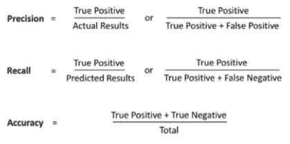

来源:[向数据科学](/precision-vs-recall-386cf9f89488)。com

**精度:**

准确性是一个简单的衡量标准。它基本上是正确预测与总预测的比率。你可以看到下面的公式:

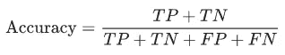

资料来源:towardsdatascience.com

其中 TP =真阳性，TN =真阴性，FP =假阳性，FN =假阴性代表预测。

现在，让我们假设你的第一个模型给你 99%的准确率，比如下面的 LinearLearner 模型(一个 SaeMaker 的内置模型)。这意味着您的欺诈检测模型在标记欺诈交易和合法交易方面做得非常好，对吗？

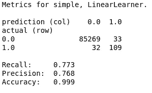

实际上，这个问题的答案是:视情况而定！让我们更仔细地分析一下积极和消极的分类，以便更好地理解模型性能。

上述模型标记了超过 30 FN(标签不正确的欺诈性交易)和略高于 30 FP 的交易(标签不正确的有效交易)。考虑到用户的观点，我们可以声明他们不希望任何有效的交易被归类为欺诈。在这种情况下，我们必须意识到这样一个事实，即我们的模型应该有尽可能少的误报(错误标记，欺诈交易)。那样的话，我们就不能仅仅基于其准确性来调整模型以完成业务需求**。**为了有效地做到这一点，我们必须进行模型调整，分析一个指标，这可以帮助我们减少 FP 的数量，这与准确性无关。

**回忆:**

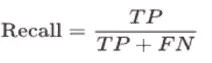

来源:[towardsdatascience.com](/precision-vs-recall-386cf9f89488)

考虑到我们的欺诈检测项目，我们可以说召回率是正确标记的欺诈总数与欺诈示例总数(标记为欺诈的欺诈和标记为有效交易的欺诈)的比率。高召回率表明我们的类被正确识别(TP 数量高，FN 数量少)。

我们思考回忆的方式如下:

在阳性样本中，我的模型正确预测了多少？

**精度:**

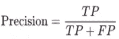

来源:owardsdatascience.com t

精确度是我们必须涵盖的第三个指标，这样我们才能解决我们的业务场景问题。它基本上是正确分类的类别数除以这些类别被预测的总时间。在我们的例子中，精度是被正确分类为欺诈的欺诈交易的数量除以被正确分类为欺诈的欺诈交易的数量，加上被标记为欺诈的有效交易的数量。

我们能想到的精度是:

在我的模型标记为正面的所有预测中，有多少实际上是正面的？

# 管理阶层失衡

每当我们想要进行模型调优时，我们必须牢记不平衡的数据可能会使模型偏向于预测具有更多数据点的类。因此，我们必须考虑二元分类器的类不平衡训练。

在这个项目中，我使用了 LinearLearner 模型提供的一个超参数来处理不平衡的数据集。这个[超参数](https://docs.aws.amazon.com/sagemaker/latest/dg/ll_hyperparameters.html)(*positive _ example _ weight _ mult*)基本上就是训练一个二元分类器的时候分配给正类(1，欺诈)的权重。有效交易的权重固定为 1。

# **场景 1**

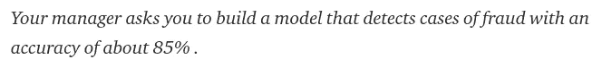

现在让我们考虑一下我们的业务案例。根据经理的要求，我们可以说我们必须建立一个模型，这个模型有尽可能多的真阳性和尽可能少的假阴性。这意味着我们必须选择**召回**指标来调整我们的欺诈检测模型。

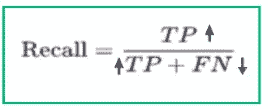

来源:[towardsdatascience.com](/precision-vs-recall-386cf9f89488)

因此，为了达到特定的召回值，我使用了*二元 _ 分类器 _ 模型 _ 选择 _ 标准* [超参数](https://sagemaker.readthedocs.io/en/stable/linear_learner.html#sagemaker.LinearLearner)，这是训练数据集的模型评估标准。通过使用这个度量，我们能够为我们的参数指定我们想要达到的精确值。

假设训练集的性能在测试集的性能的 5%以内，我们应该以 90%的召回率为目标。

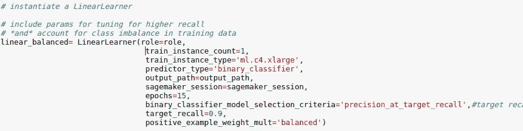

这样，我们最终得到以下指标:

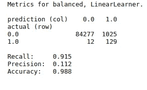

尽管我们的目标是 90%的召回率，但是我们可以看到这个模型给出了大约 91%的召回率。当应用于测试数据时，该值可能会有所不同。我们还应该看到，我们有更少的假阴性，这正是我们想要的。

场景 2:

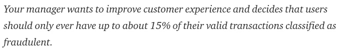

在这种情况下，业务需求是模型只将 15%的有效交易标记为欺诈交易。这意味着我们希望尽可能少的误报(0 归类为 1)。因此，我们可以使用**精度**来进行模型调整。

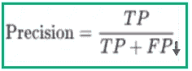

来源:[towardsdatascience.com](/precision-vs-recall-386cf9f89488)

基于这个要求，我们可以计算出我们想要的精度的近似值:85/(85+15)。同样，让我们假设与测试相比，我们在培训中的表现会高出 5%。因此，我们的目标是在测试集上达到 80–85%的精确度。

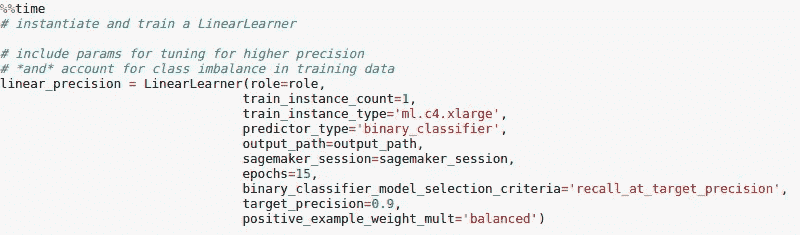

值得一提的是，该模型训练的固定精度为 90%，并试图获得尽可能高的召回率。考虑到这一点，我们可以看到作为优化模型结果的指标。

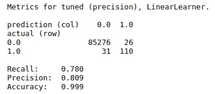

我们可以看到，该模型仍然对 26 个有效交易进行了错误分类，因此我们可能希望返回并提高我们的目标——精确度。我们还可以注意到，如果我们考虑精度的权衡，召回率和准确率都还可以。

结论:

在现实世界的项目中，产品的成功通常与调整特定的指标相关联。为了满足业务需求，了解您将选择哪种指标非常重要。我希望这篇文章能让您更好地理解如何根据业务决策和需求调整您的模型。

