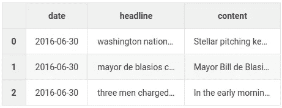
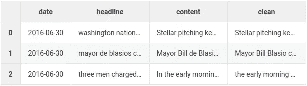
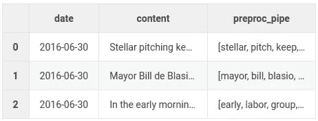
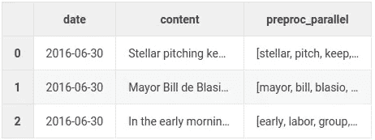
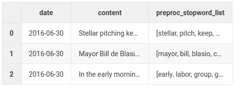

# 加速您的空间 NLP 管道

> 原文：<https://towardsdatascience.com/turbo-charge-your-spacy-nlp-pipeline-551435b664ad?source=collection_archive---------30----------------------->

## 使用自定义管道和 joblib 显著加快 spaCy 中文本预处理的技巧和诀窍


来源: [Pixabay](https://pixabay.com/illustrations/space-rocket-night-cartoon-3262811/)

假设您有一个大型文本数据集，您希望对其应用一些非平凡的 NLP 转换，例如去除停用词，然后对文本中的词进行词汇化(即，将它们简化为词根形式)。spaCy 是一个工业级的 NLP 库，就是为这样的任务而设计的。

在本文中，[纽约时报数据集](https://www.kaggle.com/nzalake52/new-york-times-articles)用于展示如何显著加快 spaCy NLP 管道。目标是接受一篇文章的文本，并快速返回一个词条列表以及不必要的单词，即删除的*停用词*。

Pandas 数据框架提供了一个方便的界面来处理这种性质的表格数据 spaCy NLP 方法可以方便地直接应用于数据框架的相关列。首先通过运行[预处理笔记本](https://github.com/prrao87/blog/tree/master/_notebooks/data/spacy_multiprocess) ( `./data/preprocessing.ipynb`)获取新闻数据，该笔记本处理从 Kaggle 下载的 raw 文本文件，并对其进行一些基本的清理。该步骤生成一个包含表格数据的文件(存储为`nytimes.tsv`)。在同一目录中[还提供了一个精选的停用词文件。](https://github.com/prrao87/blog/tree/master/_notebooks/data/spacy_multiprocess)

# 负载空间模型

由于在本练习中我们不会执行任何专门的任务，比如依赖关系解析和命名实体识别，所以在加载 spaCy 模型时这些组件是禁用的。

> **提示:** spaCy 有一个`sentencizer`组件，可以插入空白管道。

句子分析器管道简单地执行标记化和句子边界检测，随后可以将词条提取为标记属性。

定义了一个方法，从文本文件中读入停用词，并将其转换为 Python 中的集合(为了高效查找)。

# 在纽约时报数据集中阅读

NYT 新闻数据集的预处理版本作为熊猫数据帧读入。这些列被命名为`date`、`headline`和`content`——内容列中显示的文本将被预处理以删除停用词并生成标记词条。



# 定义文本清理器

由于新闻文章数据来自原始 HTML 转储，因此非常混乱，包含大量不必要的符号、社交媒体句柄、URL 和其他工件。清理它的一个简单方法是使用正则表达式，它只解析给定长度(3 到 50)之间的字母数字字符串和连字符(以便包含带连字符的单词)。这会将每个文档过滤成对 lemmatizer 有意义的文本。



# 选项 1:顺序处理数据帧列

现在我们只剩下了干净的字母数字标记，在继续词汇化之前，可以通过删除停用词来进一步清理这些标记。

处理该文本的直接方法是使用一个现有的方法，在本例中是下面显示的`lemmatize`方法，并使用`pandas.Series.apply`将其应用到 DataFrame 的`[clean](https://prrao87.github.io/blog/images/copied_from_nb/clean)`列。使用每个令牌的底层`[Doc](https://spacy.io/usage/spacy-101#annotations)` [表示](https://spacy.io/usage/spacy-101#annotations)来完成词汇化，其中包含一个`lemma_`属性。停用词在词汇化过程中同时被删除，因为这些步骤中的每一步都涉及到遍历相同的标记列表。

得到的词条作为一个列表存储在一个单独的列`preproc`中，如下所示。

```
%%time
df_preproc['preproc'] = df_preproc['clean'].apply(lemmatize)
df_preproc[['date', 'content', 'preproc']].head(3)CPU times: user 48.5 s, sys: 146 ms, total: 48.6 s Wall time: 48.6 s
```

将这种方法应用到 DataFrame 的`[clean](https://prrao87.github.io/blog/images/copied_from_nb/clean)`列并计时，它显示在 8，800 篇新闻文章上运行几乎需要一分钟。

# 选项 2:使用`nlp.pipe`

我们能做得更好吗？在 [spaCy 文档](https://spacy.io/api/language#pipe)中，指出“将文本作为流处理通常比逐个处理更有效”。这是通过调用语言管道来实现的，语言管道在内部将数据分成几批，以减少纯 Python 函数调用的数量。这意味着数据越大，`nlp.pipe`所能获得的性能增益就越好。

为了使用语言管道来传输文本，定义了一个新的 lemmatizer 方法，它直接作用于 spaCy `Doc`对象。然后，该方法被批量调用，以处理通过管道传输的`Doc`对象的*序列*，如下所示。

和以前一样，通过传递来自现有 DataFrame 的`[clean](https://prrao87.github.io/blog/images/copied_from_nb/clean)`列的数据来创建一个新列。注意，与上面的工作流#1 不同，我们在这里不使用`apply`方法——相反，数据列(一个 iterable)作为参数直接传递给预处理管道方法。

```
%%time
df_preproc['preproc_pipe'] = preprocess_pipe(df_preproc['clean'])
df_preproc[['date', 'content', 'preproc_pipe']].head(3)CPU times: user 51.6 s, sys: 144 ms, total: 51.8 s Wall time: 51.8 s
```



对这个工作流进行计时似乎并没有显示出比之前的工作流有所改进，但是根据 spaCy 文档，随着我们处理越来越大的数据集，这种方法应该会显示出一些计时改进(平均而言)。

# 选项 3:使用 joblib 并行化工作

我们可以做得更好！以前的工作流程依次处理每个新闻文档，生成词条列表，然后作为新列附加到数据帧。因为每一行的输出都完全独立于另一行，这是一个令人尴尬的并行*问题，非常适合使用多个内核。*

spaCy 推荐使用`joblib`库来并行处理 NLP 流水线的块。确保您在运行以下部分之前`pip install joblib`。

为了并行化工作流，必须定义更多的助手方法。

*   **分块:**新闻文章内容是一个(长)字符串列表，其中每个文档代表一篇文章的文本。这些数据必须以“块”的形式提供给由`joblib`启动的每个工作进程。每次调用`chunker`方法都会返回一个生成器，该生成器只包含特定块的文本作为字符串列表。在词汇化过程中，基于迭代器索引检索每个新块(前面的块被“遗忘”)。
*   **扁平化:**一旦 joblib 创建了一组在每个块上工作的 worker 进程，每个 worker 返回一个包含每个文档的 lemmas 的“列表列表”。然后，这些列表由执行者组合，以提供一个 3 级嵌套的最终“列表列表列表”。为了确保 executor 输出的长度与文章的实际数量相同，定义了一个“flatten”方法来将结果合并到一个包含词条的列表中。例如，两个并行的执行器将返回一个最终的嵌套列表:`[[[a, b, c], [d, e, f]], [[g, h, i], [j, k, l]]]`，其中`[[a, b, c], [d, e, f]]`和`[[g, h, i], [j, k, l]]`是指每个执行器的输出(最终的输出由 joblib 连接成一个列表)。这个结果的展平版本是`[[a, b, c], [d, e, f], [g, h, i], [j, k, l]]`，即去掉了一层嵌套。

除了上面的方法，一个类似的`nlp.pipe`方法被用在工作流#2 中，在每个文本块上。这些方法中的每一个都被封装到一个`preprocess_parallel`方法中，该方法定义了要使用的工作进程的数量(在本例中为 7 个)，将输入数据分成块并返回一个扁平的结果，然后可以将该结果附加到 DataFrame 中。对于具有更多物理内核的机器，工作进程的数量可以进一步增加。

使用 joblib 的并行工作流如下所示。

```
%%time
df_preproc['preproc_parallel'] = preprocess_parallel(df_preproc['clean'], chunksize=1000)CPU times: user 683 ms, sys: 248 ms, total: 932 ms Wall time: 17.2 s
```



对这种并行工作流进行计时显示出显著的性能提升(运行时间几乎减少了**3 倍**)！随着文档数量的增加，使用 joblib 启动多个工作进程的额外开销很快就会得到补偿，并且这种方法可以显著优于顺序方法。

# 块大小和批量大小的影响

请注意，在并行化的工作流中，需要指定两个参数—最佳数量可能因数据集而异。`chunksize`控制每个进程处理的每个块的大小。在本例中，对于 8，800 个文档，使用的块大小为 1000。太小的块大小意味着会产生大量的工作线程来处理大量的块，这会降低执行速度。通常，几百到几千个文档的块大小是一个很好的起点(当然，这取决于数据中每个文档的大小，以便块可以放入内存)。

批量大小是特定于`nlp.pipe`的参数，同样，一个好的值取决于正在处理的数据。对于相当长的文本，比如新闻文章，保持批量适当小是有意义的(这样每一批就不会包含真正的*长文本*，所以在这种情况下选择 20 作为批量大小。对于其他情况(例如 Tweets ),如果每个文档的长度非常短，可以使用更大的批量。

**建议试验任一参数，看看哪种组合能产生最佳性能**。

# 集合与列表

> **重要提示:**尽可能使用集合而不是列表进行查找。

注意，在前面定义的`get_stopwords()`方法中，从停用词文件中读入的停用词列表在 lemmatizer 方法中通过查找移除停用词之前被转换为一个集合。一般来说，这是一个非常有用的技巧，但是特别是对于停用词移除，集合的使用变得更加重要。为什么？

在任何现实的停用词表中，比如这个新闻数据集的停用词表，有理由期待*几百个*停用词。这是因为对于主题建模或情感分析等下游任务，有许多特定于领域的单词需要删除(非常常见的动词，无用的缩写，如时区、星期几等。).每一个文档中的每个单词都需要与停用词表中的每个单词进行比较，这对于成千上万的文档来说是一项昂贵的操作。

众所周知，集合的查找时间为 O(1)(即常数)，而列表的查找时间为 O(n)。在`lemmatize()`方法中，由于我们在停用词集中检查每个词的成员资格，我们期望集合比列表好得多。为了测试这一点，我们可以重新运行工作流#1，但是这一次，使用一个停用词列表*来代替。*

```
stopwords = list(stopwords)%%time
df_preproc['preproc_stopword_list'] = df_preproc['clean'].apply(lemmatize)
df_preproc[['date', 'content', 'preproc_stopword_list']].head(3)CPU times: user 1min 17s, sys: 108 ms, total: 1min 18s Wall time: 1min 18s
```



有了停用词表，现在产生相同的结果比以前(有了集合)多花了 50%的时间，也就是说运行时间增加了 1.5 倍！这是有意义的，因为在这种情况下，停用词列表大约有 500 个单词长，并且需要检查语料库中的每个单词是否属于这个合理大小的列表。

# 结论

在本练习中，使用 spaCy 管道处理了一个新闻文章数据集(NY Times ),以输出表示每篇文章内容中有用标记的词条列表。因为真实世界的新闻数据集几乎肯定比这个大，并且大小可以是无限的，所以需要快速、高效的 NLP 管道来对数据执行任何有意义的分析。以下步骤对于加速空间管道非常有用。

**禁用 spaCy 模型中不必要的组件:**标准 spaCy 模型的流水线包含 tagger(分配词性标签)、parser(生成依赖解析)和命名实体识别组件。如果需要这些动作中的任何一个或者都不需要，这些组件*必须在加载模型后立即*被禁用(如上所示)。

**使用集合而不是列表进行查找:**当执行查找以将一组标记与另一组标记进行比较时，总是使用集合来执行成员资格检查——列表的查找速度要慢得多！停用词的列表/集合越大，使用集合时看到的性能增益就越大。

**尽可能使用定制语言管道:**使用`nlp.pipe`设置语言管道是处理大块文本的一种非常灵活有效的方式。更好的是，spaCy 允许您单独禁用每个特定子任务的组件，例如，当您需要单独执行词性标记和命名实体识别(NER)时。[有关如何在模型加载、处理或处理定制块期间禁用管道组件的示例，请参见 spaCy 文档](https://spacy.io/usage/processing-pipelines#disabling)。

**尽可能使用多个内核:**当处理彼此完全独立的单个文档时，请考虑通过在多个内核之间分配计算来并行化工作流。随着文档数量变得越来越大，性能提升可能是巨大的。人们只需要确保文档被分成块，所有这些块在任何给定的时间都必须适合内存。

我希望这是有用的——祝你在下一个 NLP 项目中测试它们时愉快！

*原载于 2020 年 5 月 2 日*[*https://prrao 87 . github . io*](https://prrao87.github.io/blog/spacy/nlp/performance/2020/05/02/spacy-multiprocess.html)*。*