# 动荡和金融市场？

> 原文：<https://towardsdatascience.com/turbulence-and-financial-markets-e24775421835?source=collection_archive---------19----------------------->

## 金融市场动力学与湍流流动的比较

图片来自 [Pixabay](https://pixabay.com/fr/?utm_source=link-attribution&utm_medium=referral&utm_campaign=image&utm_content=81840)

动荡的流体行为和金融市场之间有着有趣的相似之处。在这两种情况下，人们可以发现大规模的扰动被转移到连续的较小规模(见[斯坦利和曼特尼亚](https://books.google.com.br/books?id=SzgXWCS7Nr8C&printsec=frontcover&dq=econophysics+stanley+mantegna&hl=en&sa=X&ved=0ahUKEwjGjcGb3b_oAhXWHbkGHXb3DWIQ6AEIKDAA#v=onepage&q=econophysics%20stanley%20mantegna&f=false))。在液体的情况下，通过搅动它，人们可以观察到输入系统的能量被转移到越来越小的尺度。在金融市场中，大规模“注入”的不是能量，而是信息，人们可以观察到反应向较小规模(在这种情况下是个人投资者)的传递。两者都非常难以建模，因为它们的部件之间或者它们与环境之间存在多种类型的交互作用

在这里，根据 Stanley 和 Mantegna 的详细统计分析，可以看出，尽管金融市场和动荡的流体在质量上有相似之处，但在数量上，这种对应是有限的。

[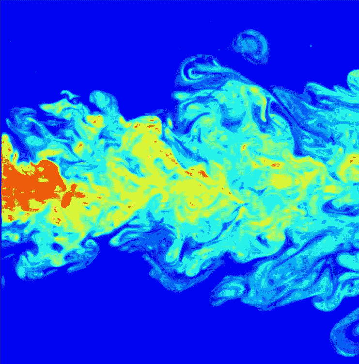](https://en.wikipedia.org/wiki/Turbulence)

图 1:湍流射流的流动呈现出典型的湍流行为的宽范围长度尺度([来源](https://en.wikipedia.org/wiki/Turbulence))。

# 什么是湍流？

让我们考虑在管道中流动的流体，具有以下参数:

*   [运动粘度](https://en.wikipedia.org/wiki/Viscosity#Dynamic_and_kinematic_viscosity) *ν* :又称动量扩散率， *ν* 是由[粘度](https://en.wikipedia.org/wiki/Viscosity) *μ* (见图 1)与[流体密度](https://en.wikipedia.org/wiki/Density) *ρ* 之比给出的
*   *速度 *V**
*   *管道的直径为 L*

**

*图 2:右边液体粘度较高([来源](https://en.wikipedia.org/wiki/Viscosity))。*

*在流体力学中，所谓的[雷诺数](https://en.wikipedia.org/wiki/Reynolds_number)或 Re 是一个(无量纲)量，有助于预测流型。具有上述参数的流动流体的 Re 由下式给出:*

*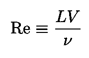*

*等式 1:在直径为 l 的管道中，运动粘度为ν、速度为 V 的流体的雷诺数。Re 值表示流体的复杂程度。*

*[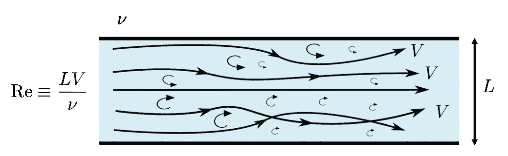](https://www.nuclear-power.net/nuclear-engineering/fluid-dynamics/reynolds-number/critical-reynolds-number/)

图 3:直径为 l 的管道中运动粘度为ν、速度为 V 的湍流流体。雷诺数 re 表示流体的复杂程度(来源[的修改版本](https://www.nuclear-power.net/nuclear-engineering/fluid-dynamics/reynolds-number/critical-reynolds-number/))。* 

*雷诺数 Re 是对流体复杂性的一种度量。根据 Re 值，流体要么是湍流(高度复杂)，要么是层流(低复杂性)。层流变成湍流的过程称为[层流-湍流转捩](https://en.wikipedia.org/wiki/Laminar%E2%80%93turbulent_transition)。*

*[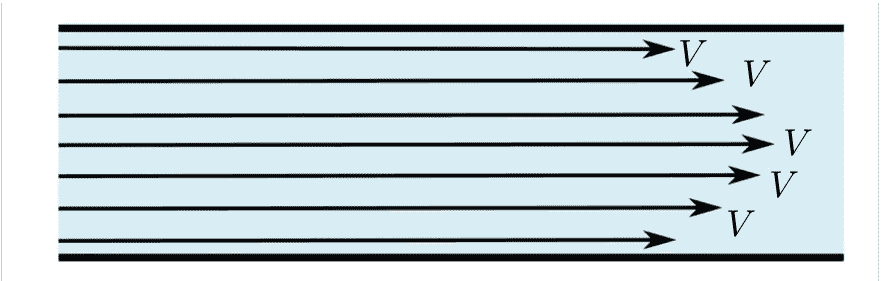](https://www.nuclear-power.net/nuclear-engineering/fluid-dynamics/reynolds-number/critical-reynolds-number/)

图 4:层流。速度曲线“看起来像一副纸牌”。流体在相互滑动的层中起作用([来源](https://www.nuclear-power.net/nuclear-engineering/fluid-dynamics/reynolds-number/critical-reynolds-number/))。* 

*描述不可压缩流体动力学的著名的[纳维尔-斯托克斯方程](https://en.wikipedia.org/wiki/Navier%E2%80%93Stokes_equations)由下式给出:*

**

*等式 2:纳维尔-斯托克斯方程，其中 **V** ( **r** ，t)是速度矢量场，P 是压力。*

*其中 **V** ( **r** ， *t* )为 **r** 处的速度矢量，时间 *t* 和 *P* 为压力。情商。2 描述了具有非常高 Re 的湍流状态(完全发展的湍流)。*

## *关于能量级联的一个旁白*

*在具有非线性动力学的系统中，例如具有充分发展的湍流的流体，直接(反向)能量级联涉及能量从大(小)尺度运动到小(大)尺度的转移。如果有中间刻度，这个中间范围叫做惯性范围或惯性子范围。*

*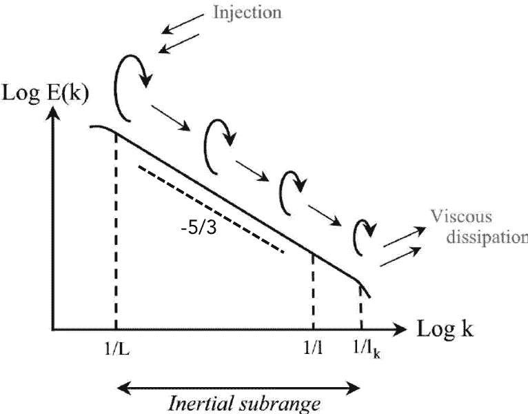*

*图 5:该图显示了湍流能谱中的产生、能量级联和耗散([来源](https://en.wikipedia.org/wiki/Energy_cascade))。*

*惯性范围内的能谱包括从低到高波数的能量转移(能量级联),并具有以下幂律形式:*

*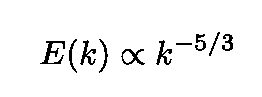*

*等式 3:惯性范围内的能谱具有这种幂律形式。*

## *Kolmogorov 1941 年的理论*

*著名的苏联数学家[安德雷·柯尔莫哥洛夫](https://en.wikipedia.org/wiki/Andrey_Kolmogorov)在两篇论文(均来自 1941 年)中表明，对于完全发展湍流的流体(在 Re → ∞极限内的流体),会发生以下行为*

*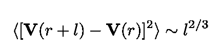*

*方程 4:Re→∞时，均方速度增量的行为，由苏联数学家安德雷·柯尔莫哥洛夫在 1941 年发现。*

*[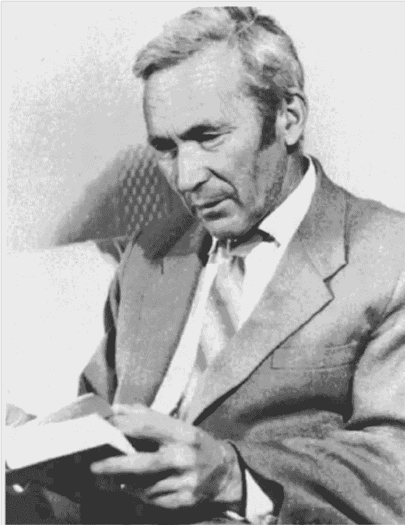](https://www.researchgate.net/publication/281044450_Onsager_and_the_theory_of_turbulence/figures?lo=1)

图 6:苏联数学家安德雷·柯尔莫哥洛夫([来源](https://www.researchgate.net/publication/281044450_Onsager_and_the_theory_of_turbulence/figures?lo=1))。* 

*在[惯性范围](http://glossary.ametsoc.org/wiki/Inertial_range)内。在方程 4 中， *l* 对应的距离(见 [Stanley 和 Mantegna](https://books.google.com.br/books?id=SzgXWCS7Nr8C&printsec=frontcover&dq=econophysics+stanley+mantegna&hl=en&sa=X&ved=0ahUKEwjGjcGb3b_oAhXWHbkGHXb3DWIQ6AEIKDAA#v=onepage&q=econophysics%20stanley%20mantegna&f=false) )小于发生湍流行为的维度，大于动能消散为热量的长度。*

*然而，Kolmogorov 的理论未能解释速度变化*U*(*t*)=δ*V*(*t*)的间歇行为(活动在时间演化中突然变化的发生)以及随之而来的 *U* ( *t* )的概率分布的[轻子态](https://en.wikipedia.org/wiki/Kurtosis#Leptokurtic)，*

# *比较金融市场和动荡动态*

*为了比较金融市场和湍流的时间行为， [Stanley 和 Mantegna](https://books.google.com.br/books?id=SzgXWCS7Nr8C&printsec=frontcover&dq=econophysics+stanley+mantegna&hl=en&sa=X&ved=0ahUKEwjGjcGb3b_oAhXWHbkGHXb3DWIQ6AEIKDAA#v=onepage&q=econophysics%20stanley%20mantegna&f=false) 分析了两个量，即:*

*   *1984-1989 年期间标准普尔 500 指数的动态*
*   *非常高 Re 的三维完全湍流流体的速度**V**(*t*)([更具体地说](https://books.google.com.br/books?id=SzgXWCS7Nr8C&printsec=frontcover&dq=econophysics+stanley+mantegna&hl=en&sa=X&ved=0ahUKEwjGjcGb3b_oAhXWHbkGHXb3DWIQ6AEIKDAA#v=onepage&q=econophysics%20stanley%20mantegna&f=false)他们认为“在康涅狄格农业研究站树冠以上约 6 米的大气表层的风速”)。*

*在短时间内，这两个过程都是非平稳、非高斯和间歇的。然而，在长时间内，这两个过程都是渐近稳定的。*

*[Stanley 和 Mantegna](https://books.google.com.br/books?id=SzgXWCS7Nr8C&printsec=frontcover&dq=econophysics+stanley+mantegna&hl=en&sa=X&ved=0ahUKEwjGjcGb3b_oAhXWHbkGHXb3DWIQ6AEIKDAA#v=onepage&q=econophysics%20stanley%20mantegna&f=false) 对标准普尔 500 指数和流体速度进行了四次比较，即:*

*   *在它们的时间演变 *Y* ( *t* )和 *V* ( *t* )之间*
*   *它们的变化量*Z*(*t*)=δ*Y*(*t*)和*U*(*t*)=δ*V*(*t*)*
*   *作为 *Z* ( *t* )和 *U* ( *t* )的δ*t*的函数的标准偏差*σ*(δ*t*)之间*
*   *在 *Y* ( *t* )和 *V* ( *t* )的功率谱 *S* ( *f* )之间*

## *标准普尔 500 指数和流体速度的时间演变*

*下面的图 7 比较了在间隔δ*t*= 1 小时采样的标准普尔 500 指数的时间演变和完全发展湍流中的大气风速(在非常高的雷诺数 Re 下)。*

*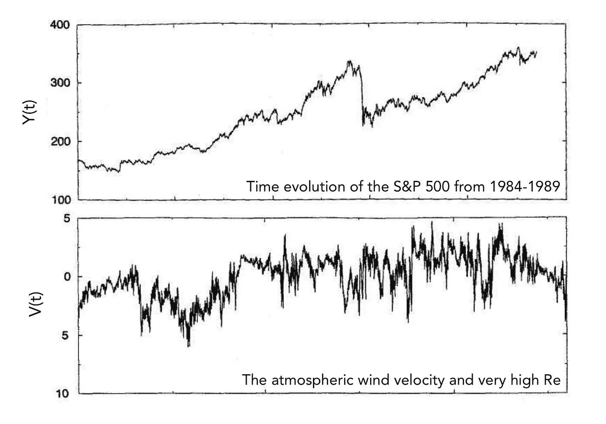*

*图 7:以一小时为间隔采样的标准普尔 500(上图)。充分发展湍流中的大气风速(具有很高的 Re)(下图)([来源](https://books.google.com.br/books?id=SzgXWCS7Nr8C&printsec=frontcover&dq=econophysics+stanley+mantegna&hl=en&sa=X&ved=0ahUKEwjGjcGb3b_oAhXWHbkGHXb3DWIQ6AEIKDAA#v=onepage&q=econophysics%20stanley%20mantegna&f=false))。*

## *标准普尔 500 指数和流体速度的变化*

*图 8 在顶部显示了 S & P 500 指数的δ*t*= 1 小时的间隔的变化，在底部显示了流体速度的变化(在更高的采样率下)。我们看到，对于湍流来说，关于 *x* 轴是对称的，这在金融数据中是不存在的。这种差异将在下面通过指标*Z*(*t*)=δ*Y*(*t*)和流体速度增量*U*(*t*)=δ*V*(*t*)的标准偏差的行为来确认(见图 9 及其上面的讨论)。*

*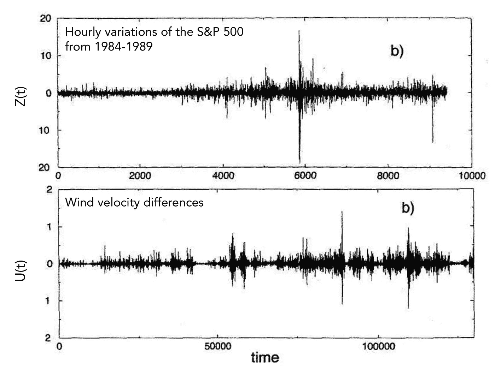*

*图 8:标普 500 指数δ*t*= 1 小时的区间变化(上)。流体速度的变化(以更高的采样率) (底部)([来源](https://books.google.com.br/books?id=SzgXWCS7Nr8C&printsec=frontcover&dq=econophysics+stanley+mantegna&hl=en&sa=X&ved=0ahUKEwjGjcGb3b_oAhXWHbkGHXb3DWIQ6AEIKDAA#v=onepage&q=econophysics%20stanley%20mantegna&f=false))。*

## *标准普尔 500 指数和流体速度增量的标准差*

*[Stanley 和 Mantegna](https://books.google.com.br/books?id=SzgXWCS7Nr8C&printsec=frontcover&dq=econophysics+stanley+mantegna&hl=en&sa=X&ved=0ahUKEwjGjcGb3b_oAhXWHbkGHXb3DWIQ6AEIKDAA#v=onepage&q=econophysics%20stanley%20mantegna&f=false) 还针对流程 *Z* ( *t* )和 *U* ( *t* )研究了波动率*σ*(δ*t*)作为δ*t*的函数，如图 8 所示。在这两种情况下，幂律*

*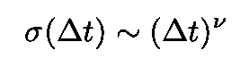*

*等式 5:增量 Z( *t* )的概率分布的波动性和速度增量 V(*t*+δ*t*)-V(*t*)作为δ*t 的函数都呈现幂律行为，指数分别为ν=0.53 和ν=0.33。**

*虽然*σ*(δ*t*)在两个过程中都表现出幂律行为，但它们之间的时间相关性却有很大不同。更具体地说，我们有:*

*   *概率分布*P*(*Z*(*t*)*的波动率*σ*(δ*t*)有一个超扩散行为的初始区间，之后是扩散行为，典型的增量不相关的随机过程(上图)。**
*   **概率分布的标准差 *P* ( *U* )其中 *U* 为速度增量*U*(*t*)=*V*(*t*+δ*t*)-*V*(*t*)作为δ*t*的函数**

**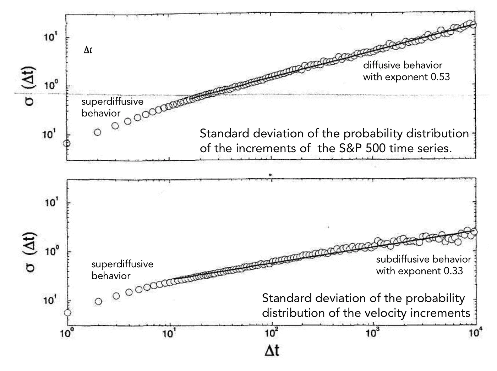**

**图 9:S&p500 指数时间序列(上)的增量 Z( *t* )的概率分布 *P* ( *Z* )的波动率*σ*(δ*t*)作为δ*t*的函数。概率分布的标准偏差 *P* ( *U* )其中 U 为速度增量*U*(*t*)= V(*t*+δ*t*)-V(*t*)作为湍流(底部)δ*t*的函数([来源【来源】](https://books.google.com.br/books?id=SzgXWCS7Nr8C&printsec=frontcover&dq=econophysics+stanley+mantegna&hl=en&sa=X&ved=0ahUKEwjGjcGb3b_oAhXWHbkGHXb3DWIQ6AEIKDAA#v=onepage&q=econophysics%20stanley%20mantegna&f=false)**

## **光谱密度**

**平稳随机过程的功率谱是其自相关函数的傅立叶变换:**

**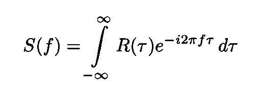**

**等式 6:平稳随机过程的功率谱。**

**随机游走的 *S* ( *f* )具有以下函数形式:**

**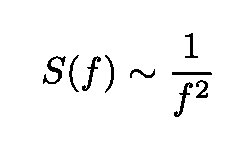**

**方程式 7:随机漫步的光谱密度。**

**人们可以用它们的功率谱来比较这两个过程。两者都服从函数形式:**

**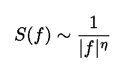**

**等式 8:两个过程的功率谱都具有这种形式，但是η非常不同。在惯性和耗散范围内，标准普尔 500 指数η=1.98，而速度时间序列η=5/3 和η=2。**

**两个过程都有形式为 Eq 的 *S* ( *f* )。8，但指数差别很大。对于 S & P 500 指数，我们得到 *η* =1.98，这非常接近与随机游走相关的指数。速度时间序列在低频和高频分别有 *η* =5/3 和 *η* =2。**

## **异同**

**对高度湍流流体的动力学和标准普尔 500 指数的比较分析表明，同样的方法可以应用于检查具有已知但(分析上)不可解的运动方程的不同系统。
相似性包括间歇性行为的存在，非高斯概率分布逐渐收敛到高斯吸引子。差异包括两个系统中概率分布的形状，以及速度波动与标准普尔 500 指数波动反相关的事实，标准普尔 500 指数波动是不相关的。**

**这篇文章是基于关于金融市场动态和动荡行为之间关系的讨论，这些讨论见于[自然杂志的文章](https://www.nature.com/articles/383587a0)和[斯坦利阁下](https://books.google.com.br/books?id=SzgXWCS7Nr8C&printsec=frontcover&dq=econophysics+stanley+mantegna&hl=en&sa=X&ved=0ahUKEwjGjcGb3b_oAhXWHbkGHXb3DWIQ6AEIKDAA#v=onepage&q=econophysics%20stanley%20mantegna&f=false)和 [R.N .曼特尼亚](https://loop.frontiersin.org/people/94335/bio)的教科书。**

**我的 [Github](https://github.com/marcotav) 和个人网站 [www.marcotavora.me](https://marcotavora.me/) 有一些关于金融和其他主题的有趣资料，如数学、数据科学和物理。看看他们！**