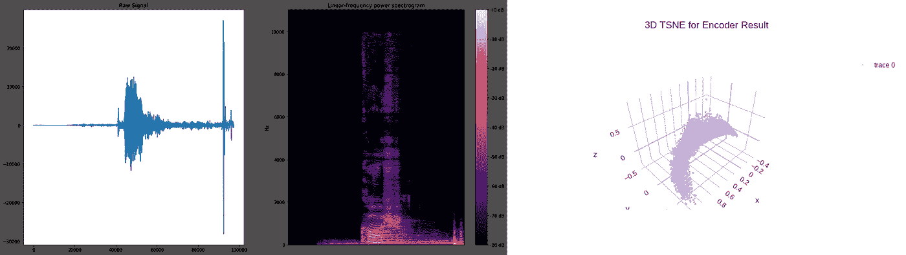
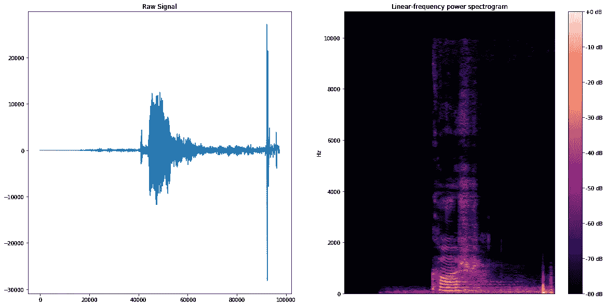
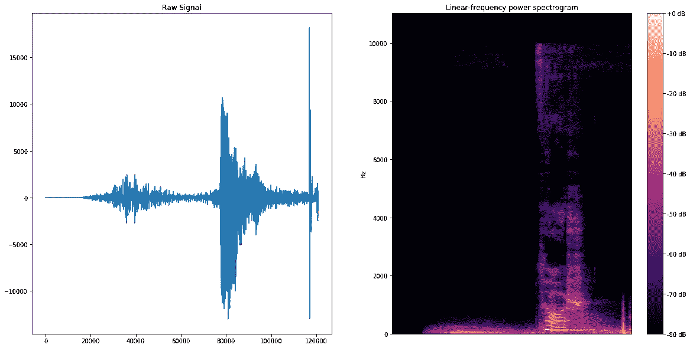
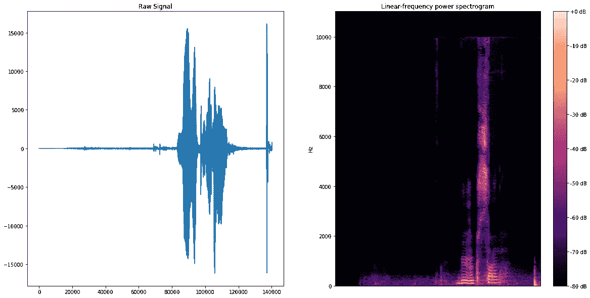
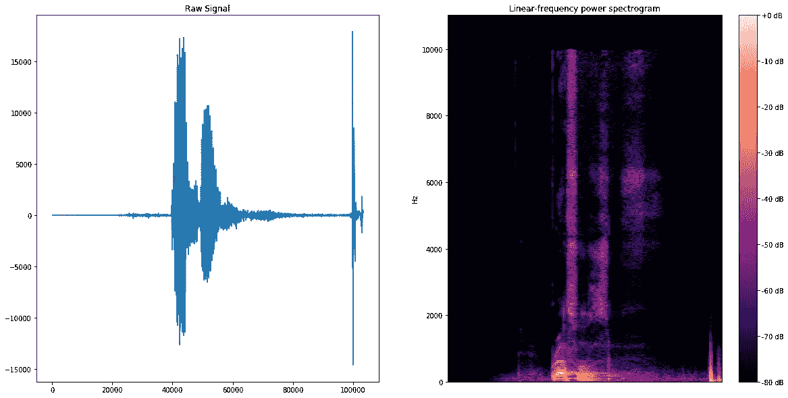
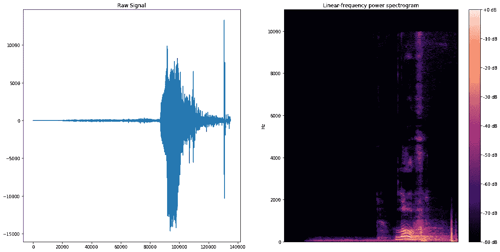
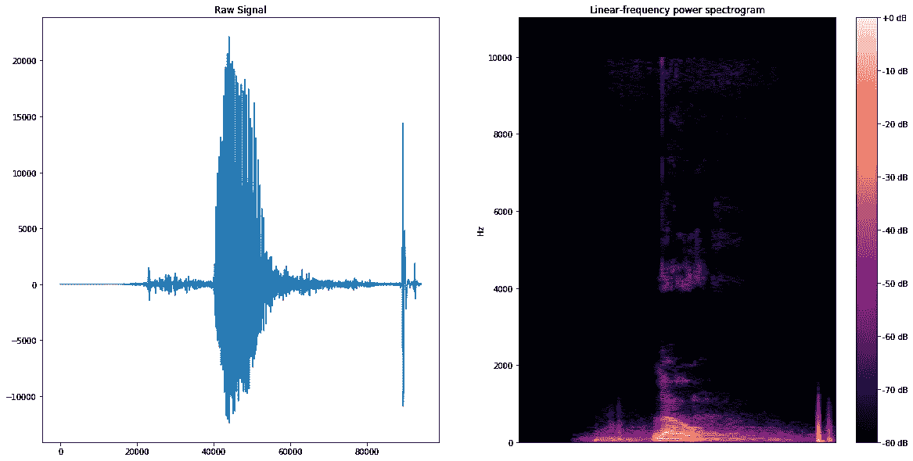
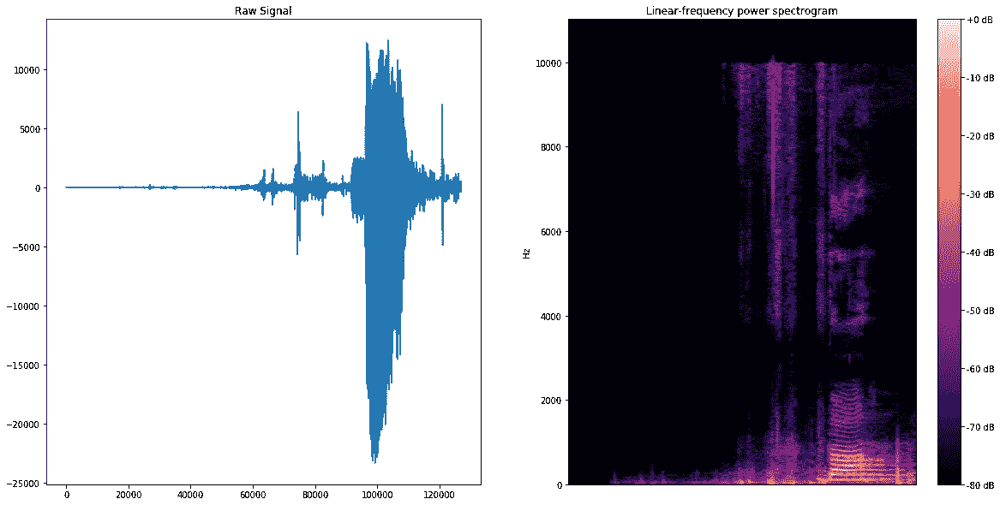
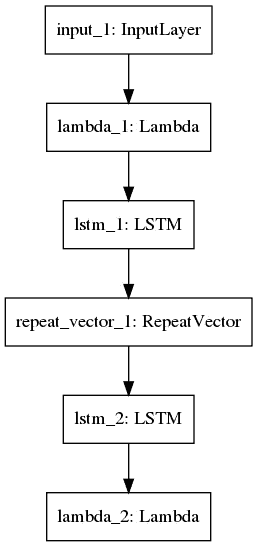
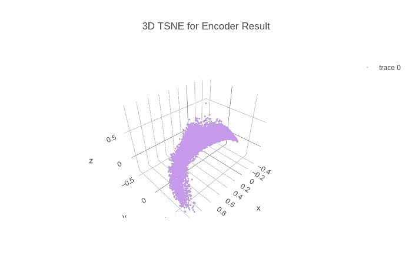

# 土耳其语音学:快速介绍

> 原文：<https://towardsdatascience.com/turkish-phonetics-a-quick-intro-cf75bb7eec79?source=collection_archive---------36----------------------->

## 实用土耳其发音语音学介绍

在本文中，我们将探讨土耳其语语音系统的一些细节，包括更高质量的土耳其 ASR 开发技巧😉

在转向对话式人工智能之前，我在一个演讲团队工作。在这篇文章中，我将分享我在开发土耳其语语音识别系统时发现的技巧。作为一个无限的语料库来源😄，我用自己的声音生成例子。为了让一些语音事件更容易理解，我对比了土耳其语和英语的发音。

土耳其语几乎是一种语音语言，大多数单词的发音与书写一致。字母表由 29 个字母、8 个元音和 21 个辅音组成:`a b c ç d e f g ğ h ı i j k l m n o ö p r s ş t u ü v y z`。开发一个土耳其 g2p 相对容易，你可以选择一个基于规则的系统。元音容易，辅音容易。单词级重音模式是基于规则的，也不是很复杂。土耳其语的语音系统的确很确定。

我用[土耳其 SAMPA](https://www.phon.ucl.ac.uk/home/sampa/turkish.htm) 耳机做我的 Kaldi 实验，你可以从[这里](https://github.com/DuyguA/computational_linguistics/blob/master/turkish-phonetic-lexicon/phoneset.txt)使用它。对应的语音词库是[这里是](https://github.com/DuyguA/computational_linguistics/blob/master/turkish-phonetic-lexicon/turkish.lexicon)。在生成该词典的过程中会用到以下所有技巧😉。



剧透:土耳其语听起来/感觉如何

让我们开始探索:

## 元音

我们的正字法有 8 个元音，没有双元音，没有辅音群，也没有什么新奇的东西。元音分为后/前、圆和高/低。

土耳其语音节模式比较容易，元音和音节之间存在一一对应关系，`one vowel = one syllable`。因此，土耳其音节化算法是相当容易的。

```
kazak      ka-zak
yorgan     yor-gan
kestirmek  kes-tir-mek
getirmek   ge-tir-mek
```

元音就是这样，真的。在接下来的两节中，我将描述关于元音的两点，为了一个好的 g2p，你应该睁大你的眼睛/耳朵。

## 短/长元音

土耳其语有许多阿拉伯语/波斯语借词。在文字革命之前，土耳其语确实是波斯语、阿拉伯语和土耳其语的混合。今天，现代土耳其语主要由土耳其语单词组成，但仍受到阿拉伯语和波斯语相当大的影响。
这些词的问题是，通常有土耳其同行写的相同但元音确实不同。对比

`kâr`(利)`kar`(雪)
`hâla`(尚)vs `hala`(姨妈)
`Kâsım`(专有名词，一个男性的名字)vs `Kasım`(十一月)

【屋顶痕】，`^`被排除在 90 年代的书面语之外。因此，这些单词在正字法中变得不可区分，并给 SMT、ASR 和许多其他统计系统带来麻烦。让我们听单词并比较元音长度:



`kar`(斯诺)，同“短一”。

对比一下`kâr`，下面加个`long a`:
1。查看原始信号
2 的元音长度差异。参见频谱图
3 中两个`a`共振峰的相似性。也听到看到`k` s 的不同，这里`k` s 确实不同。`k`有两个音位变体，`/c/`和`/k/`；腭化和非腭化音位变体。长元音也有使同一个音节中的辅音腭化的效果。这里，`kâr`中的`k`确实是`/c/`，其中`kar`中的`k`是`/k/`。从光谱图中可以看出`/k/`和`/c/`的不同特征。[土耳其 SAMPA](http://www.phon.ucl.ac.uk/home/sampa/turkish.htm) 区分`/c/`和`/k/`，显然它们是不同的音位，从频谱特征可以看出:



带“long a”的“kar”(利润)

**摘要**:虽然写法相同，但是从声谱图上看，`kar`和`kâr`在声学上非常不同。

**如何处理:**正如我之前说过的，如果一个旧外来词有一个母语为土耳其语的孪生词，就会出现这种情况。这样的单词的数量是有限的，当做土耳其 g2p 时，人们通常从这样的单词的字典中得到帮助。很可能你想在你的语音词典中包括这两种发音，就像这样:

```
kar: k a r
kar: c a: r
```

## 插字

从外来词来说，元音增音在西方外来词中经常发生。我在元音部分介绍中提到过，土耳其语没有声母簇；每个音节有一个元音，每个元音就是一个音节；元音-音节是一一对应的。因此，难怪我们在第一个音节插入一个元音来分割潜在的声母簇。查看发音中的额外元音:

```
kral      k 1 r a 5
tren      t i r e n
Brüksel   b y r y c s e l 
Twitter   t i v i t 1 r
```

我的同事兼朋友，资深语言学家阿萨夫用他受过良好教育的耳朵注意到了这个语音事件。他说我插入了一个额外的元音，我告诉他这在以土耳其语为母语的人中很常见。

让我们听听我口中的`Brüksel`。注意频谱图中两个不同的相同元音:



“Brüksel”，发音有两个元音:一个隐藏，一个书写

[Ben](https://www.instagram.com/clappa.city/) 是我的同事，一位才华横溢的程序员，母语是英语，来自美国。因此，他的声道肯定知道如何发出我不能发出的辅音串。听他讲`Brussels`，从频谱图看发病簇:



“布鲁塞尔”，由一个美国土著人发音。

**小结:**元音增音与西方借词一起发生。

**如何处理:**这几个字很好区分，如果一个字以两个辅音开头；那么就属于这一类。找到第一个拼写元音，然后插入一个合适的音标元音。增音元音应该是高元音(`[iiuü]`)。

## 为什么我们不能生产双元音

我们也不能生产双元音，没错😄。我试着发`low`的音，但失败了，而本成功了😄
让我们看看实际情况:



“低”，由土耳其母语者发音。与原发音不太相关

与英语不同，土耳其语元音的 back 和 roundedness 是不相关的。我们有前圆元音(`ö`、`ü`)和后圆元音(`o`、`u`)。如果我们观察频谱图的共振峰，我们会注意到 F2 值较低，表明存在后向性。相对较高的 F1 变得较低，F3 以及 F1 和 F2 之间的差距暗示着圆整...这个元音是`/o/`。所以，我不幸地发了一个单元音。还要注意，语音信号只有一次上升，持续时间相当长。本再次出手相救:



“low”，由美国本土人发音。这个双元音发音完美。

注意频谱图中从一个元音到另一个元音的过渡。然而，在语音信号中只有一个上升；技术上有一个音节；而是频谱图中的两个元音。作为一个美国人，本的声道完美地完成了滑行，而我只能发出“Lovvvvvvvv”很不幸😄

## 软 G！

软 G 是一个有争议的声音。在土耳其正字法中，它被标记为辅音，但它确实不是一个真正的声音。在某些情况下，它会拉长前一个元音，在某些情况下，它会完全消失。以下是一些观察结果:

*   当它在字尾或音节尾位置时，它拉长前面的后元音，如`dağdan` `/d a: d a n/`和`dağ` `/d a:/`
*   相同的后元音之间是听不见的，例如`uğur /u: r/`、`ağarmak`、`/a: r m a k/`和`sığır`、`/s ı: r/`。
*   在相同的前元音之间，要么听不见，如`bildiğim` `/b i l d i: m/`，要么听起来像腭滑音，如`düğün /d y j y n/`。
*   当它出现在 e 和 I 之间时，要么听不见，要么发音为腭滑`/j/`。单词`değil`常被听成`/d e j i l/`和`/d i: l/`。
*   在`i`和`e`之间出现时，软 g 多听为腭滑`/j/`:`diğer`常读作`/d i j e r/`，有时误写成`diyer`
*   在圆元音之间几乎听不见，例如`soğuk` `/s o u k/`。
*   在圆元音和非圆元音之间，大部分是听不见的，例如`doğan` `/d o a n/`。
*   `a+ğ+ı` 序列可能听起来像是`/a/`后跟`/1/`的序列，或者像是两个`/a/`元音的序列:`ağır` 为`/a 1 r` /或`/a: r/`。
*   `ı+ğ+a`序列发音为`/a/`后接`/1/` : `sığan` `/s 1 a n/`

动作上看软 G。你会听到单词`dağ` (mountain)，这里软 G 位于音节末尾，因此他会拉长音节元音`a`。查看语音信号中元音的持续时间，并将其与另一个单音节单词`kar`进行比较，这是笔记本的第一个单词:



## 压力，压力，压力

土耳其应力模式高度依赖于形态学。大多数原生词的最后一个音节带有重音，后缀通常将重音“移向”词尾。对于大多数单词来说，词尾重音或多或少是标准的，但旧的阿拉伯语/波斯语借词例外。

我们来看一个例子。`koyun`既可以解释为

```
koyun  koy+un  <imper><2per> koyun  koyun   (noun)
```

命令式后缀将重音带到前一个音节，因此

```
koyun  k o+ j u n   <imp><2per> 
koyun  k o j u+ n   (noun)
```

从我与 Kaldi 的实验中，我注意到神经网络无论如何都学习土耳其重音模式，不需要输入重音位置。的确，还不如根本不标注重音位置，让神经网络去学习。如果你不小心做错了标记，你可能会让 WER 的情况更糟(我就是这么做的😂).

在探讨了咬字之后，我们再来玩一些连续的语音数据，探讨一下土耳其语的声学模型。下面我用的是 [Mozilla Common Voice](https://voice.mozilla.org/en/datasets) 土耳其语语音语料库。该数据集包含 13725 个话语，总共 14 个小时的讲话。

就像在任何语音任务中一样，首先我提取声学特征向量，我喜欢使用有 40 个特征的`mfcc` 。代码如下:

```
import librosafiles = glob.glob("../tr/clips/*.mp3")datas = []for fn in files:
  X, sample_rate = librosa.load(fn)
  print(fn + ":" + str(sample_rate) + "Hz")
  fs=40
  mfcc_feature = librosa.feature.mfcc(X,n_mfcc=fs)
  datas.append(mfcc_feature)
```

结果是一个`(13725, 40)`数据矩阵。(13725 个实例=话语，40 =声音特征的数量)

然后我用`t-SNE`把提取的 mfcc 向量分别投影到二维和三维空间。我用了`sklearn`的`t-SNE`函数:

嵌入二维空间的 mfcc 特征

嵌入三维空间的 mfcc 特征

`mfcc`单独只是一种特征化方法，它不包括任何上下文/顺序信息。它没有提供任何关于哪些音素以何种密度一起出现，哪些音素是相似的，哪些音素在相似的语音环境中一起出现的信息…正如我所说的没有顺序信息。语言和言语是关于语境的，即本质上是连续的。因此我决定做一个更有语境的特征化，我在提取的`mfcc` s 上做了一个`autoencoder`，它实际上是一个基本的`seq2seq`，没什么特别的:

```
model_inputs = Input(shape=(40,))
inputs = Lambda(lambda x: K.expand_dims(x, -1))(model_inputs)
encoded = LSTM(5, return_sequences=False)(inputs)decoded = RepeatVector(40)(encoded)
decoded = LSTM(1, return_sequences=True)(decoded)
decoded = Lambda(lambda x: K.squeeze(x, -1))(decoded)autoencoder = Model(model_inputs, decoded)
autoencoder.compile(loss='mse', optimizer='adam')
autoencoder.fit(datas, datas, epochs=10)
```

我用了两个`LSTM`，一个用于编码器，一个用于解码器。`RepeatVector` 层用于构建多对多架构。最终的架构看起来像:



自动编码器架构，基本 seq2seq 模型

好了，接下来是精彩的部分:我提取了编码器 LSTM 的输出，并通过`t-SNE`将其投影到三维空间:



编码器 LSTM 输出的三维 t-SNE

这是土耳其语语音编码后的样子，结果非常漂亮。难怪是这样，土耳其人本身就很美。

亲爱的读者，我们已经到了这篇文章的结尾。欣赏美很重要，更重要的是一起欣赏美😄想了解我的更多信息，请关注我的博客，或者随时通过我的 Linkedin 页面联系我。在那之前，请保持快乐、安全和无病毒。干杯！