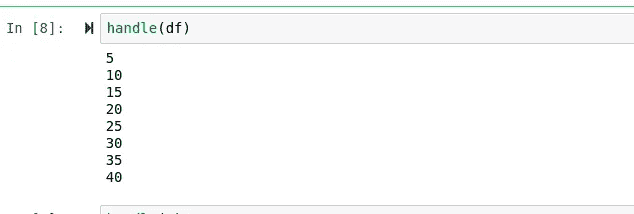

# 用函数式语言把 Julia 变成 Python 和 Duck-Type

> 原文：<https://towardsdatascience.com/turn-julia-into-python-and-duck-type-in-a-statically-typed-language-119f708936ff?source=collection_archive---------39----------------------->

## 通过结合 Julia 富有表现力的语法和令人敬畏的调度，将 Julia 变成 Python。


( [python logo src](http://python.org) ， [julia logo src](http://julialang.org) ，史酷比是汉娜芭芭拉的注册商标，我不拥有史酷比)

(有个视频可以用这个看！希望你喜欢！)

> [笔记本](https://github.com/emmettgb/Emmetts-DS-NoteBooks/blob/master/Julia/How%20to%20duck%20type%20in%20Julia.ipynb)

# 介绍

Julia 在很多方面都是一种不可思议的语言，作为一种函数式编程语言，它对可变性的支持令人惊讶。此外，Julia 包含了其开箱即用的调度，这是一个简单有效的多态工具。大多数 Julia 用户都很清楚 Julia 的调度，但是他们可能不知道 Julia 有操纵语言进行鸭式打字的能力。使用这种方法，当使用我们的类型和它们各自的方法时，我们可以使 Julia 看起来和感觉上与 Python 非常相似。

# 派遣

如果你和朱莉娅呆过一段时间，你很可能对朱莉娅的派遣很熟悉。Julia 的调度可用于应用不同的方法来处理不同类型的参数多态性。尽管 Julia 在这方面非常动态，尽管如此(以及可变声明)，重要的是要记住我们仍然保留了 Julia 作为函数式编程语言的好处。考虑前两个示例函数:

```
function _handleArray(array)
    [println(i) for i in array]
endfunction _handleDataFrame(df)
    for column in eachcol(df)
        [println(i) for i in column]
    end
end
```

DataFrame 是一种不能像我们通常使用数组那样逐元素迭代的类型。为了迭代一个数据帧，我们需要使用 eachcol()方法。我们可以使用两个完全独立的函数来处理这两种类型，但是另一种更明智的方法是，我们可以使用 Julia 的调度程序用相同的方法来处理这两种类型。


现在，每当数据帧通过 handle()方法传递时，我们都会得到预期的返回:



同样，当我们传递一个数组时，我们得到完全相同的结果:


不过，我们确实得到了一个有趣的监督阵列。Julia 这样做是因为每当数组像这样循环时，它都会给出一个返回:

```
[println(i) for i in array]
```

但是当然，println()的每次调用都不修改现有值或提供返回，所以 Julia 什么也不返回，因为什么也没有返回。这是一个有趣的和有点滑稽的疏忽，我以前从来没有注意到，因为当然

> 我不经常按元素打印数组。

# 鸭子打字

在 Julia 中使用一些有趣的类型构造技巧，我们可以像在 Python 和 C++这样的面向对象编程语言中一样，在 Julia 中有效地“鸭式”。这对于创建具有可变数据的对象和操纵该数据的子方法非常有用。这样做的另一个巨大好处是，我们可以有一个初始化函数，每当我们的类型被创建时，这个函数就会运行。当然，这是 Python 的一个主要特点，例如，几乎每次创建新类型时都会调用 __init__ 函数。考虑这个函数:

```
function our_type(number)
    add5() = number += 5
    double() = number *= 2
    get_number() = number
    (var) -> (add5;double;number)
end
```

结尾的语句，

```
(var) -> (add5;double;number)
```

创建一个新的类型，包含我们在创建该类型时使用的所有数据和函数。这可以是数据；在 Int64 例子中的数字，也可以是函数；在 double()或 add5()的例子中。现在，无论何时创建这种类型，我们都可以像调用孩子一样调用函数。

```
d = our_type(5)
```


然而，使用这种方法有一些问题。您可能遇到的第一个问题是，当使用此方法时，类型将没有值。例如，如果我们试图调用 typeof ():


这种方法的另一个缺点是访问我们断言为新类型的子类型的数据，在本例中，该数据是 int 64“number”每当我们调用这些数据时，都会得到一种类型的核心。方框:


如果我们试图把这个整数和另一个整数相加，那是行不通的！


然而，我们可以通过添加一个返回数据“数字”的新方法来减轻这种情况考虑这个例子:


然后我们可以像使用普通的 Int64 一样使用返回的数字。正如您在 Python 中所期望的那样，当使用我们的函数在我们的类型内部操作数据时，它实际上是将该操作应用于作为该类型的子类型的数据。

# 结合两者

虽然这些都是将函数和结构分开使用的好方法，但是它们也可以很好地配合使用。这方面的一个很好的例子是我如何在我的 Julia 的模块化图形库中使用它们，

> [Hone.jl](https://github.com/emmettgb/Hone.jl)

对于本例，我们有两种方法都用于绘制坐标，但是，其中一种方法特别需要数据帧，即 being _dfscatter:


我们的另一个函数将需要一个数组类型，它被称为 _arrayscatter:


虽然这两种方法都使用 duck-type 方法来使用特定类型的方法，类似于 Python 中的类，但根据数据类型调用不同的函数肯定不是最佳选择。因此，记住这一点，我们可以将这两个概念结合起来，首先用调度函数创建我们的对象，然后用子方法创建我们的变量。当然，首先我们将设置调度:

```
plot(x::DataFrame,y::Symbol,shape) = _dfscatter(x,y,shape)
plot(x::Array,y::Array,shape) = _arrayscatter(x,y,shape)
```

然后我们的输入变量:

```
df = DataFrame(:A => randn(1200), :B => randn(1200), :M => randn(1200), :P => randn(1200), :D => randn(1200), :Y => randn(1200));
shapes = [Circle(.5,.5,.02, :lightblue),Circle(.5,.5,.02, :pink),Circle(.5,.5,.02, :red), Circle(.5,.5,.02, :orange),
Circle(.5,.5,.02, :purple),Circle(.5,.5,.02, :green)];
```

将我们的地块创建为对象，并且

> 佩服的美！


> 如果你想了解更多，我也写了一篇文章！

[](/adding-julias-polymorphic-dispatch-to-my-plotting-library-part-4-1446e924774f) [## 将 Julia 的多态分派添加到我的绘图库中(第 4 部分)

### 方法论之争！

towardsdatascience.com](/adding-julias-polymorphic-dispatch-to-my-plotting-library-part-4-1446e924774f) 

# 性能指标

对于机器学习或计算机科学中的任何好的演示，考虑性能总是很重要的。对于这些性能指标，我们将使用 [@time](http://twitter.com/time) ，一个从 IJulia 导出的函数来代替 IPython 的%timeit。

首先，我创建了一个数据框架，它实际上会给我们带来足够的挑战，值得计时，有 100 万个值。虽然这肯定是一个很高的数量，但可能还不够高——但我们肯定会对 Julia 的调度和在 Julia 中键入 duck-typing 之间的度量标准有一个很好的了解。

这是我们的鸭式线性回归函数:

```
function LinearRegression(x,y)
    # a = ((∑y)(∑x^2)-(∑x)(∑xy)) / (n(∑x^2) - (∑x)^2)
    # b = (x(∑xy) - (∑x)(∑y)) / n(∑x^2) - (∑x)^2
    if length(x) != length(y)
        throw(ArgumentError("The array shape does not match!"))
    end
    # Get our Summations:
    Σx = sum(x)
    Σy = sum(y)
    # dot x and y
    xy = x .* y
    # ∑dot x and y
    Σxy = sum(xy)
    # dotsquare x
    x2 = x .^ 2
    # ∑ dotsquare x
    Σx2 = sum(x2)
    # n = sample size
    n = length(x)
    # Calculate a
    a = (((Σy) * (Σx2)) - ((Σx * (Σxy)))) / ((n * (Σx2))-(Σx^2))
    # Calculate b
    b = ((n*(Σxy)) - (Σx * Σy)) / ((n * (Σx2)) - (Σx ^ 2))
    # The part that is super struct:
    predict(xt) = (xt = [i = a + (b * i) for i in xt])
    (test)->(a;b;predict)
    end
```

这是我们的常规函数，以及它的调度和保存数据的结构:

```
mutable struct LinReg
    x
    y
endfunction lin_predict(m,xt)
    if length(x) != length(y)
        throw(ArgumentError("The array shape does not match!"))
    end
    # Get our Summations:
    Σx = sum(x)
    Σy = sum(y)
    # dot x and y
    xy = x .* y
    # ∑dot x and y
    Σxy = sum(xy)
    # dotsquare x
    x2 = x .^ 2
    # ∑ dotsquare x
    Σx2 = sum(x2)
    # n = sample size
    n = length(x)
    # Calculate a
    a = (((Σy) * (Σx2)) - ((Σx * (Σxy)))) / ((n * (Σx2))-(Σx^2))
    # Calculate b
    b = ((n*(Σxy)) - (Σx * Σy)) / ((n * (Σx2)) - (Σx ^ 2))
    (xt = [i = a + (b * i) for i in xt])
    return(xt)
endpredict(m::LinReg,xt) = lin_predict(m,xt)
```

当然，使用这些函数，我们将需要创建一个训练 X 和训练 y，以及一个测试 X 和测试 y。


```
trainX = train[:X]
trainy = train[:Y]
testX = test[:X]
testy = test[:Y]
```

现在我们可以简单地将它们插入到我们的方法中并比较时间！


# 结论

Julia 当然有很多很酷很有趣的方法来处理函数类型。我们不仅可以使用 Julia 的 dispatch，还可以利用该语言富有表现力的语法创建自己的临时类型来保存数据和函数。这不仅非常方便，而且还带来了特殊的性能提升。有一些缺点，比如如果不编写函数就不能读取类型或访问数据，但我认为这种权衡是值得的。这是我第一次把一个视频放到一个成熟的视频编辑器中，我真的希望这个结果是值得的——因为哇，Kden-live 吞噬内存就像它什么都不是，而我在整个过程中都被钉在 80%以上的内存使用率上！我的电脑也不喜欢渲染它，这是肯定的！