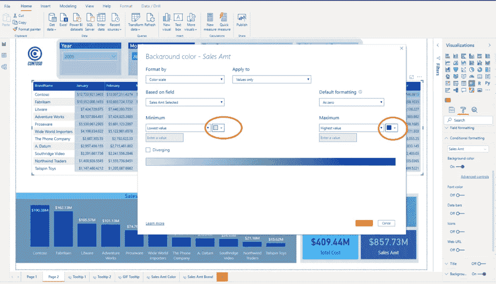

# 在 Power BI 中将平面矩阵变成全新的视觉

> 原文：<https://towardsdatascience.com/turn-plain-matrix-into-brand-new-visual-in-power-bi-f87ecd2e7fe4?source=collection_archive---------34----------------------->

## 使用这个简单的技巧快速将传统矩阵转换为更“定制化”的视觉效果

图:截图

Power BI 的最大优势之一是极其庞大的视觉效果集合，包括来自 AppSource 的内置和自定义视觉效果。老实说，几乎每个商业场景都可以通过适当的方式进行可视化处理。

然而，有一些真正[简洁而简单的技巧](/5-tips-to-boost-your-power-bi-development-a44d7e782037)可以将原生 Power BI 视觉效果转换为自定义视觉效果。不仅如此，你还可以称赞它是个人创作的:)

## 普通旧矩阵

让我们切换到 Power BI，我将快速向您展示如何将普通的矩阵视觉转换为看起来像自定义视觉的东西。

像往常一样，我将使用 *Contoso* 示例数据库进行演示。假设我们想显示每个品牌每月的总销售额:

如你所见，这个矩阵没什么特别的。一堆数字，所以不深入分析就很难一眼看出高点和低点。

## 自定义视觉效果

为了使我们的用户能够立即发现正在发生的事情，我们将转到格式窗格下的*条件格式*选项，并选择*销售金额*作为应用格式的度量。

我们首先格式化的是*背景色*。所以，我打开它，进入高级控制:

你可以看到 Power BI 自动应用了一些渐变着色，但是我们想进一步定制它。因为我的整个报告是基于蓝色的，所以我也将应用“蓝色”吨。

您可以注意到单元格的背景颜色发生了变化，以反映销售额数值的差异，但是数字仍然存在。因此，下一步我们应该做的是在*字体颜色*属性上应用相同的格式。

再次，进入高级控制，设置相同的颜色饱和度作为背景:

看看我们刚刚得到的——“树形图”一样的视觉效果，但是没有与“树形图”视觉效果相关的限制，也不需要应用复杂的格式:

因此，只需点击几下，我们就将普通的旧 Matrix 转变成了现代外观的定制视觉效果！多酷啊！

这样，我们使我们的用户能够很容易地发现，例如，Contoso 和 Fabrikam 的销售额在 5 月和 7 月之间大幅增长，并且 Contoso 最差的月份比除 Fabrikam 以外的任何其他品牌的任何月份都要好！

最重要的是——我们可以在 2 秒钟内轻松发现这些趋势，而无需深究数字。当然，数字仍然在那里，如果我们想检查一个特定的数字，工具提示将像一个魔咒:

## 结论

不要对你报告中的每一个矩阵都盲目使用这一招。仍然会有更多的场景需要你坚持使用传统的方式来显示数据。

然而，当这种技术有益时，你肯定会面临一些情况(特别是在有很多数字的“宽”矩阵中)。应用这个技巧无疑会丰富你的用户体验。

[成为会员，阅读媒体上的每一个故事！](https://datamozart.medium.com/membership)

感谢阅读！