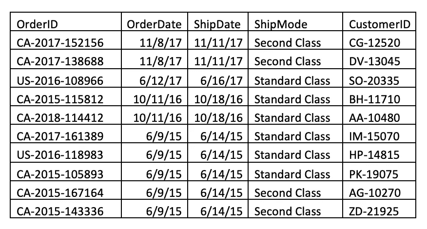

# 将 Excel 工作簿转换为 SQLite 数据库

> 原文：<https://towardsdatascience.com/turn-your-excel-workbook-into-a-sqlite-database-bc6d4fd206aa?source=collection_archive---------3----------------------->


图片来自[推特:@jankolario](https://unsplash.com/@jankolar?utm_source=medium&utm_medium=referral) 在 [Unsplash](https://unsplash.com?utm_source=medium&utm_medium=referral)

## 将电子表格转换成可查询的数据库表格

# 介绍

[**关系数据库**](https://en.wikipedia.org/wiki/Relational_database) 是数据表的集合——存储单个数据的行和列的集合——它们可以相互连接。这样，关系数据库与 Excel 工作簿并不完全不同，Excel 工作簿中的相关数据集存储在多个工作表中。考虑到这一点，本文通过一个例子，使用 Python 将 Excel 电子表格转换成可以使用**结构化查询语言(SQL)** 查询的数据库。

# 数据

这篇文章中的例子使用了来自*超市销售*数据集的数据，可以在[这里](https://data.world/scottadams26/superstoresalesexample)找到。该数据集存储为 Excel 工作簿，包含存储在以下四个表中的示例销售交易数据:*销售*、*订单*、*客户*和*产品。*

## 用 Python 读取数据

首先，如果您没有使用`conda`或`pip`安装`xlrd`包，请在启动 Python 会话之前安装，否则当您试图读取 Excel 文件时会遇到以下错误(即使安装了 *pandas* )。


现在让我们启动一个 Python 会话，并使用`import pandas`和`import sqlite3`导入*熊猫*和 *sqlite3* 。我们将使用`read_excel`将每个 Excel 电子表格中的数据读入一个单独的 *pandas* 数据框，如下面的代码所示。

在每个代码块中，`read_excel`中的第一个参数标识要处理的文件的名称。如有必要，包括文件所在的路径。例如，当我运行这段代码时，我的数据存储在`data`目录中，但是我的工作目录在上面一个目录中。第二个参数`sheet_name =`，指定工作簿中要处理的电子表格的名称。最后一个参数`header=0`告诉 Python 正在读取的电子表格中的第一行包含列标题。记住 Python 是零索引的，这就是为什么我们使用`0`而不是`1`来标识第一行。通过明确标识标题行，每个电子表格第一行中的值将被视为其各自数据框的列名。

让我们看一下每个数据框的前几行，以确保一切看起来都是正确的。


太好了！现在让我们创建数据库。

# 创建 SQLite 数据库

有多种关系数据库产品可用，这里我们将使用的具体产品是 [**SQLite**](https://www.sqlite.org/index.html) 。这是一个轻量级的 SQL 数据库引擎，可用于在个人计算机上创建存储为文件的数据库。我们可以启动一个新的 SQLite 数据库连接对象，并将该对象赋给一个变量。下面，我把这个变量命名为`db_conn`。

```
db_conn = sqlite3.connect("data/superstore.db")
```

当执行上述代码时，将在*数据*目录中创建一个名为 *superstore.db* 的新文件(假设 *superstore.db* 在该目录中尚不存在)。新创建的 *superstore.db* 文件此时是一个空的 SQLite 数据库(即，它没有表)。`db_conn`也指向 *superstore.db* 数据库，可以认为是使用这个数据库的接口。酷！但是等等…我们实际上如何运行创建数据表的 SQL 代码呢？很高兴你问了。我们现在需要建立一个 [**游标**](https://docs.python.org/2/library/sqlite3.html#cursor-objects) 对象，它是一个针对感兴趣的数据库执行 SQL 代码的工具。这里，光标被分配给一个名为`c`的变量。

```
c = db_conn.cursor()
```

下一步是创建将包含在数据库中的表，尽管需要强调的是，创建表的下一步将导致空表。稍后，我们将用之前创建的四个数据框中的数据填充我们的表。然而，在我们继续之前，让我们看一下将用于创建*销售*表的实际 SQL 代码，以便更好地理解表的创建过程。

上面代码中的第 1 行提供了创建名为 *sales* 的表的命令，第 2–8 行在 *sales* 中创建了 7 个新列:salesID、OrderID、ProductID、Sales、Quantity、Discount 和 Profit。每列的数据类型在相应列名的右侧指定。关于 SQLite 数据类型的更多信息可以在[这里](https://www.sqlite.org/datatype3.html)找到。请注意，列的顺序与关联数据框中列的顺序相匹配。


`CREATE TABLE`语句中的列顺序是有意安排的，因为这确保了数据框中的适当值进入数据库表中的预期列。例如，如果我将 OrderID 作为第一列，将 SalesID 作为第二列，那么 SalesID 值将被写入到 *sales* 表中的 OrderID 列，并且该表中的 SalesID 列将包含 OrderID 值。

第 9 行建立了表的**主键**，这是一个包含唯一标识每行的值的列。在*销售*表中，SalesID 满足主键的要求，因为没有两行具有相同的 SalesID 值。


“销售”表的快照

上一组代码中的第 10 行为*销售*建立了两个**外键**中的第一个。外键是一个表中的列，它是另一个表中的主键。例如，请注意，在*销售*表中，不同的行可以共享相同的 OrderID 值，这使得 OrderID 不再是该表*中的主键。然而，***订单*表中的每一行确实包含一个唯一的 OrderID 值。因此，OrderID 可以作为*订单*的主键。*

**

*“订单”表的快照*

*让我们回到前面的`CREATE TABLE`语句中第 10 行的实际代码。代码的第一部分`FOREIGN KEY(OrderID)`确定 *sales* 中的 OrderID 列是一个外键。第二部分，`REFERENCE orders(OrderID)`指定 OrderID 引用的表和主键。`CREATE TABLE`语句的第 11 行遵循相同的 ProductID 列逻辑。*

*通过指定主键和外键，我们能够创建一个“映射”,显示数据库中的表是如何相互关联的。例如，熟悉 SQL 概念但不熟悉该特定数据的人可以查看创建*销售*表的`CREATE TABLE`语句，并认识到通过匹配两个表的 OrderID 列中的值，可以将*销售*和*订单*表中的数据放在一起，或者将 [**连接到**](https://www.w3schools.com/sql/sql_join.asp) 。为了简要说明联接是如何工作的，考虑我们如何通过在 OrderID 上“联接”来将 OrderDate 添加到 *sales* 表中，如下所示。*

**

*联接如何工作的基本视觉演示*

## *正在完成数据库*

*建立了表创建过程的基本概述后，让我们创建所有的数据库表。这是我们放置光标的地方，`c`开始工作。我们可以运行`c.execute()`并将所需的 SQL 代码作为字符串包含在括号中，以针对我们当前连接的数据库运行所述 SQL 代码(即`data/superstore.db`)。*

*现在是时候用我们之前创建的四个数据框中的相关数据填充数据库中的表了。幸运的是，在每个数据帧上使用*pandas*’`to_sql`可以轻松完成这一步(更多细节见`to_sql` [这里](https://pandas.pydata.org/pandas-docs/stable/reference/api/pandas.DataFrame.to_sql.html))。下面块中的代码将数据从四个数据框中的每一个传输到数据库中适当的表中。*

*上面每一行代码中的第一个参数标识数据框中的值将被写入的数据库表的名称，后面的参数指定实际的数据库连接。接下来，`if_exists='append'`告诉`to_sql`如果表已经存在(在本例中确实如此)，那么应该将数据框中的值插入到表中。最后，通过`index=False`,我们告诉`to_sql`不要将索引作为附加列包含在表中。*

# *结论*

*现在，我们已经有了一个准备就绪的 SQLite 数据库！可以用 [SQLite 命令行 shell](https://sqlite.org/cli.html) 或者其他支持 SQLite 的数据库软件，比如 [DbVisualizer](https://www.dbvis.com/) 来查询 *superstore.db* 数据库文件。您还可以使用 *pandas* 中的`read_sql`在数据库上运行查询(参见更多信息[此处](https://pandas.pydata.org/pandas-docs/stable/reference/api/pandas.read_sql.html))。例如，如果我们希望看到来自 *sales* 的前五行，我们可以在我们的 Python shell 或笔记本中运行如下所示的代码。*

```
*pd.read_sql("SELECT * FROM sales LIMIT 5", db_conn)*
```

**

*当您用 Python 处理完这个数据库后，您可以通过运行`db_conn.close()`来关闭连接。如果您想在关闭后再次使用该数据库，只需重新建立数据库连接*

```
*db_conn = sqlite3.connect("data/superstore.db")*
```

*并使用`read_sql`运行查询。如果不将数据写入数据库，则不需要建立新的游标。*

*在我们结束之前，有一句话需要澄清。在这篇文章的开始，我提到了 Excel 工作簿的结构类似于 SQL 数据库，因为两者都可以由多个相关的表组成。为此，本练习旨在演示如何将 Excel 工作簿轻松转换为 SQLite 数据库文件。尽管如此，我们只是触及了数据库设计的表面，我想强调的是，一个设计良好的数据库不仅仅是表的集合。的确， [**规范化**](https://en.wikipedia.org/wiki/Database_normalization)**的过程在关系数据库设计中非常重要，其目的是消除数据冗余，促进数据完整性。请注意，我们创建的数据库可以进一步规范化。如果您有兴趣了解更多关于关系数据库和跨多个表存储数据背后的基本原理，我推荐您阅读更多关于规范化的内容。***

***好吧，这将是这个职位。感谢您的阅读，如果您有任何问题和/或建设性反馈，请联系我们。***