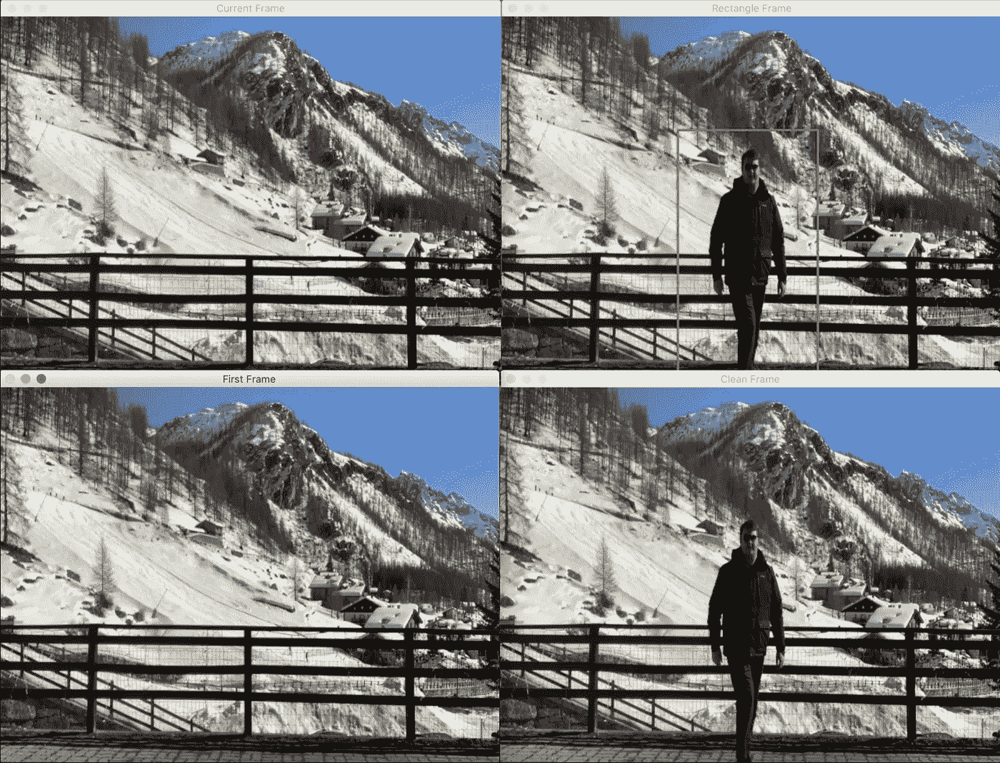
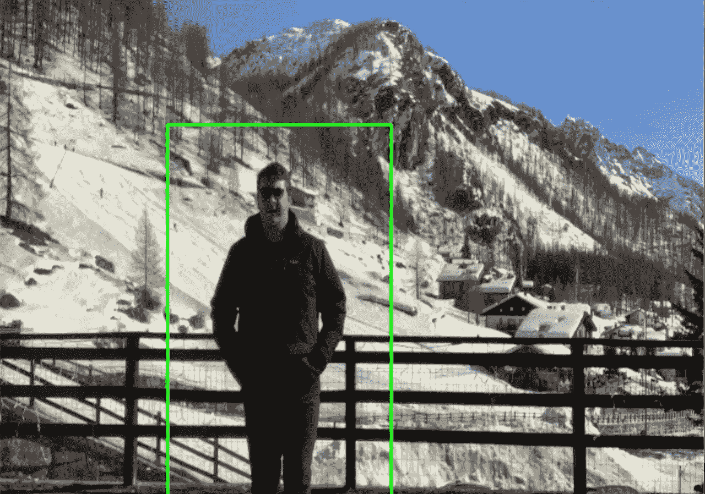
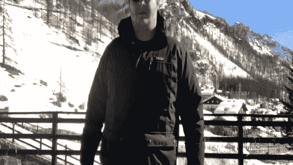
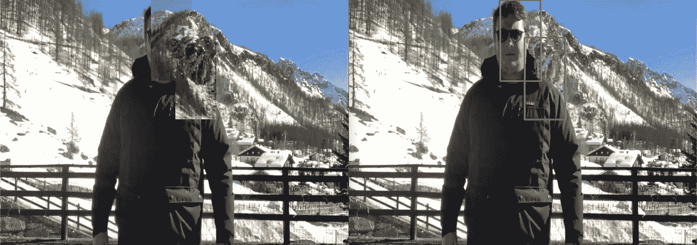
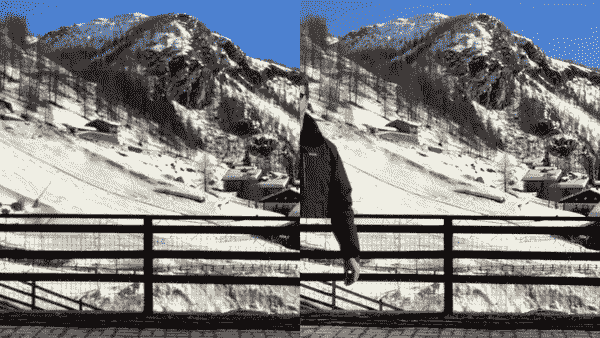

# 使用 Python 和 OpenCV 让自己隐形

> 原文：<https://towardsdatascience.com/turn-yourself-invisible-using-python-and-opencv-3a66dfa8af80?source=collection_archive---------16----------------------->

> 将一个人从背景中移除的确是一项有趣又尴尬的任务。在本指南中，我想一步一步地展示如何使用 OpenCV 和 Python 从直播流中删除一个人。


照片由阿索格蒂在 unsplash.com 拍摄

几天前，在浏览黑客新闻时，我对谷歌工程师杰森·梅斯的[T3 项目印象深刻。从我第一次看到这个项目的那一刻起，我就决定一定要(至少尝试)复制它。然而，由于我的随身工具主要是 R 和 Python，所以我决定用后者来实现它。](https://github.com/jasonmayes/Real-Time-Person-Removal)

## 你需要什么:

*   Python 3.x.x(我用的是 Python 3.7.4)
*   OpenCV(我使用的是版本 4.1.2)



本项目中描述的不同阶段的分解。

## 头脑风暴:

在做了一些头脑风暴后，我意识到，要从稳定的图像中删除一个对象，我很可能需要一个锚点作为起点，然后复制粘贴每一帧，就像一个遮罩一样，应用于包含一个人的每一个后续帧。

然后我想，如果我有我想要隐藏的区域的坐标，我可以简单地从锚帧复制它，并在我想要隐藏对象的当前帧上替换它。



一个我被检测到的帧的例子。

要解决的第二个问题是找到一种方法来检测我想要移除的感兴趣的对象。幸运的是，OpenCV 提供了一种简单的方法:基于支持向量机的梯度方向直方图检测器。这是一个必去的人探测器，不是最快的，不是最准确的，也不是最好的，但它就是工作。

## 工作流程:

因此，在头脑风暴之后，我决定坚持以下工作流程:

*   实例化`HOGDescriptor`
*   获取视频的第一帧以用作遮罩
*   迭代每一帧，对于每个检测到的人，用第一帧中相应的“空”区域替换该区域
*   保存输出

## 代码:

按照之前描述的工作流程，我在我的 [GitHub 库](https://github.com/robertosannazzaro/person-removal-detectron2)下找到了下面的代码。

## 来测试一下吧！



像老板一样。把手放在口袋里，然后消失！

然而，引用埃隆·马斯克的话:

> “仍有改进的空间”



实际上没有这么精确，尤其是当我靠近镜头的时候。

测试完这段代码后，我意识到我可能是在正确的道路上，但是，检测不够精确，整个输出看起来有问题且不稳定。

所以我意识到我需要找到一种方法来改进它:用第一帧替换每个检测到的人似乎是一个好方法，所以我可能需要找到一种更好的方法来检测物体，**一个更好的模型！**

我记得不久前我写了一篇[简短指南](/a-beginners-guide-to-object-detection-and-computer-vision-with-facebook-s-detectron2-700b6273390e)关于如何开始使用脸书的 Detectron2 模型，那么为什么不实现它而不是 HOG 检测器呢？

## 改进之处:

在 [COCO 的模型动物园](https://github.com/facebookresearch/detectron2/tree/master/configs/COCO-InstanceSegmentation)上搜索我发现了一个实例分割模型，每张图片的推理时间为 0.07 秒，这是最快的可用模型之一(可能不是最准确的)。然后我决定使用它。

要在我的管道中插入一个定制模型，必须安装所有必需的依赖项，如`pytorch`、`torchvision`和`detectron2`:

```
# install dependencies:!pip install -U torch==1.4+cu100 torchvision==0.5+cu100 -f [https://download.pytorch.org/whl/torch_stable.html](https://download.pytorch.org/whl/torch_stable.html)!pip install cython pyyaml==5.1!pip install -U ‘git+https://github.com/cocodataset/cocoapi.git#subdirectory=PythonAPI'import torch, torchvision
```

以下代码和指令是在 Google Colab 实例上测试的，做出这一选择是为了让这个实验更容易复制，而不会有缺少依赖、版本冲突和所有经常发生的无聊事情。

然后我们需要安装检测器 2:

```
# install detectron2:!git clone [https://github.com/facebookresearch/detectron2](https://github.com/facebookresearch/detectron2) detectron2_repo!pip install -e detectron2_repo
```

现在我们可以导入所有需要的库并加载模型(完整代码请参考 [Google Colab 笔记本](https://colab.research.google.com/drive/12cFu78sYG6Hl-kpmSEI3axuw4KhUe_RY)或 [GitHub repo](https://github.com/robertosannazzaro/person-removal-detectron2) ):

```
cfg = get_cfg()cfg.merge_from_file(model_zoo.get_config_file(“COCO-InstanceSegmentation/mask_rcnn_R_50_DC5_1x.yaml”))cfg.MODEL.ROI_HEADS.SCORE_THRESH_TEST = 0.5 # set threshold for this modelcfg.MODEL.WEIGHTS = model_zoo.get_checkpoint_url(“COCO-InstanceSegmentation/mask_rcnn_R_50_DC5_1x.yaml”)predictor = DefaultPredictor(cfg)
```

不可能使用我们的`predictor`来推断类，`predictor`返回一个需要转换成`numpy`数组的张量数组，然后可以像我之前做的一样迭代它:

```
outputs = predictor(frame)outputs = outputs[“instances”].pred_boxes
.to(‘cpu’)
.tensor
.numpy()
.astype(int)
```

让我们来看看最终结果:



探测器 2 与全息探测器

从 gif 中可以观察到 Detectron2 如何更准确地检测到一个人，然而，需要指出的是，当然，它需要一些更“深入”的配置(依赖关系有时是一种斗争)。但是，最后的结果自己说话！

## 几个最后的考虑:

尽管最终获得的结果相当令人惊讶，但总有改进的余地。仔细观察我身后的滑雪者，可以发现当我从他们面前经过时，面具使他们自己消失了(这种现象被称为遮挡)。此外，当前帧上的“切割”矩形之间的插值非常明显。为了解决这两个问题，能够执行[全景分割](https://github.com/facebookresearch/detectron2)的模型可能会有所帮助。

## 最后的对比视频:

```
**I have a newsletter 📩.**Every week I’ll send you a brief findings of articles, links, tutorials, and cool things that caught my attention. If tis sounds cool to you subscribe.*That means* ***a lot*** *for me.*
```

 [## 米尔斯形式

### 编辑描述

无情-创造者-2481.ck.page](https://relentless-creator-2481.ck.page/68d9def351)