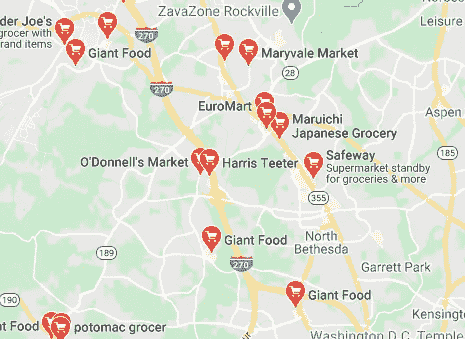
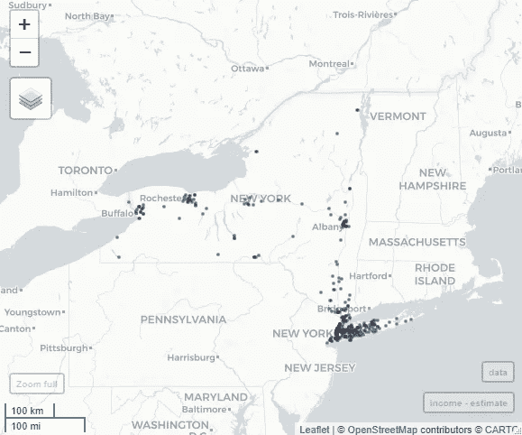
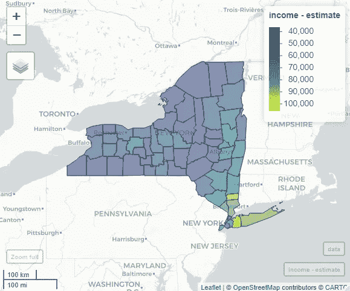
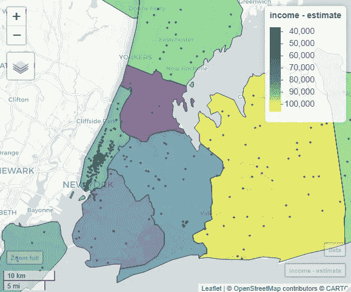
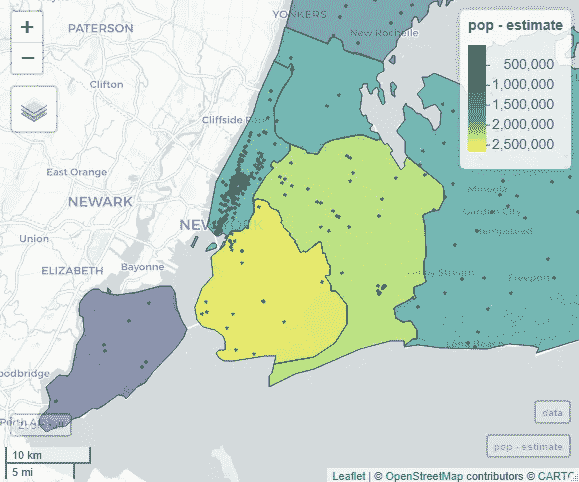
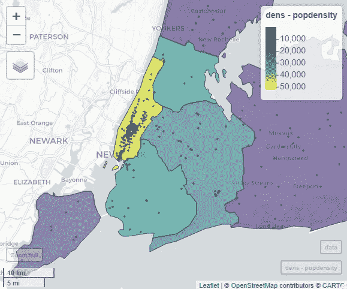

# 将位置数据转化为地理信息

> 原文：<https://towardsdatascience.com/turning-location-data-into-geographical-information-2ebbc080f040?source=collection_archive---------33----------------------->

## 纽约星巴克的位置、人口密度和家庭收入


丹尼尔·冯·阿彭在 Unsplash[拍摄的照片](https://unsplash.com?utm_source=medium&utm_medium=referral)

# 介绍

如果你搜索“我附近的杂货店”，谷歌地图会显示附近商店的位置。谷歌地图使用位置数据在地图上显示附近的商店。这些数据可能包含其他信息，如商店详细信息、地址、电话号码，但地理位置本身是关键。位置数据的使用有很多原因-就像查找杂货店一样简单，但也可以用于更复杂的决策，例如在哪里新开一家餐馆。

这篇文章是对[上一篇关于点模式分析的文章](/point-pattern-analysis-of-location-data-1346f318865d)的补充，目的是演示一些人可以用位置数据做的基本事情。没有太多复杂的分析，但我将重点关注如何在地图上显示位置数据，并解释这些数据点对于周围和潜在变量(如人口和收入)的意义。



“我附近的杂货店”的谷歌地图搜索结果

# 星巴克选址:案例研究

在这个案例研究中，我使用的是[星巴克的位置](https://raw.githubusercontent.com/libjohn/mapping-with-R/master/data/All_Starbucks_Locations_in_the_US_-_Map.csv)数据。这些数据有点过时了，但我怀疑这些年来地点有很大变化。

此外，我使用县级人口普查数据中的一些变量来理解可能与星巴克位置相关的潜在过程:

*   家庭收入
*   总人口
*   人口密度

目的是看这些变量中的哪一个与星巴克店的位置相关(没有暗示相关性)。我们没有进行任何花哨的地质统计分析，只是在数据层上叠加数据层，并观察它们以发现是否有任何有趣的模式出现。

# **位置与底层流程的关联**

为了映射位置数据和人口普查变量，我用 r 实现了这个练习。Python 有很好的库来做这种工作，但是我想利用`tidycensus`包来处理人口普查数据。首先，我们需要安装一些库。

```
# To access census variables and polygons
library(tidycensus)# To work with spatial polygons
library(sf)# To work with the dataframe associated with the spatial data
library(tidyverse)# To make maps
library(mapview)
```

要使用人口普查局 API 访问数据，您需要一个 API 密钥。这是一个简单的过程，只需[去人口普查局网站](https://api.census.gov/data/key_signup.html)申请一个 API 密匙，并把它发送到你的邮箱。一旦有了密钥，就将它加载到您的环境中。

```
# load API key
census_api_key("YOUR API KEY")
```

现在我们可以加载星巴克的位置数据了。该数据集包含全国范围的星巴克位置，您可以过滤您感兴趣的任何州/地理位置。我在过滤纽约州。

```
# load data
data = read_csv("[https://raw.githubusercontent.com/libjohn/mapping-with-R/master/data/All_Starbucks_Locations_in_the_US_-_Map.csv](https://raw.githubusercontent.com/libjohn/mapping-with-R/master/data/All_Starbucks_Locations_in_the_US_-_Map.csv)")# filter Starbucks locations in New York State
df = filter(data, State == "NY")# plot the locations 
mapview(df, xcol = "Longitude", ycol = "Latitude", crs = 4269, grid = FALSE, legend = FALSE, alpha = 0.5, cex = 1)
```



纽约的星巴克店

下一步是通过感兴趣的变量的`tidycensus`从人口普查局导入人口普查数据。我正在获取家庭收入和人口变量。

让我们先来看看纽约州的家庭收入是如何分布的。

```
# get income data via `tidycensus`` 
income = get_acs(geography = "county", variables = "B19013_001", state = "NY", geometry = TRUE)
```



纽约州各县的家庭收入分布情况

毫不奇怪，一些收入最高的家庭位于纽约市附近的县。我会放大那个区域。

但是让我们先得到其他变量。

```
# get population data via `tidycensus`` 
pop = get_acs(geography = "county", variables = "B01003_001", state = "NY", geometry = TRUE)# add population density
dens = as_Spatial(pop) # convert `sf` object (pop) to SpatialPolygonDataFrame # add area column
dens$Area_sqmile <- area(dens)/2.59e+6# add population density columns
dens$popdensity = dens$estimate/dens$Area_sqmile
```

# **绘图和解释**

首先，让我们将星巴克的位置放在收入数据的顶部，看看高收入的县是否有大量的星巴克门店。我再一次放大了纽约市的区域。

```
# map starbucks on income
mapview(income, zcol = "estimate") + 
  mapview(df, xcol = "Longitude", ycol = "Latitude", crs = 4269, grid = FALSE,legend = FALSE, alpha = 0.5, cex = 1)
```



纽约市各县(多边形)和星巴克所在地(圆点)的家庭收入

所以大多数星巴克店都位于曼哈顿地区。但这并不是家庭收入最高的地方，收入最高的家庭在拿骚县(黄色多边形)。我们可以推断，星巴克的门店不一定位于富人区，意味着存在一种微弱的(如果有的话)关联。

现在让我们试一下总人口，看看人口多的县是否有很多星巴克店。

```
# map starbucks on population
mapview(pop, zcol = "estimate") + 
  mapview(df, xcol = "Longitude", ycol = "Latitude", crs = 4269, grid = FALSE,legend = FALSE, alpha = 0.5, cex = 1)
```



纽约市各县(多边形)和星巴克所在地(圆点)周围的总人口

就人口而言，金斯县(黄色多边形)和皇后县是纽约市人口最多的县，但这也不是大多数星巴克店的所在地。这意味着，像收入一样，总人口似乎也是星巴克门店位置的一个弱预测因素。

最后，我们来看看人口密度是否有关系。

```
# map starbucks on population density
mapview(dens, zcol = "popdensity") + 
  mapview(df, xcol = "Longitude", ycol = "Latitude", crs = 4269, grid = FALSE,legend = FALSE, alpha = 0.5, cex = 1)
```



纽约市各县(多边形)和星巴克所在地(圆点)周围的人口密度

这就对了。

人口密度最高的是曼哈顿地区，那里也是星巴克店最多的地方。因此，地理位置和人口密度之间似乎存在某种联系，这种联系强于各县的总人口或家庭收入。

## 结论

从这些关联分析中，我们发现人口密度是一个更好的预测因素，可以预测附近是否有星巴克，而收入则不是一个因素。然而，作出这样的概括是相当简单的，因为还有我没有考虑的其他因素，如人口的年龄，大学生的数量，种族等等。此外，我们还可以测试这种关联在美国的其他州和地区是否成立。

在本例中，您学习了如何绘制位置数据和使用人口普查地图。你还学会了如何提出问题，测试一个假设，甚至产生一个新的假设。在以后的文章中，我将进一步分析点数据，敬请关注。