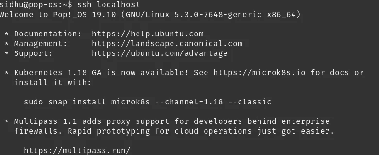
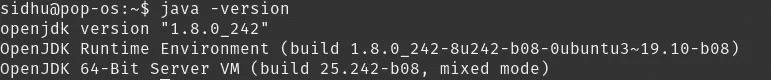
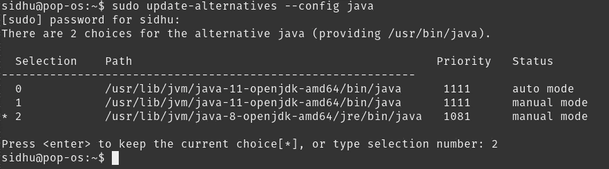
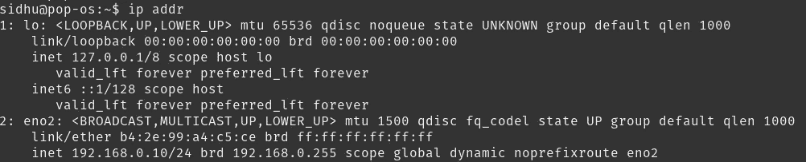
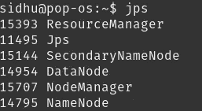
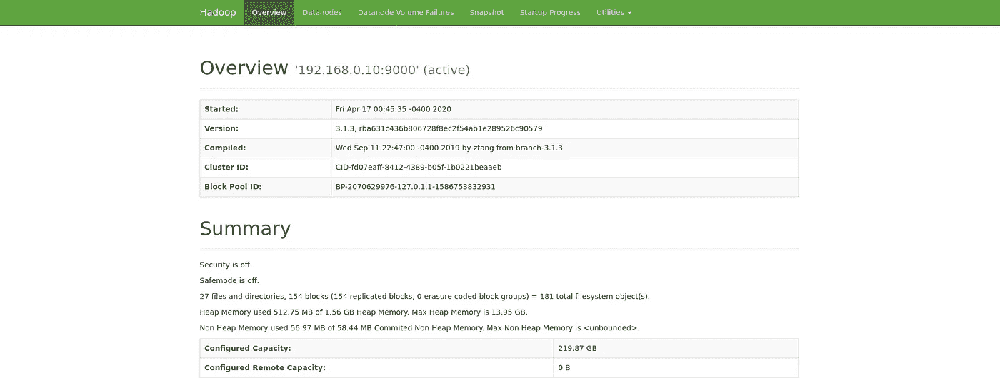
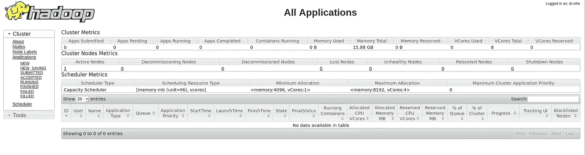
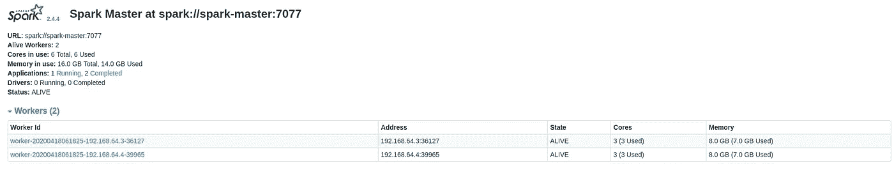
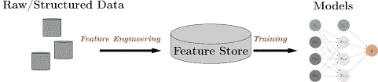

# 教程:为数据科学构建您自己的大数据基础架构

> 原文：<https://towardsdatascience.com/tutorial-building-your-own-big-data-infrastructure-for-data-science-579ae46880d8?source=collection_archive---------7----------------------->


Justin Jairam 拍摄的照片来自 [@jusspreme](https://www.instagram.com/jusspreme/?hl=en)

从事自己的数据科学项目是学习新技能和磨练现有技能的绝佳机会，但如果您想使用 Hadoop、Spark on a distributed cluster、Hive 等行业中使用的技术，该怎么办呢？并把它们整合在一起。在构建自己的基础设施时，这就是价值的来源。


大数据格局

您熟悉了这些技术，了解了它如何运行的细节，调试并体验了不同类型的错误消息，真正了解了技术的整体工作原理，而不仅仅是与它进行交互。如果您也在处理自己的私有数据或机密数据，出于隐私或安全原因，您可能不希望将其上传到外部服务来进行大数据处理。因此，在本教程中，我将介绍如何在自己的计算机、家庭实验室等设备上设置自己的大数据基础架构。我们将设置一个单节点 Hadoop & Hive 实例和一个与 Jupyter 集成的“分布式”spark 集群。

*编辑*:多亏了 [@Daniel Villanueva](https://medium.com/@dvillaj) 你现在可以部署一个预先配置了 Hadoop、Spark 和 Hive 的虚拟机，并准备好通过他的流浪映像。你可以在他的 Github [这里](https://github.com/dvillaj/spark-box)查看。

**本教程不适用于工业生产安装！**

# 先决条件

*   基于 Debian 的发行版——Ubuntu，Pop-os 等
*   基本的命令行知识会有所帮助，但对于安装来说不是必需的

# 步骤 1 —下载 Hadoop 和 Hive

Hadoop 无疑是当今行业中最常用的大数据仓库平台，是任何大数据工作的必备知识。简而言之，Hadoop 是一个开源软件框架，用于以分布式方式存储和处理大数据。你可以从[这里](https://www.apache.org/dyn/closer.cgi/hadoop/common/hadoop-3.1.3/hadoop-3.1.3-src.tar.gz)下载最新版本。

Hive 通常添加在 Hadoop 之上，以类似 SQL 的方式查询 Hadoop 中的数据。Hive 使作业易于执行操作，如

*   数据封装
*   即席查询
*   大型数据集的分析

Hive 速度较慢，通常仅用于批处理作业。一个更快的 Hive 版本可能类似于 Impala，但对于家庭使用来说，它可以完成任务。你可以在这里下载最新版本的 Hive。

确保您下载的是二进制(bin)版本，而不是源代码(src)版本！

## 将文件解压缩到/opt

```
cd ~/Downloads
tar -C /opt -xzvf apache-hive-3.1.2-bin.tar.gz
tar -C /opt -xzvf hadoop-3.1.3.tar.gz
```

将它们重命名为`hive`和`hadoop`。

```
cd /opt
mv hadoop-3.1.3 hadoop
mv apache-hive-3.1.2-bin hive
```

# 步骤 2 —设置授权(或无密码)SSH。

我们为什么需要这样做？Hadoop 核心使用 Shell (SSH)在从属节点上启动服务器进程。它要求主节点和所有连接节点之间的无密码 SSH 连接。否则，您必须手动转到每个节点并启动每个 Hadoop 进程。

由于我们运行的是 Hadoop 的本地实例，我们可以省去设置主机名、SSH 密钥以及将它们添加到每个机器中的麻烦。如果这是一个分布式环境，最好也创建一个`hadoop`用户，但是对于单个节点设置和个人使用来说，这是不必要的。

真正简单的，**只适合在家里使用，不应该在其他地方使用或完成的方式是**:

`cat ~/.ssh/id_rsa.pub >> ~/.ssh/authorized_keys`

现在运行`ssh localhost`，你应该可以不用密码登录了。



无密码 SSH 登录

为了了解在分布式环境中设置网络和 SSH 配置需要做些什么，您可以阅读[这个](https://www.tutorialspoint.com/hadoop/hadoop_multi_node_cluster.htm)。

# 步骤 3 —安装 Java 8

本教程最重要的步骤之一。

如果做得不正确，将会导致耗费大量时间调试模糊的错误消息，只是为了意识到问题和解决方案是如此简单。

Hadoop 有一个主要需求，这就是 Java 版本 8。有趣的是，这也是 Spark 的 Java 需求，也非常重要。

```
sudo apt-get update
sudo apt-get install openjdk-8-jdk
```

验证 Java 版本。

`java -version`



Java 版本

如果由于某种原因，您没有看到上面的输出，您需要更新您的默认 Java 版本。

`sudo update-alternatives --config java`



更新 Java 版本

选择与 Java 8 相关的数字。

再次检查版本。

`java -version`


正确的 Java 版本

# 步骤 4 —配置 Hadoop + Yarn

Apache Hadoop YARN(又一个资源协商器)是一种集群管理技术。在非常基本的层面上，它帮助 Hadoop 管理和监控其工作负载。

## 初始 Hadoop 设置

首先让我们设置我们的环境变量。这将告诉其他组件每个组件的配置位于何处。

`nano ~/.bashrc`

将此添加到您的`.bashrc`文件的底部。

```
export HADOOP_HOME=/opt/hadoop
export HADOOP_INSTALL=$HADOOP_HOME
export HADOOP_MAPRED_HOME=$HADOOP_HOME
export HADOOP_COMMON_HOME=$HADOOP_HOME
export HADOOP_HDFS_HOME=$HADOOP_HOME
export YARN_HOME=$HADOOP_HOME
export HADOOP_COMMON_LIB_NATIVE_DIR=$HADOOP_HOME/lib/native
export PATH=$PATH:$HADOOP_HOME/sbin:$HADOOP_HOME/binexport LD_LIBRARY_PATH=$HADOOP_HOME/lib/native:$LD_LIBRARY_PATHexport HIVE_HOME=/opt/hive
export PATH=$PATH:$HIVE_HOME/bin
```

保存并退出 nano `CTRL + o`，`CTRL + x`。

然后我们需要通过运行`source ~/.bashrc`来激活这些更改。您也可以关闭并重新打开您的终端来达到同样的效果。

接下来，我们需要制作一些目录和编辑权限。创建以下目录:

```
sudo mkdir -p /app/hadoop/tmp
mkdir -p ~/hdfs/namenode
mkdir ~/hdfs/datanode
```

编辑`/app/hadoop/tmp`的权限，授予其读写权限。

```
sudo chown -R $USER:$USER /app
chmod a+rw -R /app
```

## 配置文件

所有的 Hadoop 配置文件都位于`/opt/hadoop/etc/hadoop/`中。

`cd /opt/hadoop/etc/hadoop`

接下来，我们需要编辑以下配置文件:

```
- core-site.xml
- hadoop-env.sh
- hdfs-site.xml
- mapred-site.xml
- yarn-site.xml
```

**core-site.xml**

```
<configuration>
    <property>
	<name>hadoop.tmp.dir</name>
	<value>/app/hadoop/tmp</value>
	<description>Parent directory for other temporary directories.</description>
    </property>
    <property>
	<name>fs.defaultFS </name>
	<value>hdfs://YOUR_IP:9000</value>
	<description>The name of the default file system. </description>
	</property>
</configuration>
```

`hadoop.tmp.dir`:不言自明，只是一个 hadoop 用来存储其他临时目录的目录`fs.defaultFS`:你的文件系统通过网络访问的 IP 和端口。如果这是一个分布式系统，它应该是您的 IP，以便其他节点可以连接到它。

要查找您的 ip，请在命令行中键入`ip addr`或`ifconfig`:



**hadoop-env.sh**

1.  确定 Java 8 JDK 的位置，它应该与`/usr/lib/jvm/java-8-openjdk-amd64/`相似或相同
2.  在`hadoop-env.sh`中添加以下一行:`export JAVA_HOME=/usr/lib/jvm/java-8-openjdk-amd64/`

**hdfs-site.xml**

```
<configuration>
    <property>
	<name>dfs.replication</name>
	<value>1</value>
	<description>Default block replication.</description>
    </property>
    <property>
	<name>dfs.name.dir</name>
	<value>file:///home/YOUR_USER/hdfs/namenode</value>
    </property>
    <property>
	<name>dfs.data.dir</name>
	<value>file:///home/YOUR_USER/hdfs/datanode</value>
    </property>
</configuration>
```

`dfs.replication`:在多少个节点上复制数据。

`dfs.name.dir`:NameNode 块的目录

`dfs.data.dir`:数据节点块的目录

**mapred-site.xml**

```
<configuration>
    <property>
	<name>mapreduce.framework.name</name>
	<value>yarn</value>
    </property>
    <property>
	<name>mapreduce.jobtracker.address</name>
	<value>localhost:54311</value>
    </property>
    <property>
        <name>yarn.app.mapreduce.am.env</name>
        <value>HADOOP_MAPRED_HOME=$HADOOP_MAPRED_HOME</value>
    </property>
    <property>
        <name>mapreduce.map.env</name>
        <value>HADOOP_MAPRED_HOME=$HADOOP_MAPRED_HOME</value>
    </property>
    <property>
        <name>mapreduce.reduce.env</name>
        <value>HADOOP_MAPRED_HOME=$HADOOP_MAPRED_HOME</value>
    </property>
    <property>
    	<name>mapreduce.map.memory.mb</name>
    	<value>4096</value>
    </property>
    <property>
    	<name>mapreduce.reduce.memory.mb</name>
    	<value>4096</value>
    </property>
</configuration>
```

`mapreduce.framework.name`:执行 MapReduce 作业的运行时框架。可以是本地、经典或纱线。

`mapreduce.jobtracker.address`:MapReduce 作业跟踪器运行的主机和端口。如果是“本地”，则作业作为单个映射和简化任务在进程中运行。

`yarn.app.mapreduce.am.env`:纱线图减少环境变量。

`mapreduce.map.env`:贴图减少贴图环境变量。

`mapreduce.reduce.env`:贴图减少减少环境变量。

`mapreduce.map.memory.mb`:Hadoop 允许分配给映射器的内存上限，以兆字节为单位。默认值为 512。

`mapreduce.reduce.memory.mb`:Hadoop 允许分配给 reducer 的内存上限，以兆字节为单位。默认值为 512。

**yarn-site.xml**

```
<configuration>
<!-- Site specific YARN configuration properties -->
    <property>
	<name>yarn.resourcemanager.hostname</name>
	<value>localhost</value>
    </property>
    <property>
	<name>yarn.nodemanager.aux-services</name>
	<value>mapreduce_shuffle</value>
    </property>
    <property>
	<name>yarn.nodemanager.resource.memory-mb</name>
	<value>16256</value>
    </property>
    <property>
	<name>yarn.app.mapreduce.am.resource.mb</name>
	<value>4096</value>
    </property>
    <property>
	<name>yarn.scheduler.minimum-allocation-mb</name>
	<value>4096</value>
    </property>
</configuration>
```

`yarn.resourcemanager.hostname`:RM 的主机名。也可能是远程 yarn 实例的 ip 地址。

`yarn.nodemanager.aux-services`:选择运行 MapReduce 需要设置的随机播放服务。

`yarn.nodemanager.resource.memory-mb`:可以分配给容器的物理内存量，以 MB 为单位。作为参考，我的机器有 64GB 的内存。如果这个值太低，您将无法处理大文件，得到一个`FileSegmentManagedBuffer`错误。

`yarn.app.mapreduce.am.resource.mb`:该属性指定为特定作业选择资源标准。任何具有相同或更多可用内存的节点管理器都将被选择来执行作业。

`yarn.scheduler.minimum-allocation-mb`:RM 上每个容器请求的最小分配量，单位为 MBs。低于这个值的内存请求将不会生效，指定的值将被分配为最小值。

## 启动 Hadoop

在开始 Hadoop 之前，我们必须格式化 namenode:

`hdfs namenode -format`

现在我们可以开始 Hadoop 了！运行以下命令:

```
start-dfs.sh
start-yarn.sh
```

要确保一切都已启动，请运行以下命令:

`ss -ln | grep 9000`


端口 9000 网络信息

运行`jps`



运行 Java 程序

您现在还可以在 [http://localhost:9870](http://localhost:9870) 访问 Hadoop web UI。



Hadoop Web 用户界面

您也可以在 [localhost:8088](http://localhost:8088) 访问 Yarn web UI。



纱网用户界面

# 步骤 5 —设置配置单元

既然我们已经启动并运行了 Hadoop，让我们在它的基础上安装 Hive。

首先，让我们在 Hadoop 中创建一个目录，我们的 Hive 表将存储在这个目录中。

`hdfs dfs -mkdir -p /user/hive/warehouse`

配置权限。

`hdfs dfs -chmod -R a+rw /user/hive`

## 设置 Metastore

配置单元 Metastore 是配置单元元数据的中央存储库。它存储了配置单元表和关系(模式和位置等)的元数据。它通过使用 metastore 服务 API 提供对此信息的客户端访问。有 3 种不同类型的元存储:

*   嵌入式 Metastore:一次只能打开一个配置单元会话。
*   本地 Metastore:多个配置单元会话，必须连接到外部数据库。
*   远程 metastore:多个 Hive 会话，使用 Thrift API 与 Metastore 交互，更好的安全性和可扩展性。

为了更详细地了解每种类型的 metastore 之间的区别，这是一个很好的[链接](https://data-flair.training/blogs/apache-hive-metastore/)。

在本指南中，我们将使用 MySQL 数据库设置一个远程 metastore。

```
sudo apt update
sudo apt install mysql-server
sudo mysql_secure_installation
```

运行以下命令:

```
sudo mysqlCREATE DATABASE metastore;
CREATE USER 'hive'@'%' IDENTIFIED BY 'PW_FOR_HIVE';
GRANT ALL ON metastore.* TO 'hive'@'%' WITH GRANT OPTION;
```

在 MySQL 中将`PW_FOR_HIVE`替换为您想要用于 hive 用户的密码。

下载 MySQL Java 连接器:

```
wget https://dev.mysql.com/get/Downloads/Connector-J/mysql-connector-java-8.0.19.tar.gz
tar -xzvf mysql-connector-java-8.0.19.tar.gz
cd mysql-connect-java-8.0.19
cp mysql-connector-java-8.0.19.jar /opt/hive/lib/
```

## 编辑 hive-site.xml

现在编辑`/opt/hive/conf/hive-site.xml`:

```
<configuration>
    <property>
        <name>javax.jdo.option.ConnectionURL</name>
        <value>jdbc:mysql://YOUR_IP:3306/metastore?createDatabaseIfNotExist=true&amp;useLegacyDatetimeCode=false&amp;serverTimezone=UTC</value>
        <description>metadata is stored in a MySQL server</description>
    </property>
    <property>
        <name>javax.jdo.option.ConnectionDriverName</name>
        <value>com.mysql.jdbc.Driver</value>
        <description>MySQL JDBC driver class</description>
     </property>
     <property>
        <name>javax.jdo.option.ConnectionUserName</name>
        <value>hive</value>
        <description>user name for connecting to mysql server</description>
     </property>
     <property>
        <name>javax.jdo.option.ConnectionPassword</name>
        <value>PW_FOR_HIVE</value>
        <description>password for connecting to mysql server</description>
     </property>
</configuration>
```

用本地 ip 地址替换`YOUR_IP`。用您之前为 hive 用户初始化的密码替换`PW_FOR_HIVE`。

## 初始化架构

现在让我们让 MySQL 可以从网络上的任何地方访问。

`sudo nano /etc/mysql/mysql.conf.d/mysqld.cnf`

将`bind-address`改为`0.0.0.0`。

重新启动服务以使更改生效:`sudo systemctl restart mysql.service`

最后，运行`schematool -dbType mysql -initSchema`来初始化 metastore 数据库中的模式。

## 启动配置单元 Metastore

`hive --service metastore`

## 测试蜂箱

首先通过调用`hive`从命令行启动 Hive。

让我们创建一个测试表:

```
CREATE TABLE IF NOT EXISTS test_table
 (col1 int COMMENT 'Integer Column',
 col2 string COMMENT 'String Column')
 COMMENT 'This is test table'
 ROW FORMAT DELIMITED
 FIELDS TERMINATED BY ','
 STORED AS TEXTFILE;
```

然后插入一些测试数据。

```
INSERT INTO test_table VALUES(1,'testing');
```

然后我们可以查看表中的数据。

```
SELECT * FROM test_table;
```

# 步骤 6 —设置火花

Spark 是一个通用的分布式数据处理引擎，适用于各种环境。在 Spark 核心数据处理引擎之上，有 SQL、机器学习、图形计算和流处理的库，它们可以在应用程序中一起使用。在本教程中，我们将使用 Docker 设置一个独立的 Spark 集群，并让它能够启动任意数量的工作线程。这背后的原因是我们想要模拟一个远程集群以及它所需的一些配置。

在生产环境中，Spark 通常被配置为使用 Yarn 和已经分配给 Hadoop 的资源。

首先，我们需要创建 Docker 文件。在本教程中，我们将使用 Spark 版本 2.4.4，但如果您想要最新版本，可以将其更改为 2.4.5，它还附带了 Hadoop 2.7 来管理节点之间的持久性和簿记。在生产设置中，spark 通常配置有 Yarn，以使用现有的 Hadoop 环境和资源，因为我们只有一个节点上的 Hadoop，我们将运行 Spark 独立集群。将 Spark 配置为与纱线一起运行只需要很少的改动，您可以在这里看到设置[的不同。](https://www.linode.com/docs/databases/hadoop/install-configure-run-spark-on-top-of-hadoop-yarn-cluster/)

## 设置独立集群

`nano Dockerfile`

```
# DockerfileFROM python:3.7-alpineARG SPARK_VERSION=2.4.4
ARG HADOOP_VERSION=2.7RUN wget -q https://archive.apache.org/dist/spark/spark-${SPARK_VERSION}/spark-${SPARK_VERSION}-bin-hadoop${HADOOP_VERSION}.tgz \
 && tar xzf spark-${SPARK_VERSION}-bin-hadoop${HADOOP_VERSION}.tgz -C / \
 && rm spark-${SPARK_VERSION}-bin-hadoop${HADOOP_VERSION}.tgz \
 && ln -s /spark-${SPARK_VERSION}-bin-hadoop${HADOOP_VERSION} /sparkRUN apk add shell coreutils procps
RUN apk fetch openjdk8
RUN apk add openjdk8
RUN pip3 install ipythonENV PYSPARK_DRIVER_PYTHON ipython
```

现在，我们要建立一个星火大师和 N 个星火工作者。为此，我们将使用 docker-compose。

`nano docker-compose.yml`

```
version: "3.3"
networks:
  spark-network:
services:
  spark-master:
    build: .
    container_name: spark-master
    hostname: spark-master
    command: >
      /bin/sh -c '
      /spark/sbin/start-master.sh
      && tail -f /spark/logs/*'
    ports:
      - 8080:8080
      - 7077:7077
    networks:
      - spark-network
  spark-worker:
    build: .
    depends_on:
      - spark-master
    command: >
      /bin/sh -c '
      /spark/sbin/start-slave.sh $$SPARK_MASTER
      && tail -f /spark/logs/*'
    env_file:
      - spark-worker.env
    environment:
      - SPARK_MASTER=spark://spark-master:7077
      - SPARK_WORKER_WEBUI_PORT=8080
    ports:
      - 8080
    networks:
      - spark-network
```

对于主容器，我们公开了端口 7077 供应用程序连接，以及端口 8080 供 Spark 作业 UI 连接。对于 worker，我们通过环境变量连接到我们的 Spark master。

对于配置 spark worker 的更多选项，我们将它们添加到`spark-worker.env`文件中。

`nano spark-worker.env`

```
SPARK_WORKER_CORES=3
SPARK_WORKER_MEMORY=8G
```

在此配置中，每个工作人员将使用 3 个内核和 8GB 内存。由于我的机器有 6 个内核，我们将启动 2 个工人。更改这些值，使其相对于您的机器。例如，如果您的机器只有 16GB 的 RAM，那么一个合适的内存值可能是 2gb 或 4GB。关于环境变量的完整列表和关于独立模式的更多信息，你可以在这里阅读完整的文档[。如果你想知道 executor 的内存，那是在提交或启动应用程序时设置的。](https://spark.apache.org/docs/latest/spark-standalone.html)

```
docker-compose build
docker-compose up -d --scale spark-worker=2
```

现在 spark 已经启动并运行，您可以在 [localhost:8080](http://localhost:8080) 查看 web UI！



Spark Web 用户界面

## 本地安装 Spark

在您的本地机器上，或者任何将要创建或使用 Spark 的机器上，都需要安装 Spark。因为我们正在设置一个远程 Spark 集群，所以我们从源头上安装它。在本教程中，我们将使用 PySpark，因为我大部分时间在我的个人项目中使用 Python。

你可以从[这里](https://archive.apache.org/dist/spark/)下载 Spark。

确保您下载的版本与您在主服务器上安装的版本相同。对于本教程，它的版本是 2.4.4

```
wget https://archive.apache.org/dist/spark/spark-2.4.4/spark-2.4.4-bin-hadoop2.7.tgz
tar -C /opt -xzvf spark-2.4.4-bin-hadoop2.7.tgz
```

设置 Spark 环境变量，`nano ~/.bashrc`

```
export SPARK_HOME=/opt/spark
export PATH=$SPARK_HOME/bin:$PATHexport PYSPARK_DRIVER_PYTHON="jupyter"
export PYSPARK_DRIVER_PYTHON_OPTS="notebook"
export PYSPARK_PYTHON=python3
```

如果您更喜欢 Jupyter Lab，请将 PYSPARK_DRIVER_PYTHON_OPTS 的“笔记本”更改为“实验室”。

## 配置文件

要配置 Spark 来使用我们的 Hadoop 和 Hive，我们需要在 Spark config 文件夹中有两者的配置文件。

```
cp $HADOOP_HOME/etc/hadoop/core-site.xml /opt/spark/conf/
cp $HADOOP_HOME/etc/hadoop/hdfs-site.xml /opt/spark/conf/
```

`nano /opt/spark/conf/hive-site.xml`

```
<configuration>
        <property>
                <name>hive.metastore.uris</name>
                <value>thrift://YOUR_IP:9083</value>
        </property>
        <property>
                <name>spark.sql.warehouse.dir</name>
                <value>hdfs://YOUR_IP:9000/user/hive/warehouse</value>
        </property>
</configuration>
```

`hive.metastore.uris`:告诉 Spark 使用 Thrift API 与 Hive metastore 交互。`spark.sql.warehouse.dir`:告诉 Spark 我们的蜂巢桌在 HDFS 的位置。

## 安装 PySpark

或者用安装在 spark master 上的任何版本替换 2.4.4。

要运行 PySpark 连接到我们的分布式集群运行:

`pyspark --master spark://localhost:7077`，您也可以用您的 ip 或远程 ip 替换`localhost`。

这将启动一个带有预定义的 Spark 上下文的 Jupyter 笔记本。因此，我们现在有一个单一的环境来分析有或没有 Spark 的数据。

默认情况下，executor 内存只有大约 1GB (1024mb)，要增加内存，请使用以下命令启动 pyspark:

`pyspark --master spark://localhost:7077 --executor-memory 7g`

在 Spark 中，每个执行器有 10%的开销，所以我们最多可以分配 7200mb，但是为了安全起见，我们选择 7。

# 测试集成

默认情况下，会自动创建一个 SparkContext，变量是`sc`。

从我们之前创建的配置单元表中读取。

```
from pyspark.sql import HiveContexthc = HiveContext(sc)hc.sql("show tables").show()hc.sql("select * from test_table").show()
```

要从 Hadoop 读取文件，命令应该是:

```
sparksession = SparkSession.builder.appName("example-pyspark-read-and-write").getOrCreate()
df = (sparksession
	.read
	.format("csv")
	.option("header", "true")
	.load("hdfs://YOUR_IP:9000/PATH_TO_FILE")
)
```

# 实际的 Hadoop 使用案例

除了存储数据，Hadoop 还被用作一个特性库。假设你是一个团队或组织的一部分，他们有多种模型。每个模型都有一个数据管道，用于接收原始数据、计算数据并将数据转换为特征。对于一个或两个模型来说，这完全没问题，但是如果有多个模型呢？如果跨这些模型重用特性(例如，记录标准化股票价格)会怎样？

我们可以创建一个只计算一次要素的数据管道，并将其存储在要素库中，而不是每个数据管道都重新计算相同的要素。该模型现在可以从要素库中提取要素，而无需任何冗余计算。这减少了数据管道中冗余计算和转换的数量！



功能存储还有助于解决以下问题:

*   不会重复使用特征。数据科学家面临的一个常见障碍是花费时间重新开发功能，而不是使用以前开发的功能或其他团队开发的功能。要素存储允许数据科学家避免重复工作。
*   功能定义各不相同。任何一家公司的不同团队可能会以不同的方式定义和命名特性。此外，访问某个特定特性的文档(如果存在的话)通常是一个挑战。特征存储通过保持特征及其定义的组织性和一致性来解决这个问题。功能库的文档有助于您围绕整个公司的所有功能创建一种标准化的语言。您确切地知道每个特征是如何计算的，以及它代表什么信息。
*   培训和生产功能不一致。生产和研究环境通常使用不同的技术和编程语言。流入生产系统的数据流需要实时处理为特征，并输入到机器学习模型中。

如果你想看一看一个功能商店并免费开始，我推荐 [StreamSQL](https://streamsql.io/) 。StreamSQL 允许您从各种来源传输数据，如 HDFS、本地文件系统、Kafka 等。并创建一个数据管道，可以养活你的模型！它能够保存在线或本地 HDFS 上的特征存储，供您训练模型。它还为您创建测试(保持)集。他们有一个很好的 API 文档，并且一直在改进它。

# 反馈

我鼓励所有关于这个帖子的反馈。如果你有任何问题或者需要任何帮助，你可以给我发邮件到 sidhuashton@gmail.com 或者在帖子上留言。

您也可以通过 Twitter 联系我并关注我，地址是 [@ashtonasidhu](https://twitter.com/ashtonasidhu) 。