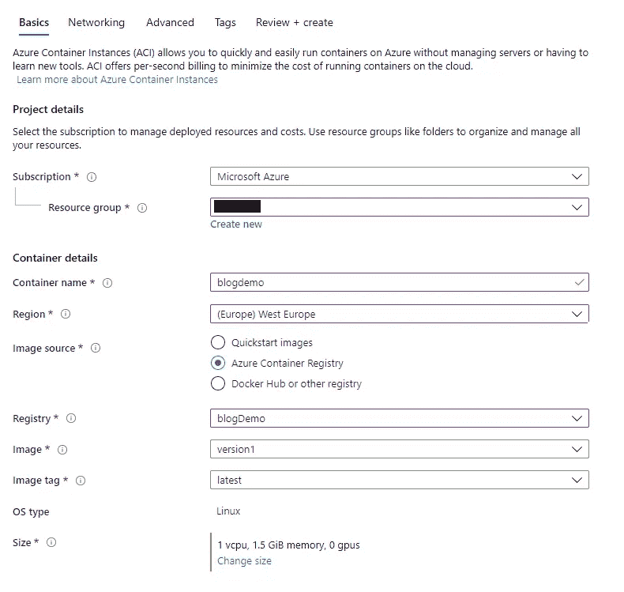

# 【教程】:在 Azure 上部署 ML 模型作为 REST API，用 SSL 保护

> 原文：<https://towardsdatascience.com/tutorial-deploy-ml-model-as-rest-api-on-azure-and-protect-it-with-ssl-7ed6c7659f80?source=collection_archive---------31----------------------->

## 将机器学习模型投入生产的分步指南


照片由[戴恩·托普金](https://unsplash.com/@dtopkin1?utm_source=medium&utm_medium=referral)在 [Unsplash](https://unsplash.com?utm_source=medium&utm_medium=referral) 拍摄

# 你会学到什么:

## **TL；博士:**


数据科学家经常忘记，如果他们的新模型不能在生产中使用，它们就没有多大用处。在本教程中，我将向您展示如何将 Tensorflow 模型部署到 Azure 容器实例，并使用 SSL 保护它。

**将有 3 种部署类型:**

*   **部署#1:本地部署:** 模型将被放在 docker 容器中，并作为 API 在 localhost 上公开。


**部署#1:本地部署**

*   **部署#2:不加密的全局部署:** 包含模型的 Docker 将上传到 Azure Container Registry。存储的容器将通过您可以调用的 API 公开。这样做的缺点是，如果每个人都有 IP 地址并且没有加密，他们就可以访问它。


**部署#2:不加密的全局部署**

*   **部署#3:用 SSL 加密的全局部署:** 包含模型的 Docker 将被上传到 Azure Container Registry。我们将为 API 的使用创建证书颁发机构(CA)和自签名证书。


**部署#3:使用 SSL 加密的全局部署**

# 先决条件:

*   带有 sudo 选项的 Linux 机器
*   安装在 Linux 上的 Docker
*   安装在 Linux 上的 Azure CLI
*   安装在 Linux 上的 openssl
*   Azure 的有效订阅

**注意:**
如果你没有有效的订阅，你可以为 Azure 创建一个免费帐户，并获得 2 周的试用期。

# 第一步:我们需要一个模型

训练 Tensorflow 模型并用
`tf.saved_model.save(model, "path / to / model")`保存

或者:

这里有一个演示模型，表示 f(x)= 2*x -1。它被保存到”。/demo_model/"

```
import os 
import numpy as np 
import tensorflow as tf xs = np.array([-1.0,  0.0, 1.0, 2.0, 3.0, 4.0], dtype=float) 
ys = np.array([-3.0, -1.0, 1.0, 3.0, 5.0, 7.0], dtype=float) model = tf.keras.Sequential([tf.keras.layers.Dense(units=1, input_shape=[1])]) 
model.compile(optimizer='sgd', loss='mean_squared_error') 
history = model.fit(xs, ys, epochs=500, verbose=0) 
print("Finished training the model") MODEL_DIR = "./demo_model" version = 1 
export_path = os.path.join(MODEL_DIR, str(version)) model.save(export_path, save_format="tf") 
print('\nexport_path = {}'.format(export_path))
```

Tensorflow 发球的细节我就不赘述了，因为有很棒的 [Coursera 课程](https://www.coursera.org/learn/advanced-deployment-scenarios-tensorflow/)。上面使用的代码是本课程中使用的代码，但仅针对本演示进行了压缩。你可以从[这里](https://www.tensorflow.org/tfx/tutorials/serving/rest_simple)了解更多 TFServing。

# 步骤 2:将模型放入 TFServing 容器中

打开“终端”,导航到保存模型的目录。

```
$ MODEL_NAME=**demo_model** #**REPLACE with your model**
$ MODEL_PATH="./$MODEL_NAME"
$ CONTAINER_NAME="$MODEL_NAME"$ sudo docker run -d --name serving_base tensorflow/serving
$ sudo docker cp "$MODEL_PATH" serving_base:"/models/$MODEL_NAME"
$ sudo docker commit --change "ENV MODEL_NAME $MODEL_NAME" serving_base "$CONTAINER_NAME"$ sudo docker run -d -p 8501:8501 "$MODEL_NAME"
```

现在，您已经通过本地主机上的 API 公开了您的模型，您可以从终端调用它:

```
$ curl -d '{"signature_name": "serving_default", "instances": [[10.0],[9.0]]}' -X POST "[http://localhost:8501/v1/models/$MODEL_NAME:predict](http://localhost:8501/v1/models/$MODEL_NAME:predict)"
```

或者来自 python:

```
import requests 
import json api_url = "[http://localhost:8501/v1/models/demo_model:predict](http://51.138.56.160/v1/models/use:predict)" data = json.dumps({"signature_name": "serving_default", "instances": [[10.0],[9.0]]}) headers = {"content-type": "application/json"} json_response = requests.post(api_url, data=data, headers=headers) print(json_response.text)
```


```
#STOP docker image
sudo docker container stop IMAGE_ID  
#DELETE docker image 
sudo docker container rm IMAGE_ID
```

部署#1:已完成！

您现在可以在 localhost 中使用您的模型了。

**额外提示:**另一个选择是端口转发。您使用 SSH 连接到机器。

```
ssh -N -f -L localhost:8501:localhost:8501 user@IP.ADDRESS
```

**缺点:**

*   你只能在本地使用它
*   您需要 VPN 访问才能使用端口转发
*   不可扩展

# 步骤 3:创建容器注册表

用于存储带有模型的容器。
转到 Azure portal 并找到容器注册表。点击**添加新注册表**按钮创建新注册表。


**重要提示:**

*   选择有效的订阅和资源组。
*   注册表名称必须是唯一的，我们以后还会用到它，所以请注意。(提示:仅使用小写字母)
*   位置是必须的，你应该选择离你最近的一个
*   大多数情况下，基本 SKU 应该足够了。

你现在可以点击**查看和创建**这个注册表按钮。

**重要提示:**导航到您的资源并启用管理员用户。记下用户名和密码。


# 步骤 4:将 Docker 容器推送到容器注册中心

```
$ CONTAINER_REGISTRY_NAME=**blogdemo** #**REPLACE (lower letters only)**$ sudo az login #login to Azure$ sudo az acr login --name "$CONTAINER_REGISTRY_NAME" $ sudo docker images
```


```
$ VERSION_NAME="$CONTAINER_REGISTRY_NAME.azurecr.io/version1"$ sudo docker tag **2b458f67dac3** "$VERSION_NAME" #**REPLACE**$ sudo docker push "$VERSION_NAME"
```

恭喜:
您已经成功地存储了带有模型的容器


# 步骤 5:用容器实例公开模型

在存储容器之后，暴露模型是相当容易的。

最简单的方法是登录 Azure portal，导航到容器实例并点击**添加**按钮。命名容器后，选择一个想要的区域，并选择您上传模型的注册表。



**注意:**
尺寸真的取决于你的模型尺寸。这个例子中使用的尺寸对于这个模型来说已经足够了。我已经部署了大约 150M 参数(600MB)的模型，它需要 2 个 vcpu 和 4 GB 内存。

现在点击**下一步:联网**按钮。


**注意:** DNS 名称是可选的，它需要是唯一的。

点击**审查并创建**，您的模型就可以使用了。(要删除实例，只需导航至资源并点击**删除**按钮)

**用法:**

```
$ curl -d '{"signature_name": "serving_default", "instances": [[10.0],[9.0]]}' -X POST "[http://blogdemo.westeurope.azurecontainer.io:8501/v1/models/$MODEL_NAME:predict](http://blogdemo.westeurope.azurecontainer.io:8501/v1/models/$MODEL_NAME:predict)" 
#**REPLACE** [blogdemo.westeurope.azurecontainer.io](http://blogdemo.westeurope.azurecontainer.io:8501/v1/models/$MODEL_NAME:predict) **WITH DNS**#OR:$ curl -d '{"signature_name": "serving_default", "instances": [[10.0],[9.0]]}' -X POST "[http://IP.ADDRESS:8501/v1/models/$MODEL_NAME:predict](http://blogdemo.westeurope.azurecontainer.io:8501/v1/models/$MODEL_NAME:predict)" 
#**REPLACE** [IP.ADDRESS](http://blogdemo.westeurope.azurecontainer.io:8501/v1/models/$MODEL_NAME:predict) **WITH IP**
```

使用模型与使用本地公开的模型是一样的，唯一的区别是 URL。您可以使用 DNS URL 或 IP URL。

**部署#2:已完成！**

您已经部署了一个可以在互联网上使用的模型。您可以监视模型的使用情况，并在需要时升级容器的大小，这使得它具有可伸缩性。

**缺点:**

*   每个知道 IP 地址的人都可以访问这个模型
*   未加密

# 步骤 6:创建证书颁发机构和用户

为了保护 API，我们需要加密。如果您使用商业证书颁发机构，可以跳过这一步。我们将创建自己的自签名证书。

```
$ mkdir certs 

$ cd certs $ openssl ecparam -genkey -name secp256r1 | openssl ec -out ca.key $ openssl req -new -x509 -days 3650 -key ca.key -out ca.pem
```

系统会提示您填写表格。请填写您的信息。

**注:** 为简单起见，这是椭圆加密的一个例子。我建议使用 RSA 密钥。这是一个很棒的[要点](https://gist.github.com/mtigas/952344)，解释了如何去做。


```
$ CLIENT_ID=”client”
$ CLIENT_SERIAL=01 
#when creating new user make sure that **serial is unique**$ openssl ecparam -genkey -name secp256r1 | openssl ec -out “${CLIENT_ID}.key”$ openssl req -new -key “${CLIENT_ID}.key” -out “${CLIENT_ID}.csr” 
#password should be empty$ openssl x509 -req -days 3650 -in “${CLIENT_ID}.csr” -CA ca.pem -CAkey ca.key -set_serial “${CLIENT_SERIAL}” -out “${CLIENT_ID}.pem”$ cat “${CLIENT_ID}.key” “${CLIENT_ID}.pem” ca.pem > “${CLIENT_ID}.full.pem”#**OPTIONAL**:
$ openssl pkcs12 -export -out “${CLIENT_ID}.full.pfx” -inkey “${CLIENT_ID}.key” -in “${CLIENT_ID}.pem” -certfile ca.pem#remember passoword and you will pass it with pfx file
```

# 步骤 7:配置 NGINX

我们为什么需要 NGINX？

拒绝所有没有有效证书的请求。


创建 nginx.config 文件，如下所示:

```
$ cd ..$ cat > nginx.conf
```

复制所有内容并粘贴到一个文件中。粘贴后，使用 CTRL+D 关闭编辑器。

```
user nginx;worker_processes auto;events {
  worker_connections 1024;
}pid        /var/run/nginx.pid;http {server {
        listen [::]:443 ssl;
        listen 443 ssl;server_name localhost;ssl_protocols              TLSv1 TLSv1.1 TLSv1.2;ssl_ciphers                ECDHE-RSA-AES128-GCM-SHA256:ECDHE-ECDSA-AES128-GCM-SHA256:ECDHE-RSA-AES256-GCM-SHA384:ECDHE-ECDSA-AES256-GCM-SHA384:DHE-RSA-AES128-GCM-SHA256:DHE-DSS-AES128-GCM-SHA256:kEDH+AESGCM:ECDHE-RSA-AES128-SHA256:ECDHE-ECDSA-AES128-SHA256:ECDHE-RSA-AES128-SHA:ECDHE-ECDSA-AES128-SHA:ECDHE-RSA-AES256-SHA384:ECDHE-ECDSA-AES256-SHA384:ECDHE-RSA-AES256-SHA:ECDHE-ECDSA-AES256-SHA:DHE-RSA-AES128-SHA256:DHE-RSA-AES128-SHA:DHE-DSS-AES128-SHA256:DHE-RSA-AES256-SHA256:DHE-DSS-AES256-SHA:DHE-RSA-AES256-SHA:AES128-GCM-SHA256:AES256-GCM-SHA384:ECDHE-RSA-RC4-SHA:ECDHE-ECDSA-RC4-SHA:AES128:AES256:RC4-SHA:HIGH:!aNULL:!eNULL:!EXPORT:!DES:!3DES:!MD5:!PSK;
        ssl_prefer_server_ciphers  on;ssl_session_cache    shared:SSL:10m; # a 1mb cache can hold about 4000 sessions, so we can hold 40000 sessions
        ssl_session_timeout  24h;keepalive_timeout 300; # up from 75 secs defaultadd_header Strict-Transport-Security 'max-age=31536000; includeSubDomains';ssl_certificate      /etc/nginx/server.pem; 
  ssl_certificate_key /etc/nginx/server.key; 
  ssl_client_certificate /etc/nginx/ca.pem; 

  ssl_verify_client on;

        location / {
            proxy_pass http://localhost:8501; # TODO: replace with correct port

            proxy_set_header Connection "";
            proxy_set_header Host $host;
            proxy_set_header X-Real-IP $remote_addr;
            proxy_set_header X-Forwarded-For $remote_addr;
        }
    }
}
```

NGINX 的细节我就不赘述了，下面是详细的[链接](https://medium.com/@jovanshernandez/what-is-nginx-f0a9c3a49a41)。这个配置是这个[博客](https://medium.com/@samkreter/adding-ssl-tls-to-azure-container-instances-1e608a8f321c)和这个[文章](https://fardog.io/blog/2017/12/30/client-side-certificate-authentication-with-nginx/)的混合体。简而言之，它只监听 https(端口 443)并验证它收到的证书。如果证书有效，它会将解密的请求重定向到具有模型的容器，并对发送回客户端的响应进行加密。

# 步骤 8:为 Azure 准备设置文件

为 Azure 创建 test-deploy.yaml 文件:

```
$ cat > test-deploy.yaml
```

复制所有内容并粘贴到一个文件中。粘贴后，使用 CTRL+D 关闭编辑器。

```
location: LOCATION
name: NAME
properties:
  containers:
  - name: model
    properties:
      image: IMAGE.azurecr.io/version1:latest
      ports:
      - port: 8501
        protocol: TCP
      resources:
        requests:
          cpu: 1.0
          memoryInGB: 1.5
  - name: nginx-with-ssl
    properties:
      image: nginx
      ports:
      - port: 443
        protocol: TCP
      resources:
        requests:
          cpu: 1.0
          memoryInGB: 1.5
      volumeMounts:
      - name: nginx-config
        mountPath: /etc/nginx
  imageRegistryCredentials:
  - server: SERVER.azurecr.io
    username: USERNAME
    password: PASSWORD
  volumes:
  - secret:
      server.pem: PEM
      server.key: KEY
      ca.pem: CA
      nginx.conf: CONF
    name: nginx-config
  ipAddress:
    ports:
    - port: 443
      protocol: TCP
    type: Public
    dnsNameLabel: DNS
  osType: Linux
tags: null
type: Microsoft.ContainerInstance/containerGroups
```

我们将使用 **sed** 命令替换该模板的部分内容。这些是无需编辑即可运行的命令。

```
$ sed -i -e "s/name: NAME/name: $MODEL_NAME/" azure.yaml$ sed -i -e "s/image: IMAGE/image: $CONTAINER_REGISTRY_NAME/" azure.yaml$ sed -i -e "s/server: SERVER/server: $CONTAINER_REGISTRY_NAME/" azure.yaml$ sed -i -e "s/username: USERNAME/username: $CONTAINER_REGISTRY_NAME/" azure.yaml$ sed -i -e "s/server.pem: PEM/server.pem: $(cat ./certs/ca.pem | base64 -w 0)/" azure.yaml$ sed -i -e "s/server.key: KEY/server.key: $(cat ./certs/ca.key| base64 -w 0)/" azure.yaml$ sed -i -e "s/ca.pem: CA/ca.pem: $(cat ./certs/ca.pem | base64 -w 0)/" azure.yaml$ sed -i -e "s/nginx.conf: CONF/nginx.conf: $(cat ./nginx.conf | base64 -w 0)/" azure.yaml
```

这些命令必须进行编辑。用注册表中的位置和密码替换粗体部分，并用您的 DNS 替换 DNS_NAME。

```
$ sed -i -e "s/location: LOCATION/location: **westeurope**/" azure.yaml$ sed -i -e "s/password: PASSWORD/password: **REGISTRY_PASS**/" azure.yaml
#TIP: If your generated password has some special characters
#like / you will have to manually put **\**/ infront$ sed -i -e "s/dnsNameLabel: DNS/dnsNameLabel: **DNS_NAME**/" azure.yaml
```

# 步骤 9:部署模型

用您的有效资源组替换 **< AZURE 资源组>** ，您就可以开始了。

```
$ az container create --resource-group **<AZURE RESOURCE GROUP>** --name "$MODEL_NAME" -f azure.yaml
```

# 第十步:用法

确保您拥有 client.key 和 client.pem 的正确路径，并且您可以继续调用 API，如下所示:

```
$ curl -d '{"signature_name": "serving_default", "instances": [[10.0],[9.0]]}' -v --key "./certs/client.key" --cert "./certs/client.full.pem" -X POST -k [https://blogdemo.westeurope.azurecontainer.io/v1/models/demo_model:predict](https://blogdemo.westeurope.azurecontainer.io/v1/models/demo_model:predict)#**REPLACE** [blogdemo.westeurope.azurecontainer.io](http://blogdemo.westeurope.azurecontainer.io:8501/v1/models/$MODEL_NAME:predict) **WITH DNS**#OR:$ curl -d '{"signature_name": "serving_default", "instances": [[10.0],[9.0]]}' -v --key "./certs/client.key" --cert "./certs/client.full.pem" -X POST -k [https://IP.ADDRESS/v1/models/demo_model:predict](https://blogdemo.westeurope.azurecontainer.io/v1/models/demo_model:predict)
#**REPLACE** [IP.ADDRESS](http://blogdemo.westeurope.azurecontainer.io:8501/v1/models/$MODEL_NAME:predict) **WITH IP**
```

如果一切正常，您将会得到这样的响应:


**重要提示:**由于这是自签名证书，所以必须在 cURL 中添加 **-k** 标志。

**Python 版本:**

```
import requests 
import jsonapi_url = "[https://blogdemo.westeurope.azurecontainer.io/v1/models/demo_model:predict](https://blogdemo.westeurope.azurecontainer.io/v1/models/demo_model:predict)"data = json.dumps({"signature_name": "serving_default", "instances": [[10.0],[9.0]]})headers = {"content-type": "application/json"}json_response = requests.post(api_url, data=data, headers=headers,verify=False,cert=("./certs/client.pem","./certs/client.key"),)print(json_response.text)
```


**重要提示:**由于这是一个自签名证书，您必须设置 **verify=False**

**无有效证书调用时:**


部署#3:已完成！

# 第十一步:监控

您可以在容器实例中监控模型的使用，并且可以在 nginx 日志中看到请求。


# 常见问题:

问:我可以部署一个定制模型(没有 TF 服务)吗？是的。你必须[对接型号](https://mlinproduction.com/docker-for-ml-part-4/)，如果你使用正确的端口，其他一切都应该按预期工作。

问:我能把它部署到 AWS 吗？
答:是的，通过使用 nginx.config 和这篇博客里看到的 CA 配置。

问:我可以在 Docker Hub 上存储容器吗？答:是的。只需用 Docker Hub 中的用户名/repo:version 替换图像，并从 YAML 文件中删除 imageRegistryCredentials。

# 资源:

[](https://www.coursera.org/learn/advanced-deployment-scenarios-tensorflow/) [## TensorFlow | Coursera 的高级部署场景

### 将机器学习模型带入现实世界涉及的不仅仅是建模。这种专业化将…

www.coursera.org](https://www.coursera.org/learn/advanced-deployment-scenarios-tensorflow/) [](https://www.tensorflow.org/tfx/tutorials/serving/rest_simple) [## 用 TensorFlow 服务训练和服务 TensorFlow 模型| TFX

### 警告:这款笔记本被设计为只能在 Google Colab * *上运行。它在系统上安装软件包，并需要…

www.tensorflow.org](https://www.tensorflow.org/tfx/tutorials/serving/rest_simple) [](https://medium.com/@samkreter/adding-ssl-tls-to-azure-container-instances-1e608a8f321c) [## 向 Azure 容器实例添加 SSL/TLS

### 如今，SSL/TLS 是任何在互联网上运行的网站或应用程序的基本要求。不幸的是…

medium.com](https://medium.com/@samkreter/adding-ssl-tls-to-azure-container-instances-1e608a8f321c) [](https://www.ssltrust.com.au/help/setup-guides/client-certificate-authentication) [## 在 Ubuntu 上通过 NGINX 使用基于客户端证书的认证

### 经过身份验证的 SSL/TLS 反向代理是保护您的应用程序免受攻击的强大方法。用户和坏…

www.ssltrust.com.au](https://www.ssltrust.com.au/help/setup-guides/client-certificate-authentication) [](https://fardog.io/blog/2017/12/30/client-side-certificate-authentication-with-nginx/) [## 使用 nginx 进行客户端证书认证

### 应用程序中的身份验证非常困难。如果你决定推出自己的，安全问题几乎是肯定的。大多数…

fardog.io](https://fardog.io/blog/2017/12/30/client-side-certificate-authentication-with-nginx/) [](https://mlinproduction.com/docker-for-ml-part-4/) [## 使用 Docker 实时生成机器学习预测-生产中的 ML

### 如果我们想要实时生成预测，我们需要公开我们训练过的模型。展示我们模型的一种方式是…

mlinproduction.com](https://mlinproduction.com/docker-for-ml-part-4/) 

[https://upload . wikimedia . org/Wikipedia/commons/thumb/6/67/Reverse _ proxy _ H2 G2 bob . SVG/1200 px-Reverse _ proxy _ H2 G2 bob . SVG . png](https://upload.wikimedia.org/wikipedia/commons/thumb/6/67/Reverse_proxy_h2g2bob.svg/1200px-Reverse_proxy_h2g2bob.svg.png)

[https://miro . medium . com/max/800/1 * dikrcflfp 3 _-yqcysditw . png](https://miro.medium.com/max/800/1*dIKRcFllFP3_-yqCysDitw.png)

[https://miro.medium.com/max/600/0*7eCQeU5D86SQeFHa.png](https://miro.medium.com/max/600/0*7eCQeU5D86SQeFHa.png)

[https://cdn 0 . icon finder . com/data/icons/home-security-2/45/security-06-512 . png](https://cdn0.iconfinder.com/data/icons/home-security-2/45/security-06-512.png)

[https://skill value . com/jobs/WP-content/uploads/sites/7/2019/10/data-scientist-freelance-remote-new-York . jpg](https://skillvalue.com/jobs/wp-content/uploads/sites/7/2019/10/data-scientist-freelance-remote-new-york.jpg)

