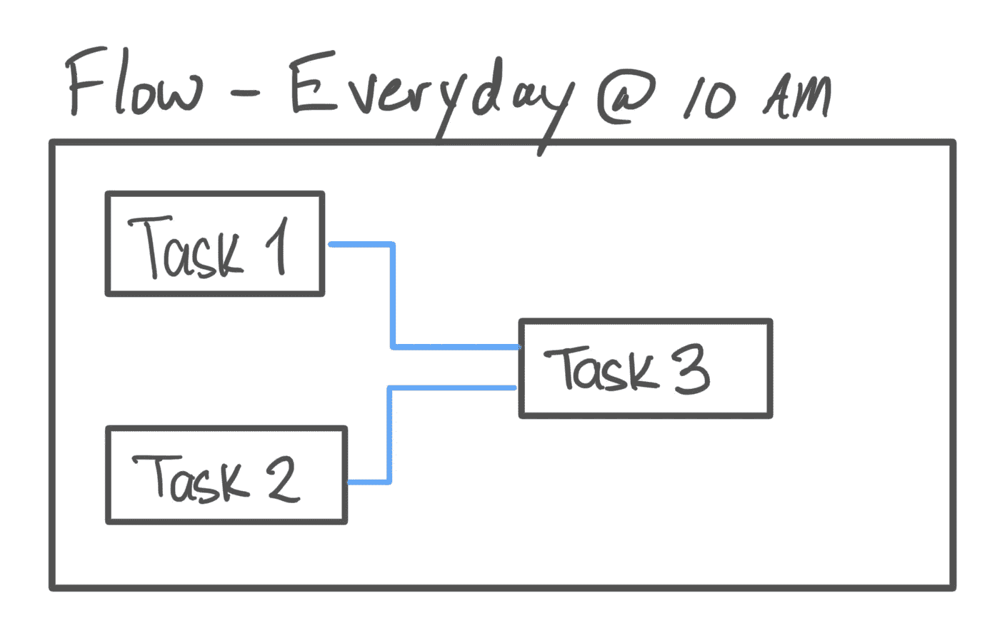
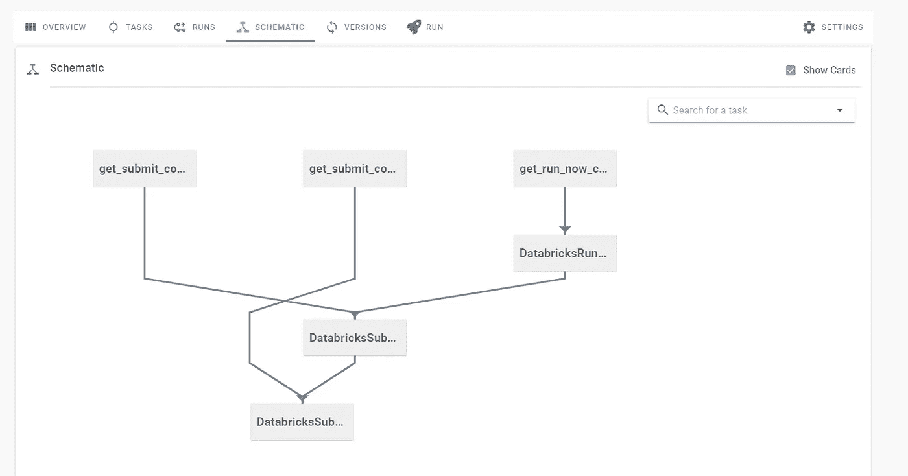

# 集成 Prefect 和 Databricks 来管理您的 Spark 作业

> 原文：<https://towardsdatascience.com/tutorial-integrating-prefect-databricks-af426d8edf5c?source=collection_archive---------20----------------------->


Justin Jairam 的照片来自 [@jusspreme](https://www.instagram.com/jusspreme/?hl=en) (经允许)

Prefect 是一个工作流管理系统，使用户能够轻松地使用数据应用程序并添加重试、日志记录、动态映射、缓存、故障通知、调度等功能，所有这些都使用功能性 Python API。Prefect 允许用户将他们现有的代码转换成 DAG(有向无环图),并且依赖关系已经确定[1]。它简化了 ETL 管道和依赖项的创建，并使用户能够严格地关注应用程序代码而不是管道代码(看着你的气流)。Prefect 甚至可以创建分布式管道来并行化您的数据应用程序。

Databricks 的核心是一个 PaaS(平台即服务),它可以提供完全托管的 Spark 集群、交互式和协作式笔记本电脑(类似于 Jupyter)、生产流水线调度程序以及为基于 Spark 的应用提供支持的平台。它集成在 Azure 和 AWS 生态系统中，使处理大数据变得简单。Databricks 使用户能够在其管理的 Spark 集群上运行定制的 Spark 应用程序。它甚至允许用户将他们的笔记本电脑安排为 Spark 作业。它完全简化了大数据开发和围绕它的 ETL 过程。

Databricks 已经成为一个不可或缺的大数据 ETL 工具，一个我每天在工作中使用的工具，所以我为 Prefect 项目做了一个[贡献](https://github.com/PrefectHQ/prefect/pull/3247)，使用户能够将 Databricks 作业与 Prefect 集成。在本教程中，我们将讨论这一点——如何将正在运行的数据块笔记本和 Spark 作业整合到您的完美流程中。

# 先决条件

这个帖子不需要任何先验知识，但是推荐一个免费的[府尹](https://www.prefect.io/)账号来实现这个例子。虽然这篇文章会涉及到级长的基础知识，但它不是一个深入的级长教程。

# 完美基础

# 任务

Prefect 中的任务相当于数据管道中的一个步骤。它就像应用程序或脚本中的 Python 函数一样简单。对任务的简单或复杂程度没有限制。也就是说，最好遵循编码最佳实践并开发您的功能，这样它们只做一件事。级长自己推荐这个。

> 一般来说，我们鼓励小任务而不是大任务，每个任务应该执行工作流程中一个独立的逻辑步骤，但不能更多。[2]

通过保持小任务，您将最大限度地利用 Prefect 的引擎，例如高效的状态检查点。

# 流

流程是将所有任务及其依赖关系联系在一起的东西。它描述了任务、它们的顺序和数据流之间的依赖关系。流将任务集合在一起，并使其成为一个管道，从而完善您的数据应用程序。



完美的流动可视化(图片由作者提供)

# Prefect 中的本机数据块集成

我通过实现任务`DatabricksRunNow` & `DatabricksRunSubmit`来实现 perfect 和 Databricks 之间的无缝集成，从而为 perfect 项目做出了贡献。通过这些任务，用户可以从外部触发一个已定义的 Databricks 作业或一个 jar、Python 脚本或笔记本的单次运行。一旦任务被执行，它就使用 Databricks 本地 API 调用来运行笔记本或 Spark 作业。当任务运行时，它将继续轮询运行的当前状态，直到任务完成。一旦任务完成，如果成功，它将允许下游任务运行。

# 使用数据块任务创建流

在开始编写任何代码之前，我们必须创建一个完美的秘密来存储我们的数据块连接字符串。从你的提督云账户，点击左侧菜单中的`Team`，进入`Secrets`部分。这个部分是你管理完美流程的所有秘密的地方。

要生成 Databricks 连接字符串，您需要 Databricks 实例的主机名以及 Databricks 帐户的 PAT。要创建数据块 PAT，请遵循数据块[文档](https://docs.databricks.com/dev-tools/api/latest/authentication.html)中的步骤。连接字符串必须是有效的 JSON 对象。秘密的标题必须是`DATABRICKS_CONNECTION_STRING`。


数据块连接字符串的完美秘密(图片由作者提供)

# 创建任务

让我们从定义一些运行 Databricks 笔记本和 Spark 作业所需的常见任务开始我们的流程。

```
from prefect import task, Flow
from prefect.tasks.databricks.databricks_submitjob import (
    DatabricksRunNow,
    DatabricksSubmitRun,
)
from prefect.tasks.secrets.base import PrefectSecretconn **=** PrefectSecret("DATABRICKS_CONNECTION_STRING")
*# Initialize Databricks task class as a template
# We will then use the task function to pass in unique config options & params* RunNow **=** DatabricksRunNow(conn)
SubmitRun **=** DatabricksSubmitRun(conn)
```

我们定义了两个任务对象`RunNow`和`SubmitRun`，作为模板来运行我们的数据块作业。我们可以通过不同的配置重用这些相同的任务，从而轻松创建新的数据块作业。让我们创建一些助手任务来动态创建我们的作业的配置。

```
**@**task
**def** **get_submit_config**(python_params: list):
    """
    SubmitRun config template for the DatabricksSubmitRun task, Spark Python Task params must be passed as a list.
    """
    **return** {
        "run_name": "MyDatabricksJob",
        "new_cluster": {
          "spark_version": "7.3.x-scala2.12",
          "node_type_id": "r3.xlarge",
          "aws_attributes": {
            "availability": "ON_DEMAND"
          },
          "num_workers": 10
        },
        "spark_python_task": {
            "python_file": "/Users/ashton/databricks_task/main.py",
            "parameters": python_params,
        },
    } **@**task
**def** **get_run_now_config**(notebook_params: dict):
    """
    RunNow config template for the DatabricksSubmitRun task, Notebook Task params must be passed as a dictionary.
    """
    **return** {"job_id": 42, "notebook_params": notebook_params}
```

`get_submit_config`任务允许我们动态地将参数传递给 DBFS (Databricks 文件系统)上的 Python 脚本，并返回一个配置来运行一次性 Databricks 作业。您可以通过在 Databricks 作业配置中创建更多映射到配置选项的参数来增加灵活性。`get_run_now_config`执行相同的任务，除了它为`DatabricksRunNow`任务返回一个配置来运行一个预配置的数据块笔记本任务。`get_run_now_config`和`get_submit_config`的模式分别匹配[现在运行](https://docs.databricks.com/dev-tools/api/latest/jobs.html#run-now)和[运行提交](https://docs.databricks.com/dev-tools/api/latest/jobs.html#runs-submit) API。

> Python 文件参数必须作为列表传递，而笔记本参数必须作为字典传递。

现在让我们创建一个可以运行我们的任务的流。

# 创造流动

我们将创建一个流程，在 Databricks 上运行一个预配置的笔记本作业，然后是两个后续的 Python 脚本作业。

```
**with** Flow("Databricks-Tasks", schedule**=**None) **as** flow: run_now_config **=** get_run_now_config({"param1": "value"})
    submit_config_a **=** get_submit_config(["param1"])
    submit_config_b **=** get_submit_config(["param2"]) run_now_task **=** RunNow(json**=**run_now_config) submit_task_a **=** SubmitRun(json**=**submit_config_a) submit_task_b **=** SubmitRun(json**=**submit_config_b) *# Since Databricks tasks don't return any data dependencies we can leverage,
*    *# we have to define the dependencies between Databricks tasks themselves
*    flow.add_edge(run_now_task, submit_task_a)
    flow.add_edge(submit_task_a, submit_task_b)
```

我们首先需要通过使用我们的`get_run_now_config`和`get_submit_config`任务来创建数据块作业配置。通过`json`参数将立即运行配置传递给`RunNow`任务，并将提交运行配置传递给`SubmitRun`任务。`json`参数接受一个与上面提到的`Run Now`和`Submit Run`API 匹配的字典。为了运行更多的数据块作业，我们实例化我们创建的`RunNow`或`SubmitRun`模板，并传入一个新的 json 作业配置。

Prefect flow 的一个令人惊叹的特性是，它可以从您的任务中自动构建一个 DAG。它将任务输入视为数据依赖，并由此推断出在其他任务运行之前需要完成哪些任务。例如，由于我们的`run_now_task`有输入`run_now_config`，流程构建 DAG，知道`get_run_now_config`任务必须在`run_now_task`之前运行。

有些任务不返回可用作下游任务输入的数据。例如，数据块任务只返回一个作业 ID。我们仍然可以通过使用`.add_edge`函数来定义流程的任务间依赖关系。这将增加任务之间的相关性，这些相关性不会用作后续下游任务的输入。例如，`flow.add_edge(run_now_task, submit_task_a)`表示`submit_task_a`是`run_now_task`的下游任务，在`run_now_task`完成之前`submit_task_a`不能运行。通过将边添加到剩余的数据块任务中，我们得到了最终的流程，您也可以在 Prefect schematics 选项卡中查看。



我们流程的 DAG(图片由作者提供)

为了运行流，我们调用流对象的`.run()`方法— `flow.run()`。最终的流程如下所示:

```
from prefect import task, Flow
from prefect.tasks.databricks.databricks_submitjob import (
    DatabricksRunNow,
    DatabricksSubmitRun,
)
from prefect.tasks.secrets.base import PrefectSecret **@**task
**def** **get_submit_config**(python_params: list):
    """
    SubmitRun config template for the DatabricksSubmitRun task, Spark Python Task params must be passed as a list.
    """
    **return** {
        "run_name": "MyDatabricksJob",
        "new_cluster": {
          "spark_version": "7.3.x-scala2.12",
          "node_type_id": "r3.xlarge",
          "aws_attributes": {
            "availability": "ON_DEMAND"
          },
          "num_workers": 10
        },
        "spark_python_task": {
            "python_file": "/Users/ashton/databricks_task/main.py",
            "parameters": python_params,
        },
    } **@**task
**def** **get_run_now_config**(notebook_params: dict):
    """
    RunNow config template for the DatabricksSubmitRun task, Notebook Task params must be passed as a dictionary.
    """
    **return** {"job_id": 42, "notebook_params": notebook_params} conn **=** PrefectSecret("DATABRICKS_CONNECTION_STRING")
*# Initialize Databricks task class as a template
# We will then use the task function to pass in unique config options & params* RunNow **=** DatabricksRunNow(conn)
SubmitRun **=** DatabricksSubmitRun(conn)**with** Flow("Databricks-Tasks", schedule**=**None) **as** flow: run_now_config **=** get_run_now_config({"param1": "value"})
    submit_config_a **=** get_submit_config(["param1"])
    submit_config_b **=** get_submit_config(["param2"]) run_now_task **=** RunNow(json**=**run_now_config) submit_task_a **=** SubmitRun(json**=**submit_config_a) submit_task_b **=** SubmitRun(json**=**submit_config_b) *# Since Databricks tasks don't return any data dependencies we can leverage,
*    *# we have to define the dependencies between Databricks tasks themselves
*    flow.add_edge(run_now_task, submit_task_a)
    flow.add_edge(submit_task_a, submit_task_b)flow.run()
*# flow.register("YOUR_PROJECT") to register your flow on the UI*
```

# 结论

现在，作为 ETL 流程的一部分，您已经掌握了运行 Databricks 笔记本和 Spark 作业所需的所有知识。要了解更多关于 Prefect 和 Databricks 作业的信息，我推荐阅读它们的文档，在这里找到[在这里找到](https://docs.prefect.io/core/)和在这里找到。

# 反馈

一如既往，我鼓励对我的帖子的任何反馈。如果你有任何问题或者需要任何帮助，你可以给我发邮件到 sidhuashton@gmail.com 或者在帖子上留言。

你也可以通过 Twitter 联系我并关注我，地址是 [@ashtonasidhu](https://twitter.com/ashtonasidhu) 。

# 参考

1.  https://docs.prefect.io/core/,提督文件
2.  [https://docs .提督. io/core/Getting _ Started/first-steps . html，](https://docs.prefect.io/core/getting_started/first-steps.html,)提督入门