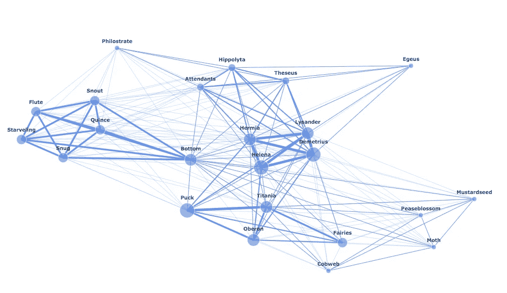

# 教程:Python 中 Networkx 和 Plotly 的网络可视化基础

> 原文：<https://towardsdatascience.com/tutorial-network-visualization-basics-with-networkx-and-plotly-and-a-little-nlp-57c9bbb55bb9?source=collection_archive---------2----------------------->

## 从莎士比亚的剧本到网络图



**人物网络图*仲夏夜之梦***

对于这个项目，我想结合我对文学、社会学和数据科学的热爱。更具体地说，我从大学时代起就对社交网络感兴趣，鉴于最近的事件，代表不同代理如何连接变得越来越重要。所以我开发了一个*仲夏夜之梦*的人物网络，这是我最喜欢的莎翁剧。如果你还没有读过它，并且喜欢一些相当异想天开的东西，我会推荐它！

在下面的帖子中，我将首先介绍网络的基础知识。然后，我将简要回顾一下我用来以我需要的格式获取数据的代码。然后，我检查了我用来创建和定制上述图表的代码。我使用的所有资源都在底部链接。希望这篇教程有帮助！如有任何问题，欢迎留言！制图快乐！

**所有的代码都可以在**[**my GitHub repo**](https://github.com/rweng18/midsummer_network)**上找到。**

**(这篇博客的灵感来自马丁·格兰让的惊人之作《将莎士比亚悲剧中的网络可视化》，你可以在这里找到**[](http://www.martingrandjean.ch/network-visualization-shakespeare/)****。)****

# **目标**

*   **解释如何使用 Python 的 Networkx 包和 Plotly 创建视觉上吸引人的网络图**
*   **为了举例说明一个网络绘图的应用程序和我采取的一些数据清理步骤(因为我处理的是自然语言数据，所以数据清理比我在这篇文章中介绍的要复杂得多)**
*   **提供一些技巧、示例代码和资源**

# **01:网络由哪些部分组成？**

**在我们可视化任何东西之前，我们需要理解我们如何定义一个网络。出于本练习的目的，我们将使用以下定义:**

> **一个**网络**由一组**节点**组成，这些节点通过一组**边**相互连接。**

**我们可以将**节点**视为我们试图连接的任何类型的代理或对象。例如，在我的例子中，我的节点是*仲夏夜之梦*中的人物，但是如果您想要显示纽约市的地铁网络，您的节点可能是地铁站。**

**你可以把**边**想象成节点之间的连接。在我的项目中，我认为连接剧中角色的是他们一起出现的场景。我认为，如果两个角色(节点)一起出现在一个场景中(一条边)，它们就是相连的。对于地铁网络的例子，它可能是地铁线路。所以两个地铁站(节点)是相连的，如果一条地铁线在两个站(一条边)之间运行。**

# **02:让我们看一个 NLP 的例子**

**既然我们已经了解了网络的基本知识，我们可以开始将我们的理解转化为代码。我们需要以下东西来创建网络图:**

1.  **最原始的数据——一个文本文件的脚本*的《仲夏夜之梦》***
2.  **节点——T4《仲夏夜之梦》中的人物列表**
3.  **边缘——一种数据结构，告诉我们每个角色何时与另一个角色一起出现在场景中 **(*注意:这是项目中最耗时的部分)****

**既然我们已经在高层次上建立了我们所需要的东西，我们就可以开始编码了。**

## **导入包**

**对于这个项目，我需要两套不同的包。第一个是收集和清理我的数据，这样我就可以在 Python 数据结构中拥有一组节点和边。第二组包用于可视化。**

```
# Import packages for data cleaning
import numpy as np
import pandas as pd
import re # For finding specific strings in the text# Import packages for data visualization
import plotly.offline as py
import plotly.graph_objects as go
import networkx as nx
```

## **加载数据**

**在安装和加载包之后，您可以加载原始数据。我在这里找到了古腾堡计划[的*仲夏夜之梦*的文本](https://www.gutenberg.org/ebooks/1514)。**

**[**古腾堡计划**](https://www.gutenberg.org/) 是一个令人惊叹的免费电子书图书馆。有超过 60，000 本电子书，如果你想探索自然语言处理(NLP)的世界，我强烈推荐你把它作为一种资源。**

```
# Load the data
f = open("midsummer.txt", "r")
whole_text = f.read()
```

## **检查和清理数据:简要概述**

**因为这不是一篇 NLP 文章，所以我只强调我在处理自然语言数据时必须考虑的一些问题。**

> **如果你对我的数据清理代码的细节部分感兴趣，请随意查看我的 GitHub，上面和下面都有链接。**

****第一步:查看你的数据****

**我知道这听起来很基本，但是如果你想可视化你的数据，最好的做法是真正理解你的数据。例如，下面是我问我的数据的一些问题:**

*   **有我能得到我的节点的一个字符列表吗？我怎样才能找到它？(是的。从“戏剧人物”开始)**
*   **有没有一条线清楚地把每个场景分开？(是的。“场景”)**
*   **在这个关键字之前或之后，是否有多余的字符需要我处理或删除？(是的。)**
*   **我怎样才能知道一个场景中有哪些角色？(特定格式的阶段说明！“进入”、“退出”和许多不同的变化，我不会在这里进入，因为它是非常特定的 NLP。)**

****第二步:从你的数据中提取一个简单的样本，并尝试处理它****

**如果您试图获取整个脚本并对其进行处理，这将非常容易出错，并且您可能会错过模块化代码的机会。所以我拍了第一幕第二场，因为所有的角色都在场景的开始进入，没有其他的角色进入，也没有人在场景结束前离开。**

*   **什么样的数据结构最适合以最符合逻辑的方式获取最多的信息？(我主要用了一本字典的字典。)**

****第三步:** **模块化你的流程****

**我用两个主函数和几个辅助函数创建了一个 process.py 文件。这绝不是唯一的方法，但这是我解决问题的方法，我的数据是复杂多样的。**

*   **1 函数为节点和边创建了一个空数据结构**
*   **1 函数接收一个场景，并获取在给定时间内出现的所有角色**
*   **当一个新的角色出现或者一个角色退出时，辅助函数进行处理，等等。**

**下面是我的数据结构的一个例子:**

```
# Create the empty data structure using custom function
appearance_counts = get_empty_appearances(characters, True)# Show a part of the data structure
# Dictionary of dictionaries where each key is each character and each value is a dictionary with all other characters as keys, and values as 0 or [].

appearance_counts
{'Theseus': {'Hippolyta': 0,
  'Egeus': 0,
  'Hermia': 0,
  'Helena': 0,
  'Lysander': 0,
  'Demetrius': 0,...
```

****第四步:使用你的函数来处理数据****

**现在我有了这些数据结构，我需要用重要的信息填充这个结构——每个字符与另一个字符(边)一起出现了多少次。**

> **还有很多代码支持下面的代码片段。如果你有问题，你可以看到我的 GitHub 回购链接以上和以下的更多细节。**

```
# For each character that appears, get how many scenes the character # appears in and how many times each pair of characters appears 
# together
for character in all_appearances:
    scene_counts[character] = []
    for co_char in all_appearances[character]:
        appearance_counts[character][co_char] = len(all_appearances[character][co_char])
        scene_counts[character].extend(all_appearances[character][co_char])

    scene_counts[character] = len(set(scene_counts[character]))
```

****终于！你有你的优势！****

> ****注意:**如果你对记录两个节点是如何连接的不感兴趣，而只关心两个节点是否连接，你可以只使用一个布尔值而不是一个整数。**

```
# If the number is greater than 0, then the characters appeared in a
# scene together.appearance_counts
{'Theseus': {'Hippolyta': 3,
  'Egeus': 2,
  'Hermia': 3,
  'Helena': 2,
  'Lysander': 3,
  'Demetrius': 3,
  'Philostrate': 2,
  'Quince': 1,
  'Snug': 1,
  'Bottom': 2,
  'Flute': 1,
  'Snout': 1,
  'Starveling': 1,...
```

****不要忘记你的节点！****

> ****注意:**如果您对跟踪每个节点的重要性不感兴趣，而只关心节点的存在，那么您可以只使用一个列表来跟踪节点，而不是字典。**

```
# Number of scenes that each character appeared in
scene_counts
{'Theseus': 3,
 'Hippolyta': 3,
 'Egeus': 2,
 'Hermia': 5,
 'Helena': 6,
 'Lysander': 5,
 'Demetrius': 6,...
```

## **创建您的网络图**

**我们将从创建图形、添加节点和添加边开始。有几行代码可以让你自定义你的图表，我会在这篇博文的最后一节把它们说出来。**

****添加节点&边****

> ****注意:**我分别根据一个角色出现的场景数和两个角色共享的场景数，定制了节点的 size 变量和边的 weight 变量。这是可选的。**

```
midsummer = nx.Graph()# Add node for each character
for char in scene_counts.keys():
    if scene_counts[char] > 0:
        midsummer.add_node(char, size = scene_counts[char])# For each co-appearance between two characters, add an edge
for char in appearance_counts.keys():
    for co_char in appearance_counts[char].keys():

        # Only add edge if the count is positive
        if appearance_counts[char][co_char] > 0:
            midsummer.add_edge(char, co_char), weight = appearance_counts[char][co_char])
```

> **您可以使用属性**仲夏.节点**和**仲夏.边**查看 Networkx 图中的节点和边。**

****获得职位****

**然后我们需要得到图中节点的位置。有几种不同的布局可供选择。我认为春季的布置看起来是最好的。您可以在图形布局部分的 [Networkx 包的开发说明](http://networkx.github.io/)中看到更多选项。**

```
# Get positions for the nodes in G
pos_ = nx.spring_layout(midsummer)
```

****制作边缘痕迹****

**因为我是根据两个角色一起出现的场景数量来定制每条边的宽度/重量，所以我创建了一个定制函数，使用 Plotly 为每个节点对创建一个唯一的边轨迹。**

> **该函数接受两个节点(字符)， **x** 和 **y** ，当您将鼠标悬停在边缘上时想要显示的任何**文本**，以及边缘轨迹的**宽度**。**

```
# Custom function to create an edge between node x and node y, with a given text and width
def make_edge(x, y, text, width):
    return  go.Scatter(x         = x,
                       y         = y,
                       line      = dict(width = width,
                                   color = 'cornflowerblue'),
                       hoverinfo = 'text',
                       text      = ([text]),
                       mode      = 'lines')
```

**现在您已经使用您的规范创建了一个函数，迭代您的边，并为指定宽度(由边的权重决定)的每条边创建一个边迹。**

```
# For each edge, make an edge_trace, append to list
edge_trace = []
for edge in midsummer.edges():

    if midsummer.edges()[edge]['weight'] > 0:
        char_1 = edge[0]
        char_2 = edge[1]x0, y0 = pos_[char_1]
        x1, y1 = pos_[char_2]text   = char_1 + '--' + char_2 + ': ' + str(midsummer.edges()[edge]['weight'])

        trace  = make_edge([x0, x1, None], [y0, y1, None], text, 
                           width = 0.3*midsummer.edges()[edge]['weight']**1.75)edge_trace.append(trace)
```

****制作节点轨迹****

**对于节点，您可以坚持只进行单个节点跟踪—单个散布对象—并仍然自定义每个节点的大小。**

```
# Make a node trace
node_trace = go.Scatter(x         = [],
                        y         = [],
                        text      = [],
                        textposition = "top center",
                        textfont_size = 10,
                        mode      = 'markers+text',
                        hoverinfo = 'none',
                        marker    = dict(color = [],
                                         size  = [],
                                         line  = None))
# For each node in midsummer, get the position and size and add to the node_trace
for node in midsummer.nodes():
    x, y = pos_[node]
    node_trace['x'] += tuple([x])
    node_trace['y'] += tuple([y])
    node_trace['marker']['color'] += tuple(['cornflowerblue'])
    node_trace['marker']['size'] += tuple([5*midsummer.nodes()[node]['size']])
    node_trace['text'] += tuple(['<b>' + node + '</b>'])
```

# **03:绘制和定制您的网络**

**现在我们有了包含所有节点的节点轨迹，以及我们的边轨迹，我们可以把它们放在一个图表中，看看它看起来像什么。**

## **自定义您的布局**

**为了定制我的布局，我修改了网格线、图例和刻度标签的背景颜色和外观。**

```
# Customize layout
layout = go.Layout(
    paper_bgcolor='rgba(0,0,0,0)', # transparent background
    plot_bgcolor='rgba(0,0,0,0)', # transparent 2nd background
    xaxis =  {'showgrid': False, 'zeroline': False}, # no gridlines
    yaxis = {'showgrid': False, 'zeroline': False}, # no gridlines
)# Create figure
fig = go.Figure(layout = layout)# Add all edge traces
for trace in edge_trace:
    fig.add_trace(trace)# Add node trace
fig.add_trace(node_trace)# Remove legend
fig.update_layout(showlegend = False)# Remove tick labels
fig.update_xaxes(showticklabels = False)
fig.update_yaxes(showticklabels = False)# Show figure
fig.show()
```

## **自定义您的颜色和文本**

**在最基本的层面上，您总是可以自定义节点和边的颜色，以及静态显示在节点/边旁边或当您将鼠标悬停在节点或边上时显示的任何文本。**

**你可以很容易地访问**颜色**和**文本**，只需使用节点和边缘轨迹中的属性。您会注意到我在本文分享的代码片段中调用这些属性的地方。但是我用来使我的文本更加突出的一个巧妙的技巧是学习如何加粗我的节点旁边的静态文本:**

```
# Add <b> and </b> at the beginning and end of your string to bold
# the text in question!
node_trace['text'] += tuple(['<b>' + node + '</b>'])
```

## **自定义边缘宽度和节点大小**

**最后，我想在视觉上突出我所做的最重要的定制。这涉及到我认为最好的尝试和错误。以下代码行分别位于关于创建边跟踪和节点跟踪的部分:**

```
# Line that customized the width of each edge trace
trace  = make_edge([x0, x1, None], [y0, y1, None], text, 
         width = 0.3*midsummer.edges()[edge]['weight']**1.75)# Line that customized the size of each node in the node trace
node_trace['marker']['size'] += tuple([5*midsummer.nodes()[node]['size']])
```

**正如你所看到的，我硬编码了标量和指数，以确定在剧中 x 和 y 场景中出现的差异有多大(节点的大小)，或者在 x 和 y 场景中出现的角色相同(边缘的宽度)。你所使用的具体数字会极大地改变你的图表的外观。所以和他们一起玩，直到你感到满意为止！**

# **奖金:未来网络项目的想法**

*   **创建一个以时间为变量的动画网络**
*   **创建一个基于进出链接的维基百科文章网络**
*   **根据地铁线路在城市中创建地铁站网络**
*   **在一群人之间建立一个社交网络(注意，你需要某种封闭的系统或方法来监控网络成员在特定时间的变化)**

# **资源**

**[](https://www.gutenberg.org/) [## 古登堡计划

### 古登堡计划是一个拥有超过 60，000 本免费电子书的图书馆。在免费的 epub 和 Kindle 电子书中选择，下载它们或…

www.gutenberg.org](https://www.gutenberg.org/) [](https://plotly.com/python/network-graphs/) [## 网络图

### Dash 是一个用于构建分析应用程序的开源框架，不需要 Javascript，而且它是紧密结合的…

plotly.com](https://plotly.com/python/network-graphs/) [](http://www.martingrandjean.ch/network-visualization-shakespeare/) [## 网络可视化:映射莎士比亚的悲剧

### 莎士比亚的悲剧结构都一样吗？这些角色是相当孤立的，成组的，还是都有联系的…

www . martingrandjen . ch](http://www.martingrandjean.ch/network-visualization-shakespeare/)  [## NetworkX - NetworkX 文档

### NetworkX 是一个 Python 包，用于创建、操作和研究…的结构、动力学和功能

networkx.github.io](http://networkx.github.io/) [](https://github.com/rweng18/midsummer_network) [## rweng 18/仲夏 _ 网络

### 创建字符网络图。在……上创建一个帐户，为 rweng 18/summers _ network 的发展做出贡献

github.com](https://github.com/rweng18/midsummer_network)**