# LSTMs 教程:计算观点

> 原文：<https://towardsdatascience.com/tutorial-on-lstm-a-computational-perspective-f3417442c2cd?source=collection_archive---------2----------------------->


杰克·纳格兹在 [Unsplash](https://unsplash.com?utm_source=medium&utm_medium=referral) 上的照片

# 目录

```
 1\. [Introduction](#6d31)2\. [Why Do we need RNNs?](#95b4)3\. [RNN Training and Inference](#7194)4\. [Structure of an RNN](#8ca2)5\. [Time Unrolling](#3226)6\. [Vanishing Gradient](#aa74)7\. [Long Short-Term Memory (LSTM)](#0d00)8\. [LSTM equations](#b10c)9\. [Understanding the LSTM dimensionalities](#da46)10\. [Time Unroll and Multiple Layers](#ada8)11\. [Example: Sentiment Analysis using LSTM](#4019)12\. [Testing your knowledge](#c240)
```

# 介绍

最近，人们对将深度学习模型嵌入硬件非常感兴趣。当涉及到深度学习模型部署时，尤其是在边缘，能量是至关重要的。Pete Warden 在[“为什么机器学习的未来很小”](https://petewarden.com/2018/06/11/why-the-future-of-machine-learning-is-tiny/)上发表了一篇关于为什么能源对 AI@Edge 很重要的博文。程序(或模型)的能量优化只能通过对底层计算的良好理解来完成。在过去几年与深度学习人员——硬件架构师、微内核程序员、模型开发人员、平台程序员和受访者(尤其是受访者)的合作中，我发现人们从定性的角度理解 LSTMs，但从定量的角度理解不好。如果你不能很好地理解某事，你就不能优化它。缺乏了解导致 LSTMs 开始失宠。本教程试图通过方程解释 LSTMs 所需的计算来弥合定性和定量之间的差距。同时，这也是我从计算的角度巩固对 LSTM 的理解的一种方式。希望它也能对以不同身份使用 LSTMs 的其他人有用。

注意:这里的免责声明是，我既不声称自己是 LSTMs 方面的专家，也不声称自己的理解完全正确。如果有不正确或令人困惑的地方，请随意发表评论。

# 为什么我们需要 RNNs？

需要递归神经网络(RNNs ),因为我们希望设计能够识别(或操作)序列的网络。卷积神经网络(CNN)不关心它们识别的图像的顺序。另一方面，RNN 用于视频、手写识别等序列。这在图 1 中用一个高层次的卡通图来说明。

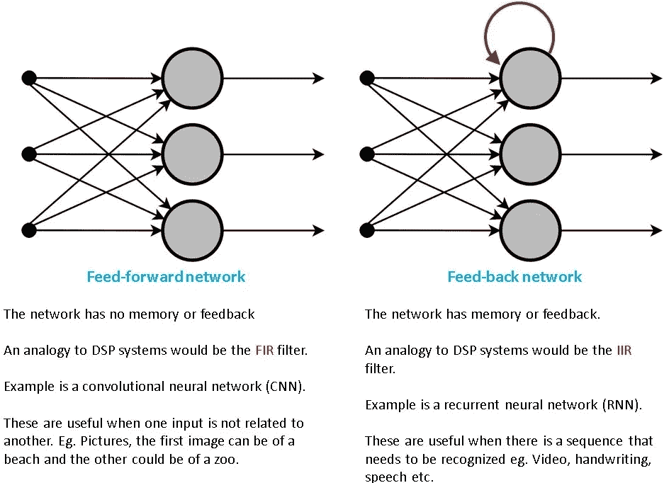

**图 1:反馈网络和前馈网络之间区别的卡通图示。原图来自** [**维基百科**](https://en.wikibooks.org/wiki/Artificial_Neural_Networks/Feed-Forward_Networks) **。**

简而言之，如果我们试图识别视频、手写或语音等序列，我们就需要 RNNs。注意，我们仍然没有谈论 LSTMs。我们仍在试图了解 RNN。稍后我们将讨论 LSTMs。

## 悬崖笔记版本

> 当我们试图处理序列时，需要 rnn。

# RNN 训练和推理

如果你跳过了前一部分，我们首先试图理解香草 RNN 的工作原理。如果你试图理解 LSTMs，我鼓励并敦促你通读这一部分。

在本节中，我们将了解以下内容:

1.  RNN 的结构。
2.  时间展开

我们将基于这些概念来更好地理解基于 LSTM 的网络。

# RNN 的结构。

图 2 显示了一个简单的 RNN 结构。该图的灵感来自于[深度学习书籍](https://www.deeplearningbook.org/contents/rnn.html)(具体是第 10 章第 373 页的图 10.3)。

图中需要注意一些事情:

*   我在括号中用红色表示了每个节点的变量。在下一张图和下一节中，我将使用变量(在等式中),所以请花几秒钟时间理解它们。
*   从预期产量到损失的箭头方向不是错别字。
*   变量 ***U，V，W*** 就是这个网络的权重矩阵。
*   反馈路径中的黄色斑点(由绿色箭头指示)表示单位延迟。如果你是 DSP 的，就把这个当成(z^-1)
*   反馈(用绿色箭头表示)使这个玩具例子有资格成为 RNN。

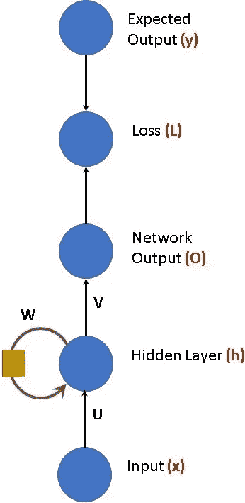

**图 2:RNN 结构的例子。这个形象的灵感来源于** [**深度学习书籍**](https://www.deeplearningbook.org/contents/rnn.html)

在我们进入方程之前。让我们看看图表，了解发生了什么。

1.  在宇宙之初。输入 **'x(t=0)'** 与矩阵 **U** 相乘得到 **x(t=0)*U** **。**
2.  上一时间步的反馈乘以矩阵 **W.** 由于这是初始阶段，反馈值为零(为简单起见)。因此，反馈值为 h(t=-1)*W = 0。因此，乘积是 0+x(t=0)*U = x(t=0)*U
3.  现在，它与矩阵 V 相乘，得到 x(t=0)*U*V。
4.  对于下一个时间步长，这个值将存储在 h(t)中，并且不是一个非零值。

因此，上述也可以总结为以下等式:

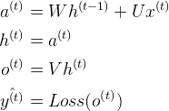

在上述方程中，我们忽略了非线性和偏差。将它们添加到等式中，如下所示。不要担心这些看起来很复杂。

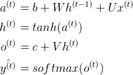

## 悬崖笔记版本

> ***rnn 的结构中有一个反馈环。这使得他们能够处理序列。***

# 时间展开

时间展开是理解 RNNs 和 LSTMs 的一个重要概念。

rnn 也可以表示为其自身的时间展开版本。这是表示它们的另一种方式，方程没有变化。时间展开只是另一种表现，而不是一种转换。我们之所以要用这种方式表示它们，是因为这样更容易推导出正向和反向传递方程。时间展开如下图所示:

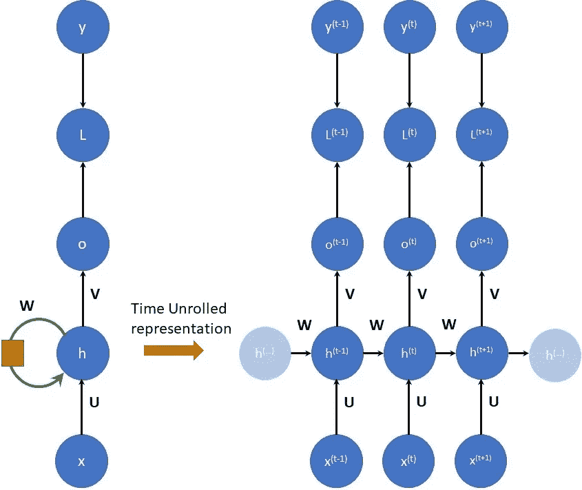

**展开的 RNN 画像。形象的灵感来源于** [**深度学习书籍**](https://www.deeplearningbook.org/contents/rnn.html)

在左上图中，RNN 的结构和我们之前看到的一样。右边是时间展开的表示。

从该图中可以得出一些重要结论:

1.  权重矩阵 U，V，W 不随时间变化。这意味着一旦训练了 RNN，权重矩阵在推断期间是固定的，并且不依赖于时间。换句话说，相同的权重矩阵(U，V，W)用于每个时间步。
2.  浅色阴影的 h(..)两边分别表示 h(t-1)之前和 h(t+1)之后的时间步长。
3.  上图显示了 RNN 的向前(或推断)传球。在每个时间步，都有一个输入和一个相应的输出。
4.  在正向传递中，“信息”(或内存)通过变量 *h.* 传递到下一级

## 悬崖笔记版本

> ***rnn 可以表示为时间展开的版本。这只是一个表示，而不是转换。在前向传递中，权重矩阵 U、V、W 不依赖于时间。***

# 消失梯度


[亚伦·罗斯](https://unsplash.com/@aaronroth?utm_source=medium&utm_medium=referral)在 [Unsplash](https://unsplash.com?utm_source=medium&utm_medium=referral) 上的照片

rnn 存在为长距离序列保留上下文的问题。换句话说，rnn 不能处理非常长的序列(想想长句或长演讲)。给定输入对隐藏层(以及输出)的影响作为时间(或序列长度)的函数呈指数衰减(或爆发和饱和)。消失梯度问题如下图所示，来自亚历克斯·格雷夫斯的论文。节点的阴影表示网络节点在给定时间对输入的敏感度。阴影越暗，灵敏度越高，反之亦然。如图所示，当我们从时间步长=1 快速移动到时间步长=7 时，灵敏度会衰减。网络会忘记第一次输入。

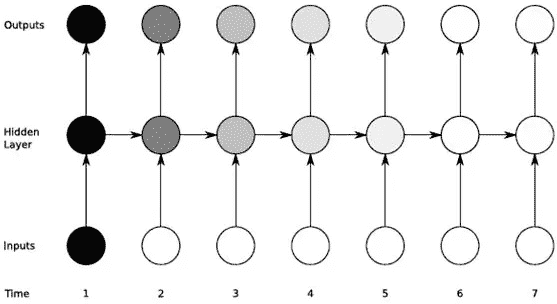

来自 [Alex Grave 论文](https://www.cs.toronto.edu/~graves/phd.pdf)的图显示了隐藏节点对梯度的敏感性。

这是使用 LSTMs 的主要动机。消失梯度问题导致研究人员多次尝试提出解决方案。其中最有效的是 LSTM 或长短期记忆，由 Hochreiter 于 1997 年提出。

## 悬崖笔记版本

> ***传统的 RNNs 对于长序列(序列长度大约大于 10 个时间步长)的输入不敏感。1997 年提出的 LSTMs 仍然是克服 rnn 这一缺点的最流行的解决方案。***

# 长短期记忆(LSTM)

LSTMs 是由 Hochreiter 在 1997 年提出的，作为一种减轻与普通 rnn 相关的棘手问题的方法。

一些博客和图片描述了 LSTMs。如您所见，在描述 LSTMs 的方式上有很大的差异。在这篇文章中，我想通过方程式来描述它们。我发现它们通过方程式更容易理解。有很多优秀的博客可以让你直观地理解它们，我强烈推荐你去看看:

[克里斯托弗·奥拉赫的博客。](https://colah.github.io/posts/2015-08-Understanding-LSTMs/)

(b) LSTM 来自[维基百科](https://en.wikipedia.org/wiki/Long_short-term_memory)

[阎石的博客](https://medium.com/mlreview/understanding-lstm-and-its-diagrams-37e2f46f1714)上媒

(d)来自[深度学习书籍](https://www.deeplearningbook.org/contents/rnn.html)的 LSTMs

(e) [Nvidia 关于加速 LSTMs 的博客](https://devblogs.nvidia.com/optimizing-recurrent-neural-networks-cudnn-5/)

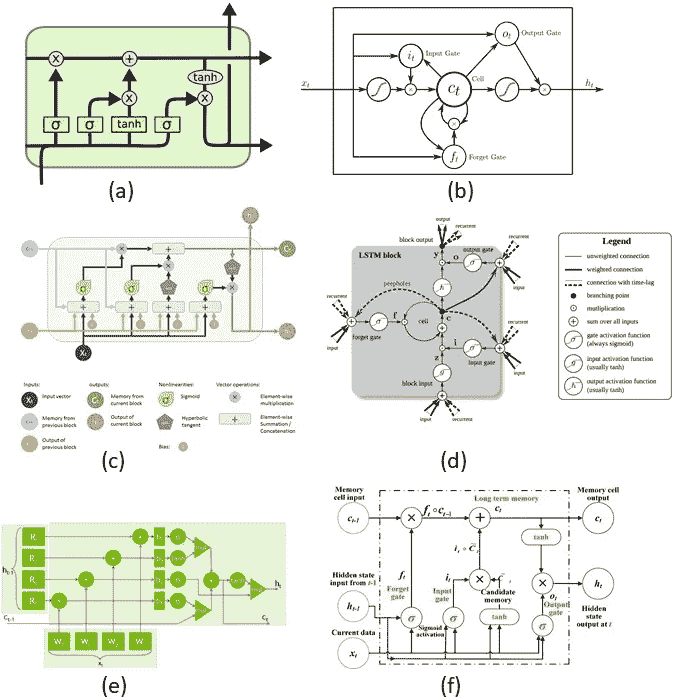

描述 LSTMs 的流行博客和论文中的不同图片。[(一)克里斯多夫·奥拉赫的博客。](https://colah.github.io/posts/2015-08-Understanding-LSTMs/) (b) LSTM 来自[维基百科](https://en.wikipedia.org/wiki/Long_short-term_memory) [阎石的博客](https://medium.com/mlreview/understanding-lstm-and-its-diagrams-37e2f46f1714)关于中(d)lstm 来自[深度学习书籍](https://www.deeplearningbook.org/contents/rnn.html) (e) [英伟达的博客](https://devblogs.nvidia.com/optimizing-recurrent-neural-networks-cudnn-5/)关于加速 lstm(f)LSTM 图来自[关于人体活动检测的会议论文](https://www.researchgate.net/figure/Illustration-of-a-Long-Short-Term-Memory-LSTM-unit_fig1_327891190)

# LSTM 方程

下图显示了单个时间步长的 LSTM 的输入和输出。这是一个时间步长的输入、输出和时间展开表示的方程。LSTM 有一个输入 **x(t)** ，它可以是 CNN 的输出或者直接是输入序列。 **h(t-1)** 和 **c(t-1)** 是来自前一时间步 LSTM 的输入。o(t) 是该时间步长的 LSTM 的输出。LSTM 还生成 **c(t)** 和 **h(t)** 用于下一时间步 LSTM 的消耗。

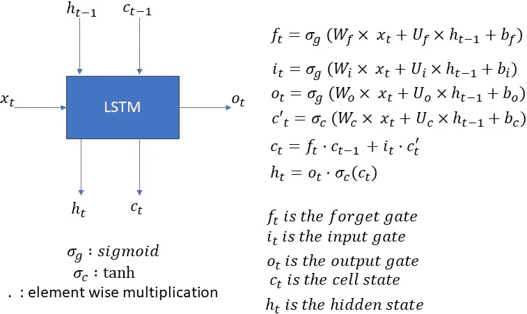

**LSTM 输入输出和单个时间步长的相应方程。**

注意，LSTM 方程也产生 f(t)，i(t)，c'(t)，这些是 LSTM 的内部消耗，用于产生 c(t)和 h(t)。

从上面可以看出一些要点:

1.  上述等式仅适用于一次性步骤。这意味着这些方程必须在下一个时间步重新计算。因此，如果我们有 10 个时间步长的序列，那么对于每个时间步长，上述等式将分别计算 10 次。
2.  权重矩阵(Wf，Wi，Wo，Wc，Uf，Ui，Uo，Uc)和偏差(bf，bi，bo，bc)不依赖于时间。这意味着这些权重矩阵不会从一个时间步长改变到另一个时间步长。换句话说，为了计算不同时间步长的输出，使用相同的权重矩阵。

下面的伪代码片段显示了十个时间步长的 LSTM 时间计算。

*说明 10 个时间步长的 LSTM 计算的代码片段。*

## 悬崖笔记版本

> LSTM 网络的权重矩阵从一个时间步长到另一个时间步长不变。LSTM 由 6 个方程式组成。如果 LSTM 正在学习长度为“seq_len”的序列。然后，这六个方程将被计算总共‘seq _ len’。基本上，每一步都要计算方程。

# 理解 LSTM 维度


沃洛季米尔·赫里先科在 [Unsplash](https://unsplash.com?utm_source=medium&utm_medium=referral) 上的照片

理解了 LSTM 的单个时间步长所需的计算之后，我们进入下一个方面——维度。根据我的经验，LSTM 维度是 lstm 混乱的主要原因之一。另外，这是我最喜欢问的面试问题之一；)

让我们再看看下图中的 LSTM 方程。正如你已经知道的，这些是单个时间步长的 LSTM 方程:

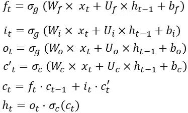

单时间步长的 LSTM 方程

让我们从一个简单的 x(t)开始。这是输入信号/特征向量/CNN 输出。我假设 x(t)来自一个嵌入层(想想 word2vec)，输入维数为[80x1]。这意味着 Wf 的维数为[某个值 x 80]。

> **至此我们已经:**
> 
> **x(t)是[80 X 1] —输入假设**
> 
> **Wf 是[Some_value X 80 ] —矩阵乘法法则。**

让我们做另一个假设，LSTM 的输出维数是[12×1]。假设这是输出类的数量。因此，在每个时间步长，LSTM 产生大小为[12×1]的输出 o(t)。

既然 o(t)是[12x1]，那么 h(t)必须是[12 x 1]，因为 h(t)是通过一个元素接一个元素的乘法来计算的(看看最后一个关于如何从 o(t)和 c(t)计算 h(t)的等式)。因为 o(t)是[12x1]，那么 c(t)必须是[12x1]。如果 c(t)是[12x1]，那么 f(t)，c(t-1)，i(t)和 c'(t)必须是[12x1]。为什么？因为 h(t)和 c(t)都是通过逐元素乘法来计算的。

> **因此我们有:**
> 
> **o(t)是[12 X 1] —输出假设**
> 
> **h(t)和 c(t)是[12x1] —因为 h(t)是通过公式中 o(t)和 tanh(c(t))的逐元素乘法计算的。**
> 
> **f(t)，c(t-1)，i(t)和 c’(t)是[12x1]——因为 c(t)是[12 x1]，并且是通过要求相同大小的元素方式运算来估计的。**

因为 f(t)的维数是[12×1]，那么 Wf 和 x(t)的乘积必须是[12×1]。我们知道 x(t)是[80x1](因为我们假设)那么 Wf 必须是[12x80]。再看 f(t)的等式，我们知道偏置项 bf 是[12x1]。

因此，我们有:

> **x(t)是[80 X 1] —输入假设**
> 
> **o(t)是[12 X 1] —输出假设**
> 
> **h(t)和 c(t)是[12x 1]——因为 h(t)是通过等式中 o(t)和 tanh(c(t))的逐元素相乘来计算的。**
> 
> **f(t)，c(t-1)，i(t)和 c’(t)是[12x1]——因为 c(t)是[12 x1]，并且是通过要求相同大小的元素式运算来估计的。**
> 
> **Wf 是[12x80] —因为 f(t)是[12x1]，x(t)是[80x1]**
> 
> **bf 是[12x1] —因为所有其他项都是[12x1]。**

以上内容看起来可能比实际情况要复杂一些。花点时间自己解决它。相信我，没那么复杂。

现在进入令人困惑的部分:)开个玩笑！

在 f(t)的计算中，Uf 和 h(t-1)的乘积也必须是[12x1]。现在根据前面的讨论我们知道 h(t-1)是[12x1]。h(t)和 h(t-1)将具有相同的维数[12×1]。因此，Uf 将具有[12×12]的维数。

所有 Ws (Wf，Wi，Wo，Wc)将具有相同的[12x80]尺寸，所有 bias(BF，bi，bc，bo)将具有相同的[12x1]尺寸，所有 Us (Uf，Ui，Uo，Uc)将具有相同的[12x12]尺寸。

因此:

> **x(t)是[80 X 1] —输入假设**
> 
> **o(t)是[12 X 1] —输出假设**
> 
> **Wf、Wi、Wc、Wo 的尺寸均为【12x 80】**
> 
> **Uf、Ui、Uc、Uo 每个都有[12x12]的尺寸**
> 
> **bf、bi、bc、bo 的尺寸均为【12 x1】**
> 
> **ht，ot，ct，ft，it 各有一个维度【12 x1】**

LSTM 的总权重矩阵大小为

权重 _ LSTM = 4 *[12x 80]+4 *[12x 12]+4 *[12x 1]

= 4 *[输出尺寸 x 输入尺寸]+4 *[输出尺寸]+4 *[输入尺寸]

= 4*[960] + 4*[144] + 4*[12] = 3840 + 576+48= 4,464

让我们验证将以下代码粘贴到您的 python 设置中

请注意，LSTM 的参数数量是 4464。这也是我们通过计算得到的结果！

在我们进入下一部分之前，我想强调一个关键的方面。LSTMs 有两个定义它们的东西:输入维度和输出维度(以及我稍后将谈到的时间展开)。在文献(论文/博客/代码文档)中，术语有很多模糊之处。有些地方称之为单位数、隐藏维数、输出维数、LSTM 单位数等。我没有争论哪个是正确的或者哪个是错误的，只是在我看来这些通常意味着同样的事情——输出维度。

到目前为止，我们已经查看了权重矩阵的大小。大多数框架将权重矩阵合并存储为单个矩阵。下图说明了这个权重矩阵和相应的维度。

**注意:根据您使用的框架，权重矩阵将以不同的顺序存储。例如，Pytorch 可以在 Wf 或 Caffe 可以首先存储 Wo 之前保存 Wi。**

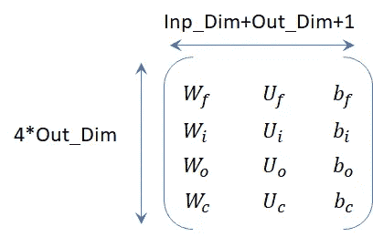

LSTM 权重矩阵维度。

## 悬崖笔记版本

> 有两个参数定义时间步长的 LSTM。输入维度和输出维度。权重矩阵大小为:4 * Output _ Dim *(Output _ Dim+Input _ Dim+1)[感谢 [Cless](https://medium.com/@clessvna) 捕捉到错别字]。当谈到 LSTMs 时，有很多模糊性——单位的数量、隐藏维度和输出维度。请记住，有两个参数定义了 LSTM-输入维度和输出维度。

# 时间展开和多层

下图中有两个独立的 LSTM 网络。两个网络都显示为展开三个时间步长。图(A)中的第一个网络是单层网络，而图(B)中的网络是双层网络。

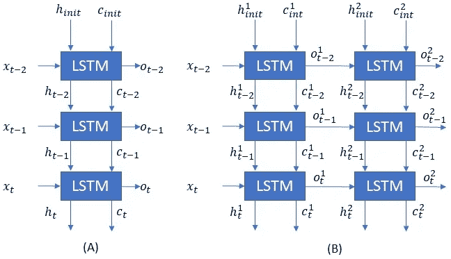

两个 LSTM 网络(A)展开三个时间步长的单层 LSTM 网络(B)展开三个时间步长的双层 LSTM 网络

在第一个单层网络的情况下，我们初始化 *h* 和 *c* ，并且每个时间步产生一个输出，连同 *h* 和 *c* 一起被下一个时间步消耗。注意，即使在最后的时间步 h(t)和 c(t)被丢弃，为了完整起见，我还是显示了它们。正如我们之前讨论的，对于三个时间步长，权重(Ws、Us 和 bs)是相同的。

双层网络有两个 LSTM 层。第一层的输出将是第二层的输入。它们都有自己的权重矩阵和各自的 *hs、cs 和 os。*我通过使用上标来表明这一点。

# 示例:使用 LSTM 的情感分析


[腾雅特](https://unsplash.com/@tengyart?utm_source=medium&utm_medium=referral)在 [Unsplash](https://unsplash.com?utm_source=medium&utm_medium=referral) 上拍照

让我们来看看一个非常简单但很现实的 LSTM 网络，看看这是如何工作的。任务很简单，我们必须想出一个网络来告诉我们一个给定的句子是否定的还是肯定的。为了简单起见，我们假设句子是固定长度的。如果实际句子的字数少于预期长度，则填充零；如果实际句子的字数多于序列长度，则截断句子。在我们的例子中，我们将句子长度限制为 3 个单词。为什么是 3 个字？只是一个我喜欢的数字，因为它对我来说更容易画出图表:)。

严肃地说，您可以绘制数据集中一个句子的字数直方图，并根据直方图的形状选择一个值。大于预定单词数的句子将被截断，单词数较少的句子将用零或空单词填充。

不管怎样，回到我们的例子。我们坚持三个词。我们将使用一个嵌入层，将一个英文单词转换成大小为[80x1]的数字向量。为什么是 80？因为我喜欢 80 这个数字:)不管怎样，网络如下图所示。

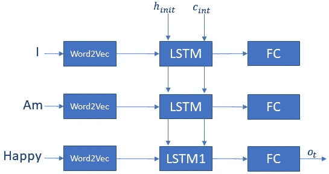

使用 LSTM 的情感分析网络示例。

我们将尝试对一个句子进行分类——“我很快乐”。在 t=0 时，第一个字“I”被嵌入层转换成长度为[80x1]的数字向量。并且穿过 LSTM，随后是完全连接的层。然后在时间 t=1，第二个单词通过网络，接着是在时间 t=2 的最后一个单词“happy”。我们希望网络等待整个句子让我们了解感情。我们不希望它过于急切，一字不漏地把感悟告诉我们。这就是为什么在下图中，LSTM 的输出只显示在最后一步。Keras 将这个参数称为 **return_sequence。**将此项设置为“假”或“真”将决定 LSTM 和随后的网络是否在每个时间步长或我们示例中的每个单词生成输出。我想在这里强调的一个关键点是，仅仅因为你将返回序列设置为假，并不意味着 LSTM 方程被修改了。他们仍然在计算每个时间步长的 h(t)，c(t)。因此计算量不会减少。

以下是 Keras 在 IMDB 数据集上进行情感分析的示例:

[https://github . com/keras-team/keras/blob/master/examples/IMDB _ lstm . py](https://github.com/keras-team/keras/blob/master/examples/imdb_lstm.py)

# 测试你的知识！


安吉丽娜·莉文在 [Unsplash](https://unsplash.com?utm_source=medium&utm_medium=referral) 上的照片

让我们试着巩固一下到目前为止所学的知识。在这一部分，我列出了一些样本/玩具网络的问题。如果我能测试我的理解是否正确，这将有助于我感觉更好，因此这一部分采用了这种格式。或者，您也可以使用这些来准备与 LSTMs 相关的面试:)

**样本 LSTM 网络# 1**

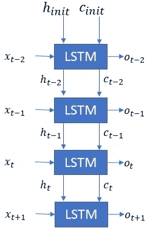

LSTM 网络# 1 示例

1.  这个网络中有多少个 LSTM 层？— **网络有一层。不要与多个 LSTM 盒混淆，它们代表不同的时间步长，只有一层。**
2.  如图所示，序列长度或时间步数是多少？— **时间步长的数量为 3。看看时间索引。**
3.  如果输入维数，即 x(t)是[18x1]，o(t)是[19x1]，那么 h(t)，c(t)的维数是多少？— **h(t)和 c(t)的尺寸为【19x 1】**

**样本 LSTM 网络# 2**

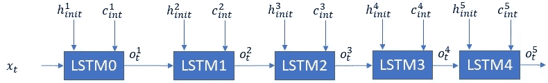

示例 LSTM 网络# 2

1.  这个网络中有多少个 LSTM 层？—**LSTM 的总层数为 5 层。**
2.  如图所示，序列长度或时间步数是多少？— **这个网络的序列长度为 1。**
3.  如果 x(t)是[45x1]，h1(int)是[25x 1]——C1(int)和 o1(t)的维数是多少？— **c1(t)和 o1(t)将与 h1(t)具有相同的尺寸，即[25x1]**
4.  如果 x(t)是[4x1]，h1(int)是[5x1]，o2(t)的大小是[4x1]。LSTM0 和 LSTM1 的权重矩阵的大小是多少？—**LSTM 的权重矩阵为[4 * output _ dim *(input _ dim+output _ dim+1)]。LSTM0 的输入尺寸为[4x1]，LSTM0 的输出尺寸为[5x1]。LSTM1 的输入是 LSTM0 的输出，因此 LSTM1 的输入 dim 与 LSTM0 的 output_dim 相同，即[5x1]。LSTM1 的输出 dim 为[4x1]。因此，LSTM0 是[4*6*(5+4+1)]=288，而 LSTM1 是[4*4*(5+4+1)] = 160。**
5.  如果 x(t)是[10x1]，h1(int)是[7 x1]lst m1 的输入维数是多少？— **看上面的解释。在计算之前，我们需要知道 LSTM0 的输出维数。**
6.  如果 x(t)是[6x1]，h1(int)是[4x1]，o2(t)是[3x1]，o3(t)是[5x1]，o4(t)是[9x1]，o5(t)是[10x1]网络的总重量大小是多少？— **单个时间步长的 LSTM 的权重矩阵为[4 * output _ dim *(input _ dim+output _ dim+1)]。通过估计单个层的输入输出维度来工作。**

**样本 LSTM 网络# 3**

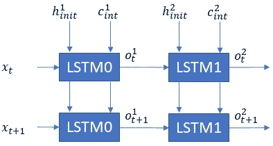

样本 LSTM 网络# 3

1.  这个网络有多少层？— **有两层**
2.  这个网络中显示的序列长度是多少？— **每层展开 2 次。**
3.  如果 x(t)是[80x1]，h1(int)是[10x1]，那么 o(t)，h1(t)，c1(t)，f(t)，i(t)的维数是多少？这些在图中没有显示，但是您应该能够标记出来。— **o(t)，h1(t)，c1(t)，f1(t)，i1(t)将具有与 h1(t)相同的尺寸，即【10x 1】**
4.  如果 x(t+1)是[4x1]，o1(t+1)是[5x1]，o2(t+1)是[6x1]。LSTM0 和 LSTM1 的权重矩阵的大小是多少？—**LSTM 的权矩阵由 4 * output _ dim *(input _ dim+output _ dim+1)给出。LSTM0 将是 4*5*(4+5+1)，即 200。LSTM2 将是 4*6*(5+5+1) = 264。**
5.  如果 x(t+1)是[4x1]，o1(t+1)是[5x1]，o2(t+1)是[6x1]。乘法和累加运算的总数是多少？——**我把这个留给读者。如果有足够多的人问，我会回答:)**

**样本 LSTM 网络# 4**

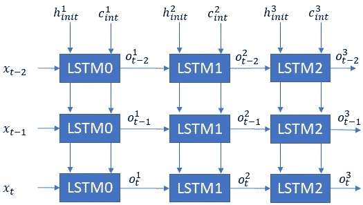

样本 LSTM 网络# 4

1.  有多少层？— **有 3 层。**
2.  如图所示，这个网络展开了多少时间步？— **每层展开 3 次。**
3.  这个网络总共要执行多少个方程？— **每个 LSTM 需要 6 个方程(某些文本合并为 5 个方程)。然后是 6 个方程/时间步长/LSTM。因此，6 个方程* 3 个 LSTM 层* 3 个时间步长= 54 个方程**
4.  如果 x(t)是[10x1]估计 LSTM1 的权矩阵还需要哪些信息？LSTM2 呢？— **一个 LSTM 的权重矩阵由 4 * output _ dim *(input _ dim+out _ dim+1)给出。因此，对于每个 LSTM，我们都需要 input_dim 和 output_dim。LSTM 的输出是 LSTM1 的输入。我们有输入维度[10x1]，因此我们需要输出维度或 o1(int)维度以及 LSTM1 的输出维度，即 o2(t)。同样，对于 LSTM2，我们需要知道 o2(t)和 o3(t)。**

# 摘要

围绕 LSTMs 的博客和论文经常在定性的层面上讨论它。在本文中，我试图从计算的角度解释 LSTM 运算。从计算的角度理解 LSTMs 是至关重要的，尤其是对于机器学习加速器的设计者来说。

# 参考资料和其他链接

[DL 面试准备](https://medium.com/@manurastogi_74075/yet-another-article-explaining-lstms-f3417442c2cd)

[克里斯托弗·奥拉赫的博客。](https://colah.github.io/posts/2015-08-Understanding-LSTMs/)

[阎石的博客](https://medium.com/mlreview/understanding-lstm-and-its-diagrams-37e2f46f1714)

来自[深度学习书籍](https://www.deeplearningbook.org/contents/rnn.html)的 LSTMs

[Nvidia 关于加速 LSTMs 的博客](https://devblogs.nvidia.com/optimizing-recurrent-neural-networks-cudnn-5/)

[关于机器学习掌握的 lst ms](https://machinelearningmastery.com/how-to-develop-lstm-models-for-time-series-forecasting/)

Pete Warden 关于[“为什么机器学习的未来很小”](https://petewarden.com/2018/06/11/why-the-future-of-machine-learning-is-tiny/)的博客。