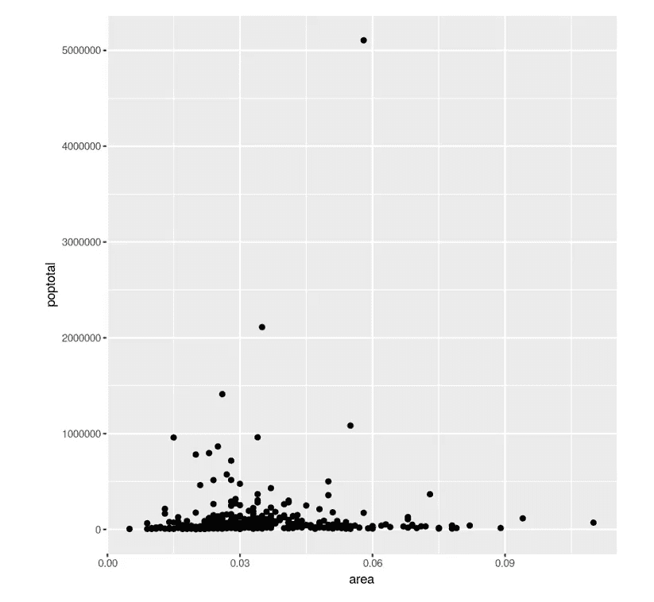
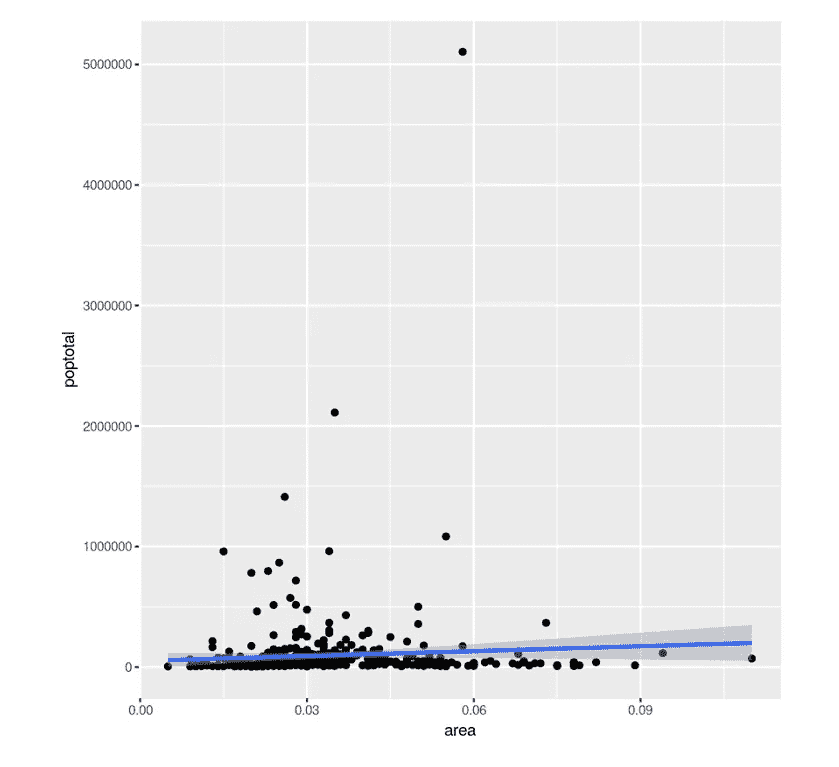
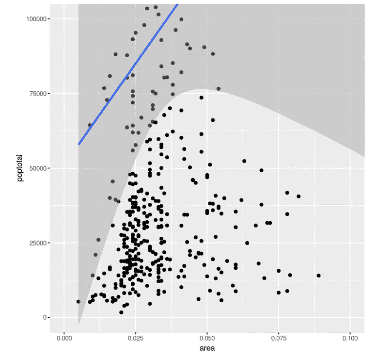

# 教程:用 R 为 Python 难民绘图

> 原文：<https://towardsdatascience.com/tutorial-plotting-in-r-for-python-refugees-15bf4500de5d?source=collection_archive---------53----------------------->


来自 Pixabay 的背景图片。

## 了解 R 惊人的绘图能力

虽然 Python 和 R 都是用于数据分析和机器学习的伟大语言，但大多数人都同意的一点是，R 在数据可视化方面占上风。虽然 Python 可能更适合快速绘图，但 R 具有可定制性控件，可以创建 Python 可以创建的几乎所有东西，甚至更远。最重要的是，R library `ggplot2`遵循“图形语法”,比 Python 有更有组织和结构化的方式来绘制图表。

如果您是一名 Python 难民，正在寻找一种更好、更有条理的方法来绘制数据，那么本教程就是为您准备的！

我们将使用的绘图库是 ggplot2。基于图形的语法，它的工作原理是每个图形都可以由三个部分组成:

*   数据集
*   坐标系
*   几何图形，或表示数据点的可视标记

为了显示数值，数据中的变量需要映射到几何、美学的属性，如尺寸、颜色或`x`和`y`轴位置。

让我们从数据集开始。`ggplot2`有一些内置功能。这

```
options(scipen=999)  # turn off scientific notation like 1e+06
library(ggplot2)
data("midwest", package = "ggplot2")  # load the data
```

现在我们有了数据，是时候指定坐标系了。`aes()`功能可用于指定`x`和`y`轴。`area`和`poptotal`是`midwest`表格中的列。

```
ggplot(midwest, aes(x=area, y=poptotal))
```


这里有一个空白坐标系，最后，是时候添加几何图形了。在这种情况下，由于我们正在制作一个散点图，将使用`geom_point()`，它将点放到坐标系中。

```
ggplot(midwest, aes(x=area, y=poptotal)) + geom_point()
```



我们还可以添加其他层。例如，如果我们想添加一个线性回归，我们可以添加一个`geom_smooth(method=’lm’)` geom。它对由`ggplot`公式的初始数据部分指定的相同数据进行操作。

```
ggplot(midwest, aes(x=area, y=poptotal)) + geom_point() + geom_smooth(method="lm")
```



我们还可以添加改变图形的层。例如，要放大图形的一部分，可以添加接受两个向量的`coord_cartesian`层——一个描述`x`轴范围，另一个描述`y`轴范围。注意，在 R 中，c()或 concatenate 函数创建一个向量(类似于一个`NumPy`数组或列表)。

```
ggplot(midwest, aes(x=area, y=poptotal)) + geom_point() + geom_smooth(method="lm") + coord_cartesian(xlim=c(0,0.1), ylim=c(0, 100000))
```



除了添加几何图形和缩放，`+`操作符还允许标记标题和轴。在这种情况下，`+ ggtitle(“Title”,subtitle = 'subtitle')`可用于为`x`和`y`轴添加标题和`+ xlab(‘axis’)`和`+ ylab(‘axis’)`。

```
ggplot(midwest, aes(x=area, y=poptotal)) + geom_point() + geom_smooth(method="lm") + coord_cartesian(xlim=c(0,0.1), ylim=c(0, 100000)) + ggtitle("Area Vs Population", subtitle="From midwest dataset") + xlab("Area") + ylab("Population")
```


为了以一种更加结构化的方式组织所有的层，而不是把它们都塞进一行，在`+`之后创建一个新行。

```
ggplot(midwest, aes(x=area, y=poptotal)) + 
geom_point() + 
geom_smooth(method="lm") + 
coord_cartesian(xlim=c(0,0.1), ylim=c(0, 100000)) + 
ggtitle("Area Vs Population", subtitle="From midwest dataset") + 
xlab("Area") + 
ylab("Population")
```

每个图层都有自己的参数，例如，我们可以根据 geom 类型指定颜色和大小。

```
ggplot(midwest, aes(x=area, y=poptotal)) + 
  geom_point(col="purple", size=0.5) +
  geom_smooth(method="lm", col="firebrick")
```


如果我们想根据类改变颜色，只需将颜色参数(`col`)设置为与颜色应该区分的列名相同。`aes()`需要指定引用的数据。

```
g <- ggplot(midwest, aes(x=area, y=poptotal)) + 
  geom_point(aes(col=state), size=3) +  # Set color to vary based on state categories.
  geom_smooth(method="lm", col="firebrick", size=2)
plot(g)
```


可以通过添加另一层来设置调色板。

```
gg + scale_colour_brewer(palette = "Set1")
```


在本教程中，您学习了:

*   图形的语法
*   向图中添加数据
*   向地块添加坐标
*   向图中添加散点图几何
*   向图中添加其他形式的几何图形，如回归
*   更改绘图的比例
*   调整几何图形的大小和颜色
*   更改调色板

感谢阅读！