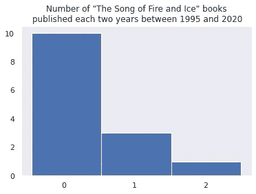
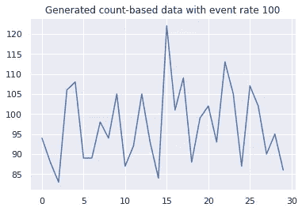
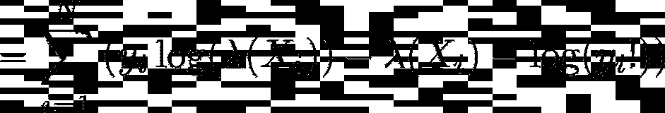
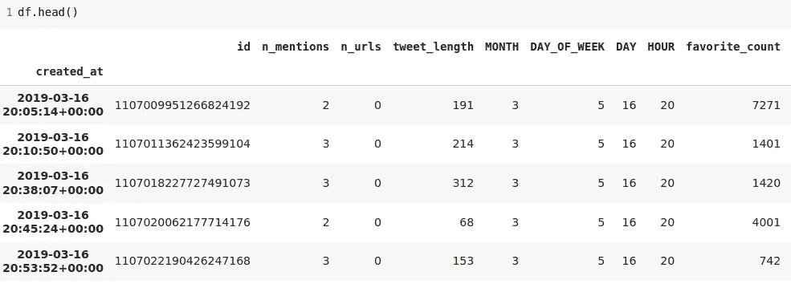
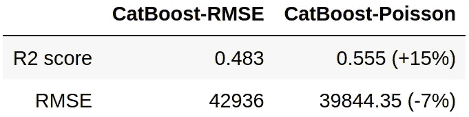
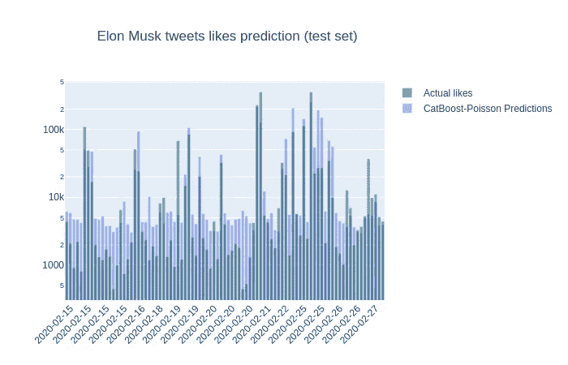

# 教程:使用 CatBoost 进行泊松回归

> 原文：<https://towardsdatascience.com/tutorial-poisson-regression-with-catboost-33a1e39badc?source=collection_archive---------31----------------------->

## 如何使用泊松回归和 CatBoost 来提高基于计数的数据的准确性…并预测一条推文获得的赞数。

# 在本教程中，我们将讨论以下主题:

*   基于计数的数据的概念
*   什么是泊松回归，为什么它适用于基于计数的数据
*   如何用 CatBoost 包建立泊松回归模型
*   如何预测埃隆·马斯克的推文会获得多少赞

# 什么是基于计数的数据？

根据定义**计数数据**是一种数据类型，其中:

*   观察值只能取非负整数值{0，1，2，3，…}
*   这些整数来自*计数*

更具体地说，在我们的教程中，我们将关注基于计数的数据，其中每个点都是在某个固定时间单位 *t* 内发生的事件数量。我们还将假设在时间单元 *t* 期间平均发生事件 *λ* 的数量。 *λ* 则称为**事件率**。**事件发生率可能会随着时间的推移而变化，也可能会随着观察的不同而变化。**以下是此类数据的一些示例:

*   每周看医生的人数
*   过桥车辆数量
*   每天发布在 Instagram 上的照片数量
*   乔治·r·r·马丁每两年写的“冰之歌”的数量

值得注意的是，基于计数的数据的分布可能是相当偏斜的，因为大多数数据点具有完全相同的值。



# 泊松回归

## 泊松分布

泊松分布的概率质量函数如下:


泊松分布的 PMF

其中 *P(k)* 是在给定事件率的时间单位内看到 *k* 个事件的概率(=每时间单位的事件数) *λ* 。

我们可以用泊松分布来模拟基于计数的数据。

常数为 *λ* 的泊松分布示例如下:



生成泊松分布样本的代码:

# 事件率λ作为因变量

泊松回归的思想是说事件率 *λ* 是因变量。

例如，每天过桥的自行车数量取决于天气、一年中的时间、一周中的日期等。我们可以建立一个普通的 RMSE 回归模型，但是，这样的模型不能解释基于计数的数据属性。所以在泊松回归中，我们希望最大化泊松分布的对数似然。假设 *X* ， *y* 是我们用于泊松回归任务的数据集(意味着 *y* 是基于计数的)，那么我们想要最大化对数似然性:



数据集(X，y)上泊松分布的对数似然性

自日志*(咦！)*不依赖于 *X* 我们去掉这一项，尽量减少以下损失:


这种损失可以用不同的模型和优化方法来优化。在我们的教程中，我们使用 CatBoost 包。

# 定型泊松回归模型

# 资料组

我们的数据集是用 Twitter API 收集的。它由埃隆·马斯克的推文组成。我们将使用 2019 年 3 月至 2020 年 1 月的推文作为训练集，2020 年 2 月上半月的推文作为验证集，2020 年 2 月下半月的推文作为测试集。我们的**目标是推特收到的赞数**。在实践中，大多数推文在发布后的前两周内收到了所有的赞，所以我们假设我们的时间单位是两周。我们收集了至少两周前的推文。

# 特征

我们为我们的任务提取了一些非常简单的特征:

*   推文长度
*   其他 Twitter 用户提及的次数
*   推文中的 URL 数量
*   月
*   一天
*   小时
*   星期几
*   大小为 500 的 TF-IDF 特征向量(用`stop_words="english"`提取`sklearn.feature_extraction.text.TfidfVectorizer`)



现在，我们将使用客观泊松来训练 CatBoost 模型。我们将使用我们的验证数据集来选择迭代次数。

```
bestIteration = 972

Shrink model to first 973 iterations.
R2 score: 0.555
RMSE score: 39844.35
```

56%的决定系数 R2 值表明，我们的模型对测试数据集的预测解释了超过一半的目标可变性，考虑到任务的复杂性和我们方法的简单性，这并不坏。
此外，为了进行比较，我们将训练一个具有标准 RMSE 目标的 CatBoost 模型:

```
bestIteration = 44

Shrink model to first 45 iterations.
R2 score: 0.483
RMSE score: 42936.22
```

鉴于 RMSE 模型的最佳迭代次数为 45，而泊松回归的最佳迭代次数为 972，我们可能会怀疑 CatBoost 自动选择的学习率 0.055185 对于 RMSE 模型来说太大了。为了解决这种可能的不公平，我们还训练了一个学习率小 30 倍的 RMSE 模型:

```
bestIteration = 748

Shrink model to first 749 iterations.
R2 score: 0.470
RMSE score: 43470.15
```

然而，较小的学习率无助于 RMSE 模型。



可以看出，考虑数据集性质的损失比标准 RMSE 损失产生更好的结果。



**感谢您的关注！希望这篇教程对你有用。**

[在 Colab 中打开](https://colab.research.google.com/github/catboost/tutorials/blob/master/regression/poisson.ipynb)

[GitHub 上的视图](https://github.com/catboost/catboost/blob/master/catboost/tutorials/regression/poisson.ipynb)