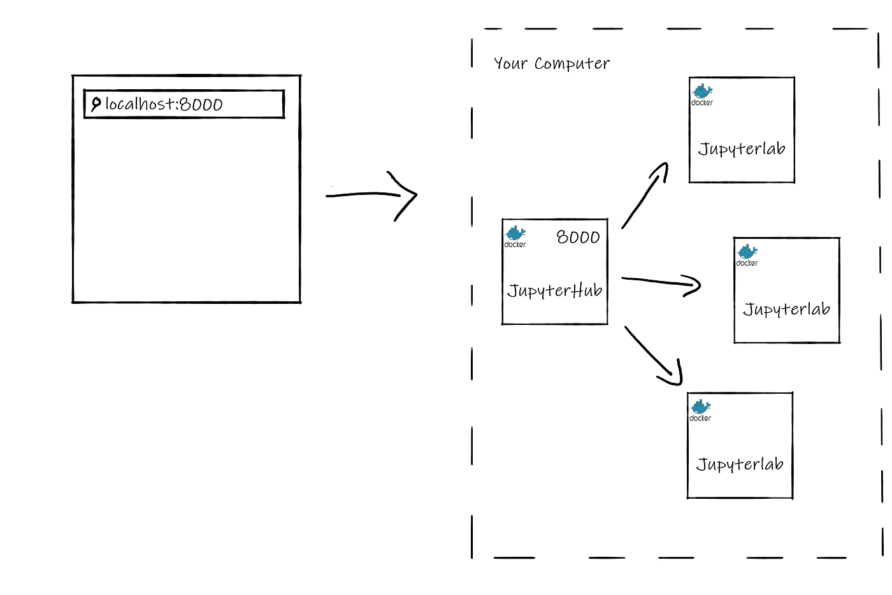
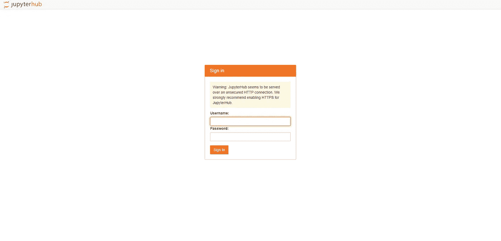
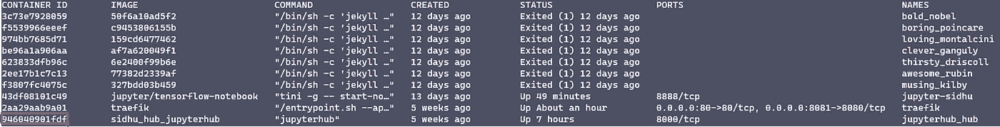

# 教程:停止从命令行运行 Jupyter 笔记本

> 原文：<https://towardsdatascience.com/tutorial-stop-running-jupyter-notebooks-from-your-command-line-b3af93265230?source=collection_archive---------5----------------------->

## 将您的 Jupyter 笔记本作为独立的网络应用程序运行


Justin Jairam 的照片来自 [@jusspreme](https://www.instagram.com/jusspreme/?hl=en) (经允许)

Jupyter Notebook 提供了一个很好的平台来生成包含代码、等式、分析及其描述的人类可读文档。一些人甚至认为它与 NBDev 结合是一个强大的发展。对于这样一个完整的工具，开箱启动并不是最好的。每次使用都需要从命令行启动 Jupyter web 应用程序，并输入您的令牌或密码。整个 web 应用程序依赖于打开的终端窗口。有些人可能会“混淆”这个过程，然后使用 [nohup](https://www.computerhope.com/unix/unohup.htm) 将它从他们的终端中分离出来，但这不是最优雅和可维护的解决方案。

幸运的是，Jupyter 已经提出了一个解决这个问题的方案，推出了 Jupyter 笔记本的扩展，作为一个可持续的网络应用程序运行，并具有内置的用户身份验证。为了在上面添加一个樱桃，它可以通过 Docker 管理和维护，允许隔离的开发环境。

在这篇文章的最后，我们将利用 JupyterHub 的能力来访问一个 Jupyter 笔记本实例，该实例可以在没有终端的情况下从网络中的多个设备访问，并且是一种更加用户友好的身份验证方法。

# 先决条件

关于 Docker 和命令行的基本知识将有助于设置这一功能。

我建议在你拥有的最强大的设备上这样做，并且一天的大部分时间都是开着的，最好是一整天。这种设置的一个好处是，你可以在网络上的任何设备上使用 Jupyter Notebook，但是所有的计算都在我们配置的设备上进行。

# 什么是 Jupyter Hub

JupyterHub 将笔记本电脑的强大功能带给用户组。JupyterHub 背后的想法是将 Jupyter 笔记本的使用范围扩大到企业、教室和大型用户组。然而，Jupyter Notebook 应该作为一个本地实例，由一个开发人员在一个节点上运行。不幸的是，JupyterHub 的可用性和可伸缩性与运行本地 Jupyter 笔记本的简单性之间没有折中。也就是说，直到现在。

JupyterHub 有预建的 Docker 映像，我们可以利用这些映像心血来潮地生成一个笔记本，在技术复杂性方面几乎没有开销。我们将使用 Docker 和 JupyterHub 的组合，从同一网址随时随地访问 Jupyter 笔记本。

# 体系结构

我们的 JupyterHub 服务器的架构将由两个服务组成:JupyterHub 和 JupyterLab。JupyterHub 将是入口点，并将为任何用户生成 JupyterLab 实例。这些服务中的每一个都将作为 Docker 容器存在于主机上。



JupyterLab 架构图(图片由作者提供)

# 构建 Docker 图像

为了构建我们的家用 JupyterHub 服务器，我们将使用 JupyterHub & JupyterLab 的预构建 Docker 映像。

# 码头文件

JupyterHub Docker 图像很简单。

```
FROM jupyterhub/jupyterhub:1.2# Copy the JupyterHub configuration in the container
COPY jupyterhub_config.py .# Download script to automatically stop idle single-user servers
COPY cull_idle_servers.py .# Install dependencies (for advanced authentication and spawning)
RUN pip install dockerspawner
```

我们使用预先构建的 JupyterHub Docker 映像，并添加我们自己的配置文件来停止空闲的服务器，`cull_idle_servers.py`。最后，我们通过 Docker 安装额外的包来生成 JupyterLab 实例。

# Docker 撰写

为了将所有的东西放在一起，让我们创建一个`docker-compose.yml`文件来定义我们的部署和配置。

```
version: '3'services:
  # Configuration for Hub+Proxy
  jupyterhub:
    build: .                # Build the container from this folder.
    container_name: jupyterhub_hub   # The service will use this container name.
    volumes:                         # Give access to Docker socket.
      - /var/run/docker.sock:/var/run/docker.sock
      - jupyterhub_data:/srv/jupyterlab
    environment:                     # Env variables passed to the Hub process.
      DOCKER_JUPYTER_IMAGE: jupyter/tensorflow-notebook
      DOCKER_NETWORK_NAME: ${COMPOSE_PROJECT_NAME}_default
      HUB_IP: jupyterhub_hub
    ports:
      - 8000:8000
    restart: unless-stopped # Configuration for the single-user servers
  jupyterlab:
    image: jupyter/tensorflow-notebook
    command: echovolumes:
  jupyterhub_data:
```

需要注意的关键环境变量是`DOCKER_JUPYTER_IMAGE`和`DOCKER_NETWORK_NAME`。JupyterHub 将使用环境变量中定义的图像创建 Jupyter 笔记本。有关选择 Jupyter 图像的更多信息，您可以访问以下 Jupyter [文档](https://jupyter-docker-stacks.readthedocs.io/en/latest/using/selecting.html)。

`DOCKER_NETWORK_NAME`是服务使用的 Docker 网络的名称。这个网络从 Docker Compose 自动获得一个名称，但是集线器需要知道这个名称来连接 Jupyter 笔记本服务器。为了控制网络名，我们使用了一个小技巧:我们将一个环境变量 COMPOSE_PROJECT_NAME 传递给 Docker Compose，网络名是通过向它附加 _default 获得的。

在与`docker-compose.yml`文件相同的目录下创建一个名为`.env`的文件，并添加以下内容:

```
COMPOSE_PROJECT_NAME**=**jupyter_hub
```

# 停止空闲服务器

因为这是我们的主设置，所以我们希望能够停止空闲的实例来保留我们机器上的内存。JupyterHub 有一些服务可以和它一起运行，其中之一就是 jupyterhub-idle-culler 。该服务停止任何长时间空闲的实例。

要添加这个服务，创建一个名为`cull_idle_servers.py`的新文件，并将 [jupyterhub-idle-culler 项目](https://raw.githubusercontent.com/jupyterhub/jupyterhub-idle-culler/master/jupyterhub_idle_culler/__init__.py)的内容复制到其中。

> 请确保“cull_idle_servers.py”与 docker 文件位于同一文件夹中。

要了解更多关于 JupyterHub 服务的信息，请查看他们的官方文档。

# Jupyterhub 配置

最后，我们需要定义配置选项，如卷装载、Docker 映像、服务、身份验证等。对于我们的 JupyterHub 实例。

下面是我使用的一个简单的`jupyterhub_config.py`配置文件。

```
import os
import sysc.JupyterHub.spawner_class **=** 'dockerspawner.DockerSpawner'
c.DockerSpawner.image **=** os.environ['DOCKER_JUPYTER_IMAGE']
c.DockerSpawner.network_name **=** os.environ['DOCKER_NETWORK_NAME']
c.JupyterHub.hub_connect_ip **=** os.environ['HUB_IP']
c.JupyterHub.hub_ip **=** "0.0.0.0" *# Makes it accessible from anywhere on your network*c.JupyterHub.admin_access **=** Truec.JupyterHub.services **=** [
    {
        'name': 'cull_idle',
        'admin': True,
        'command': [sys.executable, 'cull_idle_servers.py', '--timeout=42000']
    },
]c.Spawner.default_url **=** '/lab'notebook_dir **=** os.environ.get('DOCKER_NOTEBOOK_DIR') **or** '/home/jovyan/work'
c.DockerSpawner.notebook_dir **=** notebook_dir
c.DockerSpawner.volumes **=** {
    '/home/sidhu': '/home/jovyan/work'
}
```

请注意以下配置选项:

*   `'command': [sys.executable, 'cull_idle_servers.py', '--timeout=42000']` : Timeout 是空闲 Jupyter 实例关闭之前的秒数。
*   `c.Spawner.default_url = '/lab'`:使用 Jupyterlab 代替 Jupyter 笔记本。注释掉这一行以使用 Jupyter 笔记本。
*   `'/home/sidhu': '/home/jovyan/work'`:我将我的主目录挂载到 JupyterLab 主目录，以便访问我桌面上的任何项目和笔记本。这也允许我们在创建新笔记本的情况下实现持久性，它们被保存到我们的本地机器，并且不会在我们的 Jupyter Notebook Docker 容器被删除时被删除。

如果您不希望挂载您的主目录，请删除这一行，并且不要忘记将`sidhu`改为您的用户名。

# 启动服务器

要启动服务器，只需运行`docker-compose up -d`，在浏览器中导航到`localhost:8000`，您应该能够看到 JupyterHub 登录页面。



JupyterHub 登陆页面截图(图片由作者提供)

要在网络上的其他设备(如 asva 笔记本电脑、iPad 等)上访问它，请通过在 Unix 机器上运行`ifconfig`在 Windows 上运行& `ipconfig`来识别主机的 IP。


Ipconfig(图片作者提供)

从您的另一台设备上，导航到您在端口 8000: `http://IP:8000`上找到的 IP，您应该会看到 JupyterHub 登录页面！

# 鉴定

这就给我们留下了向服务器进行认证的最后一项任务。因为我们没有设置 LDAP 服务器或 OAuth，所以 JupyterHub 将使用 PAM(可插拔认证模块)认证来认证用户。这意味着 JupyterHub 使用主机的用户名和密码进行身份验证。

为了利用这一点，我们必须在 JupyterHub Docker 容器上创建一个用户。还有其他方法可以做到这一点，例如在容器上放置一个脚本，并在容器启动时执行，但我们将手动完成它作为一个练习。如果您拆除或重建容器，您将必须重新创建用户。

> 我不建议将用户凭证硬编码到任何脚本或 docker 文件中。

1)找到 JupyterLab 容器 ID: `docker ps -a`



JupyterLab 容器 ID(图片由作者提供)

2)“SSH”进入容器:`docker exec -it $YOUR_CONTAINER_ID bash`

3)创建用户，按照终端提示创建密码:`useradd $YOUR_USERNAME`

4)使用凭证登录，一切就绪！

现在，您已经拥有了一台随时可用的 Jupyter 笔记本电脑服务器，可以从任何设备访问，尽在您的掌握之中！编码快乐！

# 反馈

我欢迎任何关于我的帖子和教程的反馈。你可以在 sidhuashton@gmail.com 的[推特](https://twitter.com/ashtonasidhu)上给我发消息，或者发电子邮件给我。