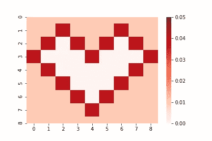
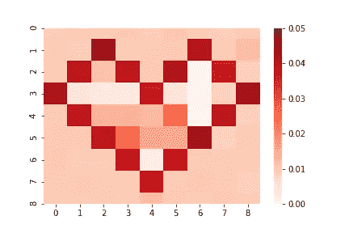
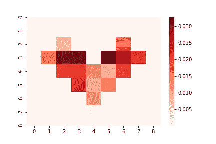
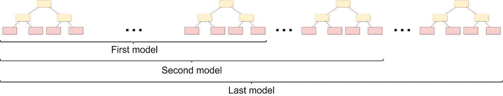
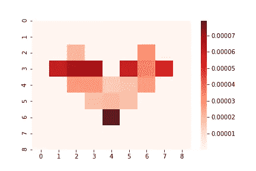

# 教程:使用 CatBoost 进行不确定性估计

> 原文：<https://towardsdatascience.com/tutorial-uncertainty-estimation-with-catboost-255805ff217e?source=collection_archive---------13----------------------->

## *理解为什么你的模型是不确定的，以及如何估计不确定性的水平*


数据不确定性示例(图片由 Yandex 提供)。

本教程涵盖以下主题:

*   什么是预测不确定性，为什么要关心它？
*   不确定性的两个来源是什么？
*   如何使用 CatBoost 梯度增强库估计回归问题的不确定性

你可以使用[这个 Jupyter 笔记本](https://github.com/catboost/catboost/blob/master/catboost/tutorials/uncertainty/uncertainty_regression.ipynb)遵循所有步骤。

# 什么是不确定性？

机器学习已经广泛应用于一系列任务。然而，在某些高风险应用中，如自动驾驶、医疗诊断和金融预测，一个错误可能会导致致命的后果或巨大的经济损失。在这些应用中，重要的是检测系统何时出错并采取更安全的措施。此外，还需要收集这些“故障场景”，标记它们，并通过主动学习教会系统做出正确的预测。

预测不确定性估计可用于检测误差。理想情况下，模型表明在可能出错的情况下存在高度的不确定性。这使我们能够发现错误并采取更安全的行动。至关重要的是，行动的选择可能取决于*为什么*模型是不确定的。不确定性的来源主要有两种:*数据不确定性*(也称任意不确定性)和*知识不确定性*(也称认知不确定性)。如果我们的目标是检测错误，就没有必要分离这两种不确定性。然而，如果我们的目标是主动学习，那么我们希望检测新的输入，而*知识不确定性*可以用于此。

数据的不确定性源于数据固有的复杂性，如附加噪声或重叠类别。在这些情况下，模型知道输入具有多个类的属性或者目标有噪声。重要的是，数据不确定性*不能通过收集更多的训练数据来减少。*

当模型的输入来自训练数据稀疏覆盖的区域或远离训练数据的区域时，知识不确定性出现。在这些情况下，模型对这一地区知之甚少，很可能出错。与数据不确定性不同，知识不确定性可以通过从了解不多的区域收集更多的训练数据来减少。

这篇教程文章详细介绍了如何在 CatBoost 中量化数据和知识的不确定性。

# CatBoost 中的数据不确定性

为了说明这些概念，我们将使用一个简单的合成示例。

假设我们有两个分类特征 x₁和 x₂，每个有 9 个值，因此有 81 个可能的特征组合。目标取决于以下特征

```
y = mean(x₁,x₂) + eps(x₁,x₂)
```

其中均值 *(x₁,x₂)* 是某个未知的固定值，eps *(x₁,x₂)* 是均值为 0、方差为 var *(x₁,x₂)* 的正态分布噪声(即数据不确定性)。在我们的示例中，mean *(x₁,x₂)* 是随机生成的，var *(x₁,x₂)* 有两个值(0.01 和 0.04)，分布如下:



数据中的差异。白色区域没有训练示例。

因此，心脏上的点比心脏外的点在目标中具有更多的噪声。请注意，我们为更好的可视化列举了类别，但是在数据集中，两个特征都是分类的，即没有给出顺序。

当我们生成具有这种分布的数据集时，我们假设心脏内部没有任何训练样本，这些特征组合被视为数据集的异常值。

用 RMSE 损失优化的标准模型只能预测 mean(x₁,x₂).好吧，但是如果我们想估计 y 的方差，也就是数据不确定性呢？换句话说，如果我们想了解哪些预测是有噪声的呢？为了估计数据的不确定性，人们不得不使用*概率*回归模型预测*均值*和*方差*。为此，CatBoost 中有一个新的损失函数，称为 RMSEWithUncertainty。对于这种损失，CatBoost 估计正态分布的均值和方差，优化负对数似然，并使用自然梯度，类似于 NGBoost 算法[1]。对于每个示例，CatBoost 模型返回两个值:估计平均值和估计方差。

让我们试着将这个损失函数应用到我们的简单例子中。我们得到以下方差:



用 RMSEWithUncertainty 猫靴损失估计的方差(数据不确定性)。

我们可以看到，CatBoost 成功地预测了心脏内外的方差。在心脏内部，我们没有训练数据，所以任何事情都可以在那里预测。

# CatBoost 中的知识不确定性

好，我们知道如何估计数据中的噪声。但是，如何衡量某个特定地区缺乏训练数据所带来的知识不确定性呢？如果我们想检测异常值，该怎么办？估计知识的不确定性需要一个*模型集合*。如果所有模型都理解一个输入，它们将给出相似的预测(低知识不确定性)。然而，如果模型不理解输入，那么它们很可能提供不同的预测，并且彼此强烈不一致(高知识不确定性)。对于回归，知识不确定性可以通过测量跨越*多个模型*的平均值的*方差来获得。注意，这不同于单个模型的*预测方差*，后者捕捉数据不确定性。*

让我们考虑如下生成的 GBDT 模型的*集合*:

使用选项*后验采样*生成模型，因为这允许获得的(随机)预测很好地分布(具有良好的理论特性，这里我们参考[2]了解细节)。

然后，为了估计知识的不确定性，我们只需计算模型预测的平均值的方差:

```
knowledge = np.var(ens_preds, axis=0)[:, 0]
```

我们得到以下结果:



通过模型集成估计知识不确定性。

该模型正确地检测了心脏内部的知识不确定性(我们看不到原始心脏边界的痕迹)。这说明了如何通过估计知识的不确定性，我们可以检测异常输入。

在实践中，训练几个 CatBoost 模型的集合可能过于昂贵。理想情况下，我们希望训练一个单一的模型，但仍然能够检测异常值。有一个解决方案:我们可以使用从单个*训练模型获得的*虚拟*集合:*

由于只有一个训练好的模型，CatBoost 会为每个示例返回几个预测。这些预测是通过截断模型获得的:



虚拟合奏(图片由作者提供)

同样，我们使用选项*后验采样*来保证裁剪预测的理想分布。让我们看看我们得到了什么:



由虚拟集合估计的知识不确定性。

注意，知识不确定性的预测绝对值现在小得多，因为虚拟系综元素是相关的。但是，它仍然可以成功地检测未被占用的区域(异常值)。

我们可以使用*prediction _ type = ' total uncertainty '*,而不是*prediction _ type = ' virt ensembles '*返回几个模型的预测，这样更容易得到相同的结果。对于这种预测类型，CatBoost 使用虚拟集合计算所有类型的不确定性。也就是说，对于 RMSEWithUncertainty，它返回以下统计数据:[均值预测、知识不确定性、数据不确定性]:

感谢您的关注！我希望这篇教程能帮助你更好地理解不确定性的概念，以及如何用 CatBoost 估计它。我们将在以后的文章中告诉你更多关于不确定性的应用。敬请期待😺

[1] T. Duan 等， [NGBoost:概率预测的自然梯度推进](https://proceedings.icml.cc/static/paper_files/icml/2020/3337-Paper.pdf) (2020)，2020

[2] A. Ustimenko，L. Prokhorenkova 和 A. Malinin，[通过系综](https://arxiv.org/pdf/2006.10562.pdf)进行梯度增强的不确定性(2020)，arXiv 预印本 arXiv:2006.10562