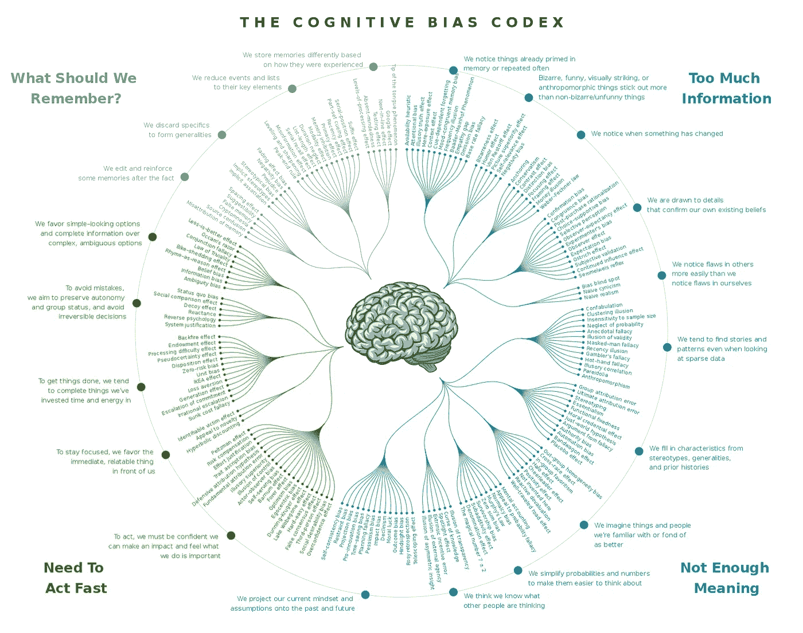

# 电视节目对人工智能感到害怕是正确的——因为所有错误的原因

> 原文：<https://towardsdatascience.com/tv-shows-are-right-to-be-scared-about-ai-for-all-the-wrong-reasons-81dde746f1a4?source=collection_archive---------26----------------------->

## 我们已经多次看到好莱坞对人工智能灾难的处理，但这个行业及其消费者实际上应该担心什么？

去年夏天，当福克斯公司宣布他们的新“科幻小说”击中“下一个”时，该节目的描述听起来类似于黑镜或菲利普·k·迪克(Philip K. Dick)的《电梦》(Electric Dreams)，这是一个关于控制技术对其用户的侵蚀的警示故事:

“接下来是一部推进性的、基于事实的惊悚片，讲述了一种致命的、流氓式的人工智能的出现，它结合了脉冲冲击行动和对技术如何入侵我们的生活并以我们尚不了解的方式改变我们的分层检查。”

然而， [**从它的预告片**](https://www.youtube.com/watch?v=eXrE9dOc0DE) 来看，这部剧的故事情节离这个总结太远了。预告片以一个类似 Alexa 的东西开场，一切看起来都很好，直到它获得了自己的意志，以邦德超级反派的微妙和冗长肆虐并反抗其用户和人类创造者。这种试图用“入侵者”的形象来描绘社会恐惧的赫伯特·乔治·威尔斯方法可能对世界之战或哥斯拉有用。然而，在这种情况下使用人工智能会严重误导我们对人工智能和决策算法的现实担忧，其中许多都严重影响了我们生活在其中的非虚构现实中的人类生活。

# 这不仅仅是数据隐私

要明确的是，数据隐私是一个组成部分。你应该关心你的数据，人工智能的支柱，去哪里了。越来越不可避免的是，作为社会的积极参与者，你将被迫把你的品味和行为的很大一部分交给数据收集公司。这些公司的唯一目的是从数据中榨取尽可能多的价值，如果不成为数字隐士，我们对此几乎无能为力。

你知道吗，不仅你可以通过点击和在线搜索被跟踪和识别，你的身体动作也可以被跟踪和识别。那些开始覆盖笔记本电脑网络摄像头的人可能在正确的道路上，但可能没有听说过行为生物测定学:通过这些技术，你在键盘上打字的节奏或你鼠标的移动模式等细节可以将你与你的身份联系起来(了解如何在这里停止**)。**

**现在，我不是说你不应该尝试最小化你的数字数据足迹。此外，围绕数据隐私工作的对话也应该关注公众对更严格的安全和隐私政策的强烈要求。在 Vox 播客“Recode Decode 的最近一集[，DuckDuckGo 的首席执行官 Gabe Weinberg 认为，选择加入数据跟踪应该是默认的，而不是许多数据公司实施的模糊的选择退出方法。这是许多欧洲国家通过政策认同的一个流行观点，需要在全球范围内采纳。](https://www.vox.com/recode/2019/5/27/18639284/duckduckgo-gabe-weinberg-do-not-track-privacy-legislation-kara-swisher-decode-podcast-interview)**

# **行为转变策略**

**数据公司已经意识到，他们不仅可以使用他们的资产和工具进行数据收集和行为预测，而且他们现在可以部署他们的洞察力来*转变*行为，有效地操纵我们未来的行动，为他们带来最佳利益。在《监视资本主义的时代》一书中，作者肖莎娜·祖博夫认为 [**资本主义行为分析的最终结果可能不仅仅是对我们隐私的威胁，而是对我们非常自由的意志的威胁**](https://www.theguardian.com/technology/2019/jan/20/shoshana-zuboff-age-of-surveillance-capitalism-google-facebook)——预设决策和自我实现预言的决定性景观。祖博夫认为:**

***“监视资本主义单方面宣称人类经验是转化为行为数据的免费原材料。虽然这些数据中的一些被用于服务改进，但其余的被宣布为专有的行为盈余，被输入到被称为“机器智能”的先进制造流程中，并被制作成预测产品，预测您现在、不久和将来会做什么。最后，这些预测产品在一种新的市场中交易，我称之为行为期货市场。监视资本家从这些交易操作中变得非常富有，因为许多公司愿意对我们未来的行为下注”***

**在资本主义思维控制下，不受监管的数据跟踪和操纵的影响应该是显而易见的。从对我们行为的威胁到民主本身，我们不需要一个电脑化的超级恶棍来想象一个真实存在的人工智能威胁。如果我们想在自主性完好无损的情况下走出这个新的数字黄金时代，一种稳健且基于道德的数据政策实施方法是根本。**

# **没有无偏见这回事**

**偏见无处不在，算法于事无补，它们模糊了问题，加剧了问题。数据和算法不是我们世界的客观反映；他们带着来自创造他们的文化和组织的同样的偏见、成见和误解。除了它们隐藏在鼓励对这些偏见缺乏问责的包装中，使得更容易证明将决定论误认为客观性是正确的。通过实施决定谁优先接受医疗护理、谁涉嫌犯罪或向儿童推荐什么在线内容的系统，我们正在增加问责制的缺乏，而没有解决紧迫的问题。**

**Rachel Thomas 是旧金山大学数据研究所的教授，也是 Fast.ai [**的联合创始人，她曾就这个主题发表过长篇大论:**](https://www.fast.ai/2019/01/29/five-scary-things/)**

***“我们的算法和产品影响着世界，是反馈回路的一部分。考虑一种预测犯罪并确定向哪里派遣警察的算法:向特定的街区派遣更多的警察不仅是一种效果，也是一种原因。在给定的街区，更多的警察可以导致更多的逮捕，这可能会导致算法向该街区派遣更多的警察(这种机制在关于失控反馈循环的论文* [***中有所描述)。***](https://arxiv.org/abs/1706.09847)**

**与欧洲血统的人相比，计算机视觉算法 [**在有色人种**](https://www.nytimes.com/2019/01/24/technology/amazon-facial-technology-study.html) 上表现不佳，因为绝大多数面部数据来自欧洲血统的人。 **M** [**ost 收集的行为数据来自发达国家的富裕地区**](https://arxiv.org/abs/1711.08536) ，自动填充算法更有可能为男性建议 STEM 相关的职业术语，为女性建议家政术语。这些刻板印象不是恶意的结果，而是反映在数据广度和宽度上的社会和个人偏见。然而，不管来自何方，这些问题都需要解决。**

**算法和数据远非客观真理的仲裁者，而是我们偏见的载体，这种偏见非常丰富。缺乏对那些执行、部署、消费和管理它们的人的理解，导致我们被我们创造的有偏见的、可操纵的机器推下悬崖。自人工智能诞生以来，伦理考量就一直是其核心的重要组成部分。因此，等到损害已经造成，或者相信巨额罚款的威胁不仅仅是解决更大问题的权宜之计，都是错误的。**

****

**认知偏差法典，设计:约翰·马诺吉安三世，类别和描述:巴斯特·本森，实现:蒂尔曼纳[CC BY-SA]**

# **我们能做些什么呢？**

**可悲的是，解决这些问题不会像“下一个”电视节目让我们相信的那样，像号召邋遢顽固的侦探打败 Alexa 的邪恶表弟那样容易。这里没有“其他人”，没有来自错误实验的流氓人工智能，只是对我们社会偏见和疑虑的认可，包装成闪亮的代码行。**

**我们已经知道如何处理偏见。人类以前已经足够聪明，能够(在不同程度上)认识到并纠正它们。挑战在于我们是否有能力将这些解决方案应用到我们曾经认为公平或客观的系统中。这样做的下一步是为负责数据流程中每个步骤(数据的收集、存储、探索、建模和部署)的人员建立限制和问责制。此外，我们需要始终意识到偏见是多么容易被忽略，并理解算法可能会犯错误——频繁，而且比预期的影响更大。最终取得成功意味着准备好主动纠正问题，如果不能，在损害不可逆转之前放弃算法。**

**[**在 InfoQ 的一次介绍会上**](https://www.infoq.com/presentations/unconscious-bias-machine-learning) ，Rachel Thomas 概述了一些我们上面讨论的问题的解决方案，比如:**

*   ****不要最大化指标** —想要数字增加很容易，但我们越是将数据简化为数字，就越容易遗漏错误并奖励我们提供的服务中存在的负面行为，或者启用不公正地歪曲所述服务的限制性反馈循环。**
*   ****雇佣多元化的团队** —研究表明多元化的团队表现更好，从分析角度来看，他们有助于更好地理解数据集所包含的主题，带来更好的、可操作的见解，并确保偏见不是来自你的团队。**
*   **“先进的技术不能代替好的政策，”托马斯说。偏见很难捕捉；不管你的算法或者管道有多好。需要制定法规和协议，以便用户可以对算法做出的决定提出上诉。**
*   ****永不放弃** —我们永远不会达到人类和我们的算法没有偏见的地步。我们一开始就是这么过来的！我们有责任训练人们时刻警惕反馈循环、偏见和我们数据中隐含的偏见。**

**最后，把黑白场景留给周末科幻电视节目。**