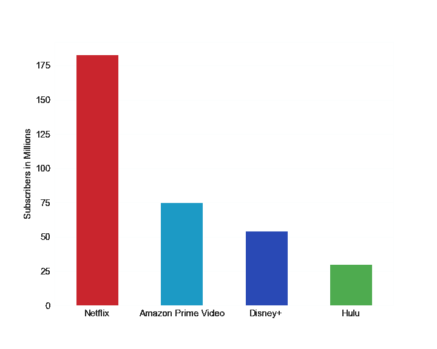
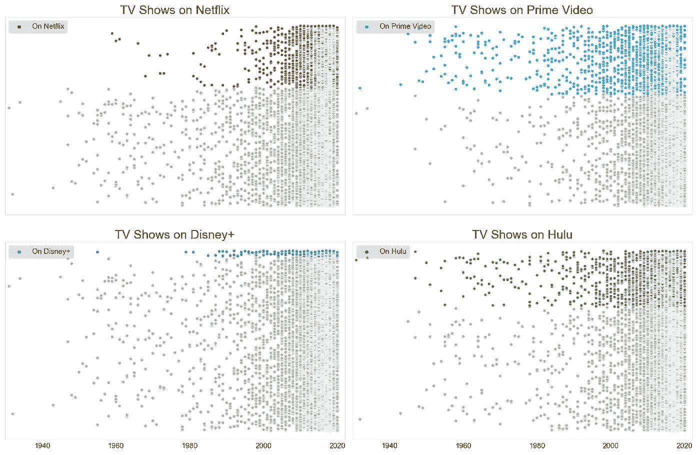

# 使用 Python 对网飞和亚马逊 Prime Video 等在线流媒体服务上的电视节目进行可视化比较

> 原文：<https://towardsdatascience.com/tv-shows-on-online-streaming-services-a-visual-comparison-using-python-cd269bed44fd?source=collection_archive---------56----------------------->

## 使用 Python 的 Seaborn 和 Matplotlib 库创建关于流行在线流媒体服务的信息图的比较研究

# 简介:

在疫情期间不会倒闭的为数不多的服务中，有像网飞和亚马逊 Prime Video 这样的在线流媒体服务。看看下面的谷歌趋势结果，从 1 月 1 日到 6 月 12 日。在 2020 年 3 月中旬左右，新冠肺炎和网飞的网络搜索量明显上升，当时新冠肺炎病例在全球范围内飙升，企业因不可避免的封锁而关闭。还有一个有趣的每周模式，搜索数量在周末增加。


网飞和科维德在谷歌上的搜索次数时间表。谷歌表示，这些数字代表了在给定地区和时间，相对于图表最高点的搜索兴趣。这种明显的增长在 3 月中旬尤为明显，当时新冠肺炎病例在全球范围内飙升，企业纷纷关门。此外，还有一个很好的周线模式。

## 谷歌搜索的受欢迎程度:

我想，到目前为止，最受欢迎的服务是网飞。为了支持我的假设，这里有一张亚马逊 Prime Video、网飞、Disney+和 Hulu 日均搜索量的柱状图。


在左边的分布中，从年初到 6 月 12 日，平均每天有 56 次对网飞的**搜索，其次是 9** 的**亚马逊 Prime Video、**迪士尼+4**和 4** 的 **Hulu。**

如果我们用日均谷歌搜索量来衡量受欢迎程度，那么网飞无疑以较大优势高居榜首。看起来，网飞的受欢迎程度是亚马逊 Prime Video 的六倍。迪士尼+和 Hulu 的受欢迎程度只有亚马逊 Prime Video 的一半，不及网飞的 14 倍。唷！

## 订户比较:



每个在线流媒体服务的用户都以百万计。(数据来源:[https://en.wikipedia.org/wiki/Streaming_service_provider](https://en.wikipedia.org/wiki/Streaming_service_provider))

网飞的用户数量几乎是亚马逊 Prime Video 的 2.5 倍。两者都是全球服务提供商，而 Disney+和 Hulu 都有特定的目标国家。

Disney+和 Hulu 属于同一个母公司，华特·迪士尼公司。Disney+成立还不到一年，其订阅用户比 Hulu 多 80%,尽管 Hulu 有更多的节目和更好的目标观众分布(参见以下部分的可视化)。Hulu 于 2007 年推出，同年网飞也推出了。亚马逊 Prime Video 比他们早一年在 2006 年推出。

令人惊讶的是，Walk Disney 公司在线流媒体服务的用户总数无法超过网飞的用户总数。更确切地说，亚马逊 Prime Video、Hulu 和 Disney+这三家网站都无法与网飞的用户总数相提并论。

# 数据来源:

1.  [谷歌趋势](https://trends.google.com/trends/?geo=US)(用于介绍)
2.  [维基百科](https://en.wikipedia.org/wiki/Streaming_service_provider)(用于介绍)
3.  [Kaggle](https://www.kaggle.com/) (用于视觉分析比较)

以下是所用 Kaggle 数据集的链接:

[](https://www.kaggle.com/ruchi798/tv-shows-on-netflix-prime-video-hulu-and-disney) [## 网飞、Prime Video、Hulu 和 Disney+上的电视节目

### 这些流媒体平台上的电视节目集

www.kaggle.com](https://www.kaggle.com/ruchi798/tv-shows-on-netflix-prime-video-hulu-and-disney) 

# 步骤 1:清理数据

数据集看起来像左边的表。


该数据集有 5611 个缺少年龄、IMDb 和烂番茄评分的实例。我没有删除这些行，而是仅用字符串“N/A”填充了“Age”。我还使用 str.replace 删除了烂番茄评级中的“%”符号。评级网站的绘图不需要 NaNs 进行屏蔽，尽管我必须为烂番茄对它们进行一些预处理。因为这些是数字列，所以在浏览和可视化数据时，零会导致数据集中不必要的偏斜，除非经过过滤，这种情况发生在我身上(是的..傻)。详细的代码可以在我的知识库中找到(博客底部的链接)。

我还将所有的电视节目标题转换成小写字母，并去掉标点符号，以查看名称的重叠部分。此外，我创建了另一个包含电视节目名称和发行年份的列，以区分 ABC Show 1991 和 ABC Show 2020。

# 步骤 2:创建可视化效果

对于视觉效果，我选择了网飞、亚马逊 Prime Video、Disney+和 Hulu 的颜色代码。

```
# My Custom Palette for the Services
pallete_dict = {
    'Netflix': ['#A9A9A9', '#E50914'],  # Red
    'Prime Video': ['#A9A9A9', '#00A8E1'],  # The Lighter Blue
    'Hulu' : ['#A9A9A9', '#3DBB3D'], # Green
    'Disney+' : ['#A9A9A9', '#113CCF']  # Darker Blue
}
```


颜色:#E50914，#00A8E1，#3DBB3D，#113CCF

## Viz 1:每个在线流媒体服务上电视节目数量的条形图

```
ax = sns.barplot(y=counts_list, x=list(pallete_dict.keys()), 
                 palette= ['#00A8E1', '#E50914', '#3DBB3D',  
                           '#113CCF'], 
                 order=['Prime Video', 'Netflix', 'Hulu', 'Disney+'] )
*reset_bar_width(ax, 0.3)*
plt.ylabel('Number of TV Shows')
plt.grid(True, axis='y', color='grey')
plt.savefig('demo6.png', transparent=True)
```

我创建了 reset_bar_width 函数来动态设置条形宽度，因为我喜欢右边的条形图。


这里的代码用于设置条形宽度:

```
def reset_bar_width(ax, new_width):
    for patch in ax.patches:
        old_width = patch.get_width()
        patch.set_width(new_width)
        shift = old_width - new_width. # To re-align the labels
        patch.set_x(patch.get_x() + shift * .5)
```

## Viz 2:散点图，用于沿着数据集中的整个时间线绘制电视节目

为了生成这个图表，我过滤了 1930 年以后的电视节目(它们是不正确的)，然后根据每个在线流媒体服务中的存在或不存在进行分组。在这些组中，我将电视节目按字母顺序排序，以注入随机性——不确定是否需要。这些图表看起来不错:

```
col_names_online_media = ['Netflix', 'Prime Video', 'Disney+',  
                          'Hulu']for col_name, num in zip(col_names_online_media, 
                         range(1,len(col_names_online_media) + 1)):
    ax = fig.add_subplot(2, 2, num)
    sns.scatterplot(x="Year", y="Title Unique Labels", 
                    palette = pallete_dict[col_name],
                    hue=col_name, 
                    data=df[df.Year > 1930].sort_values(by= 
                                           [col_name, 
                                            'Title Unique Labels']), 
                                            ax=ax)
    sns.despine
    ax.set_title('TV Shows on ' + col_name, fontsize=25)
    handles, labels = ax.get_legend_handles_labels()
    ax.legend(loc='upper left', 
              frameon=None,
              edgecolor='black',
              fontsize=15,
              framealpha=0.2,
              handles=[handles[2]],
              labels=['On ' + col_name])
    ax.set_xlim(1930, 2022)
    ax.set(yticklabels=[])
    ax.set(ylabel=None, xlabel=None)

fig.tight_layout()
for ax in fig.get_axes():
    ax.label_outer()

plt.savefig('demo1.png', transparent=True)
plt.show()
```



## 即 3:所有在线流媒体服务的目标年龄组

有五个明确界定的目标年龄组:7 岁以上、13 岁以上、16 岁以上、18 岁以上和所有年龄组。几乎 44%的数据是未知的，所以我把它们标为“不适用”。有趣的是，Disney+拥有最多适合儿童观看的节目，而且收视率相当稳定，我们将在下面的可视化中看到这一点。

```
palette_list=['Reds_r', 
              ['#0BB5FF', '#000000', '#63D1F4', '#98F5FF', 
               '#C1F0F6', '#E0FFFF'], 
              ['#00009C', '#000000', '#000000', '#000000', 
               '#003EFF', '#CAE1FF'], 
              'Greens_r' ]

**for** col_name, num **in** zip(col_names_online_media, 
                         range(1,len(col_names_online_media) + 1)):
    data = df[df[col_name] ==1].groupby(by='Age')
                               .count()
                               .reset_index()[['Age', col_name]]
    data[col_name] = data[col_name]*100/len(df)
    ax = fig.add_subplot(2, 2, num)
    sns.barplot(x="Age", 
                y=col_name, 
                data=data, 
                order=['7+', '13+', '16+', '18+', 'all', 'N/A'],
                palette=palette_list[num-1])
    reset_bar_width(ax, 0.3)
    ax.set_title('Age Restriction Distribution of ' + col_name, 
                 fontsize=15)
    ax.set_ylabel('Percentage of TV Shows')
    ax.set_ylim(0, 25)
    ax.grid(**True**, color='grey', axis='y')

fig.tight_layout()
plt.savefig('demo3.png', transparent=**True**)
plt.show()
```

正确图形

## 即 4:可视化每个电视节目分级网站对每个在线流媒体服务的分级的集中和范围

箱线图是可视化连续变量分布的最佳方式。正如我之前提到的，Disney+的一致性在这里显而易见。网飞、亚马逊和 Hulu 以相似的评分分布相互竞争。总的来说，网飞的范围更广。

```
palette_colour_from_dict = [v[1] **for** v **in** list(pallete_dict.values())]
sns.boxplot(x='Variable', 
            y='Value',
            palette=palette_colour_from_dict,
            order=list(pallete_dict.keys()),
            data=df_box_plot_prep_imdb)
*# plt.xlabel('Online Streaming Media')*
plt.xlabel(xlabel=**None**)
plt.ylabel('IMDb Ratings')
plt.grid(**True**, axis='y', color='grey')
plt.savefig('demo4.png', transparent=**True)**
```


## Viz 5:电视节目标题中最常见的词

我试图创建一个三角形的文字云来适应信息图。我很少用这个，但我真的很想用。我的意思是我用了一个透明的版本，因为颜色、间距和样式不匹配。

```
mask_image = 'path_to_my_jpg'
image_mask = np.array(Image.open(mask_image))
image_colors = ImageColorGenerator(image_mask)

wordcloud = WordCloud(width = 2000, height = 1200, max_words = 500,   
                      normalize_plurals = **True**, colormap='YlOrBr', 
                      mask=image_mask,
                      background_color = 'white', font_step = 1, 
                      relative_scaling = 0.8,
                      collocations = **False**, 
                      include_numbers = **False**)
                     .generate(' '.join([each_token.upper() 
                               **for** each_token **in** token_list]))                  
plt.figure(figsize = (20,13))
plt.imshow(wordcloud)
plt.axis("off")
plt.savefig('demo7.png', transparent=**True**)
plt.show()
```


## Viz 6:电视节目标题中十大常用词的条形图

这将生成一个带有标签和值的条形图。我对实际信息图中的图表进行了一点格式化。

我首先从我的信息图模板(#FFC000)中选择十六进制代码。这次我使用了 power-point，颜色选择器工具对获取自定义十六进制代码非常有帮助。单词的文本位置很容易。我选择了 x 的一个常数函数，并画出了单词。对于数字，我选择了一个常数来绘制第一个文本，并根据当前和以前的条形高度之差(或者换句话说，字典中当前和以前的字数之差)来减少它，以绘制其余的文本。我根据剩下的数字调整了图中的第一个数字(102 ),因为它多了一个数字，而且没有完全对齐。

这是代码，下面是图表:

```
ax = sns.barplot(x=list(word_freq_dict.keys()),     
                 y=list(word_freq_dict.values()),
                 palette = ['#404040'] * 10)# Set up labels
for i, xlabel_text in enumerate(list(word_freq_dict.keys())):
    # text placement for the top 10 words
    ax.text(i - .095 , 5, xlabel_text, color='#FFC000',  
            fontweight='bold', rotation=90, fontsize=20)
    if i == 0:
        ax.text(i - .095 , 93, word_freq_dict[xlabel_text], 
                color='#FFC000', fontweight='bold', rotation=90, 
                fontsize=20)
    else:
        ax.text(i - .095 , 
                95-(list(word_freq_dict.values())[0] -  
                    list(word_freq_dict.values())[i]),  
                word_freq_dict[xlabel_text], color='#FFC000', 
                fontweight='bold', rotation=90, fontsize=20)

plt.yticks([])
plt.xticks([])
reset_bar_width(ax, 0.5)
plt.savefig('demo8.png', transparent=True)
```


前 10 个词是爱情、世界、表演、生活、战争、故事、女孩、冒险、男人和美国人。我原以为《爱》、《生活》和《世界》会进入前 10 名，现在它们出现了——“爱”一路领先。

# 然后我制作了一个信息图:

我用 Microsoft Power Point 把所有的图表和计算累积成一个信息图。我给大纲加了框，在标题和首页文字上使用了“百老汇”字体。

下载: [PDF 链接](https://github.com/royn5618/Medium_Blog_Codes/blob/master/Online_Streming_Services_Files/TV%20Shows%20Infographics.pdf)


[点击此处下载 pdf 文件](https://github.com/royn5618/Medium_Blog_Codes/raw/master/Online_Streming_Services_Files/TV%20Shows%20Infographics.pdf)

这是我第一次尝试创建一个信息图，很快就会使用 Tableau。我很想听到一些关于这个创作的反馈，因为这是我的第一次尝试，并希望改进。

## 存储库链接:

[](https://github.com/royn5618/Medium_Blog_Codes/blob/master/Online%20Streaming%20Services%20Comparison.ipynb) [## royn5618/Medium_Blog_Codes

### permalink dissolve GitHub 是超过 5000 万开发人员的家园，他们一起工作来托管和审查代码，管理…

github.com](https://github.com/royn5618/Medium_Blog_Codes/blob/master/Online%20Streaming%20Services%20Comparison.ipynb) 

**我的链接:** [中型](https://medium.com/@nroy0110)|[LinkedIn](https://www.linkedin.com/in/nabanita-roy/)|[GitHub](https://github.com/royn5618)

***感谢光临。我希望你喜欢阅读这篇博客。***