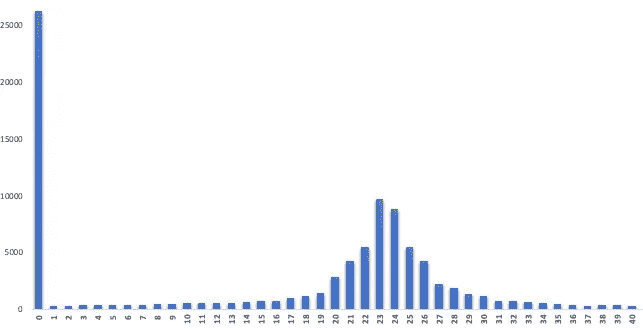
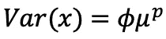
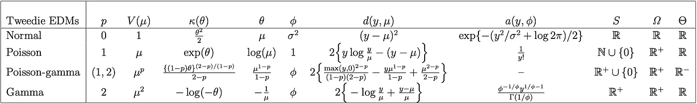
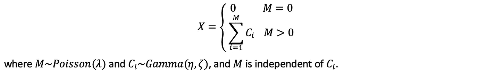
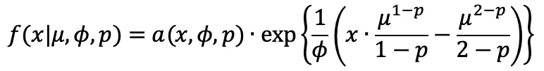
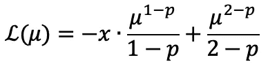
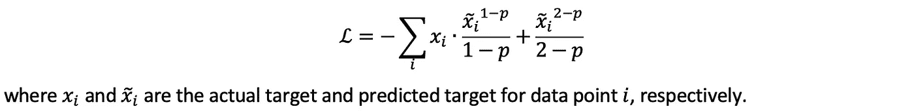

# 特威迪损失函数

> 原文：<https://towardsdatascience.com/tweedie-loss-function-for-right-skewed-data-2c5ca470678f?source=collection_archive---------17----------------------->


## 长尾右偏数据的损失函数

如今，观察具有右偏分布和长尾的数据并不罕见，例如，来自电子商务网站、广告点击&购买、保险索赔等的数据。



在这种情况下，如果使用其他分布的损失函数(例如，高斯分布的 MSE ),预测模型可能不会被很好地训练。在本文中，我们介绍了一种使用基于 Tweedie 的损失函数的方法，用于在这种长尾右偏数据上训练的模型。

# 特威迪分布

[Tweedie 分布](https://en.wikipedia.org/wiki/Tweedie_distribution)是带有幂参数 *p* 的指数离差模型(EDM)的特例，其分布均值和方差之间的幂关系如下



其中 *μ* 和 *ϕ* 分别是均值和离差参数。

功率参数 *p* 决定了族内分布的子类。例如， *p* =1 链接到泊松分布， *p* =3 链接到逆高斯分布，而本文的重点， *p∈* (1，2)链接到复合泊松-伽马分布。



特威迪分布族的普通成员。

假设是复合分布，随机变量 *X* ~ *Tw* ( *p，μ，ϕ* )可以刻画为



*x* 的概率密度函数(pdf)为



其中 *α* ( *x，ϕ，p* )是一个归一化常数，确保这是一个有效的 pdf。

# 作为损失函数的特威迪

为了将 Tweedie 分布转换为损失函数，我们需要通过模型训练来最大化样本数据的可能性。一种常见的方法是通过负对数似然



如果我们使用分布均值 *μ* 作为估计量(即预测)，那么损失函数变成



# 履行

给定预定义的功率参数 *p* (超参数)，Tweedie 损失函数可用于各种基于梯度的模型，如梯度提升树、神经网络等。下面给出了一个实现的例子。

```
import tensorflow as tf
def tweedie_loss_func(p):
    def tweedie_loglikelihood(y, y_hat):
        loss = - y * tf.pow(y_hat, 1 - p) / (1 - p) + \
               tf.pow(y_hat, 2 - p) / (2 - p)
        return tf.reduce_mean(loss)return tweedie_loglikelihood
```

## 参考

[鹤舟先生](https://arxiv.org/search/stat?searchtype=author&query=Zhou%2C+H)，[杨熠](https://arxiv.org/search/stat?searchtype=author&query=Yang%2C+Y)，[钱伟](https://arxiv.org/search/stat?searchtype=author&query=Qian%2C+W)。"对于极度不平衡的零膨胀数据的梯迪梯度提升."2019.

[阿里特拉·哈尔德](https://arxiv.org/search/stat?searchtype=author&query=Halder%2C+A)，[沙里克·穆罕默德](https://arxiv.org/search/stat?searchtype=author&query=Mohammed%2C+S)，[陈坤](https://arxiv.org/search/stat?searchtype=author&query=Chen%2C+K)，[迪帕克·戴伊](https://arxiv.org/search/stat?searchtype=author&query=Dey%2C+D)。" Tweedie 复合泊松双广义线性模型中的空间风险估计."2020.