# 用神经网络生成推文:LSTM 和 GPT-2

> 原文：<https://towardsdatascience.com/tweet-generation-with-neural-networks-lstm-and-gpt-2-e163bfd3fbd8?source=collection_archive---------15----------------------->

## 我们的递归神经网络能在多大程度上近似政治人物和艺人的推文？

*由* [*贾莱*](https://medium.com/@jmorris5)*[*娜塔莉娅*](https://medium.com/@nataliianevinchana) *和莎拉·塔姆**

**

*来源: [PhotoMIX-Company](https://pixabay.com/users/photomix-company-1546875/) ，via: [pixabay](https://pixabay.com/photos/twitter-screen-social-phone-1795652/)*

*witter 是数百万人就任何话题发表意见的地方，它也成为名人和他们的粉丝互动的地方。这启发我们探索递归神经网络的局限性，看看它们是否可以用于 Twitter 等社交网络的自动文本生成。作为我们人工神经网络和深度学习课程的最终项目，我们的目标是为 Twitter 上的 10 个受欢迎的帐户生成推文，使用 NLP 技术分析它们，并比较结果。此外，我们还考察了不同的网络，并评估了各种可能性。我们决定观察政治家和艺人，自己建立一个网络，并找到另一个预先训练好的网络来比较结果。*

# *数据收集*

*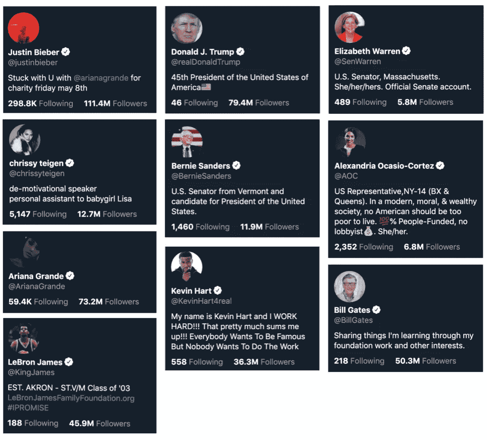*

*我们使用在 Github 上找到的这个库从 10 个公众人物的账户中挖掘推文。出于对群体差异及其对训练我们网络的影响的兴趣，我们选择了五位政治人物和五位艺人:*

***政治人物**:唐纳德·特朗普(@realDonaldTrump)，伯尼·桑德斯(@BernieSanders)。伊丽莎白·沃伦(@ewarren)、亚历山大·奥卡西奥-科尔特斯(@AOC)、比尔·盖茨(@比尔·盖茨)*

***艺人**:贾斯汀比伯(@justinbieber)、爱莉安娜·格兰德(@arianagrande)、凯文·哈特(@KevinHart4real)、勒布朗·詹姆斯(@KingJames)、克莉茜·泰根(@chrissyteigen)*

*对于每个公众人物，我们挖掘了他们最近的 10，000 条推文(请注意，对于少数人物，他们完整的推文历史总计不到 10，000 条，所以我们只是使用了可用的内容)。对于有额外推文的数字，我们收集了另外 1 万条来训练 LSTM 网络。*

***数据清理**:对于我们的训练数据，我们删除了任何只包含“pics.twitter”链接的帖子(在 twitter 上，这些链接显示为照片和视频)。我们还想分析我们的训练数据，并识别推文中的任何模式，这需要额外的清理。对于词频分析，我们删除了标点符号和停用词(由 nltk 库定义)。此外，我们用关键字“http”替换了剩余的链接，以跟踪它们的频率。*

# *通过 NLP 技术评估 Twitter 数据*

## *词频分析*

*在所有 10 个人中，“http”是使用频率最高的术语之一，这表明他们都相对频繁地在推文中发布链接。因为我们只使用关键字“http”作为链接频率的指标，所以在我们的可视化中没有考虑它。*

***政治人物:常用词***

*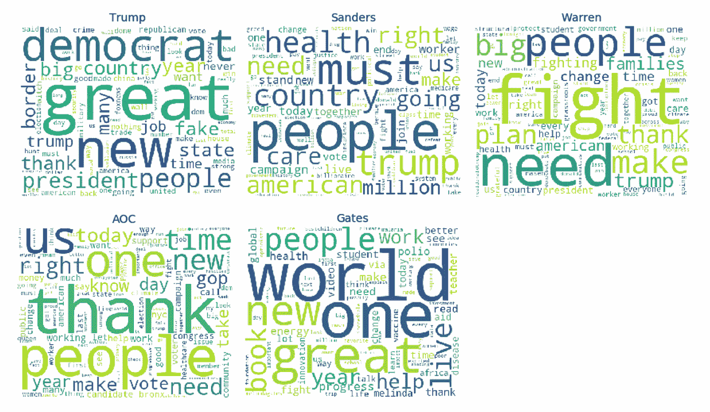*

*五位政治人物的前三名都是“人民”这些政治人物深入参与社会事务，并做出影响大多数人的决策。他们的工作围绕着人，所以“人”被他们所有人共同使用是有道理的。*

*十个最常用的单词象征着每个人的修辞和说话风格。例如，人们已经开始将某些词与特朗普的浮夸风格联系起来——“伟大”、“让美国再次伟大”、“大”和“许多”。列表中还有“假”和“新闻”——特朗普创造的另一个标志性术语。对桑德斯来说，“健康”+“护理”排在第五和第六位。对沃伦来说，“打架”和“打架”都在前十名。*

*有趣的是，特朗普第四大常用词是“民主党”，即反对党。这说明特朗普在推特上花了多少时间谈论两极化、党派问题。同样，桑德斯和沃伦的十大词汇中都有“特朗普”。*

*AOC 的前十个单词比前三个更通用。有趣的是，她第三个最常用的词是“谢谢”，这(我们接下来会看到)是艺人推特的典型特征——也许是因为她是迄今为止最年轻、最懂社交媒体的政治人物。虽然比尔·盖茨没有直接参与政治，但他也参与了塑造我们的社会和社区。他的人道主义观点体现在他的前十个词中，包括“世界”、“一”、“帮助”和“进步”。*

***艺人:常用词***

*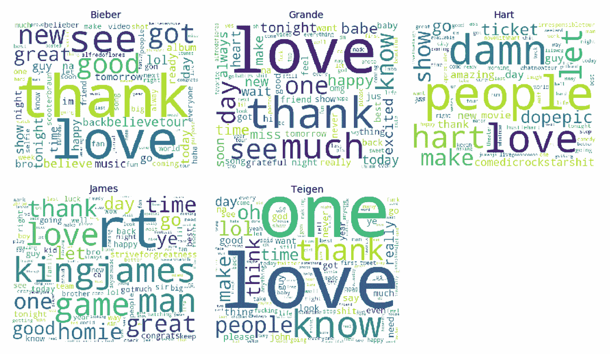*

*艺人使用社交媒体作为与粉丝互动的平台，他们大量使用“感谢”和“爱”这两个词就是明证。像政治人物一样，他们常用的术语体现了他们的个人风格和方言。哈特是最明显的例子，他创造了两个术语——“dope pic”(如#DopeEpic)和“comedicrockstarshit”——在用法上排名第六和第八。一般来说，艺人的词汇云提供的洞察力不如政治人物，因为他们经常使用 Twitter 进行宣传和简短的粉丝互动。然而，政治人物使用 Twitter 来传达关于他们的立场、政策、时事等更复杂的信息。*

***政治人物与艺人:平均推文长度***

*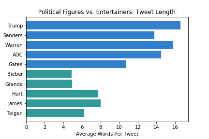*

*我们发现，平均而言，艺人的推文长度大约是政治人物推文长度的一半。我们可以看到政治人物的训练数据和艺人的训练数据之间的差异如何影响我们的网络生成的推文。随着训练的推文越来越长，我们的网络为政治人物生成的推文的质量和相似度也越来越高。*

## ****情绪分析****

*我们使用 VADER(用于情感推理的效价感知词典)工具对训练数据进行情感分析。我们采用复合得分——一种计算所有词汇评分总和的指标，这些词汇评分在-1(最极端的负面)和+1(最极端的正面)之间标准化——来比较各组的情绪。*

*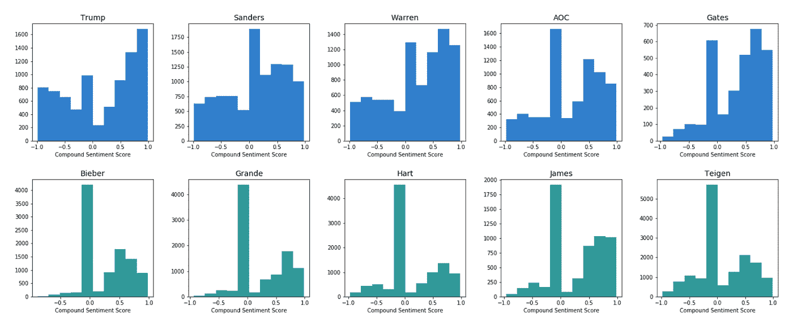*

*与政治人物相比，艺人的推文数量远高于 0.0(中性)。从柱状图来看，艺人有更多的轻尾分布。许多艺人使用社交媒体平台进行推广(中性)和粉丝互动(积极)——最明显的是比伯和格兰德。詹姆斯显示了大量积极情绪的推文，这可能与他的激励信息有关。Teigen 在所有艺人中有更多负面情绪的推文，这可能归因于她直言不讳的本性。*

*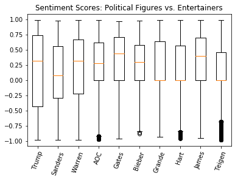*

*另一方面，政治人物箱线图的 IQR 通常比艺人的宽，即中间 50%的数据落在更大的范围内。对于政治人物来说，可能需要通过表达批评(消极情绪)或争取支持(积极情绪)来吸引公众。*

*川普拥有最大的 IQR，从-0.50 到 0.75。条形图表示在他的推文中显示了双峰分布情绪。情感模式证实了他对戏剧和表演的天赋；他倾向于强烈批评或高度赞扬。沃伦和盖茨拥有最偏右的分布，这证明了他们高度乐观和积极推动社会变革的声誉。*

# *为推文生成选择神经网络*

*我们希望创建我们自己的 LSTM 网络，此外还有一个最新的最先进的网络，以便比较结果并了解它们如何工作的特点。我们还考虑开发一个用于文本生成的 GAN 网络，因为我们试图生成看起来像特定用户的推文的推文，所以我们创建了一个鉴别器，并做了一个反向投影，帮助生成器生成更好的输出，看起来像我们的初始训练数据会产生更好的结果。以下是我们发现的每个网络(Transformer XL、CTRL 和 GPT-2)的利与弊的简要概述，以及我们最终选择 LSTM 和 GPT-2 的原因。*

## *LSTM*

*LSTM(长短期记忆)是一种递归神经网络(RNN)。我们选择创建一个 LSTM 模型来为 10 位政治家和艺人生成新的推文，因为这个特定的模型学习并掌握风格、语言和语法，因为 LSTM 能够检测和学习长期的依赖性。在学习输入文本的序列时，模型能够生成新的文本。*

*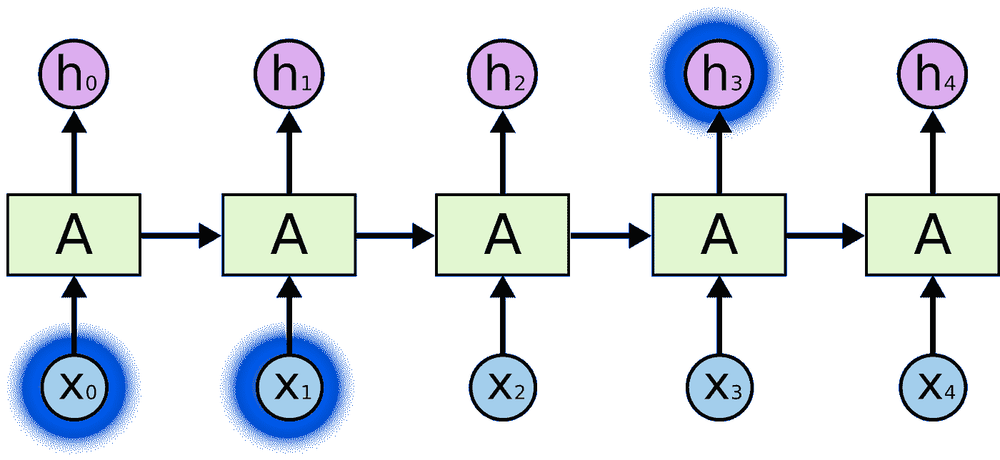*

*LSTMs 使用一种可以被描述为循环效应的学习过程，这意味着网络解释输入并产生输出。该输出及其信息随后被传递到网络中的下一个步骤。这是很重要的，因为它允许模型拾取文本中的模式，以便生成与所讨论的文本风格相似的更好的输出。*

## *变压器-XL*

*我们考虑实施 Transformer-XL 网络的主要原因是它的效率。与其他广泛传播的语言模型相比，Transformer-XL 不能捕获文本中的长期依赖关系，它能够识别单词级和字符级的上下文连接。它通过将变压器网络的概念与相对位置编码相结合来实现这一目标。传统的转换器能够捕获固定长度的片段的上下文。因此，上下文变得支离破碎。相对位置编码有助于 Transformer-XL(代表“超长”)在更长的段中捕获上下文，使模型在生成文本时更有效。*

*由于我们希望以特定艺人和政治家的风格生成推文，我们希望网络能够了解不同推文之间的依赖关系，而不仅仅是一个推文内部的依赖关系。然而，由于 Transformer-XL 是不久前开发的，即使它的代码是开源的，我们也无法找到足够的代码遍历来帮助我们实现该模型。关于该模型的更多信息可以在这些文章中找到: [Transformer-XL:释放注意力模型的潜力](https://ai.googleblog.com/2019/01/transformer-xl-unleashing-potential-of.html)作者谷歌人工智能是该模型的作者[Transformer-XL 的简单介绍— dair.ai](https://medium.com/dair-ai/a-light-introduction-to-transformer-xl-be5737feb13) 来自 Medium 上的一个博客。*

## *开始*

*当我们考虑使用 GAN 生成文本时，我们想到了相关讲座中提到的由 GAN 生成的图像示例。由于结果令人印象深刻，我们想知道尝试将相同的概念用于文本生成是否会很有趣。然而，随着我们开始做更多的研究，我们发现使用 GAN 进行文本生成是非常有问题的，因为如果我们使用 RNN 进行文本生成，我们将面临 backprop 的问题，因为 RNN“挑选”下一个单词的操作是不可微的。因为有办法解决这个问题，所以我们寻找了一些已经测试过的用于文本生成的 GANs 的例子。我们在 GitHub 上找到了几个例子，包括 [LeakGAN](https://github.com/CR-Gjx/LeakGAN) 和 [SeqGAN](https://github.com/LantaoYu/SeqGAN) ，但我们没有找到证据表明这些网络会比常规的 LSTM 网络或一些先进的网络如 GPT-2 或 CTRL 更好。在进一步阅读下，你可以看看我们发现的一些有趣的阅读，关于 gan 在文本生成中的表现。*

## *计算机的 Ctrl 按键(控制键)*

*CTRL 是 Salesforce 在 2019 年展示的大规模文本生成网络。它代表条件转换器语言模型。创建这个模型是为了让用户对生成的文本有更多的控制，这是其他大规模模型通常所缺乏的。这个模型是开源的，可以在 GitHub 上获得。在我们研究的所有模型中，CTRL 拥有最多由创建者提供的文档。然而，使用 CTRL 主要是为了从链接、文本等的提示中产生故事。因为我们的目标是创建推文，而不是故事，所以我们决定继续使用 GPT-2，尽管用用户资料的链接来测试 CTRL 会很有趣。这是关于 CTRL [CTRL:可控生成的条件转换器语言模型](https://arxiv.org/pdf/1909.05858.pdf)的原始文章，作者是 Nitish Shirish Keskar、Bryan McCann、Lav R. Varshney、Xiong、Salesforce Research 的 Richard Socher 和的 GitHub repo 并附有文档。*

## *GPT-2*

*GPT-2 是 Open AI 在 2019 年发布的最新文本生成网络。它基于 transformer 网络，并在来自互联网的 40GB 文本上进行训练。因为创作者担心使用这种模型产生假新闻的可能性，他们决定发布一个小得多的模型。这个模型生成的文本很容易被误认为是人类的，而且语法和拼写几乎完美无缺。在我们观察的所有模型中，这一个是研究人员采用最多的，因此有更多关于其使用的说明和解释。对于我们的文本生成，我们使用了 Max Woolf GPT-2 Simple 的模型，并使用了他各自的 Colab 笔记本来检查模型。第一次尝试的结果令人印象深刻，所以我们决定停止这一次，因为它有最佳的训练时间和最佳的结果质量。关于该模型的更多信息可以在 Open AI 的文章[更好的语言模型及其含义](https://openai.com/blog/better-language-models/)中找到。*

# *建立网络和发微博*

## *LSTM*

*为了使用 LSTM 网络生成推文，来自 CSV 的 10，000 条推文被转移到熊猫文件中。推文中存在差异，因此我们尽最大努力清理数据，同时不减少用于训练模型的数据量。正因为如此，我们决定尝试训练模型来学习链接。我们只删除了长度小于 60 个字符的推文。通过删除低于一定长度的推文，它会删除只有一个单词的推文以及 CSV 文件中的空推文。接下来，推文被分成等长的序列，放入一个叫做句子的列表中。这些句子将用作模型的训练示例。*

*矢量化是下一步。在这里，我们将推文平均分成 x 和 y 两部分。 *x* 是一个 3D 矩阵，具有句子总数、步长(40)和唯一字符数的形状。 *y* 是一个 2D 矩阵，它包含句子的总长度和唯一的字符，这个向量的目的是检索*x*给出的句子后面的下一个字符。现在，数据已经收集完毕，准备用于训练，是时候构建 LSTM 模型了。*

*在花了几天时间试图找到合适且高效的完美模型后，我们偶然发现了以下模型。特别是这个模型，在我们训练的 10 个不同的模型中表现最好。该模型与其他模型的不同之处在于，额外的神经元、激活函数、SELU 和常规批量标准化适合于所使用的训练数据的大小。*

*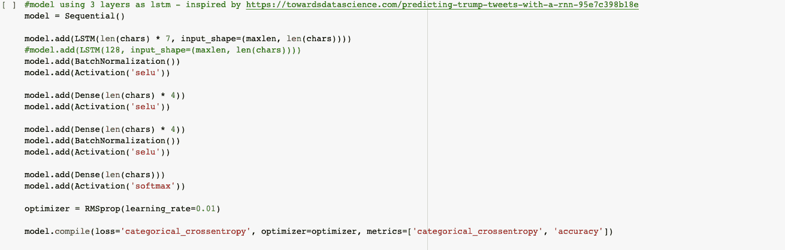*

*在模型的训练期间，每个历元花费大约 30 分钟，并且在 10 个历元之后，模型停止学习，每个数据集的损失大约为 1.5。在训练期间，模型基于概率分布输出下一个字符。这就是所谓的多样性。多样性是一个决定生成的句子有多随机的值。出于训练目的，我们将多样性设置为 0.2、0.5、0.7、1.0 和 1.2，以便直观显示哪种多样性生成了最有意义的推文。*

*最后一步是为用户生成新的推文。generate_tweets 函数接受一个随机种子，它是来自 tweet 列表的一个随机 tweet，以及一个集合多样性。我们选择了 0.7 的多样性，因为与其他相比，它表达了最容易理解的推文。在收到一个随机种子和一个多样性值后，该函数将种子长度减少到 40 个字符。这样做是因为使用一条已经公式化的推文来创建另一条推文是良性的，因为一旦一条新的推文生成，它将超过 twitter 上允许的最大字符长度。*

*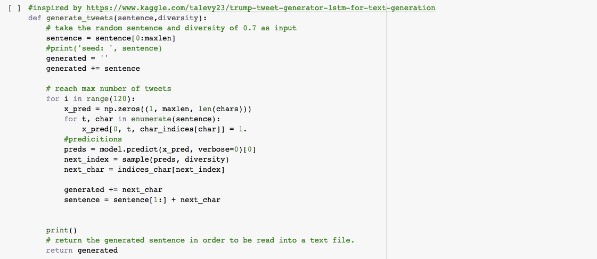**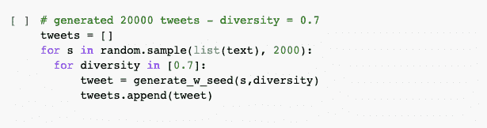*

*在将句子设置为随机种子的前 40 个字符后，我们创建了由*生成的*变量，该变量将存储生成的 tweet 的开头、随机种子的前 40 个字符以及由模型预测提供的 120 个其他生成的字符。生成 2000 条推文所需的时间从 45 分钟到 2 小时不等。下面，我为下面的四个人提供了 2000 条推文中的一条:*

*伯尼·桑德斯:*

> *2018 年你可能错过的好消息。感谢世界的承诺我们已经完成的事情考虑:【http://b-gat.es/2vwmyaw】pic.twitter.com/eyfhwch8gpngw*

*比尔·盖茨:*

> *老师们正在做着不可思议的工作来保持世界上最贫穷的:【http://b-gat.es/1u6yecf】T4pic.twitter.com/h4g6vdscdhoamgetpiwel108heepsang it:[http://b-gat.es/2dp](http://b-gat.es/2dp)*

*凯文·哈特:*

> *我有更多突发新闻抽搐！现在就去电影院吧！！！！# hustlehart # hustlehart #创造历史#喜剧明星…#想想电影中的阿曼斯顿*

*贾斯汀比伯:*

> *我的专辑出来了，但我大哥的@ jesicnolker @ showmybirthdi @ americcaem @ dankan ter 和@ its beliebers @ spendwer @ changel[https://twitter.com/smazurgop/status](https://twitter.com/smazurgop/status)也出来了*

## *结果*

*为了找到一个适合将准确率提高到 40%以上的模型，花了几天时间。就这个特定模型的准确性而言，政治家伯尼·桑德斯和比尔盖茨在他们的推文中分享了相同的推文风格和语法，用于训练该模型。这种一致性提供了 62%及更高的准确度结果。因为艺人经常发微博，而且他们的微博从一个话题到另一个话题，这影响了他们训练的准确性。这使得该模型能够为伯尼·桑德斯和比尔盖茨生成更好的推文。*

*总的来说，还有一些可以改进的地方。首先，我们可以从推文中排除链接，但问题是，因为所有被选中的人都使用大量链接来推广自己。这将导致数据集的大小大幅下降。但是，通过收集每个用户大约五万条推文，它会给模型更多的句子来训练和学习。然而，这将需要几周的时间来实现和产生每个人。*

# *GPT-2 简单*

*为了用 GPT-2 生成推文，我们使用了马克斯·伍尔夫的教程[如何用 GPT-2 制作定制的人工智能生成的文本](https://minimaxir.com/2019/09/howto-gpt2/)。至于推文生成的这一部分，我们使用了无法定制的网络，我们可以试验的主要内容是学习率和时代数量。当 eta 设置为 0.0001，epochs 的数量为 1000 时，生成的 tweets 的质量最好。我们还能够在 GPT-2 模型的尺寸版本之间进行选择——124 米、355 米和 774 米模型。我们决定运行最小的一个，因为我们需要在 1000 个时期内训练模型 10 次，然后生成 20000 条推文(每个用户 2000 条)，所以时间是我们关心的问题。我们使用 Google Colab notebook 来运行代码，以使用 Google 的 GPU 并使其更快，但即使是最小的模型也需要大约 1 小时来为每个用户进行训练，大约 20 分钟来产生推文。由于 Google Colab 会频繁断开运行时，我们决定不冒险运行较重的模型，所以我们可以在截止日期前生成推文。即使使用最小的模型，推文的质量也令人印象深刻。*

*我们注意到艺人和政客之间的推文质量有很大差异。总的来说，政治家的推文要长得多，有更多的内容，因此，对于网络来说，学习起来容易得多，因为当提供 10000 条推文时，它会得到更多的单词。与此同时，艺人们会有很多宣传片和短信，它们并不是很独特，比如“爱你”等。因此，当网络处理艺人的推文时，结果质量较低，包含更多只有空格的空推文。当我们标准化推文的长度时，我们用空格增加了它们，所以推文越短，空格占书面文本的比例就越高。*

*GPT-2 的制造商还提到，网络的一个缺点是重复。我们看到，在每个用户的大量推文中，网络会停在某个词上，并生成 10 次或更多次。这样的推文的一个例子是为贾斯汀比伯生成的:“XXL 回来了。你知道该怎么做。@ scooter Braun @ scrappy @ luda cris @ luda cris @ luda cris @ luda cris @ luda cris @ luda cris @ luda cris @ luda cris @ luda cris @ luda cris @ luda cris @ luda cris @ luda cris”。*

*我们看到的重复的另一个问题是，当网络生成同一条推文的几个变体，只是改变时间，链接的结尾，结尾的几个词，等等。例如，网络为盖茨生成的推文改变了“更新”时间:*

> *更新，上午 19:45:这篇文章已经更新，澄清我最近得到的脊髓灰质炎疫苗不是“脊髓灰质炎疫苗”确实是。*
> 
> *更新，2:58:这篇文章已经更新，澄清我最近得到的脊髓灰质炎疫苗不是“脊髓灰质炎疫苗”确实是。*
> 
> *更新，凌晨 3:58:这篇文章已经更新，澄清我最近得到的脊髓灰质炎疫苗不是“脊髓灰质炎疫苗”确实是。*
> 
> *更新，凌晨 4:55:这篇文章已经更新，澄清我最近得到的脊髓灰质炎疫苗不是“脊髓灰质炎疫苗”确实是。*
> 
> *更新，上午 5:45:这篇文章已经更新，澄清我最近得到的脊髓灰质炎疫苗不是“脊髓灰质炎疫苗”确实是。*
> 
> *更新，上午 6:30:这篇文章已经更新，澄清我最近得到的脊髓灰质炎疫苗不是“脊髓灰质炎疫苗”确实是。*
> 
> *更新，上午 7:45:这篇文章已经更新，澄清我最近得到的脊髓灰质炎疫苗不是“脊髓灰质炎疫苗”确实是。*

*另一个例子是链接结尾的 10 种变化:*

> *这个世界比以往任何时候都好，但我很惊讶很少有人知道这一点。https://b-gat.es/2BZcNFk*
> 
> *这个世界比以往任何时候都好，但我很惊讶很少有人知道这一点。https://b-gat.es/2E3zEMw*
> 
> *这个世界比以往任何时候都好，但我很惊讶很少有人知道这一点。https://b-gat.es/2EJzX1V*
> 
> *这个世界比以往任何时候都好，但我很惊讶很少有人知道这一点。https://b-gat.es/2Ft7tBS*
> 
> *这个世界比以往任何时候都好，但我很惊讶很少有人知道这一点*
> 
> *这个世界比以往任何时候都好，但我很惊讶很少有人知道这一点。https://b-gat.es/2HfkiQi*
> 
> *这个世界比以往任何时候都更好，但我很惊讶很少有人知道这一点。https://b-gat.es/2I0xWEWT*
> 
> *这个世界比以往任何时候都好，但我很惊讶很少有人知道这一点。https://b-gat.es/2I4m0JT*
> 
> *这个世界比以往任何时候都更好，但我很惊讶很少有人知道这一点。https://b-gat.es/2I9cVMr*
> 
> *这个世界比以往任何时候都更好，但我很惊讶很少有人知道这一点。[https://b-gat.es/2JsNJoh](https://b-gat.es/2JsNJoh)*

*还有，当推文被拉出来的时候，一些像撇号这样的符号还没有读好，所以在生成的推文中，我们可以看到一些奇怪的符号或者符号的组合，而不是撇号，在句子的结尾等等。下面是一些用 those:"iрір‚в„ўm”代替“我是”、“iвђ™m”、“рвђрёр‡рёпїѕ”等的例子。*

*GPT-2 文本生成的积极方面是，该网络能够抓住所有用户谈论的主要话题，包括他们的签名标签、他们共享链接的网站、他们从事的项目和个人谈话风格。例如，对于特朗普的虚假推文，该网络发现特朗普经常从福克斯新闻频道转发，而亚历山德拉·奥卡西奥-科尔特斯生成的推文来自《纽约时报》。比伯生成的推文中有很多关于新歌和专辑的公告，而桑德斯的推文中有很多关于全民医疗保健的内容。盖茨在推特上发表了很多关于经济发展、抗击小儿麻痹症、疟疾等文章的评论，还提到了梅林达·盖茨的书和评论。*

*以下是我们制作的一些最佳推文:*

## *款待者*

*贾斯汀比伯:*

> *你可以发送短信 SUMMER 至 22837 预订#AsLongAsYouLoveMe，当我们推出独家原声专辑时，应用程序会通知你。#AsLongAsYouLoveMe 和#LoveYourself 将出现在 ITUNES 上，也将进入我们的前十名。#BIEBERBLAST*

*爱莉安娜·格兰德:*

> *今晚是#危险女人之旅的最后一晚，我们很荣幸能在巴克莱中心表演。非常感谢你们今晚所有的爱、能量、兴奋和爱。[https://www.instagram.com/p/BRiT3YZrH6R/](https://www.instagram.com/p/BRiT3YZrH6R/)*

*凯文·哈特:*

> *我刚刚在我的“不负责任的旅行”中增加了另一个节目…我等不及让你们看这部电影了！！！[https://Twitter . com/originalcinema/status/924093577757350208](https://twitter.com/originalcinema/status/924093577757350208)*

*勒布朗·詹姆斯:*

> *NBA 季后赛终于来了！我很期待今晚的比赛，我也会期待下一场比赛。*

*克莉茜·泰根:*

> *《向前看》全文明天出！在我的简历中预订！！#渴望系列#克里斯·库#克里斯·库#克里斯·布利斯·pic.twitter.com/aI1oIOyCEI*

## *政治家*

*亚历山德拉·奥卡西奥·科尔特斯:*

> *14 年来，国会和共和党一直致力于解散患者保护与平价医疗法案。他们不能在不废除法律的情况下废除 ACA，这意味着将保险市场减半。我们需要用更多的东西来代替 ACA。*

*比尔·盖茨:*

> *许多人认为非洲是一个饥饿的大陆。它实际上是世界上最大的经济体之一。这里有 5 个惊人的统计数据:【http://b-gat.es/1o5YKV7】pic.twitter.com/wZ8EFmYJFl*

*伯尼·桑德斯:*

> *几周前，特朗普总统签署了一项行政命令，削减对某些项目和活动的资金，包括计划生育。特朗普的行动必须结束并立即停止对计划生育的所有资助和乳腺癌筛查的所有供应。[https://Twitter . com/realDonaldTrump/status/11668362477942539](https://twitter.com/realDonaldTrump/status/11668362477942539)*

*唐纳德·特朗普:*

> *你认为管理我们国家和经济的人会允许这个荒谬的弹劾骗局继续下去吗？我们的经济是有史以来最好的，民主党正在追杀你们！*

*伊丽莎白·沃伦:*

> *一年前的今天，奥巴马总统签署了一项行政命令，强制关闭私人监狱。今天，在我写这篇文章的时候，46 个州已经实施了他们自己版本的计划，国会也签署了，这要感谢@KamalaHarris 和@ AyannaPressley。*

## *结果*

*总的来说，GPT-2 Simple 在为我们选择的用户生成推文方面做得很好。文本是相同的风格，相同的主题，包括每个用户特有的细节。我们还看到，结果高度依赖于输入数据的质量。对于几乎所有艺人来说，与政客相比，网络产生的推文质量要低得多，重复和空洞的推文也多得多。对于政治家来说，由于网络有更多的数据可以处理，因此产生的推文有意义，错误少得多，并且对每个用户来说更容易识别。总而言之，GTP-2 是一个用相对少的数据快速生成高质量文本的好方法。对于那些一开始我们无法获得所有 10000 条推文的用户，即使有 5000 条推文，结果也令人印象深刻。根据我们使用的 Max Woolf 的教程，几乎任何人都可以使用这个模型快速生成高质量的文本。*

# *比较实际的推文和生成的推文*

*LSTM 只为四位公众人物(比伯、哈特、盖茨和桑德斯)发布了推文，而 GPT 2 号为所有十位公众人物发布了推文。因此，我们首先对所有十个人的 GPT-2 与训练数据进行了分析，然后我们将两个网络与训练数据进行了比较。*

## *GPT-2 与实际推文*

*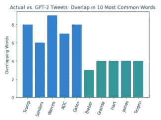*

*政治人物生成的推文的十个最常见的词与训练数据中的 6-8 个匹配，而艺人的匹配数量是一半(3-4 个)。*

*对于大多数公众人物来说，GPT-2 网络产生的推文的链接频率类似于训练数据的链接频率。在新 GPT 协议生成的 twitter 数据中，“http”是 10 个最常见的术语之一。我们可以通过比较爱莉安娜·格兰德常用词的分布来观察链接用法的差异:*

*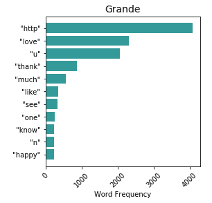*

*比较艺人的实际推文和生成的推文的词云，我们可以看到网络仍然生成与个人的一般语气相匹配的词。作为一个例子，这里有一个爱莉安娜·格兰德的词云的对比:*

*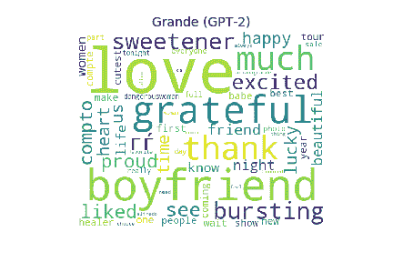*

*我们还绘制了训练数据和 GPT-2 并排生成的推文的推文长度和情绪。有趣的是，GPT-2 网络持续生成的推文长度是它被训练的推文长度的一半，甚至更少。此外，他们的情感得分远比训练数据更加中立。我们可以从每个人的情绪得分的轻尾分布中看到，生成的推文中的情绪变化要小得多，我们将在下一节回到这一点。*

*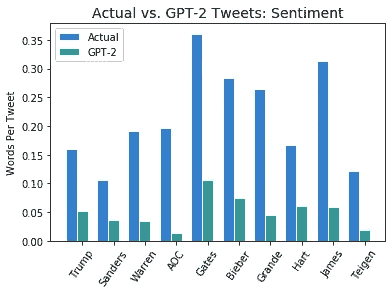**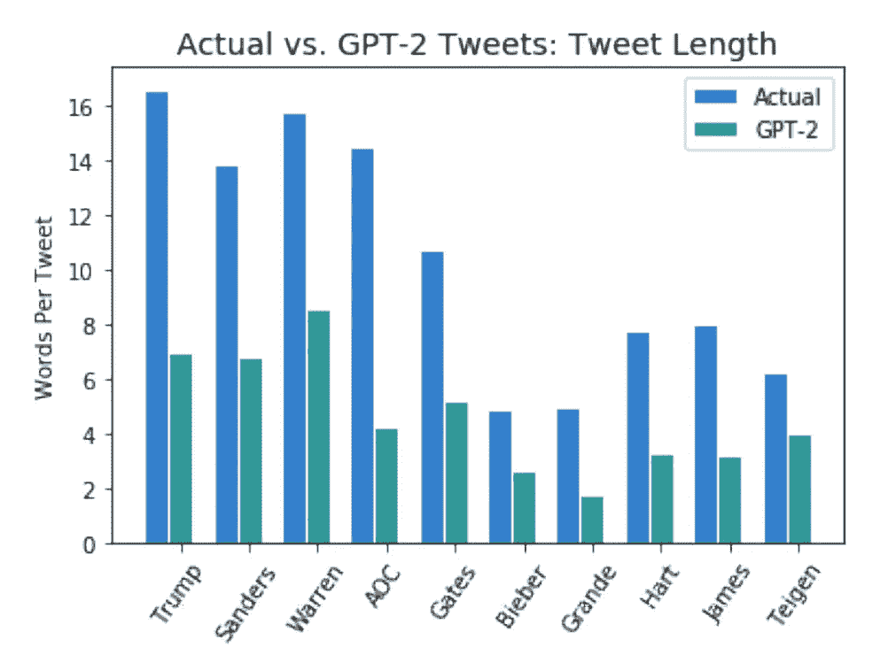*

## *比较 LSTM 和 GPT-2 生成的推文*

*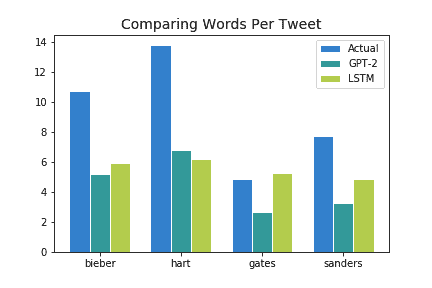*

*当谈到推文长度时，LSTM 网络的表现类似于 GPT-2 网络。一个例外是沃伦，LSTM 网络实际上平均生成了略长的推文。*

*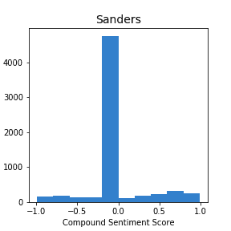**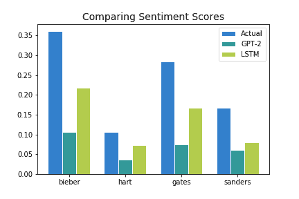*

*与 GPT-2 网络相比，LSTM 产生了更积极的情绪得分，更接近实际的推特数据。然而，正如我们在桑德斯身上看到的那样，生成的推文和实际推文之间的情感分布仍有明显差异。对于两个网络，生成推文的分布都是非常轻尾的，分数都集中在 0.0 左右(中性)。显然，网络可以令人信服地模仿推文风格，但要获得正确的情感需要更多的细微差别。更短的推文长度和生成的推文中更多的链接的组合可能有助于更高的中性情绪。*

# *结论*

*总的来说，我们在这个项目中学到了很多。我们的两个网络都为政治家生成了质量更好、相似度更高的推文。这可能归因于这两个群体在推特上的不同方式。政治家倾向于发布更长、更复杂的信息来反映他们的平台，而大多数艺人使用 Twitter 来发布宣传片并与粉丝互动。*

*关于我们的网络，我们的主要结论是，GPT-2 简单是更容易和更快地使用比 LSTM 网络。它产生了相当不错的推文，看起来很像真的。作为这个项目的延伸，将我们使用的模型的结果与更大版本的 GPT-2 进行比较将会很有趣。此外，我们观察到生成文本的质量与训练网络的数据质量直接相关。因此，如果你想产生更好的结果，花更多的时间清理和调整你的数据。*

*从我们的网络和生成的推文中，我们看到了 OpenAI 对发布完全训练有素的网络的担忧的证据——如果创建看起来几乎与真实政治家的推文完全一样的推文那么容易，那么滥用这种模型生成假新闻的威胁就令人担忧。然而，我们注意到，我们的网络在模仿政治人物和艺人的推特上的各种情绪方面甚至都不接近。也许这些网络还没有发现人类说话的模式。*

# *参考*

* [## Transformer-XL:释放注意力模型的潜力

### 为了正确理解一篇文章，有时需要参考几千年前出现的一个词或一个句子…

ai.googleblog.com](https://ai.googleblog.com/2019/01/transformer-xl-unleashing-potential-of.html)  [## Transformer-XL 简介

### 一种支持长期依赖的注意力语言建模新技术概述。

medium.com](https://medium.com/dair-ai/a-light-introduction-to-transformer-xl-be5737feb13)  [## CTRL:用于可控生成的条件转换器语言模型

### 大规模语言模型显示了有前途的文本生成能力，但是用户不能容易地控制特定的…

arxiv.org](https://arxiv.org/abs/1909.05858)  [## 销售力量/控制

### 作者:Nitish Shirish Keskar，Bryan McCann，Lav Varshney，Xiong，和 Richard Socher

github.com](https://github.com/salesforce/ctrl#generations)  [## 更好的语言模型及其含义

### 我们已经训练了一个大规模的无监督语言模型，它可以生成连贯的文本段落，实现…

openai.com\](https://openai.com/blog/better-language-models/)  [## Twitter 数据挖掘:挖掘没有 API 键的 Twitter 数据。

### 使用一行命令获取旧的 Twitter 大数据进行分析。

medium.com](https://medium.com/@IrekponorVictor/twitter-data-mining-mining-twitter-data-without-api-keys-a2a2bd3f11c) 

# 进一步阅读

 [## [PDF]评估文本生成的生成模型|语义学者

### 由于语义的模糊性和长文本建模的困难，生成高质量的文本是一个具有挑战性的问题

www.semanticscholar.org](https://www.semanticscholar.org/paper/Evaluating-Generative-Models-for-Text-Generation-Kawthekar/0a4e66bd2ba65a53b11684250f2adc76eb768222)  [## 使用知识蒸馏和生成对抗网络的文本生成…

### 文本生成在许多自然语言处理应用中有着特殊的意义，如机器翻译、语言建模和语义分析等

www.semanticscholar.org](https://www.semanticscholar.org/paper/TextKD-GAN%3A-Text-Generation-Using-Knowledge-and-Haidar-Rezagholizadeh/abcbfa04b14ee6cc76afe8c5e504daf815d14fa2)  [## 文本生成的生成性对抗网络——第一部分

### 用于文本生成的 GANs 的问题以及解决这些问题的方法

becominghuman.ai](https://becominghuman.ai/generative-adversarial-networks-for-text-generation-part-1-2b886c8cab10)  [## 文本生成的生成性对抗网络第 2 部分:RL

### 使用强化学习解决文本中的不可微性问题。

becominghuman.ai](https://becominghuman.ai/generative-adversarial-networks-for-text-generation-part-2-rl-1bc18a2b8c60)*