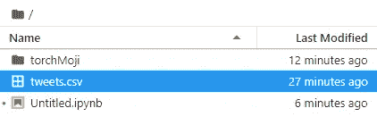
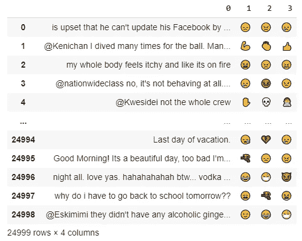

# 推文，使用 Q 块的表情符号情感分析

> 原文：<https://towardsdatascience.com/tweets-emoji-sentiment-analysis-using-q-blocks-495e24d7e1c0?source=collection_archive---------35----------------------->

## 自然语言处理

## 我第一次尝试租 GPU 加速软件。在我的回购中可获得全部代码。

在下面的文章中，我将租用 [Q Blocks](https://www.qblocks.cloud/) GPU 来运行一个计算要求苛刻的 AI 模型。我将运行一个名为 [DeepMoji](https://deepmoji.mit.edu/) 的深度学习模型，给定一个句子，该模型将估计出可以描述该句子的前 n 种情绪(单击非链接进行尝试)。我将租用 GPU 的平台仍然处于早期访问阶段，所以你可以在购买之前试用它(这个平台为你提供 20 小时的免费 GPU，一个很好的开始)，看看你是否适应它。


# 租 Q 块 GPU

为了进行这个实验，我想从替代提供商而不是亚马逊 AWS 租赁 GPU，我被告知这很贵。，只有在运行巨大的模型时才变得方便。

到目前为止，我发现一个很好的提议尝试 Q 块 GPU。GPU 不是用使用量买的，是用时间买的。这项服务每小时只需 0.05 美元。是一个非常合理的价格，你将基本上支付相同的 CPU 成本的 GPU。Q Blocks 使用的分布式计算技术允许该提供商在不降低质量的情况下保持低价。

## 买 GPU 有必要吗？

如果你是初学者，肯定不是。常见的在线编译器，如 Google Colab 或 Kaggle，提供了免费(但不强大)的计算能力。如果您像每个初学者一样处理小数据集，它不需要很高的计算能力，您可以使用免费版本。

相反，如果你需要调整你的模型(就像每个专业人士需要的那样)，你将不得不在电脑前等待无数个小时，等待可能会让你失望的结果。建立更具挑战性的模型的前一步是增加你的计算能力。

例如，在不使用 GPU 的情况下运行这个算法将需要我几个小时才能完成。我的实验在于更快地完成这个项目。

## 如何高效使用 QBlocks:不浪费 GPU！

我将使用此服务的截图来简化事情。然而，我假设每个供应商都根据你的需求提供不同的服务。因为我不需要过多的计算能力，所以我可以每小时使用 100 个块，相当于每小时 0.10 美元。


如果这是你第一次租用 GPU，你可能会感到沮丧。当你启动模型时，它将开始消耗。因此，至关重要的是，你知道你在做什么，你不要在服务提供的笔记本上做实验。如果有错误，你需要在付费的工作簿中调试你的代码，你的时间将会是昂贵的。当你意识到调试时间花费了你多少钱时，你可能会转向另一家 GPU 提供商。

* * *确保您在另一个工作簿中有一个工作模型的副本。您可以简单地导入并运行该副本，而不会浪费宝贵的时间。

Q Blocks 与在线 Jupyter 笔记本有关联。例如，如果你在 Google Colab 中开始你的模型，可能会有一些问题。访问文件或下载库的语法略有不同，当您的笔记本正在运行时，您可能会浪费时间在网上搜索解决方案。因为我在制作这个模型时遇到了类似的问题，所以我将详细说明如何克服解决方案。

因此，在免费 Jupyter 工作簿中编写您的模型之前，如果它可以工作，那么在您使用的平台上导入该模型(在我的例子中是 Q 块)以节省时间。

提供商可能会启动一个加载了 GPU 的空笔记本。我们可以开始编码了…

# 导入数据集

您要做的第一件事是导入您可以访问的数据集。每个笔记本都有一个上传文档的部分，我稍后会创建一个到那个文档的连接，用熊猫导入它。



# 火炬装置

很可能，在尝试这个实验时，最困难的事情是安装 torchMoji。我将把这个装置分成两部分。首先，我将安装运行 torchMoji 所需的库:

```
!pip3 install torch==1.0.1 -f [https://download.pytorch.org/whl/cpu/stable](https://download.pytorch.org/whl/cpu/stable) 
!git clone [https://github.com/huggingface/torchMoji](https://github.com/huggingface/torchMoji)
import os
os.chdir('torchMoji')
!pip3 install -e .
#if you restart the package, the notebook risks to crash on a loop
#if you managed to be curious and to make it stuck, just clic on RunTime, Factory Reset Runtime
#I did not restart and worked fine#se questo funziona, poi crasha in future linee di codice, anche se chiudiamo e riapriamo dovrebbe essere a posto per 12 ore
```

第二步，我将下载并安装权重，这将允许神经网络基于任何文本选择表情符号。

* * *非常小心，Jupyter Notebook 中有一个错误(我不知道我是否可以将其归类为错误),它阻止您输入是或否之类的答案。要解决此问题并防止您的 GPU 在循环中迭代，从而消耗您的可用处理能力，请使用以下代码行解决 Jupyter Notebook 中的问题。

```
#!python3 scripts/download_weights.py
! yes | python3 scripts/download_weights.py
```

在传统的笔记本中，你应该被允许在选项**是和否**之间进行选择。然而，Jupyter Notebook 没有为您提供任何输入选择的可能性。我使用上面的代码绕过了它，并立即声明了 **yes** 选择。

## 定义转换函数

我现在将创建一个函数，作为输入，它将接受一个文本字符串，并根据我们想要提取的情绪数量，输出相应的表情符号。

```
#si connette a DeepMoji per una request, non posso modificare i parametri, credo
!python3 examples/text_emojize.py --text f" {Stay safe from the virus} "!pip3 install --upgrade numpy!pip install numpy==1.18
!pip install scipy==1.1.0
!pip install scikit-learn==0.21.3import numpy as np
import emoji, json
from torchmoji.global_variables import PRETRAINED_PATH, VOCAB_PATH
from torchmoji.sentence_tokenizer import SentenceTokenizer
from torchmoji.model_def import torchmoji_emojis

EMOJIS = ":joy: :unamused: :weary: :sob: :heart_eyes: :pensive: :ok_hand: :blush: :heart: :smirk: :grin: :notes: :flushed: :100: :sleeping: :relieved: :relaxed: :raised_hands: :two_hearts: :expressionless: :sweat_smile: :pray: :confused: :kissing_heart: :heartbeat: :neutral_face: :information_desk_person: :disappointed: :see_no_evil: :tired_face: :v: :sunglasses: :rage: :thumbsup: :cry: :sleepy: :yum: :triumph: :hand: :mask: :clap: :eyes: :gun: :persevere: :smiling_imp: :sweat: :broken_heart: :yellow_heart: :musical_note: :speak_no_evil: :wink: :skull: :confounded: :smile: :stuck_out_tongue_winking_eye: :angry: :no_good: :muscle: :facepunch: :purple_heart: :sparkling_heart: :blue_heart: :grimacing: :sparkles:".split(' ')
model = torchmoji_emojis(PRETRAINED_PATH)
with open(VOCAB_PATH, 'r') as f:
  vocabulary = json.load(f)
st = SentenceTokenizer(vocabulary, 30)def deepmojify(sentence, top_n=5, return_emoji=True, return_prob=False):
  #converte lista probabilità in emoticon più probabili
  def top_elements(array, k):
    ind = np.argpartition(array, -k)[-k:]
    return ind[np.argsort(array[ind])][::-1]tokenized, _, _ = st.tokenize_sentences([sentence])
  #print(tokenized)
  #lista di probabilità
  prob = model(tokenized)[0]
  #se ci sono errori parte da qui: too many values to unpack (expected 2), non riesce a trovare prob
  #trova le n emoticono più alte 
  emoji_ids = top_elements(prob, top_n)#converte questi numeri in emoticons
  emojis = map(lambda x: EMOJIS[x], emoji_ids)

  if return_emoji == False and return_prob == False:
    return None
  elif return_emoji == True and return_prob == False:
    return emoji.emojize(f"{sentence} {' '.join(emojis)}", use_aliases=True)
  elif return_emoji == True and return_prob == True:
    return emoji.emojize(f"{sentence} {' '.join(emojis)}", use_aliases=True), prob
  elif return_emoji == False and return_prob == True:
    return prob
deepmojify('ciao, come stai?', top_n=3, return_emoji=True, return_prob=False)
```

输入字符串的输出如下:

```
'ciao, come stai? 💓 💛 ❤'
```

## 定义我们的主要功能

我现在将创建一个函数，将一个列表转换为一个数据集，其估计的表情符号位于不同的列中。正如你在上面的字符串中看到的，这个函数将表情符号和输入字符串连接在一起，我将把它们分开，分别放在数据集的不同列中。

```
def emoji_dataset(list1, n_emoji=3, only_prob=False):
  emoji_list = [[x] for x in list1]for _ in range(len(list1)):
    for n_emo in range(1, n_emoji+1):
      print(_)
      if only_prob == False:
        emoji_list[_].append(deepmojify(list1[_], top_n=n_emoji, return_emoji=True, return_prob=False)[2*-n_emo+1])
      else:
        emoji_list[_].append(deepmojify(list1[_], top_n=1, return_emoji=False, return_prob=True))emoji_list = pd.DataFrame(emoji_list)
  return emoji_listdf_ = emoji_dataset(list1, 3)
df_
```

## 下载数据集

现在我已经准备好了，我可以运行整个项目了。我会下载数据集，快速预处理，然后启动算法。

```
import pandas as pd
X = pd.read_csv(open('tweets.csv'))
```

如果你还没有注意到，我正在使用 **read_csv** 里面的函数 **open** 。如果没有这个函数，代码将返回一个错误。这种行为是朱庇特笔记本所特有的。

```
X.pop('Unnamed: 0')
X = pd.DataFrame(X)
X.columns = ['tweets']
Xdf = X.copy()
df
```

作为最后一步，我将把 25000 条推文的列表变成一个列表。我可以使用这个列表作为主函数的输入。

```
list1 = df['tweets'].to_list()
```

我终于可以开始模型了。因此，我将拥有 25000 条带有相应情绪的推文列表。

```
list1 = list1[0:25000]
df_.to_csv('25k_emotions.csv')
df_
```



输出的示例

当您的模型设置好后，不要忘记删除笔记本以保存您剩余的学分。

## 结论

该模型的执行速度相对较快。与 GPU 相比，免费的云编译器可以达到快 10 倍的速度。在 Google Colab 上运行这个算法需要 1 个多小时，相比之下，我使用 Q 块大约需要 10 分钟才能达到相同的结果。如果你打算租用更强大的 GPU，根据你的需求，这个数字只会增加。

云计算很快将成为新的规范。有了区块链和像素流技术等革命性创新，人们将不再需要购买 GPU 硬件。像 Q Blocks 这样使用对等计算的提供商，通过使计算能力更容易获得，加速创新，做出了贡献。