# 二十五个 SQL 练习题

> 原文：<https://towardsdatascience.com/twenty-five-sql-practice-exercises-5fc791e24082?source=collection_archive---------1----------------------->

## 这些问题和示例解决方案将保持你的技能敏锐。


图片来源: [Unsplash](https://unsplash.com/photos/atSaEOeE8Nk)

# 介绍

结构化查询语言(SQL)用于检索和操作存储在关系数据库中的数据。精通 SQL 是许多技术工作的重要先决条件，需要一些实践。

为了补充网上可用的 SQL 培训资源([pg exercise](https://pgexercises.com/)、 [LeetCode](https://leetcode.com/problemset/database/) 、 [HackerRank](https://www.hackerrank.com/domains/sql) 、 [Mode](https://mode.com/sql-tutorial/introduction-to-sql) )，我整理了一个我最喜欢的问题列表，您可以手动解决这些问题，也可以用 PostgreSQL 实例来解决。

这些问题涵盖以下关键概念:

*   **基本检索**(选择，从)
*   **创建和别名**(使用，AS，GENERATE_SERIES)
*   **过滤** (DISTINCT，WHERE，HAVING，AND，OR，IN，NOT IN)
*   **聚合**(分组依据，计数、总和、平均值)
*   **连接**(内连接、左连接、一个或多个等式上的全外连接、交叉连接、联合和联合所有)
*   **条件语句****(CASE-WHEN-THEN-ELSE-END)**
*   ****窗口函数** (RANK，DENSE_RANK，ROW_NUMBER，SUM with PARTITION BY - ORDER BY)**
*   ****格式化**(限制、排序、整型、浮点型或日期型、串联、合并)**
*   ****算术** **运算和比较** (+，-，*，/，//，^，<，>，=，！=)**
*   ****日期时间操作**(提取(月/日/年))**

## **你自己试试**

**你可以下载 [PostgreSQL](https://postgresapp.com/) 和 [PSequel](http://www.psequel.com/) (参见[本教程](https://www.youtube.com/watch?v=xaWlS9HtWYw)的分步安装指南)，然后运行下面文本中灰色框中显示的查询，自己尝试一下。PSequel 只适用于 Mac——如果你用的是 PC，你可以试试这些 Windows 替代品中的一个。**

**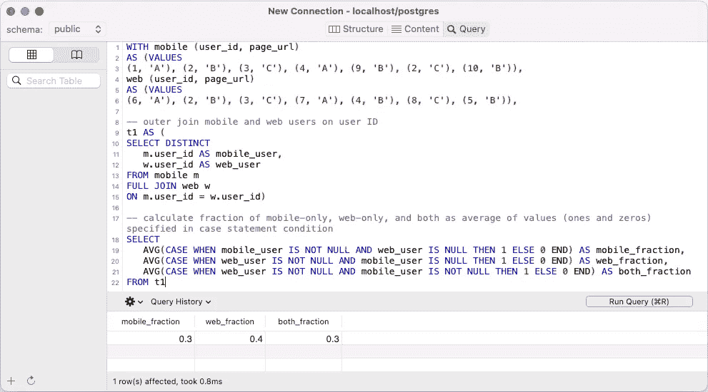**

**使用 [PSequel](http://www.psequel.com/) 和下面提供的输入表自己尝试这些查询。**

**下面显示的每个查询中的第一个文本块建立输入表，并遵循以下格式:**

```
WITH input_table (column_1, column_2) 
AS (VALUES 
(1, 'A'), (2, 'B'))
```

**您可以使用 PSequel(如上所示)查询输入表，并使用该模板为您自己的问题轻松构建新表。**

**基于 Web 的 SQL 培训资源在几个方面存在不足。例如，LeetCode 不支持使用窗口功能，并将其最有趣的问题隐藏在付费墙之后。此外，在浏览器中运行 SQL 查询可能会非常慢，因为数据集很大，对于非高级用户来说，检索速度通常会受到限制。另一方面，本地执行查询是即时的，并允许通过语法错误和中间表进行快速迭代。我发现这是一次更令人满意的学习经历。**

**下面列出的问题包括证实在 PostgreSQL 中有效的示例解决方案。请记住，通常有多种方法可以获得 SQL 问题的正确答案。我更喜欢使用公共表表达式([cte](https://www.sqlservertutorial.net/sql-server-basics/sql-server-cte/))而不是嵌套子查询——cte 可以更线性地说明数据争论的顺序。然而，这两种方法可以产生相同的解决方案。我也喜欢遵循将 SQL 操作符全部大写的[惯例](https://www.sqlstyle.guide/)(SELECT、FROM、WHERE 等。)，小写的列名(user_id，date 等。)，以及简单的表别名(t1，t2 等。)可能的话。**

**下面显示的代码片段可以按原样在 PSequel 中运行，以产生显示的结果。注意 Postgres 的一个怪癖:分数必须乘以 1.0 才能从整数转换成浮点格式。这在 SQL 的其他实现中是不需要的，在访谈中也是不期望的。**

**欢迎在评论中留下你的备选答案！**

# **问题**

## **1.取消率**

**根据下表中的用户 id、操作和日期，编写一个查询来返回每个用户的发布率和取消率。**

****

```
WITH users (user_id, action, date) 
AS (VALUES 
(1,'start', CAST('01-01-20' AS date)), 
(1,'cancel', CAST('01-02-20' AS date)), 
(2,'start', CAST('01-03-20' AS date)), 
(2,'publish', CAST('01-04-20' AS date)), 
(3,'start', CAST('01-05-20' AS date)), 
(3,'cancel', CAST('01-06-20' AS date)), 
(1,'start', CAST('01-07-20' AS date)), 
(1,'publish', CAST('01-08-20' AS date))), *-- retrieve count of starts, cancels, and publishes for each user*t1 AS (
SELECT 
   user_id,
   SUM(CASE WHEN action = 'start' THEN 1 ELSE 0 END) AS starts, 
   SUM(CASE WHEN action = 'cancel' THEN 1 ELSE 0 END) AS cancels, 
   SUM(CASE WHEN action = 'publish' THEN 1 ELSE 0 END) AS publishes
FROM users
GROUP BY 1
ORDER BY 1)*-- calculate publication, cancelation rate for each user by dividing by number of starts, casting as float by multiplying by 1.0 (default floor division is a quirk of some SQL tools, not always needed)*SELECT 
   user_id, 
   1.0*publishes/starts AS publish_rate, 
   1.0*cancels/starts AS cancel_rate
FROM t1
```

## **2.净值的变化**

**从下面两个用户之间的交易表中，编写一个查询来返回每个用户的净值变化，按净变化递减排序。**

**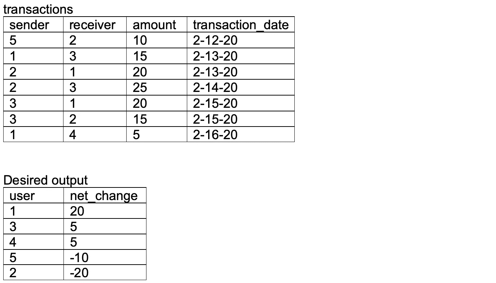**

```
WITH transactions (sender, receiver, amount, transaction_date) 
AS (VALUES 
(5, 2, 10, CAST('2-12-20' AS date)),
(1, 3, 15, CAST('2-13-20' AS date)), 
(2, 1, 20, CAST('2-13-20' AS date)), 
(2, 3, 25, CAST('2-14-20' AS date)), 
(3, 1, 20, CAST('2-15-20' AS date)), 
(3, 2, 15, CAST('2-15-20' AS date)), 
(1, 4, 5, CAST('2-16-20' AS date))), *-- sum amounts for each sender (debits) and receiver (credits)*debits AS (
SELECT 
   sender, 
   SUM(amount) AS debited
FROM transactions
GROUP BY 1 ),credits AS (
SELECT 
   receiver, 
   SUM(amount) AS credited
FROM transactions
GROUP BY 1 )*-- full (outer) join debits and credits tables on user id, taking net change as difference between credits and debits, coercing nulls to zeros with coalesce()*SELECT 
   COALESCE(sender, receiver) AS user, 
   COALESCE(credited, 0) - COALESCE(debited, 0) AS net_change 
FROM debits d
FULL JOIN credits c
ON d.sender = c.receiver
ORDER BY 2 DESC
```

## **3.最常见的项目**

**从包含日期和订购项目列表的下表中，编写一个查询以返回在每个日期订购的最频繁的项目。在平局的情况下返回多个项目。**

**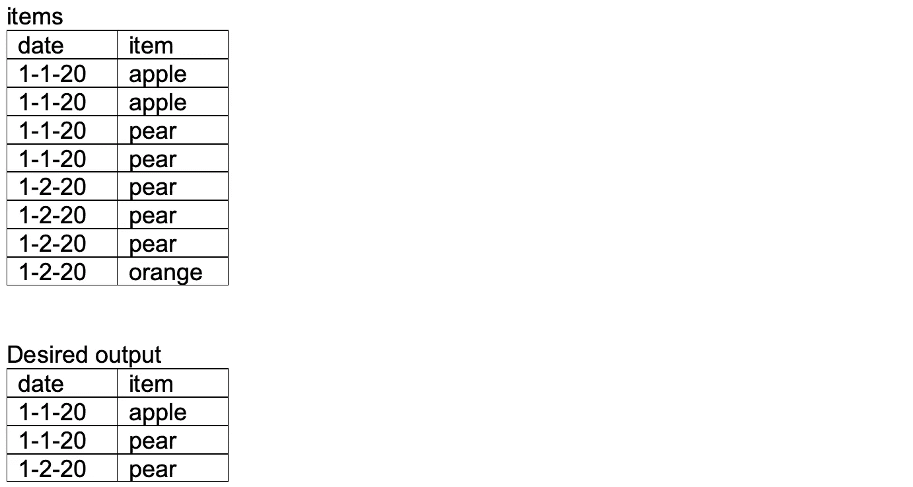**

```
WITH items (date, item) 
AS (VALUES 
(CAST('01-01-20' AS date),'apple'), 
(CAST('01-01-20' AS date),'apple'), 
(CAST('01-01-20' AS date),'pear'), 
(CAST('01-01-20' AS date),'pear'), 
(CAST('01-02-20' AS date),'pear'), 
(CAST('01-02-20' AS date),'pear'), 
(CAST('01-02-20' AS date),'pear'), 
(CAST('01-02-20' AS date),'orange')),*-- add an item count column to existing table, grouping by date and item columns*t1 AS (
SELECT 
   date, 
   item, 
   COUNT(*) AS item_count
FROM items
GROUP BY 1, 2
ORDER BY 1),*-- add a rank column in descending order, partitioning by date*t2 AS (
SELECT 
   *, 
   RANK() OVER (PARTITION BY date ORDER BY item_count DESC) AS date_rank
FROM t1)*-- return all dates and items where rank = 1*SELECT 
   date, 
   item
FROM t2
WHERE date_rank = 1
```

## **4.最新行动之间的时间差**

**根据下表中的用户操作，编写一个查询，按用户 ID 的升序为每个用户返回最后一个操作和倒数第二个操作之间经过的时间。**

**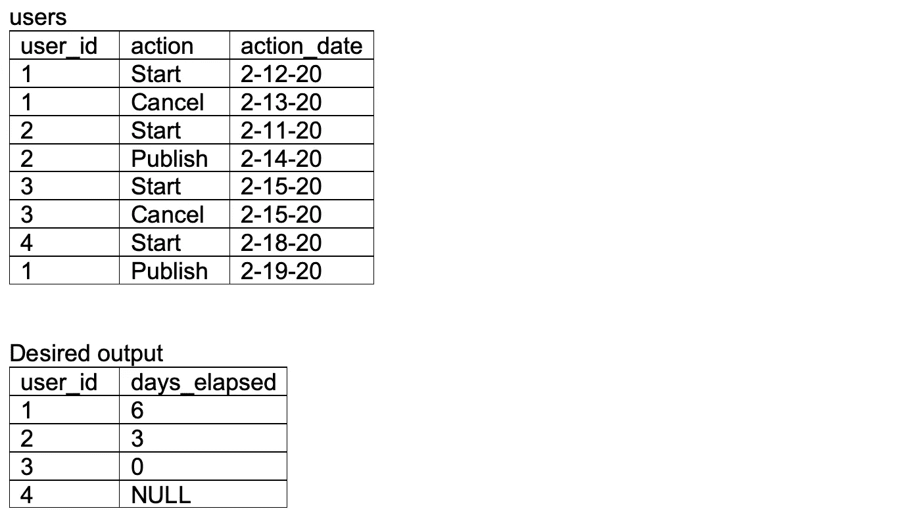**

```
WITH users (user_id, action, action_date) 
AS (VALUES 
(1, 'start', CAST('2-12-20' AS date)), 
(1, 'cancel', CAST('2-13-20' AS date)), 
(2, 'start', CAST('2-11-20' AS date)), 
(2, 'publish', CAST('2-14-20' AS date)), 
(3, 'start', CAST('2-15-20' AS date)), 
(3, 'cancel', CAST('2-15-20' AS date)), 
(4, 'start', CAST('2-18-20' AS date)), 
(1, 'publish', CAST('2-19-20' AS date))), *-- create a date rank column, partitioned by user ID, using the ROW_NUMBER() window function* t1 AS (
SELECT 
   *, 
   ROW_NUMBER() OVER (PARTITION BY user_id ORDER BY action_date DESC) AS date_rank
FROM users ),*-- filter on date rank column to pull latest and next latest actions from this table*latest AS (
SELECT *
FROM t1 
WHERE date_rank = 1 ),next_latest AS (
SELECT *
FROM t1 
WHERE date_rank = 2 )*-- left join these two tables, subtracting latest from second latest to get time elapsed* SELECT 
   l1.user_id, 
   l1.action_date - l2.action_date AS days_elapsed
FROM latest l1
LEFT JOIN next_latest l2
ON l1.user_id = l2.user_id
ORDER BY 1
```

## **5.超级用户**

**一家公司将其超级用户定义为至少进行过两次交易的用户。从下表中编写一个查询，为每个用户返回他们成为超级用户的日期，首先按最早的超级用户排序。不是超级用户的用户也应该出现在表中。**

**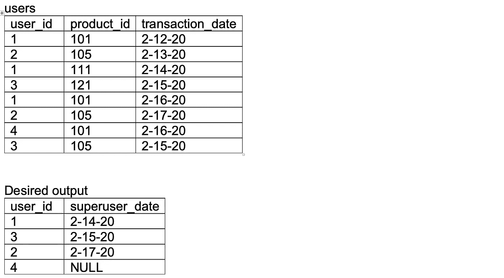**

```
WITH users (user_id, product_id, transaction_date) 
AS (VALUES 
(1, 101, CAST('2-12-20' AS date)), 
(2, 105, CAST('2-13-20' AS date)), 
(1, 111, CAST('2-14-20' AS date)), 
(3, 121, CAST('2-15-20' AS date)), 
(1, 101, CAST('2-16-20' AS date)), 
(2, 105, CAST('2-17-20' AS date)),
(4, 101, CAST('2-16-20' AS date)), 
(3, 105, CAST('2-15-20' AS date))), *-- create a transaction number column using ROW_NUMBER(), partitioning by user ID*t1 AS (
SELECT 
   *, 
   ROW_NUMBER() OVER (PARTITION BY user_id ORDER BY transaction_date) AS transaction_number
FROM users),*-- filter resulting table on transaction_number = 2*t2 AS (
SELECT 
   user_id, 
   transaction_date
FROM t1
WHERE transaction_number = 2 ),*-- left join super users onto full user table, order by date* t3 AS (
SELECT DISTINCT user_id
FROM users )SELECT 
   t3.user_id, 
   transaction_date AS superuser_date
FROM t3
LEFT JOIN t2
ON t3.user_id = t2.user_id
ORDER BY 2
```

## **6.内容推荐(硬)**

**使用以下两个表，编写一个查询，根据社交媒体用户的朋友喜欢但尚未标记为喜欢的页面，向他们返回页面推荐。按用户 ID 升序排列结果。[来源](https://www.glassdoor.com/Interview/Write-an-SQL-query-that-makes-recommendations-using-the-pages-that-your-friends-liked-Assume-you-have-two-tables-a-two-c-QTN_1413464.htm)。**

**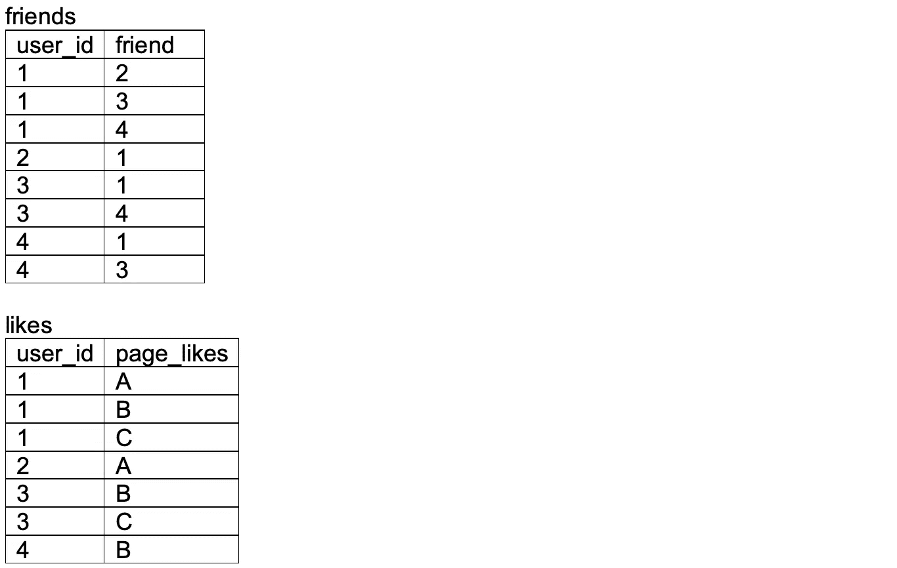****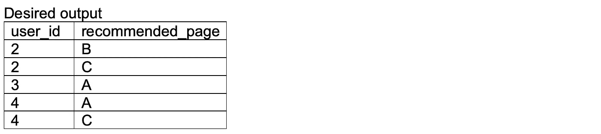**

```
WITH friends (user_id, friend) 
AS (VALUES 
(1, 2), (1, 3), (1, 4), (2, 1), (3, 1), (3, 4), (4, 1), (4, 3)),likes (user_id, page_likes) 
AS (VALUES 
(1, 'A'), (1, 'B'), (1, 'C'), (2, 'A'), (3, 'B'), (3, 'C'), (4, 'B')), *-- inner join friends and page likes tables on user_id*t1 AS (
SELECT 
   l.user_id, 
   l.page_likes, 
   f.friend
FROM likes l
JOIN friends f
ON l.user_id = f.user_id ),*-- left join likes on this, requiring user = friend and user likes = friend likes* t2 AS (
SELECT 
   t1.user_id,
   t1.page_likes, 
   t1.friend, 
   l.page_likes AS friend_likes
FROM t1
LEFT JOIN likes l
ON t1.friend = l.user_id
AND t1.page_likes = l.page_likes )*-- if a friend pair doesn’t share a common page like, friend likes column will be null - pull out these entries* SELECT DISTINCT 
   friend AS user_id, 
   page_likes AS recommended_page
FROM t2
WHERE friend_likes IS NULL
ORDER BY 1
```

## **7.移动和网络访问者**

**使用下面的两个表，返回只访问移动设备、只访问 web 以及两者都访问的用户的比例。**

**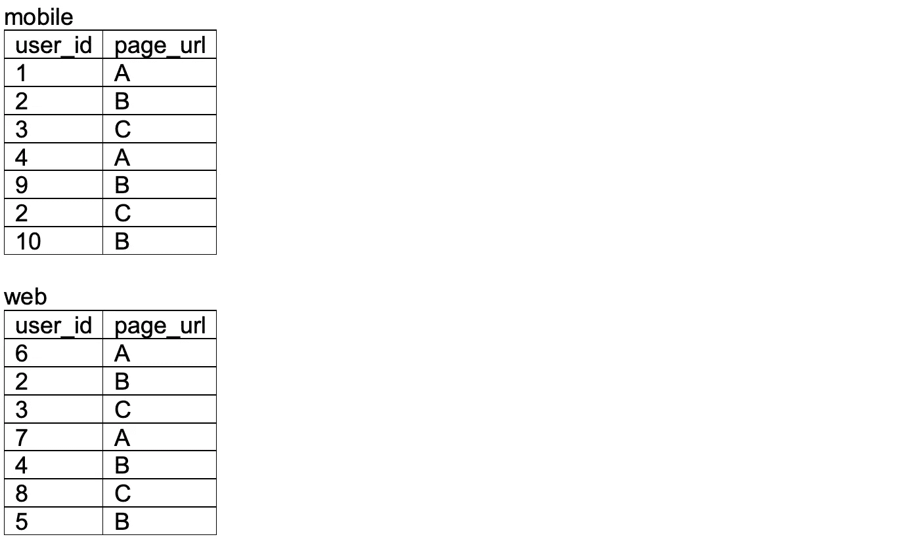****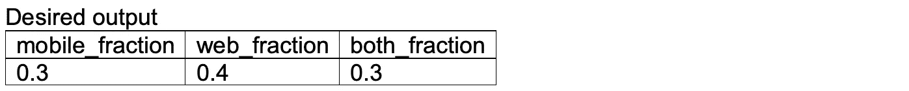**

```
WITH mobile (user_id, page_url) 
AS (VALUES 
(1, 'A'), (2, 'B'), (3, 'C'), (4, 'A'), (9, 'B'), (2, 'C'), (10, 'B')),web (user_id, page_url) 
AS (VALUES 
(6, 'A'), (2, 'B'), (3, 'C'), (7, 'A'), (4, 'B'), (8, 'C'), (5, 'B')), *-- outer join mobile and web users on user ID*t1 AS (
SELECT DISTINCT 
   m.user_id AS mobile_user, 
   w.user_id AS web_user
FROM mobile m
FULL JOIN web w
ON m.user_id = w.user_id)*-- calculate fraction of mobile-only, web-only, and both as average of values (ones and zeros) specified in case statement condition*SELECT 
   AVG(CASE WHEN mobile_user IS NOT NULL AND web_user IS NULL THEN 1   ELSE 0 END) AS mobile_fraction,
   AVG(CASE WHEN web_user IS NOT NULL AND mobile_user IS NULL THEN 1 ELSE 0 END) AS web_fraction,
   AVG(CASE WHEN web_user IS NOT NULL AND mobile_user IS NOT NULL THEN 1 ELSE 0 END) AS both_fraction
FROM t1
```

## **8.按产品活动列出的升级率(硬)**

**给定以下两个表，返回在注册后的前 30 天内访问功能二(事件表中的类型:F2)并升级到高级版的用户比例(四舍五入到两位小数)。**

**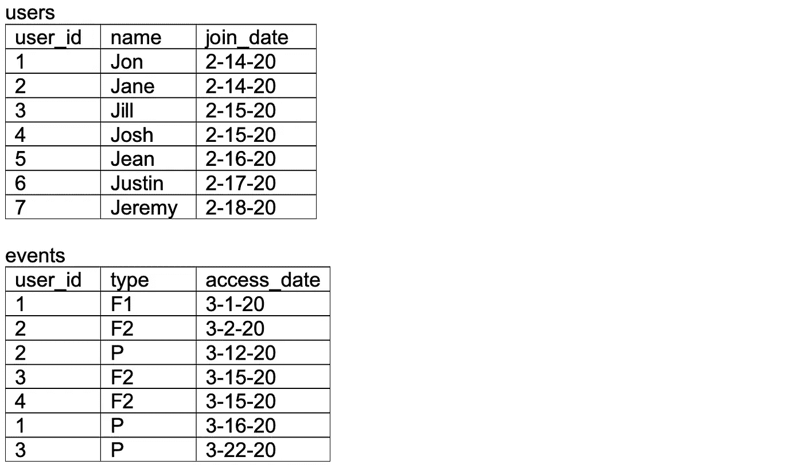****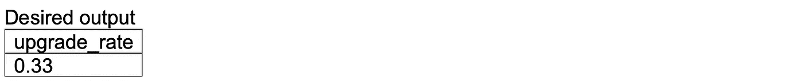**

```
WITH users (user_id, name, join_date) 
AS (VALUES 
(1, 'Jon', CAST('2-14-20' AS date)), 
(2, 'Jane', CAST('2-14-20' AS date)), 
(3, 'Jill', CAST('2-15-20' AS date)), 
(4, 'Josh', CAST('2-15-20' AS date)), 
(5, 'Jean', CAST('2-16-20' AS date)), 
(6, 'Justin', CAST('2-17-20' AS date)),
(7, 'Jeremy', CAST('2-18-20' AS date))),events (user_id, type, access_date) 
AS (VALUES 
(1, 'F1', CAST('3-1-20' AS date)), 
(2, 'F2', CAST('3-2-20' AS date)), 
(2, 'P', CAST('3-12-20' AS date)),
(3, 'F2', CAST('3-15-20' AS date)), 
(4, 'F2', CAST('3-15-20' AS date)), 
(1, 'P', CAST('3-16-20' AS date)), 
(3, 'P', CAST('3-22-20' AS date))), *-- get feature 2 users and their date of feature 2 access*t1 AS (
SELECT 
   user_id, 
   type, 
   access_date AS f2_date
FROM events
WHERE type = 'F2' ),*-- get premium users and their date of premium upgrade*t2 AS (
SELECT 
   user_id, 
   type, 
   access_date AS premium_date
FROM events
WHERE type = 'P' ),*-- for each feature 2 user, get time between joining and premium upgrade (or null if no upgrade) by inner joining full users table with feature 2 users on user ID and left joining premium users on user ID, then subtracting premium upgrade date from join date*t3 AS (
SELECT t2.premium_date - u.join_date AS upgrade_time
FROM users u
JOIN t1
ON u.user_id = t1.user_id
LEFT JOIN t2
ON u.user_id = t2.user_id )*-- calculate fraction of users with upgrade time less than 30 days as average of values (ones and zeros) specified in case statement condition, rounding to two decimal places*

SELECT 
   ROUND(AVG(CASE WHEN upgrade_time < 30 THEN 1 ELSE 0 END), 2) AS upgrade_rate
FROM t3
```

## **9.最友好的**

**给定下表，返回用户列表及其相应的朋友计数。按照朋友数量降序排列结果，如果出现平局，则按照用户 ID 升序排列。假设只显示唯一的友谊
(即【1，2】不会再次显示为【2，1】)。来自[李码](https://leetcode.com/problems/friend-requests-ii-who-has-the-most-friends/)。**

**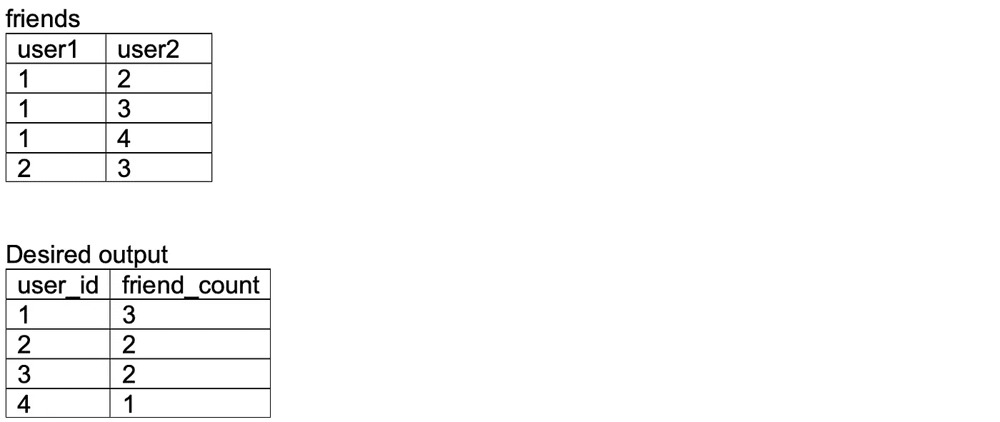**

```
WITH friends (user1, user2) 
AS (VALUES (1, 2), (1, 3), (1, 4), (2, 3)), *-- compile all user appearances into one column, preserving duplicate entries with UNION ALL* t1 AS (
SELECT user1 AS user_id
FROM friends
UNION ALL
SELECT user2 AS user_id
FROM friends)*-- grouping by user ID, count up all appearances of that user*SELECT 
   user_id, 
   COUNT(*) AS friend_count
FROM t1
GROUP BY 1
ORDER BY 2 DESC
```

## **10.项目汇总(硬)**

**“项目”表包含三列:“任务标识号”、“开始日期”和“结束日期”。表中每一行的结束日期和开始日期相差 1 天。如果任务结束日期是连续的，则它们是同一项目的一部分。项目不重叠。**

**编写一个查询来返回每个项目的开始和结束日期，以及完成项目所用的天数。按项目持续时间升序排序，如果出现平局，则按开始日期升序排序。来自[黑客排名](https://www.hackerrank.com/challenges/sql-projects/problem)。**

**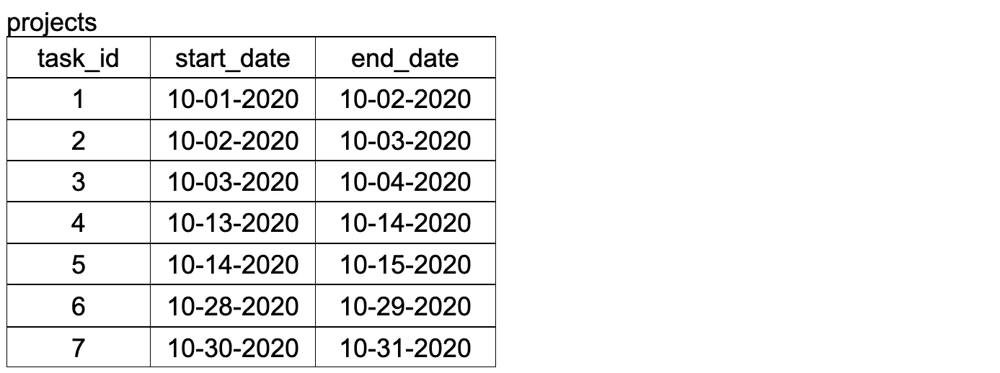****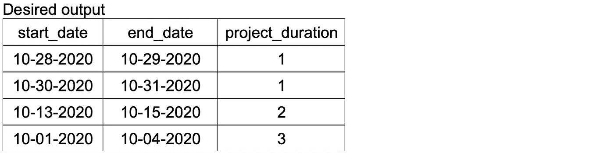**

```
WITH projects (task_id, start_date, end_date) 
AS (VALUES 
(1, CAST('10-01-20' AS date), CAST('10-02-20' AS date)), 
(2, CAST('10-02-20' AS date), CAST('10-03-20' AS date)), 
(3, CAST('10-03-20' AS date), CAST('10-04-20' AS date)), 
(4, CAST('10-13-20' AS date), CAST('10-14-20' AS date)), 
(5, CAST('10-14-20' AS date), CAST('10-15-20' AS date)), 
(6, CAST('10-28-20' AS date), CAST('10-29-20' AS date)), 
(7, CAST('10-30-20' AS date), CAST('10-31-20' AS date))), *-- get start dates not present in end date column (these are “true” project start dates)* t1 AS (
SELECT start_date
FROM projects
WHERE start_date NOT IN (SELECT end_date FROM projects) ),*-- get end dates not present in start date column (these are “true” project end dates)* t2 AS (
SELECT end_date
FROM projects
WHERE end_date NOT IN (SELECT start_date FROM projects) ),*-- filter to plausible start-end pairs (start < end), then find correct end date for each start date (the minimum end date, since there are no overlapping projects)*t3 AS (
SELECT 
   start_date, 
   MIN(end_date) AS end_date
FROM t1, t2
WHERE start_date < end_date
GROUP BY 1 )SELECT 
   *, 
   end_date - start_date AS project_duration
FROM t3
ORDER BY 3, 1
```

## **11.生日出席率**

**给定下面的两个表，编写一个查询来返回学生的分数，四舍五入到两位小数，他们在生日那天上学
(出勤= 1)。[来源](http://orhancanceylan.com/facebook/data/science/interview/2020/05/17/sql_facebook_student-attendance.html)。**

**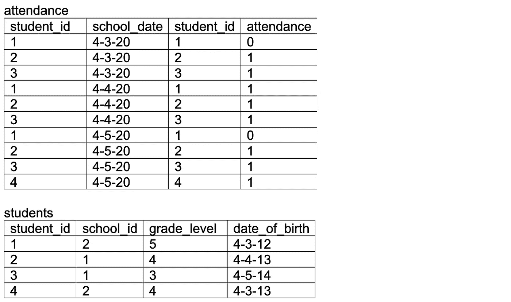****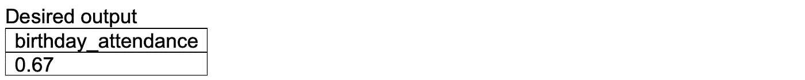**

```
WITH attendance (student_id, school_date, attendance)
AS (VALUES
(1, CAST('2020-04-03' AS date), 0),
(2, CAST('2020-04-03' AS date), 1),
(3, CAST('2020-04-03' AS date), 1), 
(1, CAST('2020-04-04' AS date), 1), 
(2, CAST('2020-04-04' AS date), 1), 
(3, CAST('2020-04-04' AS date), 1), 
(1, CAST('2020-04-05' AS date), 0), 
(2, CAST('2020-04-05' AS date), 1), 
(3, CAST('2020-04-05' AS date), 1), 
(4, CAST('2020-04-05' AS date), 1)),students (student_id, school_id, grade_level, date_of_birth)
AS (VALUES
(1, 2, 5, CAST('2012-04-03' AS date)),
(2, 1, 4, CAST('2013-04-04' AS date)),
(3, 1, 3, CAST('2014-04-05' AS date)), 
(4, 2, 4, CAST('2013-04-03' AS date))) -- join attendance and students table on student ID, and day and month of school day = day and month of birthday, taking average of attendance column values and roundingSELECT ROUND(AVG(attendance), 2) AS birthday_attendance
FROM attendance a
JOIN students s
ON a.student_id = s.student_id 
AND EXTRACT(MONTH FROM school_date) = EXTRACT(MONTH FROM date_of_birth)
AND EXTRACT(DAY FROM school_date) = EXTRACT(DAY FROM date_of_birth)
```

## **12.黑客得分**

**给定以下两个表，编写一个查询来返回黑客 ID、姓名和总分(完成的每个挑战的最高分之和),按分数降序排序，在分数相等的情况下按黑客 ID 升序排序。不显示零分黑客的条目。来自 [HackerRank](https://www.hackerrank.com/contests/simply-sql-the-sequel/challenges/full-score) 。**

**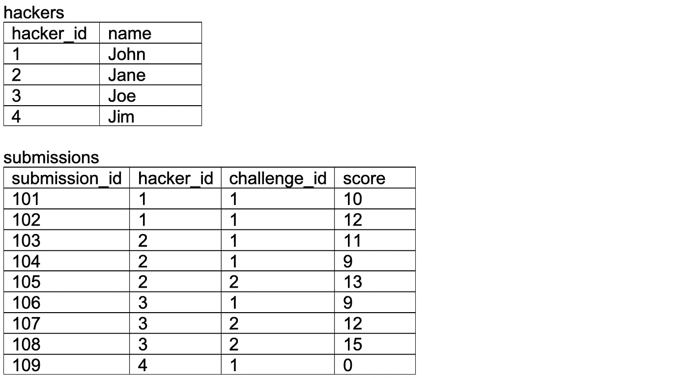****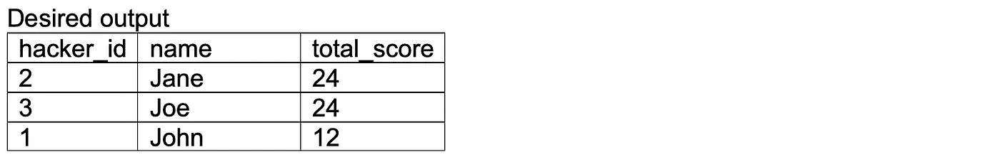**

```
WITH hackers (hacker_id, name)
AS (VALUES
(1, 'John'),
(2, 'Jane'),
(3, 'Joe'),
(4, 'Jim')),submissions (submission_id, hacker_id, challenge_id, score)
AS (VALUES
(101, 1, 1, 10),
(102, 1, 1, 12),
(103, 2, 1, 11),
(104, 2, 1, 9),
(105, 2, 2, 13),
(106, 3, 1, 9),
(107, 3, 2, 12),
(108, 3, 2, 15),
(109, 4, 1, 0)), *-- from submissions table, get maximum score for each hacker-challenge pair*t1 AS (
SELECT 
   hacker_id, 
   challenge_id, 
   MAX(score) AS max_score
FROM submissions 
GROUP BY 1, 2 )*-- inner join this with the hackers table, sum up all maximum scores, filter to exclude hackers with total score of zero, and order result by total score and hacker ID*SELECT 
   t1.hacker_id, 
   h.name, 
   SUM(t1.max_score) AS total_score
FROM t1
JOIN hackers h
ON t1.hacker_id = h.hacker_id
GROUP BY 1, 2
HAVING SUM(max_score) > 0
ORDER BY 3 DESC, 1
```

## **13.有等级无等级(硬)**

**编写一个查询，在不使用窗口函数的情况下对下表中的分数进行排序。如果两个分数相等，则两者应该具有相同的等级。平局之后，下面的排名应该是下一个连续的整数值。来自 [LeetCode](https://leetcode.com/problems/rank-scores/) 。**

**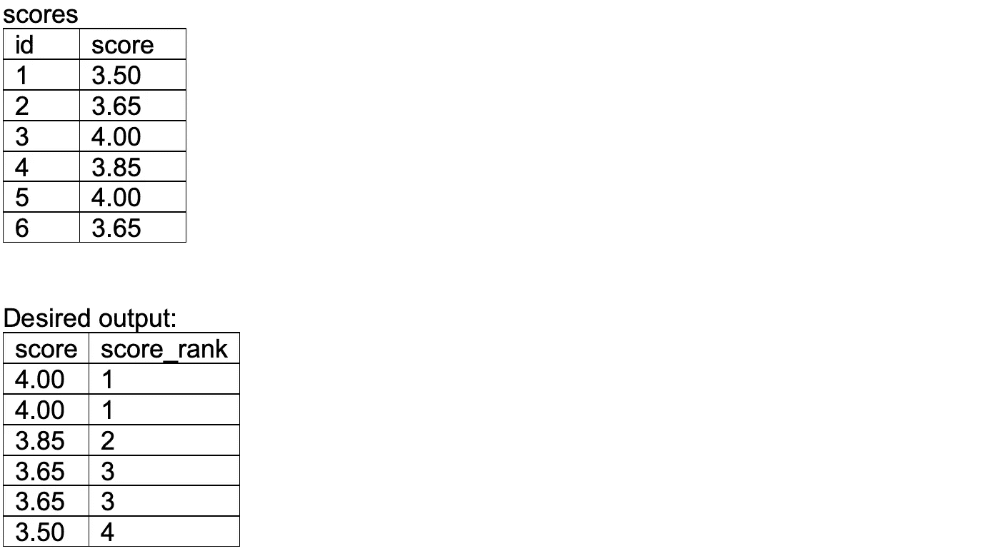**

```
WITH scores (id, score)
AS (VALUES
(1, 3.50),
(2, 3.65),
(3, 4.00),
(4, 3.85),
(5, 4.00),
(6, 3.65)) *-- self-join on inequality produces a table with one score and all scores as large as this joined to it, grouping by first id and score, and counting up all unique values of joined scores yields the equivalent of DENSE_RANK()   [check join output to understand]*SELECT 
   s1.score, 
   COUNT(DISTINCT s2.score) AS score_rank
FROM scores s1 
JOIN scores s2
ON s1.score <= s2.score
GROUP BY s1.id, s1.score
ORDER BY 1 DESC
```

## **14.累计薪金总额**

**下表保存了几名雇员的月薪信息。编写一个查询，获取一名雇员在 3 个月内(不包括最近一个月)每月的工资总额。结果应该按雇员 ID 和月份升序排序。来自 [LeetCode](https://leetcode.com/problems/find-cumulative-salary-of-an-employee/) 。**

**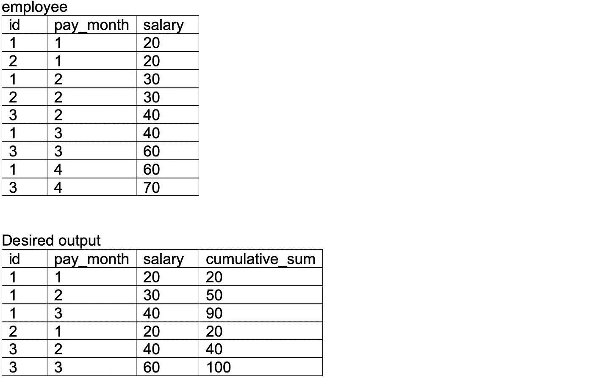**

```
WITH employee (id, pay_month, salary)
AS (VALUES
(1, 1, 20),
(2, 1, 20),
(1, 2, 30),
(2, 2, 30),
(3, 2, 40),
(1, 3, 40),
(3, 3, 60),
(1, 4, 60),
(3, 4, 70)), *-- add column for descending month rank (latest month = 1) for each employee*t1 AS (
SELECT *, 
   RANK() OVER (PARTITION BY id ORDER BY pay_month DESC) AS month_rank
FROM employee )*-- filter to exclude latest month and months 5+, create cumulative salary sum using SUM() as window function, order by ID and month*SELECT 
   id, 
   pay_month, 
   salary, 
   SUM(salary) OVER (PARTITION BY id ORDER BY month_rank DESC) AS cumulative_sum
FROM t1 
WHERE month_rank != 1
AND month_rank <= 4
ORDER BY 1, 2
```

## **15.团队排名**

**编写一个查询，在 matches 表中显示所有比赛之后，返回 teams 表中每个队的得分。计分如下:输了得零分，平了得一分，赢了得三分。结果应该包括球队名称和分数，并按分数递减排序。如果出现平局，按字母顺序排列球队名称。**

**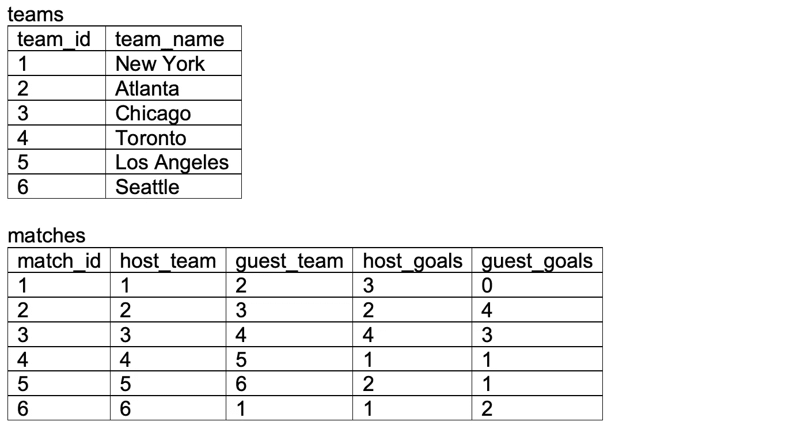****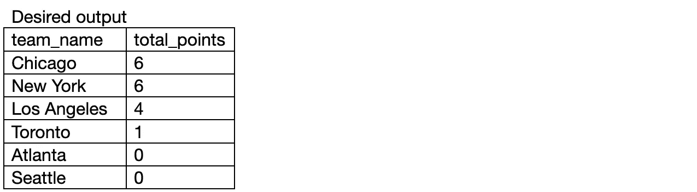**

```
WITH teams (team_id, team_name)
AS (VALUES
(1, 'New York'),
(2, 'Atlanta'),
(3, 'Chicago'),
(4, 'Toronto'),
(5, 'Los Angeles'),
(6, 'Seattle')),matches (match_id, host_team, guest_team, host_goals, guest_goals)
AS (VALUES
(1, 1, 2, 3, 0),
(2, 2, 3, 2, 4),
(3, 3, 4, 4, 3),
(4, 4, 5, 1, 1),
(5, 5, 6, 2, 1),
(6, 6, 1, 1, 2)), *-- add host points and guest points columns to matches table, using case-when-then to tally up points for wins, ties, and losses*t1 AS (
SELECT 
   *, 
   CASE WHEN host_goals > guest_goals THEN 3 
        WHEN host_goals = guest_goals THEN 1 
        ELSE 0 END AS host_points, 
   CASE WHEN host_goals < guest_goals THEN 3 
   WHEN host_goals = guest_goals THEN 1 
   ELSE 0 END AS guest_points
FROM matches )*-- join result onto teams table twice to add up for each team the points earned as host team and guest team, then order as requested*SELECT 
   t.team_name, 
   a.host_points + b.guest_points AS total_points
FROM teams t
JOIN t1 a
ON t.team_id = a.host_team
JOIN t1 b
ON t.team_id = b.guest_team
ORDER BY 2 DESC, 1
```

## **16.没有购买产品的顾客**

**根据下表，编写一个查询来显示购买了产品 A 和 B 但没有购买产品 C 的客户的 ID 和姓名，按客户 ID 升序排序。**

**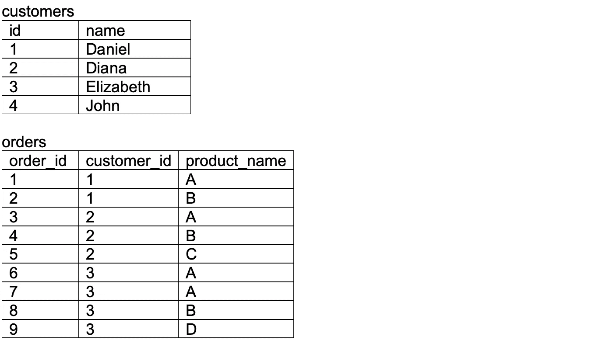****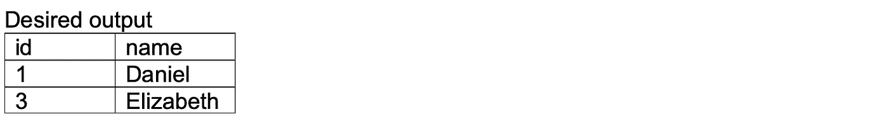**

```
WITH customers (id, name)
AS (VALUES
(1, 'Daniel'),
(2, 'Diana'),
(3, 'Elizabeth'),
(4, 'John')),orders (order_id, customer_id, product_name)
AS (VALUES
(1, 1, 'A'),
(2, 1, 'B'),
(3, 2, 'A'),
(4, 2, 'B'),
(5, 2, 'C'),
(6, 3, 'A'), 
(7, 3, 'A'),
(8, 3, 'B'),
(9, 3, 'D')) *-- join customers and orders tables on customer ID, filtering to those who bought both products A and B, removing those who bought product C, returning ID and name columns ordered by ascending ID*SELECT DISTINCT 
   id, 
   name
FROM orders o
JOIN customers c
ON o.customer_id = c.id
WHERE customer_id IN (SELECT customer_id 
                      FROM orders 
                      WHERE product_name = 'A') 
AND customer_id IN (SELECT customer_id 
                    FROM orders 
                    WHERE product_name = 'B') 
AND customer_id NOT IN (SELECT customer_id 
                        FROM orders 
                        WHERE product_name = 'C')
ORDER BY 1
```

## **17.中纬度(硬)**

**编写一个查询来返回下表中每个州气象站的中值纬度，四舍五入到最接近的十分之一度。注意，SQL 中没有 MEDIAN()函数！来自[黑客排名](https://www.hackerrank.com/challenges/weather-observation-station-20/problem)。**

**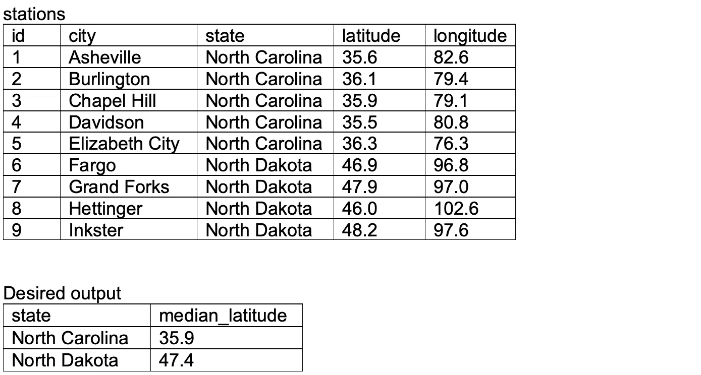**

```
WITH stations (id, city, state, latitude, longitude)
AS (VALUES
(1, 'Asheville', 'North Carolina', 35.6, 82.6),
(2, 'Burlington', 'North Carolina', 36.1, 79.4),
(3, 'Chapel Hill', 'North Carolina', 35.9, 79.1),
(4, 'Davidson', 'North Carolina', 35.5, 80.8),
(5, 'Elizabeth City', 'North Carolina', 36.3, 76.3),
(6, 'Fargo', 'North Dakota', 46.9, 96.8),
(7, 'Grand Forks', 'North Dakota', 47.9, 97.0),
(8, 'Hettinger', 'North Dakota', 46.0, 102.6),
(9, 'Inkster', 'North Dakota', 48.2, 97.6)), *-- assign latitude-ordered row numbers for each state, and get total row count for each state*t1 AS (
SELECT 
   *, 
   ROW_NUMBER() OVER (PARTITION BY state ORDER BY latitude ASC) AS row_number_state, 
            count(*) OVER (PARTITION BY state) AS row_count
FROM stations )*-- filter to middle row (for odd total row number) or middle two rows (for even total row number), then get average value of those, grouping by state*SELECT 
   state, 
   AVG(latitude) AS median_latitude
FROM t1
WHERE row_number_state >= 1.0*row_count/2 
AND row_number_state <= 1.0*row_count/2 + 1
GROUP BY 1
```

## **18.最大分隔城市**

**从问题 17 的同一个表中，编写一个查询，返回每个州中相距最远的一对城市，以及这两个城市之间的相应距离(以度为单位，四舍五入到小数点后两位)。来自[黑客排名](https://www.hackerrank.com/challenges/weather-observation-station-19/problem)。**

**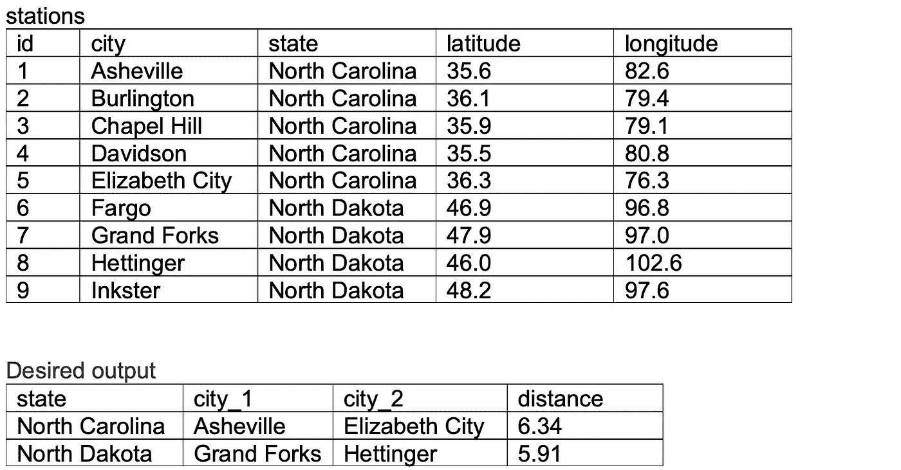**

```
WITH stations (id, city, state, latitude, longitude)
AS (VALUES
(1, 'Asheville', 'North Carolina', 35.6, 82.6),
(2, 'Burlington', 'North Carolina', 36.1, 79.4),
(3, 'Chapel Hill', 'North Carolina', 35.9, 79.1),
(4, 'Davidson', 'North Carolina', 35.5, 80.8),
(5, 'Elizabeth City', 'North Carolina', 36.3, 76.3),
(6, 'Fargo', 'North Dakota', 46.9, 96.8),
(7, 'Grand Forks', 'North Dakota', 47.9, 97.0),
(8, 'Hettinger', 'North Dakota', 46.0, 102.6),
(9, 'Inkster', 'North Dakota', 48.2, 97.6)), *-- self-join on matching states and city < city (avoids identical and double-counted city pairs), pulling state, city pair, and latitude/longitude coordinates for each city*t1 AS (
SELECT 
   s1.state, 
   s1.city AS city1, 
   s2.city AS city2, 
   s1.latitude AS city1_lat, 
   s1.longitude AS city1_long, 
   s2.latitude AS city2_lat, 
   s2.longitude AS city2_long
FROM stations s1
JOIN stations s2
ON s1.state = s2.state 
AND s1.city < s2.city ),*-- add a column displaying rounded Euclidean distance* t2 AS (
SELECT *, 
ROUND(( (city1_lat - city2_lat)^2 + (city1_long - city2_long)^2 ) ^ 0.5, 2) AS distance
FROM t1 ),*-- rank each city pair by descending distance for each state*t3 AS (
SELECT *, RANK() OVER (PARTITION BY state ORDER BY distance DESC) AS dist_rank
FROM t2 )*-- return the city pair with maximium separation*SELECT 
   state, 
   city1, 
   city2, 
   distance
FROM t3
WHERE dist_rank = 1
```

## **19.周期**

**编写一个查询来返回每个月的平均周期时间。周期时间是一个用户加入和他们的被邀请者加入之间经过的时间。未经邀请而加入的用户在“邀请者”一栏中有一个零。**

**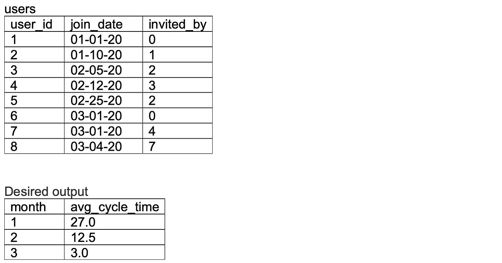**

```
WITH users (user_id, join_date, invited_by) 
AS (VALUES 
(1, CAST('01-01-20' AS date), 0), 
(2, CAST('01-10-20' AS date), 1), 
(3, CAST('02-05-20' AS date), 2), 
(4, CAST('02-12-20' AS date), 3), 
(5, CAST('02-25-20' AS date), 2), 
(6, CAST('03-01-20' AS date), 0), 
(7, CAST('03-01-20' AS date), 4),
(8, CAST('03-04-20' AS date), 7)), *-- self-join on invited by = user ID, extract join month from inviter join date, and calculate cycle time as difference between join dates of inviter and invitee*t1 AS (
SELECT 
   CAST(EXTRACT(MONTH FROM u2.join_date) AS int) AS month,
   u1.join_date - u2.join_date AS cycle_time
FROM users u1
JOIN users u2
ON u1.invited_by = u2.user_id )*-- group by join month, take average of cycle times within each month*SELECT 
   month, 
   AVG(cycle_time) AS cycle_time_month_avg
FROM t1
GROUP BY 1
ORDER BY 1
```

## **20.连续三次**

**出席表记录了每天举行活动时人群中的人数。编写一个查询来返回一个显示高出勤率时段的日期和访问者计数的表，高出勤率时段定义为三个连续的条目(不一定是连续的日期),访问者超过 100 人。来自 [LeetCode](https://leetcode.com/problems/human-traffic-of-stadium/solution/) 。**

**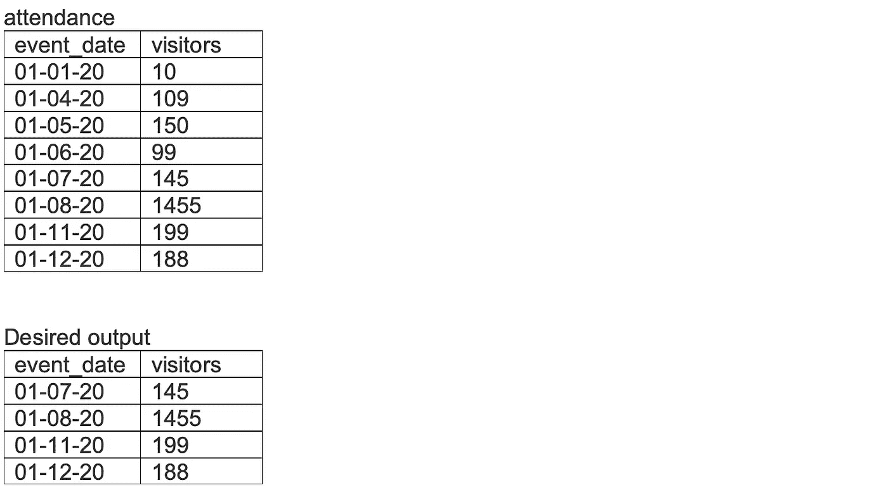**

```
WITH attendance (event_date, visitors) 
AS (VALUES 
(CAST('01-01-20' AS date), 10), 
(CAST('01-04-20' AS date), 109), 
(CAST('01-05-20' AS date), 150), 
(CAST('01-06-20' AS date), 99), 
(CAST('01-07-20' AS date), 145), 
(CAST('01-08-20' AS date), 1455), 
(CAST('01-11-20' AS date), 199),
(CAST('01-12-20' AS date), 188)), *-- add row numbers to identify consecutive entries, since date column has some gaps*t1 AS (
SELECT *, 
   ROW_NUMBER() OVER (ORDER BY event_date) AS day_num
FROM attendance ),*-- filter this to exclude days with > 100 visitors*t2 AS (
SELECT *
FROM t1
WHERE visitors > 100 ),*-- self-join (inner) twice on offset = 1 day and offset = 2 days*t3 AS (
SELECT 
   a.day_num AS day1, 
   b.day_num AS day2, 
   c.day_num AS day3
FROM t2 a
JOIN t2 b
ON a.day_num = b.day_num - 1
JOIN t2 c
ON a.day_num = c.day_num - 2 )*-- pull date and visitor count for consecutive days surfaced in previous table*SELECT 
   event_date, 
   visitors
FROM t1
WHERE day_num IN (SELECT day1 FROM t3)
   OR day_num IN (SELECT day2 FROM t3)
   OR day_num IN (SELECT day3 FROM t3)
```

## **21.通常一起购买**

**使用下面两个表，编写一个查询来返回最常一起购买的前三对产品的名称和购买频率。两种产品的名称应该出现在一列中。[来源](https://www.careercup.com/question?id=5759072822362112)。**

**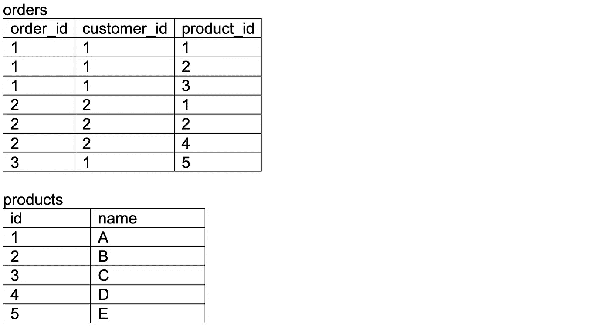****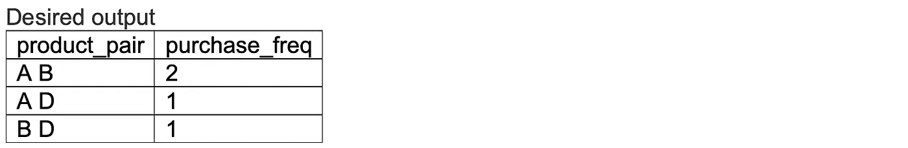**

```
WITH orders (order_id, customer_id, product_id) 
AS (VALUES 
(1, 1, 1),
(1, 1, 2),
(1, 1, 3),
(2, 2, 1),
(2, 2, 2),
(2, 2, 4),
(3, 1, 5)),products (id, name) 
AS (VALUES 
(1, 'A'),
(2, 'B'),
(3, 'C'),
(4, 'D'),
(5, 'E')), *-- get unique product pairs from same order by self-joining orders table on order ID and product ID < product ID (avoids identical and double-counted product pairs)*t1 AS (
SELECT 
   o1.product_id AS prod_1, 
   o2.product_id AS prod_2
FROM orders o1
JOIN orders o2
ON o1.order_id = o2.order_id
AND o1.product_id < o2.product_id ),*-- join products table onto this to get product names, concatenate to get product pairs in one column*t2 AS (
SELECT CONCAT(p1.name, ' ', p2.name) AS product_pair
FROM t1
JOIN products p1
ON t1.prod_1 = p1.id
JOIN products p2
ON t1.prod_2 = p2.id )*-- grouping by product pair, return top 3 entries sorted by purchase frequency*SELECT *, 
   COUNT(*) AS purchase_freq
FROM t2
GROUP BY 1
ORDER BY 2 DESC 
LIMIT 3
```

## **22.平均治疗效果(硬)**

**从总结研究结果的下表中，计算平均治疗效果以及 95%置信区间的上限和下限。将这些数字四舍五入到小数点后 3 位。**

**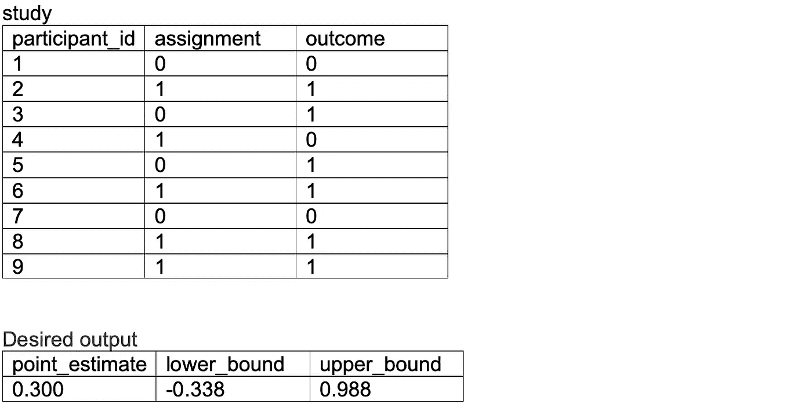**

```
WITH study (participant_id, assignment, outcome) 
AS (VALUES 
(1, 0, 0),
(2, 1, 1),
(3, 0, 1),
(4, 1, 0),
(5, 0, 1),
(6, 1, 1),
(7, 0, 0),
(8, 1, 1),
(9, 1, 1)), -- get average outcomes, standard deviations, and group sizes for control and treatment groupscontrol AS (
SELECT 
   AVG(outcome) AS avg_outcome, 
   STDDEV(outcome) AS std_dev, 
   COUNT(*) AS group_size
FROM study
WHERE assignment = 0 ),treatment AS (
SELECT 
   AVG(outcome) AS avg_outcome, 
   STDDEV(outcome) AS std_dev,
   COUNT(*) AS group_size
FROM study
WHERE assignment = 1 ),-- get average treatment effect sizeeffect_size AS (
SELECT t.avg_outcome - c.avg_outcome AS effect_size
FROM control c, treatment t ),-- construct 95% confidence interval using z* = 1.96 and magnitude of individual standard errors [ std dev / sqrt(sample size) ]conf_interval AS (
SELECT 1.96 * (t.std_dev^2 / t.group_size 
             + c.std_dev^2 / c.group_size)^0.5 AS conf_int
FROM treatment t, control c )SELECT round(es.effect_size, 3) AS point_estimate, 
        round(es.effect_size - ci.conf_int, 3) AS lower_bound, 
        round(es.effect_size + ci.conf_int, 3) AS upper_bound
FROM effect_size es, conf_interval ci
```

## **23.滚动工资总额**

**下表显示了给定年份中前九个月员工的月薪。在此基础上，编写一个查询来返回一个表，该表按时间顺序显示上半年每个月雇员当月和接下来两个月的工资总额。**

**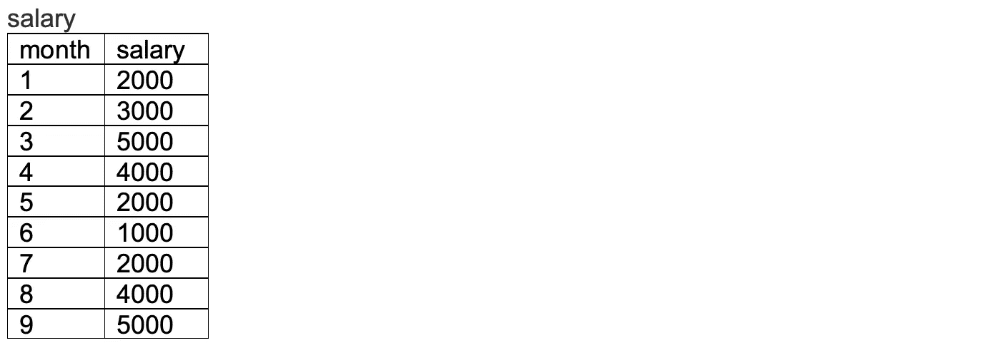****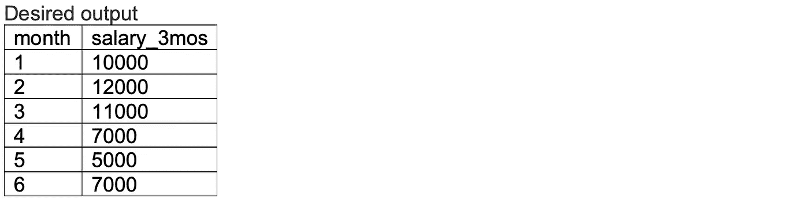**

```
WITH salaries (month, salary) 
AS (VALUES 
(1, 2000),
(2, 3000),
(3, 5000),
(4, 4000),
(5, 2000),
(6, 1000),
(7, 2000),
(8, 4000),
(9, 5000)) -- self-join to match month n with months n, n+1, and n+2, then sum salary across those months, filter to first half of year, and sortSELECT 
   s1.month, 
   SUM(s2.salary) AS salary_3mos
FROM salaries s1
JOIN salaries s2
ON s1.month <= s2.month 
AND s1.month > s2.month - 3
GROUP BY 1
HAVING s1.month < 7
ORDER BY 1
```

## **24.出租车取消率**

**从出租车服务的给定 trips 和 users 表中，编写一个查询，返回 10 月份前两天的取消率，四舍五入到两位小数，返回不涉及被禁乘客或司机的行程。来自 [LeetCode](https://leetcode.com/problems/trips-and-users/description/) 。**

**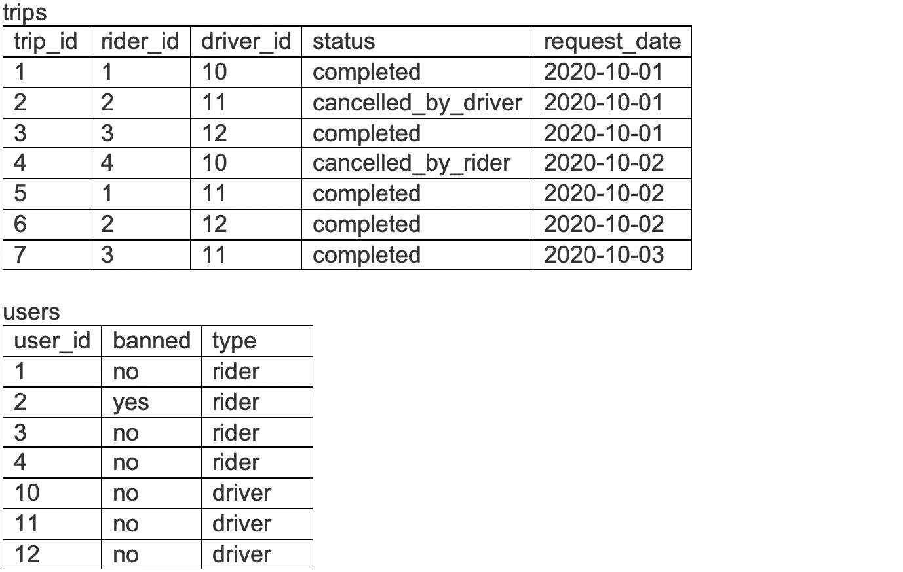******

```
WITH trips (trip_id, rider_id, driver_id, status, request_date)
AS (VALUES
(1, 1, 10, 'completed', CAST('2020-10-01' AS date)),
(2, 2, 11, 'cancelled_by_driver', CAST('2020-10-01' AS date)),
(3, 3, 12, 'completed', CAST('2020-10-01' AS date)),
(4, 4, 10, 'cancelled_by_rider', CAST('2020-10-02' AS date)),
(5, 1, 11, 'completed', CAST('2020-10-02' AS date)),
(6, 2, 12, 'completed', CAST('2020-10-02' AS date)),
(7, 3, 11, 'completed', CAST('2020-10-03' AS date))),users (user_id, banned, type)
AS (VALUES
(1, 'no', 'rider'),
(2, 'yes', 'rider'),
(3, 'no', 'rider'),
(4, 'no', 'rider'),
(10, 'no', 'driver'),
(11, 'no', 'driver'),
(12, 'no', 'driver')) -- filter trips table to exclude banned riders and drivers, then calculate cancellation rate as 1 - fraction of trips completed, filtering to first two days of the month
SELECT 
   request_date, 
   1 - AVG(CASE WHEN status = 'completed' THEN 1 ELSE 0 END) AS cancel_rate
FROM trips
WHERE rider_id NOT IN (SELECT user_id 
                       FROM users
                       WHERE banned = 'yes' )
AND driver_id NOT IN (SELECT user_id 
                      FROM users
                      WHERE banned = 'yes' )
GROUP BY 1
HAVING EXTRACT(DAY FROM request_date) <= 2
```

## **25.保留曲线(硬)**

**从下面的用户活动表中，编写一个查询来返回在加入后给定天数内保留(显示一些活动)的用户比例。按照惯例，用户在其加入日(第 0 天)被认为是活跃的。**

**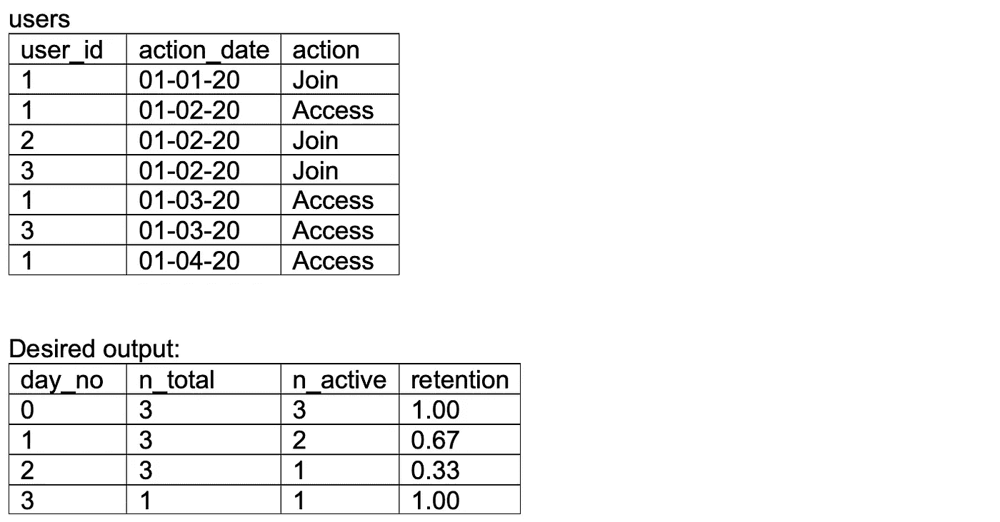**

```
WITH users (user_id, action_date, action) 
AS (VALUES 
(1, CAST('01-01-20' AS date), 'Join'), 
(1, CAST('01-02-20' AS date), 'Access'), 
(2, CAST('01-02-20' AS date), 'Join'), 
(3, CAST('01-02-20' AS date), 'Join'), 
(1, CAST('01-03-20' AS date), 'Access'), 
(3, CAST('01-03-20' AS date), 'Access'),
(1, CAST('01-04-20' AS date), 'Access')), *-- get join dates for each user*join_dates AS (
SELECT 
   user_id, 
   action_date AS join_date
FROM users
WHERE action = 'Join' ),*-- create vector containing all dates in date range*date_vector AS (
SELECT CAST(GENERATE_SERIES(MIN(action_date), MAX(action_date), 
            '1 day'::interval) AS date) AS dates
FROM users ),*-- cross join to get all possible user-date combinations*all_users_dates AS (
SELECT DISTINCT 
   user_id, 
   d.dates
FROM users
CROSS JOIN date_vector d ),*-- left join users table onto all user-date combinations on matching user ID and date (null on days where user didn't engage), join onto this each user's signup date, exclude user-date combinations falling before user signup*t1 AS (
SELECT 
   a.dates - c.join_date AS day_no, 
   b.user_id
FROM all_users_dates a
LEFT JOIN users b
ON a.user_id = b.user_id
AND a.dates = b.action_date
JOIN join_dates c
ON a.user_id = c.user_id 
WHERE a.dates - c.join_date >= 0 )*-- grouping by days since signup, count (non-null) user IDs as active users, total users, and the quotient as retention rate*SELECT 
   day_no, 
   COUNT(*) AS n_total, 
   COUNT(DISTINCT user_id) AS n_active, 
   ROUND(1.0*COUNT(DISTINCT user_id)/COUNT(*), 2) AS retention
FROM t1
GROUP BY 1
```

# **附录**

**一个常见问题:如果您在使用 CTE 时看到语法错误，请检查 cte 之间是否有逗号，并且在最后一个 CTE 后面没有逗号。**

```
WITH input_table (column_1, column_2) 
AS (VALUES 
(1, 'A'), (2, 'B')),     -- comma between CTEst1 AS (
SELECT *
FROM input_table
WHERE column_2 = 'A')    -- no comma after last CTESELECT *
FROM t1
```

**感谢本·拉卡尔和叶敏婷。**