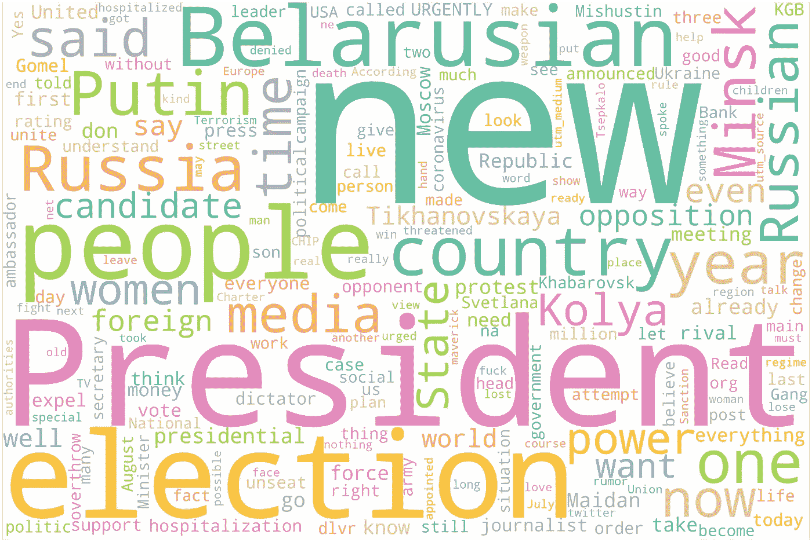

# 推特分析白俄罗斯当前的政治局势

> 原文：<https://towardsdatascience.com/twitter-analysis-of-the-current-political-situation-in-belarus-a8834271ad65?source=collection_archive---------45----------------------->

## 在白俄罗斯没有办法进行独立的社会学研究，所以在分析政治偏好时，Twitter 和 Python 就派上了用场。


[Unsplash](https://unsplash.com/photos/bgQ4Im-P0mc)([@ reise uhu](http://twitter.com/reiseuhu))

# 语境

亚历山大·卢卡申科担任白俄罗斯总统已经超过 26 年。他因侵犯人权、绑架政治对手并使其失踪以及滥用权力而被禁止进入欧盟和美国。

今年八月，当他面临“改选”时，社会动荡和抗议已经激增，一股前所未见的社会团结浪潮也随之而来。

反对派领导人和和平抗议者现在面临前所未有的镇压。活动家、政治家和记者在监狱里被绑架和折磨。

> 禁止进行和发表独立的社会学研究。

一些互联网调查显示，卢卡申科拥有不超过 3%的白俄罗斯民众的支持，而他公开声称这一数字约为 72-78%。我决定使用 Python 和 NLP 库来检查这些声明。

**本次简短研究的目标:**

–衡量 Twitter 用户对总统候选人的真实忠诚度。

–确定主要作者、标签和主题。

跟踪国际社会对当前事件的反应。

*工具包:Python，Pandas，Numpy，Matplotlib，Seaborn，SpaCy，Scikit-learn，Vader，LDA。*

# 检索 Twitter 数据

从 6 月初开始，我搜集了超过 24 万条与白俄罗斯和总统候选人相关的推文。我获得了 49 种不同语言的推文，平均每天有 3 条 4K 推文。

由于官方 Twitter API 不允许获取超过 1 周的推文，所以我使用 GetOldTweets3 来解析历史数据(我强烈建议查看@noahberhe 的[代码](https://github.com/noahberhe/COVID-19/blob/master/COVID-19%20Winners%20and%20Losers.ipynb)，它修复了许多错误)。如果有兴趣，你可以在这里下载一个原始数据集。

下面的代码用俄语(红色)、英语(蓝色)和其他语言(黄色)创建了从 6 月 1 日到 7 月 26 日的三个每日推文图。

```
#Importing some basic librariesimport pandas as pd
import numpy as np
import seaborn as sns
import matplotlib.pyplot as plt
from datetime import date, timedelta, datetime# Converting the created_at column to np.datetime objectdf['date'] = pd.to_datetime(df['date'])#Creating separate dataframes in Russian, English and other languagesdf_ru =df[df.language == 'ru']
df_en =df[df.language == 'en']
df_else =df[(df['language'] != 'ru') & (df['language'] != 'en')]#Plotting tweets dynamics in different languagesdf_ru.resample('D', on='date').text.count().plot(color='r',figsize=(16,6), label = 'russian')
df_en.resample('D', on='date').text.count().plot(color='b',figsize=(16,6), label = 'english')
df_else.resample('D', on='date').text.count().plot(color='y',figsize=(16,6),label = 'other languages')
plt.ylabel('number of daily tweets')
plt.legend()
```


# 最受欢迎的推文

下面是打印最受欢迎的 tweet 的代码示例。

```
fav_max = np.max(df_ru['favorites'])
fav = df_ru[df_ru.favorites == fav_max].index[0]print("Tweet with most likes: \n{}".format(df_ru['text'][fav]))print("Number of likes: {}".format(fav_max))
print("Username: {}".format(df_ru['username'][fav]))
print ("Translation: {}".format(translator.translate(df_ru['text'][fav]).text))
```

在指定时间段内最受欢迎的俄语推文:

下面翻译

> 简要介绍一下今天白俄罗斯的情况:
> 
> 候选人 Babariko 收集了 425，000 个签名，但他们在去选举委员会的路上拘留了他和他的儿子，不允许律师进入，房子被搜查。
> 
> 候选人 Tikhanovskaya 被威胁要绑架她的孩子。警方拒绝调查。"

最受欢迎的英语推文:

# 用俄语发推文的前 25 名用户

下面是绘制前 25 名最活跃用户的直方图代码示例。

```
users_count  = df_ru['username'].value_counts()
users_count = users_count[:25,]
plt.figure(figsize=(16,8))
sns.barplot(users_count.index, users_count.values, alpha=0.8)
plt.title('Top 25 users')
plt.ylabel('Number of Occurrences', fontsize=12)
plt.xlabel('Users', fontsize=12)
plt.xticks(rotation=65, horizontalalignment='right')
plt.show()
```


# 用英语发推文的前 25 名用户


# 热门标签

> #白俄罗斯，#白俄罗斯，#明斯克，#特比，#布雷斯特比，#新闻，#选举，#卢卡申科，#特比邦，#乔维德 19，#冠状病毒，#乔维德，#乔维德 19，#fcdm1927，#人权，#人权暴力，#OSCE，#明斯克集团，# 2020 年幸存者，#军事

# 衡量对总统候选人的忠诚度

然后，我使用库 SpaCy 分离出与卢卡申科及其主要对手 Babariko、Tsepkalo 和 Tikhanovskaya 有关的最近推文(2020 年 7 月 18 日至 26 日)。为了使用情感分析和实体提取库，我必须将推文翻译成英语。我用了谷歌翻译 API。下面是一个简单的方法:

```
#Importing librariesimport json
from apiclient.discovery import build
import os
import time
pd.options.mode.chained_assignment = None
import requests
import socket
from googleapiclient import discovery#Creating GoogleAPI function def translation_googleAPI(query, target_language):socket.setdefaulttimeout(600)  # set timeout to 10 minutes
    service = discovery.build('translate','v2',developerKey='YOURKEY')
    collection = service.translations() 
    request = collection.list(q=query, target=target_language) 
    response = request.execute() 
    response_json = json.dumps(response) 
    translation = ((response['translations'][0])['translatedText'])
    print (translation)
    print('....')
    return translation#Separating tweets related to a particular candidatedf_lukashenko = df[df.topical_persons == 'lukashenko']#Lambda function to create a new column with translationdf_lukashenko['translated'] = df_lukashenko['text'].apply(lambda x: translation_googleAPI(x,'en'))
```

让我们探索一下每个候选人的数据集。

# 卢卡申科

8023 条推文


在此期间，卢卡申科在推特上被提及的次数比任何其他候选人都多至少 8 次。7 月 20 日的高峰与宣布候选人登记有关。

下面是使用 VADER 识别推文情绪的代码:

```
#Let's import the library and create a functionfrom vaderSentiment.vaderSentiment import SentimentIntensityAnalyzerdef vader_scorer(df):

    analyzer = SentimentIntensityAnalyzer()
    vader_scores = df.loc[:,'translated'].map(analyzer.polarity_scores)dvec = DictVectorizer()
    vader_scores = dvec.fit_transform(vader_scores)

    vader_scores = pd.DataFrame(vader_scores.toarray(),columns=dvec.feature_names_)
    return vader_scores#Adding scores to our datasetvader_scores = vader_scorer(df_lukashenko)
df_lukashenko = pd.concat([df_lukashenko,vader_scores], axis=1)
df_lukashenko = df_lukashenko.drop_duplicates(subset='tweet_id', ignore_index=True)# Creating a new column called 'sentiment_class'
sentimentclass_list = []for i in range(0, len(df_lukashenko)):

    # current 'compound' score:
    curr_compound = df_lukashenko.iloc[i,:]['compound']

    if (curr_compound <= 1.0 and curr_compound >= 0.55):
        sentimentclass_list.append(5)
    elif (curr_compound < 0.55 and curr_compound >= 0.10):
        sentimentclass_list.append(4)
    elif (curr_compound < 0.10 and curr_compound > -0.10):
        sentimentclass_list.append(3)
    elif (curr_compound <= -0.10 and curr_compound > -0.55):
        sentimentclass_list.append(2)
    elif (curr_compound <= -0.55 and curr_compound >= -1.00):
        sentimentclass_list.append(1)# Adding the new column 'sentiment_class' to the dataframedf_lukashenko['sentiment_class'] = sentimentclass_list#Plotting the distribution of sentiment_classimport seaborn as sns
plt.figure(figsize = (6,4))
sns.set_palette('coolwarm')
sns.countplot(df_luk['sentiment_class'])
plt.title('Countplot of sentiment class')
plt.xlabel('Sentiment class: from negative to positive')
plt.ylabel('No. of tweets')
plt.show()
```


提到卢卡申科的推特的情绪分布均匀。如果我们看看最负面的推文，它们通常是在谴责政权的暴力。如果我们看看积极的推文，它主要与团结白俄罗斯人民反对独裁主义有关。

下面是一个负面推文的例子:

下面翻译

> “卢卡申科不再隐藏他的法西斯本质、仇恨和对人民的蔑视，正在为他的终身权力与人民进行战争。失去权力后，法西斯分子卢卡申科将被定罪。法西斯分子卢卡申科因谋杀、恐怖主义和贪污而受到的唯一惩罚是被枪毙”。

下面是一条被 VADER 定性为正面的推文:

提到卢卡申科的最受欢迎的推文:

下面翻译

> “支持无畏的白俄罗斯妇女斯韦特兰娜·蒂哈诺夫斯卡娅的最大规模集会现在正在戈梅尔举行，她向残酷和卑鄙的独裁者卢卡申科发出了挑战。人山人海——灯笼的海洋。他们的光芒照亮了我们通往自由的道路！白俄罗斯万岁！”

以下是卢卡申科数据集的代码和单词 cloud 月 18-16 日，翻译成英文):

```
#Transforming translated tweets to the plain textdf_lukashenko.translated.to_csv('lukashenko_tweets.txt', header=None, index=None, sep=' ', mode='a')# Importing packagesimport matplotlib.pyplot as plt
%matplotlib inline# Defining a function to plot word clouddef plot_cloud(wordcloud):
    # Set figure size
    plt.figure(figsize=(40, 30))
    # Display image
    plt.imshow(wordcloud) 
    # No axis details
    plt.axis("off");# Extracting the plain text contenttext = open("lukashenko_tweets.txt", 'r', encoding='utf-8').read()
# Clean text
text = re.sub(r'==.*?==+', '', text)
text = text.replace('\n', '')# Importing packagefrom wordcloud import WordCloud, STOPWORDS
stop_words = ["https","html","youtu", "via", "d0","d1", "will", "quot","amp","alexander","ru", "lukashenka", "lukashenko", "belarus", "youtube", "video"] + list(STOPWORDS)# Generating word cloudwordcloud = WordCloud(width = 3000, height = 2000, random_state=1, background_color='white', colormap='Set2', collocations=False, stopwords = stop_words).generate(text)# Plotplot_cloud(wordcloud)
```



# 采普卡洛

*1024 条推文*


7 月 24 日的高峰与 Valeriy Tsepkalo 在收到内部消息后带着两个小孩逃离该国有关，他将被逮捕，孩子们将被送往孤儿院。


Valeriy Tsepkalo 离开后，他的妻子 Veronika Tsepkalo 接管了政治活动，与其他反对派领导人共同努力。因此，当前数据集的情感主要与 Veronika 相关。

VADER 将带有负面情绪的推文归类为:

下面翻译

> “威胁不在候选人身上。威胁在于人民本身。厌倦了生活在屈辱和恐惧中的人。在前往第一次集会的路上，Babariko、Tsepkalo 和 Tikhanovskaya 联合总部的代表讲述了他们计划如何在选举中进一步斗争”。

正面推文的例子:

下面翻译

> “三个女孩完美地互补。科列斯尼科娃——最善良的动物，带着富有感染力的微笑和真正的希望之光。tikhanovskaya——激发胜利信念的意志力。tsepkalo——最聪明和理性思考的领导者”。

提到 Tsepkalo 的最受欢迎的推文:

下面翻译

> “继 Tikhanovskaya 之后，Tsepkalo 也被迫带着孩子出国。仿佛来自战区。多么令人沮丧。(他们还试图把孩子从被投进监狱的 2010 年候选人 Sannikov 身边带走)”。

Tsepkalo 数据集的词云:


# 巴巴里科

684 条推文


从 18 年 7 月到 26 年 7 月，与巴巴里科相关的推文

最近，有两个明显的高峰:

7 月 19 日，中央选举委员会表示，巴巴里科没有登记为总统候选人。7 月 24 日，一项新的指控(行贿)被曝光。


提到 Babariko 的推文的情绪主要是负面的，尽管这种负面情绪来自于人们对不公平的指控和拘留感到愤怒的事实。

下面是一条带有负面情绪的推文:

下面翻译

> “卢卡申科说，他被捕的竞争对手巴巴里科“失声痛哭”，“开始就 Belgazprombank 案作证”；我可以想象那个人在那里是如何被折磨的”。

这是这段时间最正面的推文(关于 Babariko 总部负责人 Maria Kolesnikova):

下面翻译

> “聪明、美丽、有才华——不可思议的玛丽亚·科列斯尼科娃！！！维克多有着惊人的团结最优秀者的能力，巴巴里科总部的团队就是最好的证明。玛丽亚，我个人非常感谢你为我们国家的美好未来所做的一切！”

这是提到巴巴里科的最受欢迎的推文:

下面翻译

> “维克多和爱德华·巴巴里科被捕已经一个月了。我们非常想念你！我们怀念维克多·德米特里耶维奇(Viktor Dmitrievich)愉快的声音，他向来到办公室的每一个人打招呼。通过他在会议上的笑话和亲密的溪流，通过他在会议室里的咖啡味道——一切”。

下面是巴巴里科的词云:


# 季哈诺夫斯卡娅

*1015 条推文*


联合总部(从左至右):韦罗妮卡·采普卡罗、斯维特拉娜·季哈诺夫斯卡娅和玛丽亚·科列斯尼科娃(维克多·巴巴里科总部负责人)。图:[卡纳普列夫+莱迪克](https://www.instagram.com/kanaplev_leydik/)

Svetlana Tikhanovskaya 是一位 37 岁的家庭主妇，有两个小孩，当她的丈夫 Sergey Tikhanovskiy 在授权的 piquet 期间受到挑衅而被监禁时，她决定注册成为总统候选人。Tikhanovskaya 是仍留在白俄罗斯的大规模支持的候选人，没有坐牢。

采普卡罗、巴巴里科和季哈诺夫斯卡娅总部联合起来反对卢卡申科。


Tikhanovskaya 的受欢迎程度在她注册成为候选人后急剧上升，并一直保持稳定。


联合总部的支持率很高。白俄罗斯在其现代史上从未见过对反对派候选人的如此支持。不管负面背景如何，推文的整体情绪相当积极。

带有负面情绪的推文示例:

下面翻译

> “总统候选人斯维特拉娜·季哈诺夫斯卡娅因受到威胁带着她的孩子离开了这个国家。6 月中旬，Tikhanovskaya 说，一个不知名的人威胁说，如果她不停止总统竞选，就把她送进监狱，并带走她的孩子”。

正面推文示例:

最受欢迎的推文来自账户 [sadmikalai](https://twitter.com/sadmikalai) ，讽刺地代表卢卡申科 15 岁的儿子发推文:

下面翻译

> “爸爸非常喜欢季哈诺夫斯卡娅所说的话，他甚至决定为她投票”。

下面是 Tikhanovskaya 的词云:


# 国际社会对当前事件的反应


使用 SpaCy，我分离了提到美国和欧盟的推文(从 6 月 1 日到 7 月 26 日的推文)。显然有更多与美国相关的推文，尽管其中大多数与政治不太相关。我没有注意到高级官员对白俄罗斯局势表达了激进的立场。虽然欧盟的推特更少，但立场更具决定性。

例如，转发量最大的帖子是唐纳德·图斯克强烈谴责白俄罗斯当局的行为。

我注意到美国相关数据集中有一个不寻常的话题(Elon Musk — Space — Space Suite)。我决定更深入地研究它与白俄罗斯和白俄罗斯选举有什么关系。我们开始吧:

# 简要结论

1.  卢卡申科在推特上被提及的次数比最接近的竞争对手至少多 8 次。负面情绪是激进的(呼吁暴力)，而大多数正面推文是讽刺性的或假阳性的。
2.  Tsepkalo 和 Babariko 数据集中的负面情绪主要与被捕和受到威胁有关。
3.  Svetlana Tikhanovskaya 比任何其他候选人获得了更多积极的推文。她的人气增长极快，并保持稳定。
4.  推特上没有国际社会对白俄罗斯局势的决定性反应。唐纳德·图斯克是为数不多的积极表达担忧的外国政治家之一。
5.  白俄罗斯人正在大量写信给埃隆·马斯克，要求尽快将卢卡申科送入太空，并提供卫星互联网 Starlink。人们有理由担心互联网会在选举日被封锁。

# 后续步骤

一系列受控行为实验表明，当人们对某个问题进行道德化时，他们更有可能支持针对该问题的暴力抗议( [Nature](https://www.researchgate.net/publication/325320508_Moralization_in_social_networks_and_the_emergence_of_violence_during_protests) ，2016)。

目前，我正在研究一个应用程序，通过识别推文中道德和伦理的百分比，并将其与 Twitter 位置数据进行匹配，来实时预测暴力抗议。如果你愿意合作，请随时联系我。


南方公园第十六季第十三集

[更多代码](https://github.com/dariaminsky/belarusian-twitter)在 Github 上。

[这里](https://drive.google.com/file/d/1rN2VnwvGXnpYMTdKgvFLI2suTQTnfJZl/view?usp=sharing)你可以下载数据集。

请继续关注并实时跟踪这场革命。

[领英](https://www.linkedin.com/in/dariaminsky/)脸书 推特