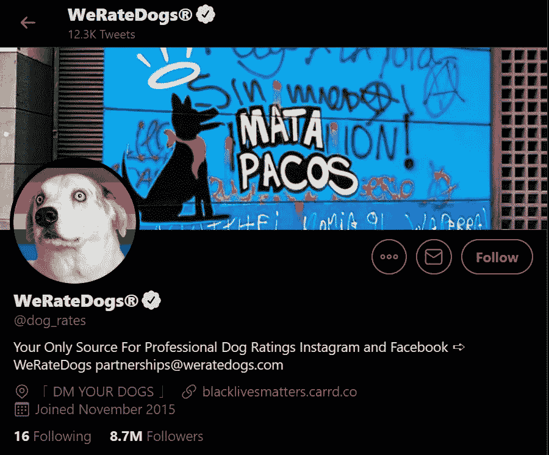
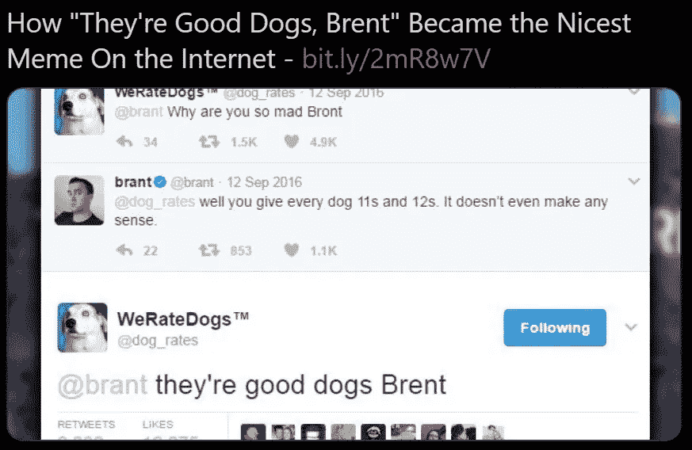
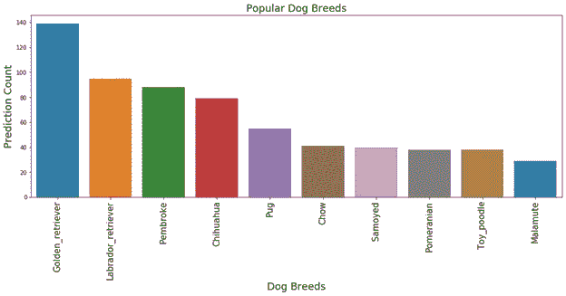
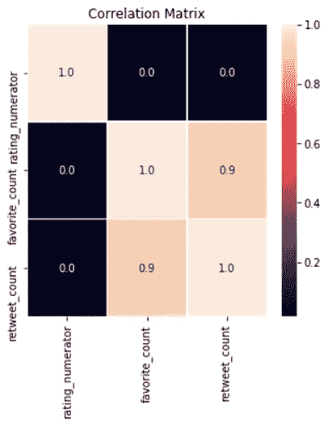

# Twitter 分析:“WeRateDogs”

> 原文：<https://towardsdatascience.com/twitter-analytics-weratedogs-a441be7d4a85?source=collection_archive---------26----------------------->

## 一个数据争论和分析博客



来源:WeRateDogs 推特

> 一个好的数据管理者知道如何集成来自多个数据源的信息，解决常见的转换问题，以及解决数据清理和质量问题。

*来自 [Udacity](https://medium.com/u/2929690a28fb?source=post_page-----a441be7d4a85--------------------------------) 的数据分析师 Nanodegree 项目*向我介绍了当今业界正在使用的各种数据争论方法。在其中一个争论不休的项目中，我有机会经历了整个数据分析过程——收集数据、清理数据、分析数据，最后将数据可视化。

该数据集是 Twitter 用户 [@dog_rates](http://twitter.com/dog_rates) 的推文档案，也称为 WeRateDogs。WeRateDogs 是一个推特账户，用幽默的评论给人们的狗打分。

来源:WeRateDogs 推特

这个项目的大部分焦点都集中在数据争论上。那么到底什么是数据角力呢？

> 数据争论指的是将可用的原始数据清理、重组和丰富成更有用的格式的过程。

我在这个项目中使用了各种 python 库，下面是我开始使用的。

```
**import** **numpy** **as** **np**
**import** **pandas** **as** **pd**
**import** **matplotlib.pyplot** **as** **plt**
%**matplotlib** inline
```

# 收集数据:

这个项目的数据有三种不同的格式:

**1。Twitter 存档文件——WeRateDogs:**WeRateDogs 下载了他们的 Twitter 存档文件，并专门分享给本项目使用。这个档案包含基本的 tweet 数据(tweet ID、时间戳、文本等。)他们在 2017 年 8 月 1 日发布的所有 5000 多条推文。

这是由 Udacity 以编程方式提取的，并作为 csv 文件提供给用户使用。

```
pd.read_csv('twitter-archive-enhanced.csv')
```

**2。图像预测文件:**tweet 图像预测，即根据神经网络在每个 tweet 中出现什么品种的狗，存储在该文件中。它以 tsv 格式托管在 Udacity 的服务器上，必须使用 [*Url*](https://d17h27t6h515a5.cloudfront.net/topher/2017/August/599fd2ad_image-predictions/image-predictions.tsv) 以编程方式下载。

Python 的 *request* 库用于从 web 上收集这些数据。 [***请求***](https://requests.readthedocs.io/en/master/) 是 python 中一个多功能的 HTTP 库，具有各种应用。它的应用之一是使用文件 URL 从 web 下载或打开文件。

**3。Twitter API — JSON 文件:**通过使用 WeRateDogs Twitter 档案中的 tweet IDs，我使用 Python 的 tweepy 库查询了 Twitter API 中每条 tweet 的 JSON 数据。

[***Tweepy***](http://docs.tweepy.org/en/v3.5.0/getting_started.html) 是一个开源的 Python 包，给你一个非常方便的方法来用 Python 访问 Twitter API。你可以在 twitter 和使用 Python 访问 Twitter API 的 [*中找到关于*](https://www.earthdatascience.org/courses/use-data-open-source-python/intro-to-apis/twitter-data-in-python/) *[*设置应用的更多细节。*](https://developer.twitter.com/en/docs/basics/apps/overview)*

此外，每条 tweet 的全部 JSON 数据都存储在一个名为 tweet_json.txt 的文件中。

每个 tweet 的 JSON 数据都被写到自己的行中，然后。txt 文件被逐行读入熊猫数据帧。

# 评估数据

收集数据后，这三个表被保存，并以可视化和编程的方式进行评估。在这两次评估中，我在所有三个数据框架中寻找不干净的数据，即整洁性和质量问题。


由[弗兰基·查马基](https://unsplash.com/@franki?utm_source=medium&utm_medium=referral)在 [Unsplash](https://unsplash.com?utm_source=medium&utm_medium=referral) 上拍摄的照片

***质量:*** *低质量数据通常被称为脏数据。脏数据的内容有问题。*数据质量维度是完整性、有效性、准确性和一致性。

***整洁:*** *凌乱的数据通常被称为“凌乱”的数据。杂乱的数据在结构上有问题。*整理数据是哪里:
1。每个变量形成一列。
2。每个观察值形成一行。
3。每种类型的观测单位形成一张表。

视觉评估为我提供了一些问题，如三个数据集中的非描述性列标题和重复列。
程序性评估实际上给了我大部分质量问题，例如三个数据集中出现的不正确的数据类型和重复数据。然后，我在 python 笔记本中记录了我的评估要点。

# 清理数据

清洁意味着根据我们所做的评估**来提高质量和整洁度**。

提高质量并不意味着改变数据，让它说一些不同的东西——这是数据欺诈。质量改进是指*不准确时纠正，不相关时删除，缺失时更换*。

类似地，改善整洁意味着转换数据集，使得每个变量是一列，每个观察是一行，每种类型的观察单元是一个表。

我遵循程序化的数据清理流程，即 ***定义、编码和测试。*** 我将我在评估步骤中的观察转换成**定义的**问题，将这些定义翻译成复杂的**代码**来修复这些问题，然后**测试**三个数据集以确保操作有效。

# 存储数据

清理完数据后，我发现不需要三个数据集。所有的数据都可以很容易地转换成一个文件。因此，我将三个数据帧连接在一个公共属性 twitter_id 上，以创建 twitter_archive_master.csv。

# 分析数据

使用这些新清理的 WeRateDogs Twitter 数据，创建了有趣和可信的分析和可视化，以传达调查结果。

WeRateDogs 是一个 Twitter 账户，用幽默的评论给人们的狗打分。这些评级的分母几乎都是 10。但是分子数几乎总是大于 10。11/10、12/10、13/10 等。为什么？因为“他们是好狗布伦特”。WeRateDogs 认为几乎所有的狗都应该得到 10 分或者更多。每条推文的转发次数和收藏(即“喜欢”)次数是另一个有趣的参数。



来源:推特

那么，如何处理这些评级呢？对于狗，最常见的问题是哪只狗最受欢迎？我们能得到转发、收藏和收视率之间的任何关系吗？我已经分析了这些数据来得到这些问题的答案。

matplotlib 和 seaborn 等 Python 库为我的分析提供了一些很酷的可视化工具。

# 最受欢迎的狗品种

根据第一次预测分析我的数据，我得到了*十大最受欢迎的狗品种*。



作者图片

金毛猎犬是最受欢迎的狗。这些狗有最多的推文，这使它们在我们最受欢迎的名单上。

我们的数据中有狗的 jpg_url。Pythons 的 io 模块用于管理与文件相关的输入输出操作。我使用 Pillow，友好的 PIL fork-Python 图像库，得到了我们最受欢迎的狗金毛猎犬的图像，它在统计中名列榜首。

下面是结果。


*作者图片*

# 转发、收藏和评级

令人惊讶的是，许多推文被转发。一些推文有近 40000 次转发。

我试图通过关联图(python 中最酷的图之一)来找出转发、评级和收藏之间是否有任何关系。我用 seaborn 库生成了一个热图。



作者图片

转发量和收视率之间没有明确的关系。但是收藏和转发之间有很强的正相关性，即转发次数和收藏次数之间的线性关系。下面的散点图也证实了这一点。


作者图片

因此，这里的见解是转发通常是最受欢迎的，但我们不能说所有的转发都是最受欢迎的，反之亦然。

在我的分析中，我发现给定推文的收藏数和转发数之间有很强的线性关系。金毛寻回犬是最受欢迎的犬种，它与拉布拉多寻回犬、彭布罗克犬、吉娃娃犬和哈巴狗一起构成了数据中最常见的五个犬种。

# 结论

可以分析该数据集中的许多其他参数，以获得不同的洞察力和可视化效果。因为这个项目的主要焦点是数据争论，所以在这个部分花了更多的时间。

为了 [Udacity](https://medium.com/u/2929690a28fb?source=post_page-----a441be7d4a85--------------------------------) ，我不得不提交两份报告以及*Python 笔记本*。第一份报告是内部文档 *the wrangle_report* ，它简要描述了争论的结果；第二份报告是外部文档 *the act_report* ，它传达见解并显示从争论的数据中产生的可视化结果。

数据鼓吹者非常了解他们的数据，并且总是在寻找丰富数据的方法。我已经用令人惊奇的 Python 库做了同样的事情。这个项目是我最有趣的数据体验之一，以至于我决定写我的第一篇博客。您可以在我的 [Github](https://github.com/divyanitin/TwitterDataAnalysis-WeRateDogs) 上查看项目和我的报告。

感谢您的阅读！