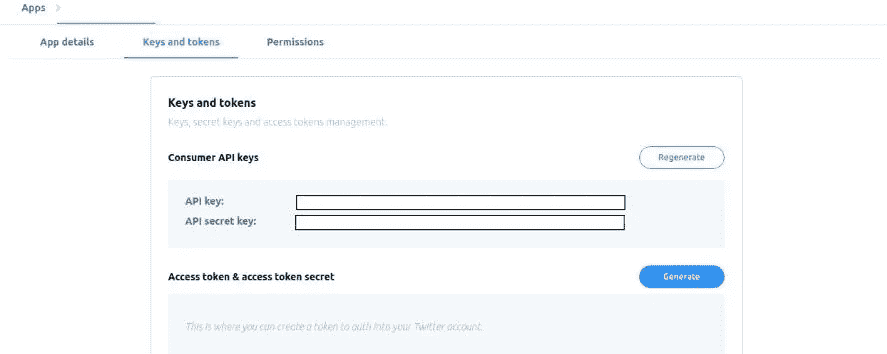
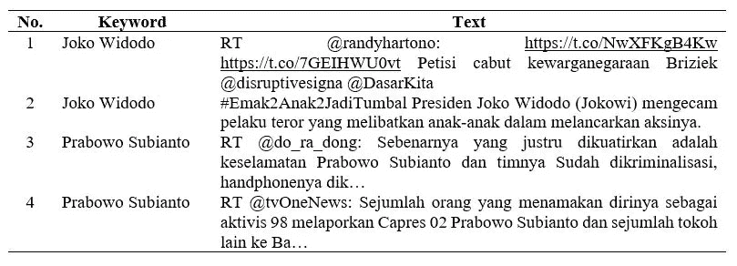
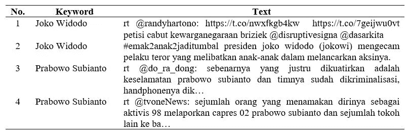
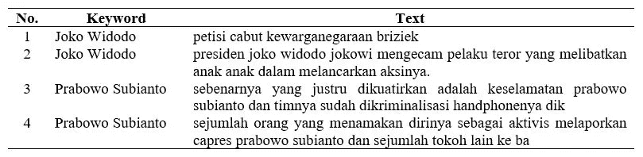
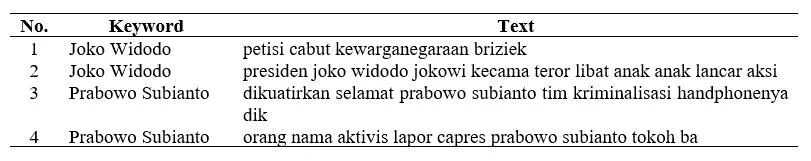

# 使用 R 进行 Twitter 数据获取和预处理的深度教程

> 原文：<https://towardsdatascience.com/twitter-data-acquisition-and-pre-processing-using-r-c999746babbe?source=collection_archive---------23----------------------->


在 [Unsplash](https://unsplash.com?utm_source=medium&utm_medium=referral) 上由 [Carlos Muza](https://unsplash.com/@kmuza?utm_source=medium&utm_medium=referral) 拍摄的照片

## [实践教程](https://towardsdatascience.com/tagged/hands-on-tutorials)

## 如何通过数据洞察印尼大选

## 作为微博和社交网络服务的 Twitter

Twitter 是一种社交媒体，用于传播特定主题的信息或观点，可以是社会中发生的社会或政治现象。Twitter 用户可以使用 280 个字符、照片、声音、视频、链接等来发布他们的观点。

在我看来，Twitter 最有趣的元素之一是一个 ***趋势话题*** 。它指的是在特定领域中经常讨论的词或话题，在同一日期和时间内，它的音量最高。

这一分析是在印度尼西亚公共选举期间进行的，当时总统候选人的竞选团队通过社交媒体进行了大量的政治活动，其中之一就是 Twitter。这就像是热门话题的在线战争。每个团队都宣传自己的总统候选人，甚至使用了黑人竞选。作为一名数据科学家，这就像是可以分析的数据宝藏，所以我们通过分析找出一种模式。但是，我们如何获得 Twitter 数据呢？下一步是什么？这将在本故事中涉及。尽情享受吧！

## 如何使用 API 从 Twitter 获取数据

好吧，一般来说，Twitter API 和网络抓取可以轻松获取数据。Twitter API 可以从我们的 Twitter 帐户中提取数据——特定日期和时间的推文、我们帐户的关注者数量等。

> API 代表应用程序编程接口是连接两个应用程序之间数据的工具，正式格式为 JSON。

这个端点允许我们发出一个特定的请求，例如，某个时间段的 tweets，并将其返回给我们的应用程序。在这种情况下，R 的行为类似于应用程序。为了开始使用 Twitter API，我们需要一个 Twitter 帐户，它将使我们能够访问 API 密钥(消费者密钥)。所以获取 Twitter API 有几个步骤。

*   创建一个 Twitter 帐户。请前往 [**Twitter 平台**](http://twitter.com) 注册一个免费账户。它允许我们访问开发者网站。


用于登录和注册的 Twitter 页面(图片由作者提供)

*   前往 Twitter 开发者网站，创建一个新的应用程序。开发商所在地是 [**这里是**](https://developer.twitter.com/apps)


未创建任何应用程序的开发人员网站(图片由作者提供)

*   您需要说明使用 Twitter 开发者工具的一个主要原因。是为了个人项目、教育、研究还是其他？你所需要的是回答和填写某些问题，并同意条款和政策
*   该过程可能需要一些时间。我们应该能够在*“Keys and Access Tokens”*选项卡下找到所有 Twitter API 密钥细节的所有内容



Twitter API 已经在开发者网站上生成(图片由作者提供)

## 如何使用 R 连接 Twitter API

现在，我们将通过 API 连接我们的应用程序(R)和 Twitter。在我们深入讨论这个之前，请确保我们已经在 r 中安装了`**twitterR**`和`**tm**`库。

```
# Install libraries
install.packages('twitteR')   # Library for Twitter API
install.packages('tm')        # Library for text mining
```

需求完成后，我们开始使用 API 将应用程序与 Twitter 连接起来。

```
# Import the library
library(twitteR)
library(tm)
# Crawling data from Twitter
api_key = 'xxxxxxxxxxxxxxxxxxxxxxxx'
api_secret = 'xxxxxxxxxxxxxxxxxxxxxxxx'
access_token = 'xxxxxxxxxxxxxxxxxxxxxxxx'
access_token_secret = 'xxxxxxxxxxxxxxxxxxxxxxxx'
# Connect with Twitter API
setup_twitter_oauth(api_key, api_secret, access_token, access_token_secret)
# Search any tweets
data_twitter = searchTwitter(searchString = 'bromo OR ijen', 
                             since = '2020-02-26',
                             until = '2020-02-28',
                             n = 100,
                             lang = 'id')
# Convert data to dataframe
data_twitter_df = twListToDF(data_twitter)
View(data_twitter_df)
```

使用`**searchTwitter**`功能，我们可以搜索某个时间段的任何推文，推文数量，以及语言。你可以在文件上找到任何参数。请记住，使用`**twitterR**`库搜索推文有一些规则。

*   查询`**"politics"**` 搜一个字**政治**
*   查询`**"indonesia politics"**` 来搜索词语**印尼**和**政治**(忽略顺序)
*   查询`**"\"indonesia politics\""**` 以搜索短语**印度尼西亚政治**
*   查询`**"indonesia OR politics"**` 以搜索一个词**印度尼西亚**或**政治**或两者
*   查询`**"indonesia -politics"**` 搜索**印尼**无**政治**一词
*   查询`**"#politics"**` 搜索标签**政治**
*   查询`**"@politics"**` 来搜索提及**政治**

## 如何进行数据预处理

最后，我们把手伸向这个故事的主题！但是，在我们进行数据预处理之前，我们必须知道在文本预处理中有三个主要任务要做:

*   `**case-folding**`是指将数据转换成小写格式的过程
*   `**filtering**`表示从数据中移除未使用的字符，如数字、标点符号、标签、提及、URL、HTML 或 CSS 元素
*   `**tokenization**`从文本数据中生成一组单词(称为标记)的过程
*   `**normalization**`分为两个任务，即`**lemmatization**`和`**stemming**`
*   `**stopwords removal**`指的是提取最常见的字典单词的过程——称为停用词(英语、印度尼西亚语或其他语言，具体取决于我们的主要分析)

为了简化我们的任务，我们想创建一个包含一些文本预处理功能的 R 文件。所以，我们只需要在主 R 文件中需要它的时候调用或者导入它。为此，创建一个名为`**cleansing.R**`的 R 文件，包含下面的脚本。

```
# Import libraries
library(tm)
library(xml2)
library(stringr)
library(dplyr)
library(katadasaR)  # Indonesia corpus for text mining
# URL removal
removeURL <- function(x){
  gsub("http[^[:space:]]*", "", x)
}
# Mention removal
removeMention <- function(x){
  gsub("@\\w+", "", x)
}
# Hashtag removal
removeHashtag <- function(x){
  gsub("#\\S+", "", x)
}
# Carriage removal
removeCarriage <- function(x){
  gsub("[\r\n]", "", x)
}
# Emoticon removal
removeEmoticon <- function(x){
  gsub("[^\x01-\x7F]", "", x)
}
# Retweet removal
removeRT <- function(x){
  gsub("(rt|via)((?:\\b\\W*@\\w+)+)", "", x)
}
# Invoice removal
removeInvoice <- function(x){
  gsub("inv/[0-9]+/+[xvi]+/[xvi]+/[0-9]+", "", x, ignore.case = T)
}
# HTML removal
unescapeHTML <- function(str) {
  xml2::xml_text(xml2::read_html(paste0("<x>", str, "</x>")))
}
# Function to make a whitespace
toSpace <- content_transformer(function(x, pattern){
  gsub(pattern, " ", x)
})
# Spell Normalization Function
spell.correction = content_transformer(function(x, dict){
  words = sapply(unlist(str_split(x, "\\s+")),function(x){
    if(is.na(spell.lex[match(x, dict$slang),"formal"])){
      x = x
    } else{
      x = spell.lex[match(x, dict$slang),"formal"]
    }
  })
  x = paste(words, collapse = " ")
})
# Stemming Words
stemming = function(x){
  paste(sapply(unlist(str_split(x,'\\s+')),katadasar),collapse = " ")
}
```

开始了。我们将运行 R 的主脚本来进行文本预处理。**同样，这个分析是用印度尼西亚语进行的**。因此，对于标准化和停用词删除，它将不同于英语，但我们只需要调整数据。



原始数据样本(数据预处理前)(图片由作者提供)

首先，我们只是执行案例折叠和过滤任务。我们走吧！

```
# Import libraries
library(tm)
# Import external function
source(file = 'path-to/cleansing.R')
# Read the data
data_tweet = data_twitter_df$text
data_tweet = unique(data_tweet)
# Work with corpus
tweet_corpus = VCorpus(VectorSource(data_tweet))
# Case folding
tweet_corpus = tm_map(tweet_corpus,content_transformer(tolower))
# Retweet removal
tweet.corpus = tm_map(tweet.corpus,content_transformer(removeRT))
# Hashtag removal
tweet_corpus = tm_map(tweet_corpus,content_transformer(removeHashtag))
# URL removal
tweet_corpus = tm_map(tweet_corpus,content_transformer(removeURL))
# HTML removal
tweet_corpus = tm_map(tweet_corpus,content_transformer(unescapeHTML))
# Mention removal
tweet_corpus = tm_map(tweet_corpus,content_transformer(removeMention))
# Carriage removal
tweet_corpus = tm_map(tweet_corpus,content_transformer(removeCarriage))
# Emoticon removal
tweet_corpus = tm_map(tweet_corpus,content_transformer(removeEmoticon))
# Invoice removal
tweet_corpus = tm_map(tweet_corpus,content_transformer(removeInvoice))
# Remove additional symbols to white space
# punctuation
tweet_corpus = tm_map(tweet_corpus,toSpace,"[[:punct:]]")
# numbers
tweet_corpus = tm_map(tweet_corpus,toSpace,"[[:digit:]]")
# Eliminate extra white spaces
tweet_corpus = tm_map(tweet_corpus,stripWhitespace)
```

运行上面的脚本后，我们很容易看到案例折叠和过滤过程前后的差异。



折叠后的数据(图片由作者提供)



过滤过程后的数据(图片由作者提供)

接下来，我们在检查站见面。在进行文本规范化和停用词移除之前，我们需要下载两种数据作为我们的词典:

*   `**colloquial-indonesian-lexicon.txt**`包含一对印尼语中的非正式和正式词汇。在这里下载[](https://github.com/audhiaprilliant/Indonesia-Public-Election-Twitter-Sentiment-Analysis/tree/master/Helpers/Data%20Helper)
*   **`**stopwords-id.txt**`包含印度尼西亚语中最常见的单词，这些单词在文本挖掘中没有足够的重要意义。下载 [**这里**](https://github.com/audhiaprilliant/Indonesia-Public-Election-Twitter-Sentiment-Analysis/tree/master/Helpers/Data%20Helper)**

```
# Continued from the previous script
# Normalization - lemmatization
spell_lex = read.csv(file = '../colloquial-indonesian-lexicon.txt',
                     header = TRUE,
                     sep = ',',
                     stringsAsFactors = FALSE)
tweet_corpus = tm_map(tweet_corpus,spell.correction,spell_lex)
# Normalization - stemming
tweet_corpus = tm_map(tweet_corpus,content_transformer(stemming))
# Stopwords removal
df_tweet = data.frame(text = sapply(tweet_corpus,as.character),
                      stringsAsFactors = FALSE)
rm_stopword = VCorpus(VectorSource(df_tweet$text))
# Using edited stopword list
stopwords_id = readLines('path-to/stopwords-id.txt')
rm_stopword = tm_map(rm_stopword,removeWords,stopwords_id)
# Save the data
df_clean = data.frame(text = sapply(rm_stopword,as.character),
                      stringsAsFactors = FALSE)
View(df_clean)
```

**我们数据的最新版本如下:**

****

**归一化和停用词删除后的数据(图片由作者提供)**

## **结论**

**数据预处理是文本挖掘中至关重要的任务。它决定了整个分析的输出，就像 GIGO(垃圾输入垃圾输出)一样。社交媒体数据太乱了，所以为了让我们的分析更可靠，分析师必须正确地进行数据预处理。请记住，预处理没有系统的顺序，停用词删除可以是第一个要做的任务，并且这个过程可以根据我们的需要重复进行。**

**请前往我的 [**GitHub repo**](https://github.com/audhiaprilliant/Indonesia-Public-Election-Twitter-Sentiment-Analysis) 查看完成的代码。**

**这个故事和前面的 [**Twitter 数据可视化使用 R**](/twitter-data-visualization-fb4f45b63728) 的故事有关。让我们编码，分析，重复！**

## **参考**

**[1]囟门梭菌。 [*如何获取、使用、&受益于 Twitter 的 API*](https://blog.hubspot.com/website/how-to-use-twitter-api#:~:text=The%20Twitter%20API%20lets%20you,stands%20for%20Application%20Programming%20Interface.) (2020)、[https://blog.hubspot.com/](https://blog.hubspot.com/)。**

**[2] N .塞蒂亚布迪。 [*rtweet:抓取数据 Twitter 孟古那坎 R*](https://www.nurandi.id/blog/rtweet-crawling-data-twitter-menggunakan-r/) (2019)，[https://www . nurandi . id/blog/rtweet-Crawling-Data-Twitter-孟古那坎-r/](https://www.nurandi.id/blog/rtweet-crawling-data-twitter-menggunakan-r/) 。**