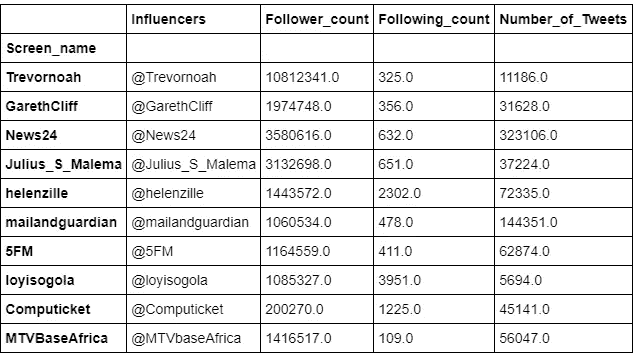
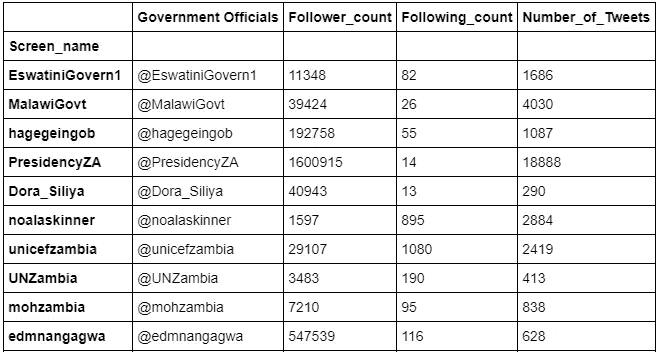
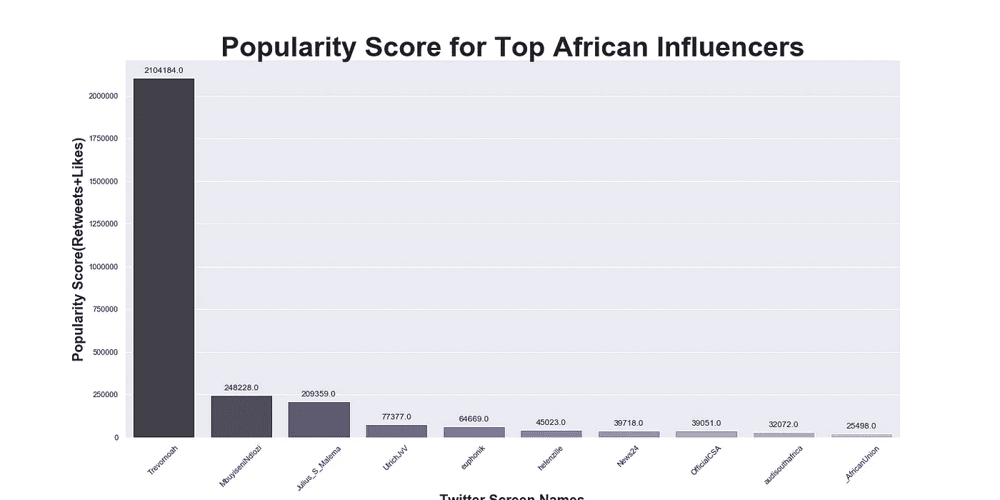
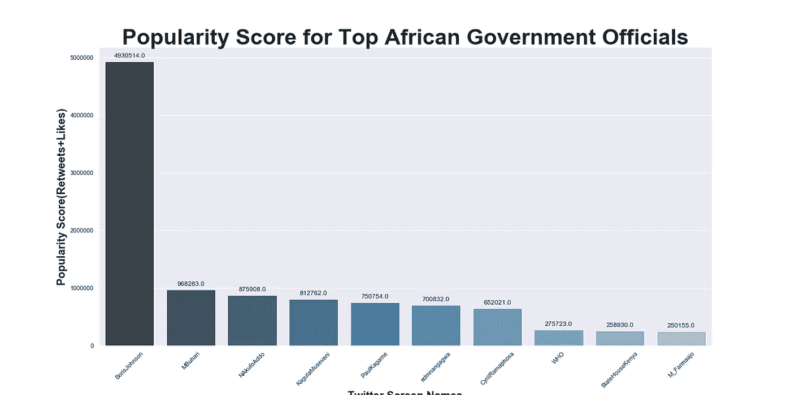
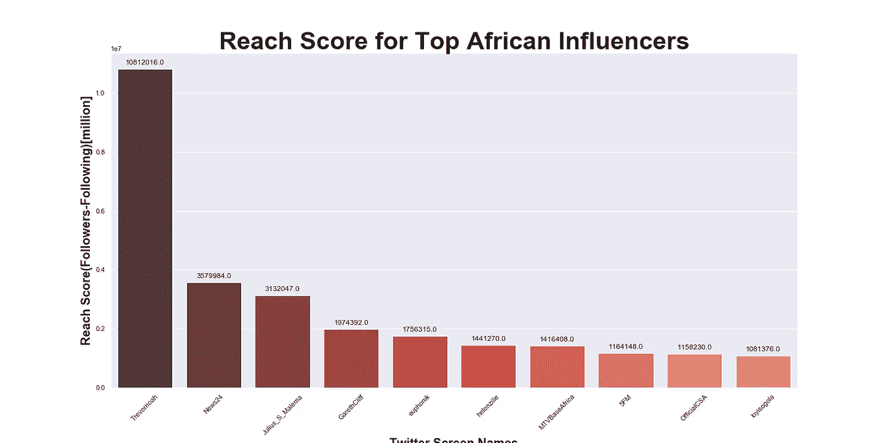
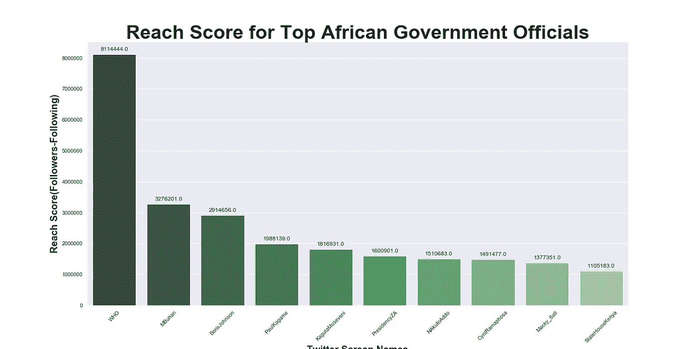

# Twitter 数据挖掘——测量用户的影响力

> 原文：<https://towardsdatascience.com/twitter-data-mining-measuring-users-influence-ef76c9badfc0?source=collection_archive---------34----------------------->

## 追随者和影响力；科学见解

当有人说一个人在 twitter 上有影响力时，首先想到的是*‘他/她可能有很多粉丝’；*这可能对每个人都不一样，但我确实有过这样的想法，我也遇到过几个这样想的人。

这些影响者到底是谁？这个[网站](https://influencermarketinghub.com/what-is-an-influencer/#:~:text=An%20influencer%20is%20someone%20who,he%20or%20she%20actively%20engages.)给出了详细的定义，对于这个项目，我们将考虑使用 twitter 的社交媒体影响者。

> 社交媒体中的影响者是那些因其在特定主题上的知识和专长而建立了声誉的人。他们在自己喜欢的社交媒体渠道上定期发布关于这个话题的帖子，并产生了大量热情参与的人，这些人密切关注他们的观点。

作为在 [10 学院](https://www.10academy.org/)受训的一个好处，我开始意识到有很多追随者并不等于有影响力。这个项目展示了我测量用户在 twitter 上的影响力的科学方法，采用的指标包括:popularity_score 和 reach_score，同时考虑到 ***【跟随者谬误】*** 如本文[所讨论的](http://twitter.mpi-sws.org/icwsm2010_fallacy.pdf)。

# 数据收集和数据争论

## **网页抓取**

我采取的第一步是使用 *BeautifulSoup(一个 python 库)*从下面的网站获取一些非洲有影响力的人和政府官员的 twitter 账号。这些网站使用关注者计数和其他指标对有影响力的人和政府官员进行排序。

*   [非洲最具影响力的 100 名 Twitter 用户](https://africafreak.com/100-most-influential-twitter-users-in-africa)
*   [非洲领导人在推特上回应冠状病毒](https://africafreak.com/100-most-influential-twitter-users-in-africa)

**影响者**

```
#importing libraries
import requests
from bs4 import BeautifulSoup#getting the page
page_inf = requests.get("https://africafreak.com/100-most-influential-twitter-users-in-africa")soup = BeautifulSoup(page_inf.content, 'html.parser')
inf_list = soup.find_all('h2')
```

政府官员

```
#getting the page
page_gov = requests.get("[https://africafreak.com/100-most-influential-twitter-users-in-africa](https://www.atlanticcouncil.org/blogs/africasource/african-leaders-respond-to-coronavirus-on-twitter/#east-africa)")soup = BeautifulSoup(page_gov.content, 'html.parser')
gov_list = soup.find_all(class='wp-block-embed__wrapper')
```

BeautifulSoup 总是以列表形式返回对象，并且可能包含不需要的额外数据，所以我必须做一些清理工作来获取这些影响者和政府官员的 twitter 句柄，将其转换为 Pandas DataFrame，并将其保存为 csv 文件。

```
#import the necessary libraries
import re
import pandas as pd#cleaning the data
inf_list = re.findall(r"@[\w]*", inf_list)
gov_list = re.findall(r"@[\w]*", gov_list)#converting to dataframe and saving as csv file
inf_df = pd.DataFrame(inf_list, columns=['Handles'])
inf_df.to_csv('influencers.csv')gov_df = pd.DataFrame(gov_list, columns=['Handles'])
gov_df.to_csv('officials.csv')
```

## Twitter API

下一步是通过使用开发人员的帐户凭证访问 Twitter API 来收集关于这些影响者和政府官员的信息。

```
import tweepy#Variables that contains the user credentials to access Twitter API 
consumer_key = 'XXXXXXXXXX'
consumer_secret = 'XXXXXXXXX'
access_token = 'XXXXXXXXX'
access_token_secret = 'XXXXXXXXXXX'#This handles Twitter authentication and the connection to Twitter Streaming API
auth = OAuthHandler(consumer_key, consumer_secret)
auth.set_access_token(access_token, access_token_secret)

api = tweepy.API(auth)
```

以下是收集的用户信息列表:

*   网名
*   追随者计数(追随者数量)
*   朋友计数(关注人数)
*   状态计数(推文数量)
*   最喜欢的计数(喜欢的数量)
*   转发计数(转发次数)

收集这些信息的方法如下所示

```
#getting the followers count, following, number of tweets, and screen name
followers_count = {}
following_count ={}
num_of_tweets = {}
screen_name = {}for count in range(len(inf_list)):
    try:
        user = api.get_user(inf_list[count])
        followers_count[inf_list[count]]= user.followers_count
        following_count[inf_list[count]] = user.friends_count
        num_of_tweets[inf_list[count]] = user.statuses_count
        screen_name[inf_list[count]] = user.screen_name
    except Exception as e:
        pass
```

详细代码可以在这个 [GitHub 库](https://github.com/gloryodeyemi/10AcademyWeeklyChallenges/tree/master/week1)中找到。下面是一个为非洲影响者获取的数据示例。



作者图片



作者图片

# 数据分析

在收集的数据中，为每个用户计算了以下指标:

*   population _ score = Retweets+赞
*   Reach_score = Followers —关注

```
#calculating the popularity score
new_inf_df['Popularity_score'] = new_inf_df['Retweet_count'] + new_inf_df['Favorite_count']#calculating the reach score
new_inf_df['Reach_score'] = new_inf_df['Follower_count'] - new_inf_df['Following_count']
```

## 结果—数据可视化

在计算了每个用户的指标之后，我利用 seaborn(一个 python 库)通过按照如图所示计算的每个指标对数据帧进行排序来可视化结果。

```
##data visualization - government officials#importing library for data visualization
import seaborn as sns#bar plot - reach score
plt.figure(figsize=(20,10)) #customizing the size of the plot
sns.set(style="darkgrid") #customizing the style of the plot#visualizing the data using bar plot
ax = sns.barplot(x='Screen_name', y='Reach_score', palette="Greens_d",
                data=new_gov_df.sort_values(by='Reach_score', ascending=False)[0:10]
                )#getting the values of the data
for p in ax.patches:
    ax.annotate(format(p.get_height()), (p.get_x() + p.get_width() / 2.,
                            p.get_height()), ha = 'center', va = 'center', 
                            xytext = (0, 10), textcoords = 'offset points')#setting the parameters for the title, x and y labels of the plot
ax.set_title("Reach Score for Top African Government Officials", size=40, weight='bold')
ax.set_xlabel("Twitter Screen Names", size=20, weight='bold')
ax.set_ylabel("Reach Score(Followers-Following)", size=20, weight='bold')#changing the rotation of the x axis tick labels 
for item in ax.get_xticklabels():
    item.set_rotation(45)

plt.savefig('reach.png') #saving the figure
plt.show()
```

详细代码可以在这个 [GitHub 库](https://github.com/gloryodeyemi/10AcademyWeeklyChallenges/tree/master/week1)中找到。

**人气评分**



作者图片



作者图片

**到达分数**



作者图片



作者图片

## 观察和见解

从上面显示的可视化分析结果可以看出，前 10 名非洲影响者和政府官员的受欢迎程度得分和影响力得分有所不同。

**例 1:**

世卫组织(政府官员)

*   得分= 8，114，444
*   人气评分= 275，723

**新闻 24** (影响者)

*   得分= 3，579，984
*   人气评分= 39，718

查看上面的示例 1，我们可以看到到达分数和流行分数之间的巨大差距。这些用户有很多追随者；然而，与他们的追随者相比，参与他们推文的人数并不多。

**例 2:**

鲍里斯约翰逊(政府官员)

*   得分= 2，914，656
*   人气评分= 4，930，514

**MbuyiseniNdozi** (影响者)

*   得分=不在前 10 名
*   人气分= 248228

在示例 2 中，我们看到了这样一种情况，用户的可及性得分低于他们的受欢迎度得分。这里看到的影响者的影响力得分甚至不在前 10 名之列，但受欢迎程度得分在图表上排名第二。

## 结论

该项目旨在纠正拥有大量追随者就等同于成为有影响力的人的观念，从分析中获得的结果支持了这一目标。流行度分数显示了参与用户推文的人数，与到达分数相比，它被证明是更好的影响力衡量标准。

**深造**

除了通过人气得分和到达得分来衡量用户的影响力，还可以考虑相关性得分(用户提及+评论)和他们在推文中使用的标签。

关于这个项目的详细信息可以在这个 [GitHub 资源库中找到。](https://github.com/gloryodeyemi/10AcademyWeeklyChallenges/tree/master/week1)

感谢您的阅读。

## 参考

*   [社交媒体中的影响者](https://influencermarketinghub.com/what-is-an-influencer/#:~:text=An%20influencer%20is%20someone%20who,he%20or%20she%20actively%20engages.)
*   [网页抓取](https://www.dataquest.io/blog/web-scraping-tutorial-python/)
*   [非洲最具影响力的 100 名 Twitter 用户](https://africafreak.com/100-most-influential-twitter-users-in-africa)
*   [非洲领导人在推特上回应冠状病毒](https://www.atlanticcouncil.org/blogs/africasource/african-leaders-respond-to-coronavirus-on-twitter/#east-africa)
*   [衡量 Twitter 用户影响力:百万追随者谬误](http://twitter.mpi-sws.org/icwsm2010_fallacy.pdf)
*   [Python 正则表达式](https://www.w3schools.com/python/python_regex.asp)