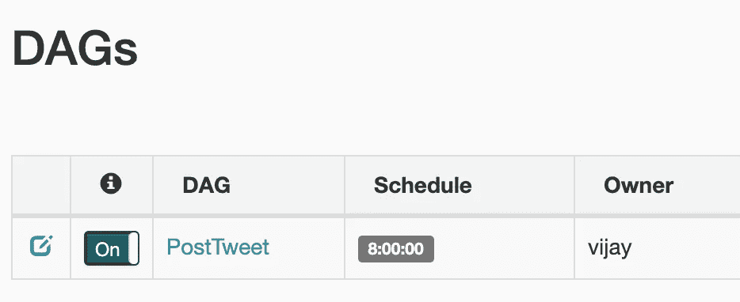

# 使用气流的 Twitter 调度程序

> 原文：<https://towardsdatascience.com/twitter-data-pipeline-using-apache-airflow-24e0881c214d?source=collection_archive---------25----------------------->


鸣谢:[https://dribbble . com/shots/5370290-Website-for-bZx-Metaphor-Design](https://dribbble.com/shots/5370290-Website-for-bZx-Metaphor-Design)

为什么你甚至需要一个 Twitter 调度程序？

所有的 Twitter 名人或你在 Twitter 上认识的任何企业，可能都在使用某种调度程序来准时发布他们的推文。

如果你有一堆各种主题的推文草稿，并且想自动发布它们而不用担心时间问题。这个日程表会让你的生活更轻松。

因此在本文中，您将**使用 Apache Airflow 构建一个 Twitter 调度器**。

最后，你会有一个运行中的管道，你的推文会在预定的时间段发布。此外，如果您想亲自体验运行在 Docker 上的 Apache Airflow，那么这可能是一个不错的起点。

先说这个 bot 话题。😄

# 气流到底是什么？

Apache Airflow 是一个工作流调度器，本质上是一个 python 框架，允许运行 Python 可以执行的任何类型的任务。例如发送电子邮件、运行 Spark 作业、Hadoop 任务以及在 Postgres 数据库上运行 SQL 查询等

# 设置计划程序的先决条件

在 docker 上运行 Airflow 是运行应用程序的最佳方式，它消除了各种环境设置错误。我假设你对 docker 的概念比较熟悉，并且你的机器上已经安装了 Docker。在互联网上找到的最好的气流 docker 图像之一是 [puckel/docker-airflow](https://github.com/puckel/docker-airflow) ，你可以克隆这个 repo 并开始构建你的数据管道，但如果你想完成这个项目，那么我会建议你克隆这个 repo[**VJ GPT/Twitter-pipeline**](https://github.com/vjgpt/twitter-pipeline)，在这里我对之前的 repo 的 docker 文件和 docker-compose 文件进行了更改，以符合这个项目。这个 repo 还包括 Twitter 调度 DAG，这是你对这个项目的所有要求。

如果你还没有克隆回购协议，👇

[](https://github.com/vjgpt/twitter-pipeline) [## vjgpt/twitter-pipeline

### 在这里，我们将建立一个 Twitter 调度数据管道，这个想法是收集数百条推文在一个文件中…

github.com](https://github.com/vjgpt/twitter-pipeline) 

但是在你开始这条管道之前，你需要做两件事:

1.  创建一个 **Twitter 开发者 API 账户**。([申请访问— Twitter 开发者| Twitter 开发者](https://developer.twitter.com/en/apply-for-access))
2.  **启用 Google Drive v3** 备份你所有的数据。( [Python 快速入门| Google Drive API | Google 开发者](https://developers.google.com/drive/api/v3/quickstart/python))

创建完 Twitter 开发者账户后，确保保存了所需的密钥和凭证，并将其放在`**topic_tweet.py**`文件中

```
consumer_key = ''           # Add your API key here
consumer_secret = ''        # Add your API secret key here
access_token = ''           # Add your Access Token key here
access_token_secret = ''    # Add your Access Token secret key here
```

要设置 Google Drive API，您需要在本地机器上创建一个 python 环境，并遵循上面的链接。在你允许你的应用后，你会得到两个文件`**credentials.json**`和`**token.pickle**`。复制这两个文件，放入 repo `*twitter-pipeline/dags/daglibs*` 文件夹路径。

```
├── dags
│   ├── daglibs
│   │   ├── **credentials.json**
│   │   ├── etl_job.py
│   │   ├── **token.pickle**
│   │   ├── topic_tweet.py
│   │   └── upload.py
│   └── post_tweet.py
├── data
```

# 让我们开始码头集装箱🚢

我们将在本地执行器模式下运行 Airflow，这意味着合成文件不会构建您的图像，在继续之前，您可以自己在本地构建它。

```
cd twitter-pipelinedocker build -t aflatest .
```

下面是`docker-compose-LocalExecutor.yml`的文件。

你可以在上面的 compose 文件中看到 ***volume*** 部分，它基本上在本地机器和 docker 容器之间创建了一个桥梁。它有助于在本地卷和 Docker 路径之间持久化数据。您将 dag 文件添加到本地机器，它将反映在您的 docker 容器中，并最终反映在 Airflow UI 中。

现在您已经准备好启动这些容器并运行 Apache Airflow，确保您位于`twitter-pipeline` repo 的主路径中。

```
docker-compose -f docker-compose-LocalExecutor.yml up -d
```

**docker-compose up -d** 在后台启动你的容器(即分离模式)

您可以使用**拆除**合成设置

```
docker-compose -f docker-compose-LocalExecutor.yml down 
```

您可以使用以下命令检查在后台模式下运行的服务的日志

```
docker-compose -f docker-compose-LocalExecutor.yml logs
```

点击 [**的网页界面 http://localhost:8080**](http://localhost:8080)

您应该可以看到您放在`./dags`目录中的任何 Dag，尽管有时它们可能需要一分钟才能显示出来。

一旦 DAG 出现，您对 python 文件所做的任何更改将在下次触发 DAG 时立即生效。

PS:打开 dag 激活它。



# Twitter 调度程序管道

好了，现在你的气流在你的码头集装箱上流动，让我们了解一下这条管道是如何工作的。

在`data/tweets`文件夹中有一些文件，用户把他/她所有起草的推文放在那里。我们把所有的推文都放到一个 CSV 文件中，这是所有推文文件的合并。参照这个 CSV 文件，我们发布推文并做出相应的更改。最后，所有的 CSV 文件和文本文件都备份在 google drive 中，以防发生致命的事情。

这整个过程可以在预定的 DAG 运行时发送你起草的推文。


图片来源:【https://dribbble.com/shots/3166602-Twitter 

## post_tweet.py

这是主 DAG 文件，显示在你的气流用户界面中，它包含你在这个 python 文件中定义的任务。

```
# DAG is scheduled to run every 8 hoursdag = DAG('PostTweet',schedule_interval=timedelta(hours=8), default_args=default_args)
```

该 DAG 计划每 8 小时运行一次，您可以根据需要更改运行时间。

## etljob.py

这是大部分数据管道发生的地方。它把你从不同文件中起草的推文合并成一个文件。

该文件中的每个函数都被视为 DAG 中的一个任务。

## topic _ tweet.py

在这里，我们连接到 Twitter API 并发布推文。这个文件需要在 Twitter 开发人员 API 控制台登录时生成的所有密钥和秘密。

## 上传. py

此文件将所有与此管道相关的数据备份到您的 Google Drive 帐户。

**现在，让我们测试这条管道。**

在`data/tweets`文件夹中的 txt 文件中添加一些 tweet，你可以添加多个 tweet 到那个文件中，或者创建一个新文件并在其中添加 tweet。然后触发管道，你会发现你的推文发布在你的 Twitter 账户上，所有文件都备份在 Google Drive 上。

干杯！！！🥂

# 结束了！！

这只是您刚刚制作的一个演示管道，但是您可以使用同一组基础设施，通过几个用例来制作更多这样的管道。

如果你有兴趣更深入地研究这个话题，那么试着创建一个比我们现在做的更好的可扩展架构。在这个架构中，我们使用了 LocalExecutor，并且有一个不可伸缩的 singletons 调度程序。尝试使用 CeleryExecutor 模式，在这种模式下，工作从任务队列中分发出去，所有任务都是分布式的。

哦，等等..如果这对你有所帮助，请支持我的工作。

这是这个项目的回购👇

[](https://github.com/vjgpt/twitter-pipeline) [## vjgpt/twitter-pipeline

### 此时您不能执行该操作。您已使用另一个标签页或窗口登录。您已在另一个选项卡中注销，或者…

github.com](https://github.com/vjgpt/twitter-pipeline)