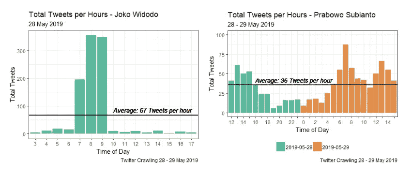

# 初学者使用 ggplot2 的 Twitter 数据可视化介绍

> 原文：<https://towardsdatascience.com/twitter-data-visualization-fb4f45b63728?source=collection_archive---------46----------------------->

由[拉维·夏尔马](https://unsplash.com/@ravinepz?utm_source=medium&utm_medium=referral)在 [Unsplash](https://unsplash.com?utm_source=medium&utm_medium=referral) 拍摄的照片

## [动手教程](https://towardsdatascience.com/tagged/hands-on-tutorials)

## 如何使用 R (ggplot2)交互式地可视化您的 Twitter 数据

## 概观

F 对于这个项目，我们使用的是 2019 年 5 月 28 日—29 日抓取的 Twitter 的原始数据。此外，数据为 CSV 格式(逗号分隔)，可在此处 下载 [**。它涉及两个主题，一个是佐科·维多多的数据，包含关键字*【佐科·维多多】*，另一个是 Prabowo Subianto 的数据，包含关键字*【Prabowo subi anto】*。这些包括几个变量和信息，以便确定用户情绪。实际上，数据有 16 个变量或属性和 1000 多个观察值(两种数据都有)。表 1 列出了一些变量。**](https://github.com/audhiaprilliant/Indonesia-Public-Election-Twitter-Sentiment-Analysis/tree/master/Datasets)

导入模块

数据的变量(图片由作者提供)

## 数据可视化

数据探索旨在从 Twitter 数据中获取任何信息和洞察力。应该指出的是，数据进行了文本预处理。对被认为很有兴趣讨论的变量进行探索。例如，变量`**created**` *。*

为 tweet 活动创建条形图(佐科·维多多和普拉博沃·苏比安托)

图 1 佐科·维多多(左)和普拉博沃·苏比安托(右)的推文总数直方图(图片由作者提供)

根据图 1，我们可以得出结论，通过数据抓取(对于关键字*“佐科·维多多”*和*“普拉博沃·苏比安托”*)的推文数量并不相似，即使是在同一天。例如图 1(左)，直观地表示仅在 WIB 2019 年 5 月 28 日 03:00-17:00 期间获得了带有关键词*“佐科·维多多】*的推文。而在图 1(右)上，我们得出结论，在 2019 年 5 月 28 日至 29 日 WIB 12:00-23:59(2019 年 5 月 28 日)和 WIB 00:00-15:00(2019 年 5 月 29 日)期间获得的带有关键字 *"Prabowo Subianto"* 的推文。

为 tweet 活动创建条形图(Prabowo Subianto)

图 Prabowo Subianto(左)2019 年 5 月 28 日和(右)2019 年 5 月 29 日的总推文直方图(图片由作者提供)

基于图 2，我们得到了使用关键字*“佐科·维多多”*和*“Prabowo subi anto”*发推文的用户之间的显著差异。带有关键词*【佐科·维多多】*的推文往往会在某个时间(07:00-09:00 WIB)激烈地谈论佐科·维多多，其中 08:00 WIB 的推文数量最多。它有 348 条推文。而带有关键字*“Prabowo Subianto”*的推文倾向于在 2019 年 5 月 28 日至 29 日期间不断谈论 Prabowo subi anto。2019 年 5 月 28 日至 29 日上传的带有关键词*“Prabowo subi anto”*的平均每小时推文数为 36 条。

创建情绪得分的密度图(佐科·维多多和普拉博沃·苏比安托)

图 3 情绪得分密度图(左)佐科·维多多和(右)普拉博沃·苏比安托(图片由作者提供)

图 3 是 2019 年 5 月 28 日—29 日，以*【佐科·维多多】**【Prabowo subi anto】*为关键词的多条推文的柱状图。根据图 3(左)，可以得出结论，正在谈论 Prabowo Subianto 的用户每小时上传的平均推文数少于每小时 30 条推文的两天推文总数。Twitter 用户在 WIB 时间 19:00–23:59 不太热衷于谈论 Prabowo Subianto。是印尼的休息时间造成的。然而，由于居住在国外的用户或仍然活跃的用户，带有其主题的推文总是在午夜更新。然后，用户在 WIB 时间 04:00 开始活动，在 WIB 时间 07:00 达到高峰，然后下降，直到 WIB 时间 12:00 再次上升。

创建一个情绪得分条形图(佐科·维多多和普拉博沃 Subianto)

图 4 情绪得分柱状图(左)佐科·维多多和(右)普拉博沃·苏比安托(图片由作者提供)

图 4 是包含关键词*【佐科·维多多】**【Prabowo subi anto】*的情感得分的密度图。推文的得分是由组成推文的词根的平均得分获得的。因此，它的分数是为每个词根给出的，值在-10 到 10 之间。如果分数越小，那么对推文中的词的负面情绪就越多，反之亦然。根据图 4(左)，可以得出结论，包含关键词*“佐科·维多多”*的推文的负面情绪范围为-10 到-1，中间值为-4。这也适用于积极的情绪(当然是积极的分数)。根据图 4(左)中的密度图，可以发现积极情绪的得分具有相当小的方差。因此，我们得出结论，对包含关键词*“佐科·维多多”*的推文的积极情绪并不太多样化。

图 4(右)显示了包含关键字*“Prabowo subi anto”*的情感得分的密度图。它与图 4(左)不同，因为图 4(右)中的负面情绪范围从-8 到-1。暗示推文没有太多负面情绪(推文有负面情绪，但不够高)。此外，负面情绪得分的分布在 4 和 1 的范围内有两个峰值。然而，积极情绪的范围是从 1 到 10。与图 4(左)相反，图 4(右)中的积极情绪具有很高的方差，并且在 3 和 10 的范围内具有两个峰值。这表明包含关键字*“Prabowo subi anto”*的推文具有高正面情绪。

为情感类创建一个饼图(Jowo Widodo 和 Prabowo Subianto)

图 5 情感类饼图(左)佐科·维多多和(右)普拉博沃·苏比安托(图片由作者提供)

图 5 是已被分类为负面、中性和正面情绪的推文的情绪得分汇总。负面情绪是得分小于零的情绪。中性是得分等于零的情绪。反之，积极情绪的得分大于零。根据图 5，可以得出带有关键字*【佐科·维多多】*的推文的负面情绪百分比低于带有关键字*【Prabowo subi anto】*的推文。它有 6.3%的百分比差异。还发现，与具有关键字*“Prabowo subi anto”*的推文相比，包含关键字*“佐科·维多多”*的推文具有更大百分比的中性情绪和积极情绪。通过对饼状图的研究发现，与关键字为*“Prabowo subi anto”*的推文相比，关键字为*“佐科·维多多”*的推文往往有更大比例的正面情绪。但通过密度图发现，正面和负面情绪得分的分布显示，与*“佐科·维多多”*相比，包含关键词*“Prabowo subi anto】*的推文往往具有更大的情绪得分。它必须进行进一步的分析。

图 6 推文中的 Wordcloud(左)佐科·维多多和(右)普拉博沃·苏比安托(图片由作者提供)

图 6 显示了用户在 2019 年 5 月 28 日-29 日经常上传的推文中的术语或单词(关键词*“佐科·维多多”*和*“普拉博沃·苏比安托”*)。通过这种 WordCloud 可视化，可以发现针对关键词进行讨论的热门话题。对于包含关键词*【佐科·维多多】*的推文，发现词条*【tuang】【petisi】【negara】【aman】**【NUS antara】*是每条推文中出现次数最多的前五个词条。然而，包含关键字*“佐科·维多多”*的推文发现，术语*“普拉博沃”、“Subianto”、“kriminalisasi”、“selamat”、“T13”和*“迪拜”*是每条推文中出现次数最多的前五个术语。这间接显示了使用关键字*“Prabowo subi anto”*上传的推文的模式:几乎可以肯定，每条上传的推文都直接包含了名字*“Prabowo subi anto”*，而不是通过提及(@)。这是因为，在文本预处理中，提示音(@)已被删除。*

请前往我的 [**GitHub repo**](https://github.com/audhiaprilliant/Indonesia-Public-Election-Twitter-Sentiment-Analysis) 查看完成的代码。

## 参考

[1] K .博劳，c .，j .冯，r .沈 [*【微博语言学习:利用推特培养交际和文化能力*](https://www.researchgate.net/publication/220886248_Microblogging_for_Language_Learning_Using_Twitter_to_Train_Communicative_and_Cultural_Competence) (2009)，网络学习的进步——ICWL 2009，第八届国际会议，德国亚琛，2009 年 8 月 19 日至 21 日。