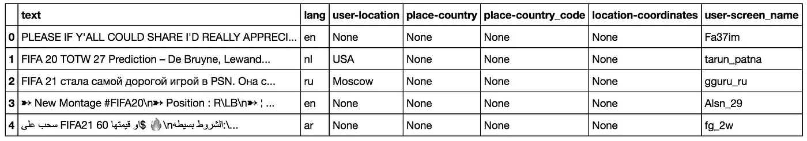
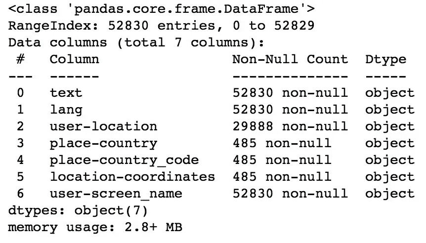
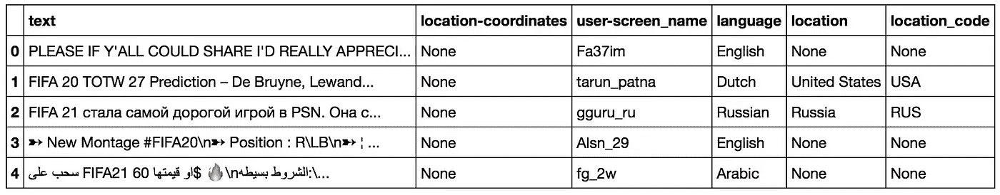

# Twitter JSON 数据处理

> 原文：<https://towardsdatascience.com/twitter-json-data-processing-3f353a5deac4?source=collection_archive---------7----------------------->

## 使用 python 库清理和润色用于社交媒体分析的推文数据帧。


由[拉维·夏尔马](https://unsplash.com/@ravinepz?utm_source=medium&utm_medium=referral)在 [Unsplash](https://unsplash.com?utm_source=medium&utm_medium=referral) 拍摄的照片

witter 允许使用用于访问 Twitter API 的 Python 库 tweepy 来收集 tweepy。在这里，我不打算给出如何收集 tweet 的教程，因为已经有一些好的评论了(看看下面的参考资料)，而是给你一个完整的例子，说明如何处理 tweet 对象，以便建立一个干净的数据框架，我们可以在这个框架上进行社交媒体分析。

**TL；TR:** 在这个过程中，我们将展平 Twitter JSON，在几个选项(主推、转发、引用等)中选择文本对象。)，清理它们(删除非字母字符)，翻译非英语推文，计算文本的情感，以及关联给定用户定义的位置或自动地理定位的位置。

**要使用的库:** [熊猫](https://pandas.pydata.org)[国家转换器](https://pypi.org/project/country-converter/)[GeoPy](https://geopy.readthedocs.io/en/stable/#)[spaCy](https://spacy.io)[Google trans](https://pypi.org/project/googletrans/)[NLTK](https://www.nltk.org)。

每个 [*tweet 对象*](https://developer.twitter.com/en/docs/tweets/data-dictionary/overview/tweet-object) 以 JSON 格式出现，*混合了“根级”属性和子对象(用* `*{}*` *符号表示)*。Twitter 开发者页面给出了以下例子:

```
{
 "created_at": "Wed Oct 10 20:19:24 +0000 2018",
 "id": 1050118621198921728,
 "id_str": "1050118621198921728",
 "text": "To make room for more expression, we will now count all emojis as equal—including those with gender‍‍‍ ‍‍and skin t… https://t.co/MkGjXf9aXm",
 "user": {},  
 "entities": {}
}
```

当然，这只是组成每条推文的庞大字典中的一小部分。另一个流行的例子是这个 [Twitter 状态对象图](http://www.slaw.ca/wp-content/uploads/2011/11/map-of-a-tweet-copy.pdf)。

对于大多数类型的分析，我们肯定需要属性，如 tweet 文本、用户屏幕名称或 tweet 位置。不幸的是，正如您所看到的，这些属性没有一个清晰的格式，相反，它们分布在 JSON 的各个层次上——例如，tweet 位置坐标位于

```
tweet_object['place']['bounding_box']['coordinates']
```

正是由于这一事实，收集的推文需要一个大的清理和转换过程，这就是这篇文章的目的。

## 推特数据

我最近进行了一个[语言本地化](https://en.wikipedia.org/wiki/Language_localisation)项目，我需要在 Twitter 上做一个社交媒体分析。为此，我在几天的时间里收集了 **52830 条**包含以下关键词的推文: **'#FIFA20'** ，' **#FIFA21'** ， **'FIFA20'** ， **'FIFA21'** ， **'FIFA 20'** ， **'FIFA 21'** 和**' # easporter 然后，为了对它们进行正确的分析，我必须事先清理每个 tweet 对象，这样我才能得出有意义的结论。**

由于该项目的性质，我主要感兴趣的是关于推文位置的数据(国家和坐标)，英文版本文本的情感，以及推文使用的语言。加工步骤的目标是完善和发现这些属性。您可以在以下存储库中找到该项目的详细信息:

[](https://github.com/hectoramirez/Language-localization_FIFA) [## hectoramirez/语言-本地化 _FIFA

### 这是一个端到端的项目，我们的目标是执行国际足联视频游戏的语言本地化，只有公众…

github.com](https://github.com/hectoramirez/Language-localization_FIFA) 

让我们用这个数据集来举例说明 tweets 处理的步骤！

# 处理 JSON

正如我们看到的，在包含文本数据的 [Twitter JSON](https://developer.twitter.com/en/docs/tweets/data-dictionary/overview/tweet-object) 中有多个字段。在典型的 tweet 中，有 tweet 文本、用户描述和用户位置。在超过 140 个字符的 tweet 中，还有扩展 tweet 子 JSON。在引用的推文中，有原始推文和引用推文的评论。

为了大规模分析 tweet，我们需要将 tweet JSON 扁平化为一个层次。这将允许我们以数据帧格式存储推文。为此，我们将定义函数`flatten_tweets()`，该函数将接受几个关于文本和位置的字段(该字段存储在`place`中)。看一看:

现在，您可能想要研究所有的文本字段(主字段、转发字段或引用字段)，但是，为了简单起见，这里我只保留一个文本字段。为此，我们现在定义一个函数`select_text(tweets)`来选择主要文本，无论该推文是主要推文还是转发推文，我们决定删除引用的文本，因为它通常是重复的，可能没有信息。

我们现在构建数据框。请注意，我们选择了与社交媒体分析相关的主要列(字段)。这包括 tweet 语言、`lang`和由用户手动设置的`user-location`。我们还保留了`place`中的`country`、`country_code`和`coordinates`字段。当推文被地理标记时，这些字段就会出现，并且通常包含在不到 10%的推文中。以下代码块构建了数据帧:

```
**import** **pandas** **as** **pd**

*# flatten tweets*
tweets = flatten_tweets(tweets_data)

*# select text*
tweets = select_text(tweets)
columns = ['text', 'lang', 'user-location', 'place-country', 
           'place-country_code', 'location-coordinates', 
           'user-screen_name']

*# Create a DataFrame from `tweets`*
df_tweets = pd.DataFrame(tweets, columns=columns)*# replaces NaNs by Nones*
df_tweets.where(pd.notnull(df_tweets), **None**, inplace=**True**)
```

数据帧的头部看起来像这样:



df_tweets.head()



df_tweets.info()

请注意，几乎只有一半的推文包含手动设置的用户位置字段，甚至 1%的推文都没有地理标记，*即*，它们没有提供*位置*字段。这凸显了收集尽可能多的推文的重要性！

在下文中，我们感兴趣的是清理和抛光每个 dataframe 列。

# 语言

在流程的这一部分，我们将用语言标准名称替换`lang`中的语言代码。如文档中所述:

> 如果存在，[ `lang` ]表示与机器检测到的 Tweet 文本语言相对应的 BCP 47 语言标识符，如果没有检测到语言，则为`*und*`。

我们使用[这个库](https://github.com/annexare/Countries/tree/master/data)中的辅助`languages.json`文件来执行这个步骤。该文件将语言代码映射到语言标准名称。下面的代码将完成这个任务:

```
**with** open('languages.json', 'r', encoding='utf-8') **as** json_file:
    languages_dict = json.load(json_file)names = []
**for** idx, row **in** df_tweets.iterrows():
    lang = row['lang']
    **if** lang == 'und':
        names.append(**None**)
    **elif** lang == 'in':
        name = languages_dict['id']['name']
        names.append(name)
    **elif** lang == 'iw':
        name = languages_dict['he']['name']
        names.append(name)
    **else**:
        name = languages_dict[lang]['name']
        names.append(name)

df_tweets['language'] = names
df_tweets.drop(['lang'], axis=1, inplace=**True**)
```

# 位置

现在我们开始处理位置。我们将首先处理`place`字段，然后处理`user-location`字段。

## 地方

很明显,`place`对象中的数据比`user-location`更可靠。因此，虽然它构成了我们推文的 0.91%，但我们会照顾它。首先，`place-country_code`中的国家代码以 ISO 2 形式出现，为此我们将使用[国家转换器](https://github.com/konstantinstadler/country_converter)将其转换为 ISO 3 形式。然后，我们将执行同样的操作，将`place-country`名称改为标准的简称。这是有利的，因为，例如， **Plotly 地图使用 ISO 3 代码来定位国家。**

## 用户位置

在这里，我们将手动设置的`user-locations`翻译成国家名称和代码——这涉及到对用户的信任。我们使用 [GeoPy](https://geopy.readthedocs.io/en/latest/#) 库来识别一个位置(可能是一个地址)并为其分配一个国家。同样，我们使用`country_converter`来查找 ISO 3 表格中的国家代码。

**提醒一句** : GeoPy 连接到一个 API，不幸的是，每次调用几乎要花一秒钟。这使得计算~ 50 K tweets 的过程相当慢。

**注意:** [tqdm](https://tqdm.github.io) 是一个 python 库，对 pandas 有很好的实现，在代码运行时输出进度条。这会让你的生活更轻松！

最后，我们将`place-country`和`user-country`列减少为一列，当前者存在时保留前者，否则保留后者。我们对*代码*列进行同样的操作:

```
countries, codes = [], []
**for** idx, row **in** df_tweets.iterrows():
    **if** row['place-country_code'] **is** **None**:
        country = row['user-country']
        code = row['user-country_code']
        countries.append(country)
        codes.append(code)
    **else** :
        countries.append(row['place-country'])
        codes.append(row['place-country_code'])

df_tweets['location'] = countries
df_tweets['location_code'] = codes

*# drop old columns*
df_tweets.drop(columns=['place-country', 'place-country_code', 
                 'user-country', 'user-country_code'], inplace=**True**)
```

此时，我们的数据集如下所示:



df_tweets.head()

# 文本清理

现在是处理推文文本的时候了。这将涉及删除非字母字符和翻译非英语推文。然而，我们将保留这两个选项，并实际使用带有表情符号和其他字符的文本进行分析，因为我们的情感分析器可以很好地处理它们。

要删除非字母字符，我们使用 [spaCy](https://spacy.io/) ，因为它非常简单，我们不需要指定正则表达式。请记住，下面的代码块删除了带有撇号的表情符号和单词，如“我是”、“你们都是”、“不要”等。

```
**import** **spacy**

nlp = spacy.load('en_core_web_sm')

**def** cleaner(string):

    *# Generate list of tokens*
    doc = nlp(string)
    lemmas = [token.lemma_ **for** token **in** doc] *# Remove tokens that are not alphabetic* 
    a_lemmas = [lemma **for** lemma **in** lemmas **if** lemma.isalpha() 
                 **or** lemma == '-PRON-']    *# Print string after text cleaning*
    **return** ' '.join(a_lemmas)

df_tweets['text_cleaned'] = \
                   df_tweets['text'].progress_apply(cleaner)
```

## 翻译

为了**翻译**非英语推文，我们使用 [googletrans](https://pypi.org/project/googletrans/) ，作为 GeoPy，它连接到它的 API，然而它要快得多。

**另一个警告:**存在一个讨论过的记录不良的错误，*例如*，这里:[https://stack overflow . com/questions/49497391/Google trans-API-error-expecting-value-line-1-column-1-char-0](https://stackoverflow.com/questions/49497391/googletrans-api-error-expecting-value-line-1-column-1-char-0)，它会断开您的连接并阻止您的 IP。为了避免这个错误，我使用`np.array_split()`将数据帧分成几个块，在一个循环中一次处理一个块。通过这样做，错误不会发生，但是我仍然将每个块的翻译保存到一个`csv`中，这样如果在任何迭代中出错，我可以只重新计算一个块。我每次都会实例化`Translator()`。

最后，我们将原始的、未经处理的英文文本添加到`text_english`:

```
*# replaces NaNs by Nones*
df_english.where(pd.notnull(df_english), **None**, inplace=**True**)

*# add original English tweets to text_english by replacing Nones*
texts = []
**for** idx, row **in** df_english.iterrows():
    **if** row['text_english'] **is** **None**:
        text = row['text']
        texts.append(text)
    **else** :
        texts.append(row['text_english'])

df_english['text_english'] = texts
```

此时，数据帧看起来像这样:


df_english.head()

# 情感分析

我们最终计算每条推文的情感。为此，我们使用`nltk.sentiment.vader`库中 [NLTK](https://www.nltk.org/) 的`SentimentIntensityAnalyzer`对象。

> VADER (Valence Aware 字典和情感推理器)是一个基于词典和规则的情感分析工具，专门针对社交媒体中表达的情感。*[T22【参。】](https://medium.com/analytics-vidhya/simplifying-social-media-sentiment-analysis-using-vader-in-python-f9e6ec6fc52f)*

*这个库使用起来非常简单，如你所见:*

*请注意，`polarity_score`输出文本为负、中性或正的概率以及一个复合分数。然后，我们提取后者并将分数附加到数据帧中。*

# *结束*

*为了便于展示，我们对各列进行了重新排序。*

```
*cols_order = ['text', 'language', 'location', 'location_code', 
              'location-coordinates', 'sentiment', 'text_english', 
              'text_cleaned', 'user-screen_name']df_final = df_sentiment[cols_order]*
```

*最终数据集应该如下所示:*

**

*df_final.head()*

# *附加:一个简单的分析*

*为了举例说明可以用这个数据集做什么，让我们按国家建立一个平均推文情绪得分的可视化:*

*请注意，我们使用了一个国家/语言数据框架，它可以在[这个库](https://github.com/hectoramirez/Language-localization_FIFA/blob/master/Countries/countries_lang_full.csv)中找到。上面的代码输出以下 Plotly 地图:*

*这张世界地图看起来不太乐观😕*

***这篇文章中使用的全部代码可以在我的知识库中找到:***

*[](https://github.com/hectoramirez/Language-localization_FIFA/blob/master/Tweets%20processing%20and%20sentiment.py) [## hectoramirez/语言-本地化 _FIFA

### EA Sports 的 FIFA 本地化端到端研究。通过以下方式为 hectoramirez/Language-localization _ FIFA 的发展做出贡献…

github.com](https://github.com/hectoramirez/Language-localization_FIFA/blob/master/Tweets%20processing%20and%20sentiment.py) 

## 关于作者

我最近获得了物理学博士学位，目前正在进入数据科学领域。**非常感谢对这篇文章的任何评论和/或建议。**另外，看看我的其他故事:

[](/your-live-covid-19-tracker-with-airflow-and-github-pages-658c3e048304) [## 您的实时新冠肺炎跟踪与气流和 GitHub 网页

### 加载数据，用散景制作出色的可视化效果，将它们放在 GitHub Pages 网站上，让气流自动流动…

towardsdatascience.com](/your-live-covid-19-tracker-with-airflow-and-github-pages-658c3e048304) 

最后，请随时在 LinkedIn 与我联系:

[](https://www.linkedin.com/in/harr/) [## héctor ramírez-西班牙巴伦西亚地区|职业简介| LinkedIn

### 我最近获得了物理学博士学位，专攻实验数据分析和数学建模。我领导了…

www.linkedin.com](https://www.linkedin.com/in/harr/) 

# 参考

Datacamp 用 Python 分析社交媒体数据:

[](https://learn.datacamp.com/courses/analyzing-social-media-data-in-python) [## 签到

### 登录 DataCamp 帐户

learn.datacamp.com](https://learn.datacamp.com/courses/analyzing-social-media-data-in-python) [](/my-first-twitter-app-1115a327349e) [## 我的第一个 Twitter 应用

### 如何使用 Python 和 Tweepy 创建自己的数据集

towardsdatascience.com](/my-first-twitter-app-1115a327349e) [](/tweepy-for-beginners-24baf21f2c25) [## 适合初学者的 Tweepy

### 使用 Twitter 的 API 建立你自己的数据集

towardsdatascience.com](/tweepy-for-beginners-24baf21f2c25) [](/how-to-access-twitters-api-using-tweepy-5a13a206683b) [## 如何使用 Tweepy 访问 Twitter 的 API

### 使用易于使用的 Python 库获得大型 Twitter 数据集的分步指南(包含代码和技巧)

towardsdatascience.com](/how-to-access-twitters-api-using-tweepy-5a13a206683b) [](https://medium.com/@leowgriffin/scraping-tweets-with-tweepy-python-59413046e788) [## 用 Tweepy Python 抓取推文

### 这是一个使用 Python 库 Tweepy 抓取 Twitter tweets 的逐步指南。

medium.com](https://medium.com/@leowgriffin/scraping-tweets-with-tweepy-python-59413046e788)*