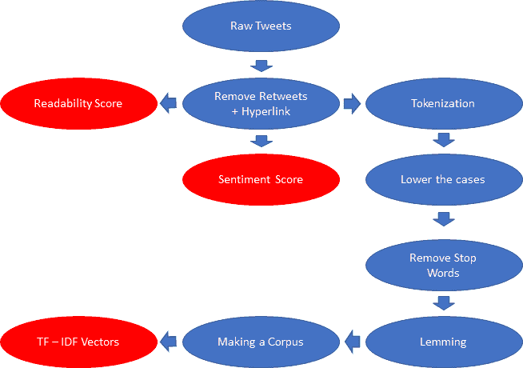
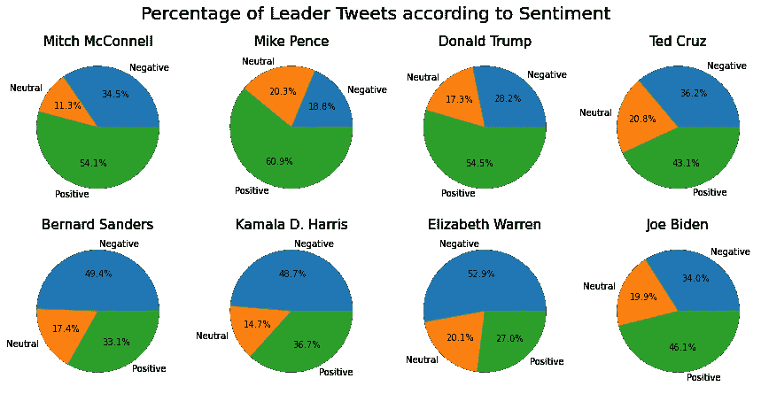
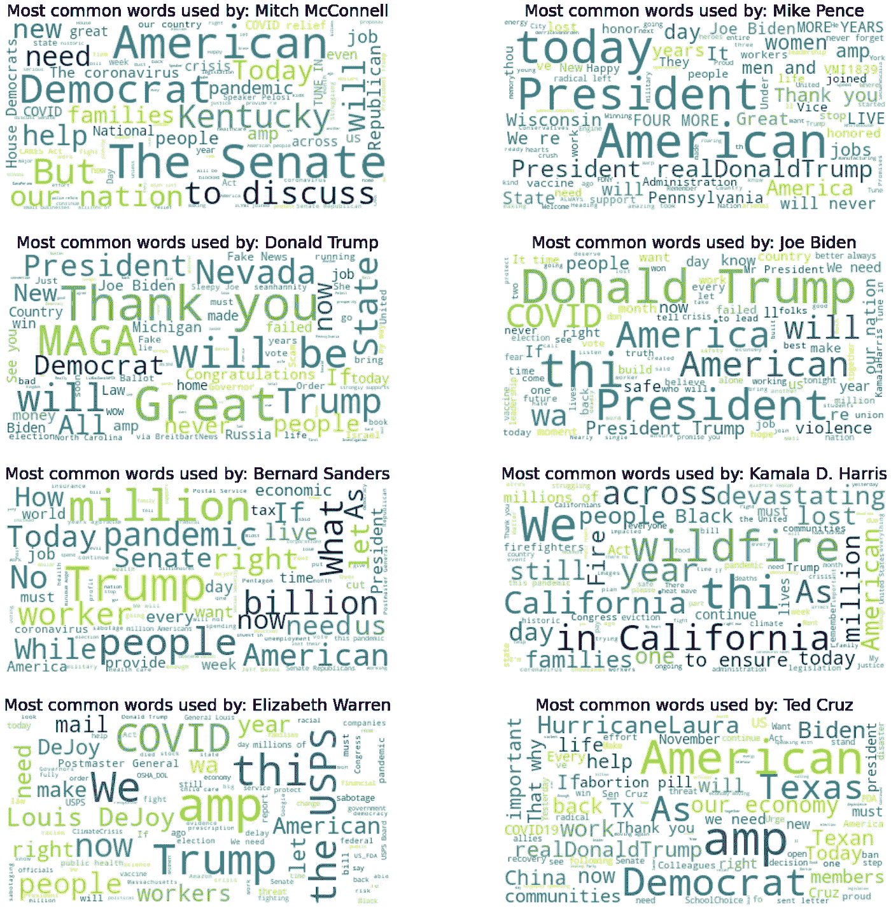
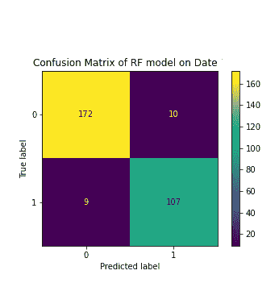
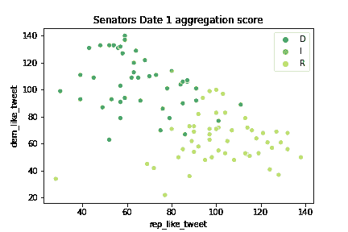

# Twitter 政治罗盘机器:自然语言处理方法与分析

> 原文：<https://towardsdatascience.com/twitter-political-compass-machine-a-nature-language-processing-approach-and-analysis-7e8152033495?source=collection_archive---------45----------------------->

## 如何使用 Twitter 和机器学习模型评估政治家的党派关系并监控政治分歧

随着 2020 年大选的进行，了解一个政治家的从属关系比以往任何时候都更重要。今天，我将教你如何建立一个机器学习模型，根据他们的推文预测政党归属。

## 数据争论

为了收集数据/推文，我们将使用 Twitter API。所有参议员的 Twitter 句柄都在这里:([https://www . sbh4all . org/WP-content/uploads/2019/04/116 th-Congress-Twitter-handles . pdf](https://www.sbh4all.org/wp-content/uploads/2019/04/116th-Congress-Twitter-Handles.pdf))

我还生成了一个两党领袖的列表，我们将使用它来训练我们的模型。

民主党:乔·拜登(总统候选人)，卡玛拉·哈里斯(副总统候选人)，伯尼·桑德斯，伊丽莎白·沃伦

共和党人:唐纳德·川普(总统)，迈克·彭斯(副总统)，米奇·麦康奈尔，特德·克鲁兹

## 数据/特色工程

为了收集有用的特征，我们必须将推文转换成某种向量。在下图中，我将展示我们将在该模型中使用的 3 个主要特性以及如何获得它们。



作者图片

现在我将详细解释为什么我选择这些特性，为什么我认为它们是必不可少的。

## 可读性分数

可读性分数表明一个人的写作水平，并将他或她的写作转化为评估一个人教育水平的数字。可读性是至关重要的，因为大量的报告显示，研究生或大学毕业生更有可能保持自由的观点。因此，政治家可能会迎合他们的基础，我们希望捕捉到这一点。

下面是我们用来增加可读性分数的代码；我们使用 textstat 包，把句子变成数字。(请参考他们的网站了解这种转换的细节/科学)。在这里，我们必须删除超链接和转发，因为超链接是一个名词，而不是一个名词，算法不会识别，转发，虽然可能分享他们的情绪，但不是他们的词。

```
import textstatdate2_df[‘retweet’] = date2_df[‘tweet’].str.contains(‘RT’)
date2_df[‘tweet_web_r’] = date2_df.tweet.str.replace(r’http\S+’,’’)
date2_df[‘TS’] = date2_df.tweet_web_r.apply(lambda x:textstat.text_standard(x,float_output =True))
date2_df = date2_df[date2_df[‘retweet’] == False]
date2_df = date2_df.reset_index(drop=True)
```

## 情感得分

我相信我们都听说过“让美国再次伟大！”。你大概可以猜到这句话有积极的情绪。情感是我们在写作中的感受。找到对一个特定主题的情感组合，将会给我们一个政治家可能保持的党派关系的概念。

例如:

**‘让美国再次伟大’**具体来说，可能是共和党人或川普会说的话(对美国的积极情绪)。

**“昨晚，乔·拜登说，没有一个拥有私人保险的人在奥巴马医改下失去了他们的计划。”大概是共和党人会说的话。(对奥巴马医改的负面情绪)。**

昨晚川普说我们正在疫情“度过难关”。“真的吗，”可能是民主党人会说的话(对特朗普的负面情绪)。

假设我们来看看政治领袖的推文百分比是如何分类的。(如下图)非常有趣的是，在这段时间里，大多数共和党领导人的推文都是正面的，而民主党人的推文大多是负面的。如果非要我猜的话，民主党人可能是在批评共和党人，或者在反思疫情带来的危险。这种区别应该有助于我们的模型。



作者图片

下面是我们用来给每条推文添加情感复合得分的代码。我们使用 VADER(化合价感知词典和情感推理机)包来做这件事。关于他们算法的细节，请参考他们的网站。此外，在得到分数之前，我们删除了超链接和转发。

```
from nltk.sentiment.vader import SentimentIntensityAnalyzerdate2_df[‘sentiment_score’] = date2_df[‘tweet_web_r’].apply(analyser.polarity_scores)
compound_score = []
sentiment_score = list(date2_df[‘sentiment_score’])for i in range(len(date2_df[‘sentiment_score’])):
 compound_score.append(sentiment_score[i][‘compound’])

date2_df[‘sentiment_score’] = compound_score
```

## TF-IDF(术语频率逆文档频率)向量

最后，也是最关键的，功能是将一条推文的文字转化为 TF-IDF 向量。为了做到这一点，我们将共和党和民主党领导人的所有推文结合起来，并将其转化为一个语料库/文档。TF-IDF 的中心概念是我们将一个语料库转换成一个单词包向量(一个单词出现了多少次！)考虑到语料库的长度。如果你想了解更多细节，请参考 TF-IDF 维基百科页面。在这种情况下，当我们对政党领导人的话语使用频率进行矢量化，并查看其他参议员是否使用领导人正在使用的相同词语时，就可以想到这一点。

为了生成这些 TF-IDF 向量，我们必须删除超链接和转发，将所有单词转换为小写，标记化，删除停用词，并对之前的单词进行旅顺。一旦句子被清理干净，我们就可以将语料库放入 Sklearn 包中的 TF-IDF 矢量器。下面是清理操作的目的，下面是我的代码！

*   降低大小写—防止因大小写不同而重复计算单词
*   把单词的变体变成一个单词。例如:“cover”“covering”“covered”都将被视为同一个词
*   去掉无用的词——去掉无意义的词，比如命题

```
rep_Tfidf = TfidfVectorizer(stop_words=stop_words, ngram_range=(1,3))
rep_Tfidf.fit_transform(df[df[‘politican’].isin(rep_leaders)].len_sentence)dem_Tfidf = TfidfVectorizer(stop_words=stop_words, ngram_range=(1,3))
dem_Tfidf.fit_transform(df[df[‘politican’].isin(dem_leaders)].len_sentence )
# Put the result into a dataframe
rep_vectorize = pd.DataFrame(rep_Tfidf.transform(date2_df[‘len_sentence’]).toarray(), columns= rep_Tfidf.get_feature_names())#.sum(axis = 1)
dem_vectorize = pd.DataFrame(dem_Tfidf.transform(date2_df[‘len_sentence’]).toarray(), columns= dem_Tfidf.get_feature_names())rep_vectorize[‘politican’] = date2_df.politican
dem_vectorize[‘politican’] = date2_df.politicanrep_vectorize[‘Party’] = date2_df.Party
dem_vectorize[‘Party’] = date2_df.Party# Add in the tf-idf vectors to the sentiment score and readability score
date2_df_final = date2_df[[‘politican’,’Party’,’TS’,’sentiment_score’]]rep_vectorize = rep_vectorize.drop([‘politican’,’Party’],axis =1)
dem_vectorize = dem_vectorize.drop([‘politican’,’Party’], axis = 1)
date2_df_final = pd.concat([date2_df_final,rep_vectorize,dem_vectorize ], axis = 1 )
```

为了证明 TF-IDF 的重要性，以下是领导们最常用的词语。正如你在这里看到的，唐纳德·特朗普大量使用 MAGA 和 great。难怪他的很多推文都有积极的情绪。相反的趋势和用词反映了民主党人的负面情绪。他们使用“covid”、“疫情”和“火灾”(这些都是自然灾害)的次数明显多于共和党人。也许这就是为什么他们的推文中有如此多的负面情绪。



作者图片

## 建模

在这一点上，你可能已经注意到，我们将训练我们的模型只使用党的领导人。这背后的原因是

1.  我们想用这个模型来衡量党内的不和谐。
2.  如果我们使用所有的参议员，我们的模型将不堪重负，因为推特的数量太多了。

我们选择的模型是随机森林分类器。下面是我们进行训练测试分割并使用交叉验证来生成模型的代码。

```
from sklearn.ensemble import RandomForestClassifier
from sklearn.model_selection import RandomizedSearchCV
from sklearn.metrics import plot_confusion_matrix
import seaborn as sns
# Change Party code to 0 and 1
party_code = {‘R’:1, ‘D’:0}
date2_df[‘Party’] = date2_df[‘Party’].replace(party_code)date2_df_leaders = date2_df[date2_df[‘politican’].isin(leaders) == True]
date2_df_nonleaders = df[df[‘politican’].isin(leaders) == False]# Split data into train and test set 
X = date2_df_leaders.drop([‘politican’,’Party’], axis = 1)
y = date2_df_leaders.PartyX_train, X_test, y_train, y_test = train_test_split(X,y , train_size = 0.75, test_size = 0.25)# Scale the data 
scaler = StandardScaler()
X_train = scaler.fit_transform(X_train)
X_test = scaler.transform(X_test)param_grid = {‘n_estimators’:stats.randint(100,400), ‘criterion’:[‘entropy’]
 , ‘min_samples_leaf’:stats.randint(1,6), ‘max_depth’: stats.randint(100,400)}
# Make the model with 5 fold cross validation 
RF_model = RandomForestClassifier()
RF_model_cv = RandomizedSearchCV(RF_model, param_grid, cv = 5, n_iter = 60, n_jobs = 4, scoring = ‘accuracy’)
RF_model_cv.fit(X_train, y_train)
y_pred = RF_model_cv.predict(X_test)
print(plot_confusion_matrix(RF_model_cv,y_test, y_pred))
```



作者图片

根据我们的混淆矩阵，你可以看到我们的模型在根据他们的推文猜测领导人的政党归属方面的准确率高达 90%，这非常好。

我们现在将使用这个模型来预测我们的参议员发出的所有推文，并单独汇总他们的得分。一旦我们收集了分数，我们将在散点图的 xy 轴上绘制类似共和党的推文数量和类似民主党的推文数量



作者图片

在这里你可以看到两党之间的明显分歧。你现在可以使用同样的代码，删除你选择的一个政治家，看看他/她在这个图上的位置。这将会给你一个政治家的从属关系的定量评估，并允许你监控任何党内的不和谐。恭喜你，你刚刚建立了你自己的推特政治指南针机器。

关于我如何构建机器、我所做的数据探索以及这个模型如何处理另一个日期的数据的更多细节。请参考我的 [GitHub](https://github.com/minglwu427/capstone2) ，直接在 minglwu427@gmail.com 给我发邮件，或者在 [LinkedIn](https://www.linkedin.com/in/minglwu/) 联系我。