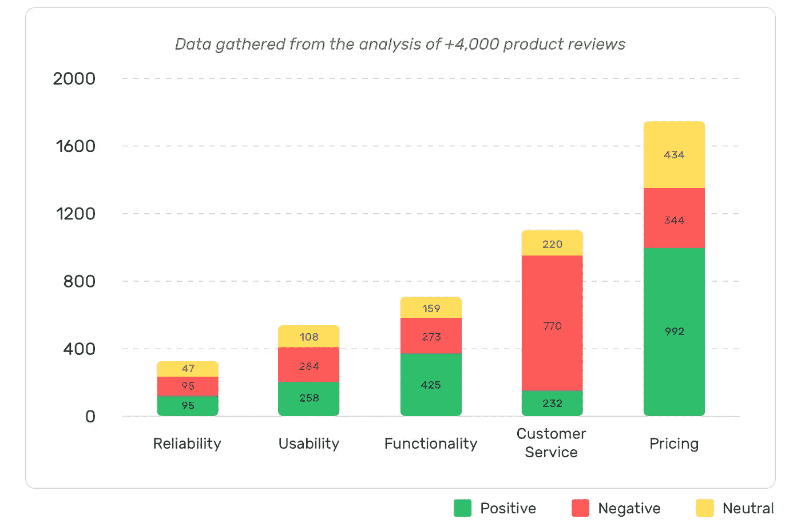
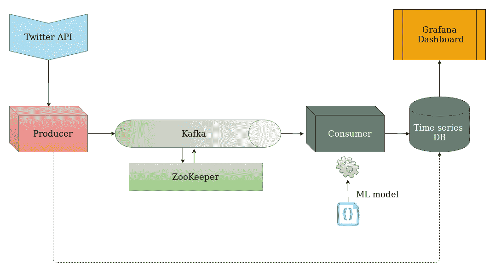
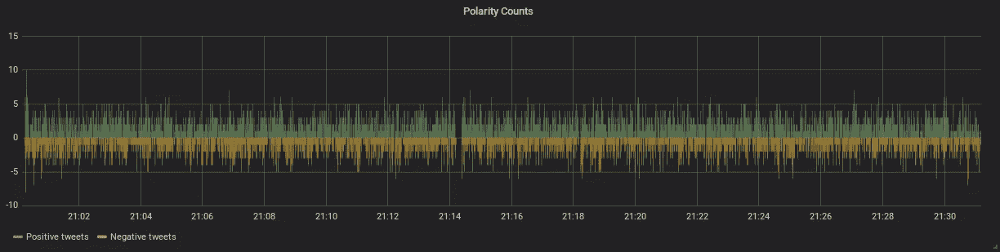

# Twitter 情感分析:流处理的故事

> 原文：<https://towardsdatascience.com/twitter-sentiment-analysis-a-tale-of-stream-processing-8fd92e19a6e6?source=collection_archive---------21----------------------->

## 如果我们可以通过人们在 Twitter 上留下的面包屑来了解他们的情绪，会怎么样？

在这篇文章中，我们将着手构建一个微服务架构，包括建立一个*流处理*管道，从 Twitter 的公共 API 获取推文，将其排队到一个 Kafka 主题中，并用自然语言处理对其进行消化，以获得每条推文的*极性*。最终的结果将在一个仪表板上可视化，上面有我能想到的所有花哨的图表；-)


照片由[亚当·张](https://unsplash.com/@adamjang?utm_source=unsplash&utm_medium=referral&utm_content=creditCopyText)在 [Unsplash](https://unsplash.com/?utm_source=unsplash&utm_medium=referral&utm_content=creditCopyText) 上拍摄

## 快速访问链接

*   仪表板:[grafana.redouaneachouri.com](https://grafana.redouaneachouri.com/d/twitter-sentiment-analysis/twitter-sentiment-analysis)。
*   完整的源代码可以在 GitHub 上找到:[推特-情绪-分析](https://github.com/redouane-dev/twitter-sentiment-analysis)。
*   预处理、特征提取和模型化在[本笔记本](https://github.com/redouane-dev/twitter-sentiment-analysis/blob/master/model/twitter-sentiment-analysis.ipynb)中有详细说明。

## 技术总结

*   **概念:**自然语言处理，流处理，数据可视化。
*   **技术:** Python v3.8，Kafka，InfluxDB，Grafana。
*   **部署平台**:谷歌云平台。

## 目录

*   介绍
*   创建一个 Twitter 开发者帐户来访问 API
*   微服务架构:
    1。Twitter API
    2。制作人
    3。动物园管理员&卡夫卡
    4。消费者。时间序列数据库。Grafana 仪表板
*   深入研究预处理和特征提取
    1。记号化
    2。正常化
    3。去噪或降噪
    4。确定数据集中的单词密度
*   数据建模
*   结论
*   参考

# 介绍

witter 是一个人们分享他们对现实趋势的想法和情感的地方。这也是各种营销活动发生的战略场所，包括公司和公众人物在内的品牌可以通过分析人们在推特上发布的关于他们的信息，获得对受众看法的深刻见解。

通过情感分析，我们可以检测出一段文字传达的是积极的 T2 信息还是消极的 T4 信息。它被称为*极性*，当涉及到在短时间内从大量数据中收集消费者反馈时，这是一个游戏规则的改变者。



分析情绪有助于获得反馈，发现企业各方面的优势和弱点— [来源](https://monkeylearn.com/sentiment-analysis/#sentiment-analysis-use-cases-and-applications)

要了解更多关于情感分析及其应用的信息，请查看这篇关于 MonkeyLearn 的优秀文章。

没有进一步的到期，让我们深入到技术细节！
**GitHub 上有完整源代码:**[**Twitter-情操-分析**](https://github.com/redouane-dev/twitter-sentiment-analysis) **。**

# 创建一个 Twitter 开发者帐户来访问 API

为了开始收集所有这些推文，我们需要一个 Twitter 开发者账户。在这里，我将简要描述从创建帐户到为我们的第一个应用程序获得 OAuth2 载体令牌所采取的步骤。

1.  前往 [Twitter 开发者页面](https://developer.twitter.com)和*申请*开发者账户。标准 API 已经足够好了。请随意使用您的实际 Twitter 帐户(如果有的话)，或者创建一个新帐户。
2.  我们的下一步是进入 Twitter 实验室——所有有趣的事情都发生在这里。为此，我们需要注册一个*开发环境*并创建一个应用程序。我们的应用程序将有一组名为 *API key* 和 *API secret* 的凭证，我们必须严格保密，因为它们用于授权访问与我们的开发人员帐户相关的应用程序。
3.  一旦获准进入开发人员实验室，我们就可以开始使用*采样流*端点`https://api.twitter.com/labs/1/tweets/stream/sample`:

> 采样流端点通过流连接实时提供所有 Tweet 数据的大约 1%的随机样本。

4.[官方 API 样本流文档](https://developer.twitter.com/en/docs/labs/sampled-stream/overview)提供了一个坚实的基础来学习如何认证，并提供样本代码片段来开始获取实时推文流。

# 微服务架构



这个项目的架构，从左到右。

这个项目的架构非常简单，从 Twitter API 到 Grafana 仪表板，经过 Kafka 管道和生产者/消费者对。

所有架构都有其弱点，包括这一个，这包括网络故障、内存问题、错误、文本格式错误……我试图通过采取以下措施使主要组件(如**生产者**和**消费者**)尽可能地适应故障来解决这些问题:

*   启动时，在几秒钟的间隔内持续轮询 Kafka 代理的连接，直到代理可用。
*   在 infite `while True`循环中运行主程序，该循环捕捉异常，执行日志记录或尝试重新连接，并优雅地继续程序。

*注意:*实时部署在 GCP*计算引擎*—[谷歌云平台](https://cloud.google.com/compute)中的虚拟机上完成。

以下是每个组件的描述:

## Twitter API

*   **描述:**这是 Twitter 免费提供的一个 API 端点，目的是获取全球约 1%的实时推文。访问细节请参考前面的部分“*创建 Twitter 开发者账号访问 API”*。
*   **端点:** `https://api.twitter.com/labs/1/tweets/stream/sample`
*   **先决条件:**一个 *API 密钥*和 *API 秘密*，将用于从 Twitter OAuth2 认证端点`[https://api.twitter.com/oauth2/token](https://api.twitter.com/oauth2/token.)` [获取访问令牌。](https://api.twitter.com/oauth2/token.)
*   示例:这是一条基本推文及其元数据的样子。对我们来说最重要的部分是`id`、`lang`(语言)、和`text`:

```
{
    "data": {"attachments": {"media_keys": ["xxx"]},
    "author_id": "xxx",
    "context_annotations": [{"domain": {"description": "xxx",
                                        "id": "123",
                                        "name": "xxx"},
                             "entity": {"id": "xxx",
                                        "name": "xxx"}}],
    "created_at": "1970-01-01T00:00:00.000Z",
    "entities": {"mentions": [{"end": 42,
                               "start": 123,
                               "username": "xxx"}],
                 "urls": [{"end": 42,
                           "start": 123,
                           "url": "https://t.co/xxx"}]},
    "format": "detailed",
    "id": "123456789",
    "lang": "en",
    "possibly_sensitive": False,
    "referenced_tweets": [{"id": "123",
                           "type": "retweeted"}],
    "source": "<a href='http://twitter.com/download/android' rel='nofollow'>Twitter for Android</a>",
    "stats": {"like_count": 0,
              "quote_count": 0,
              "reply_count": 0,
              "retweet_count": 0},
    "text": "here comes the tweet !!!"}
}
```

## 生产者

*   **描述:**生产者或*发布者*从 Twitter API 获取推文，并将推文的`id`和`text`(只有英语，没有元数据)发送到 Kafka 主题，然后由*消费者*消费。此外，我们将每条推文的`id`和语言`lang`存储在一个*时间序列数据库*中，用于可视化目的(见下面的 Grafana 仪表板)。
*   **语言:**Python(3.8 版本)。
*   **实现细节:**我们创建一个继承自 [Kafka-python](https://github.com/dpkp/kafka-python) 类`KafkaProducer`的类`TweetsProducer`，以方便与我们的 Kafka broker 的连接和交互。这个类将与 Twitter API 建立一个永久的连接，以获取连续的 tweets 流。

## 动物园管理员&卡夫卡

*   **描述:**使用 Kafka 的目的是拥有一个队列，在等待消费者处理消息(tweets)时，消息可以安全地存储在这个队列中，因为处理部分可能比从 Twitter 的 API 获取相对较慢。它充当 *FIFO —先进先出—* 数据存储。Zookeeper 用于管理大型分布式系统的状态和配置，但在我们的例子中，它不需要太多关注，因为我们的集群中只有一个 Kafka 实例。
*   **需求:**Docker images for[Zookeeper:3 . 4 . 6](https://hub.docker.com/r/wurstmeister/zookeeper)和 [Kafka:2.4.0](https://hub.docker.com/r/wurstmeister/kafka) (基于 Scala 版本 2.12)。
*   **实例化细节:**在尝试启动和运行我的第一个*dockered*Kafka 实例时，这似乎不是一件容易的事情，因为它需要一些内部和外部容器网络配置，并且通过对[官方 Kafka 文档](https://kafka.apache.org/documentation/)和 [Wurstmeister 的 Kafka 文档](https://hub.docker.com/r/wurstmeister/kafka)的一些搜索，我发现下面的配置最适合这个项目:
    `KAFKA_ZOOKEEPER_CONNECT`:Zookeeper 的地址和端口。由于 Zookeeper 和 Kafka 在同一个 Docker 网络上，我们可以将其设置为 Zookeeper 服务名和默认端口“zookeeper:2181”。
    `KAFKA_LISTENERS`:地址列表( *0.0.0.0:9093* 和 *0.0.0.0:9092* )及其关联的侦听器名称(内的*和*外的*)，Kafka 代理将在这些地址上侦听传入的连接。*内的*表示与我们的 Kafka 实例在同一个 Docker 网络内的所有客户端，例如*生产者*和*消费者*，而*外的*表示主机上的所有客户端，例如 Kafka 的 CLI 工具。
    `KAFKA_LISTENER_SECURITY_PROTOCOL_MAP`:监听器名称和安全协议之间的映射。我们用“*内:明文，外:明文”来保持简单。* `KAFKA_ADVERTISED_LISTENERS`:指向 Kafka 代理的可用地址列表(将发送给客户端进行初始连接)。我们将其设置为“*内://kafka:9093，外://localhost:9092* ”。
    `KAFKA_INTER_BROKER_LISTENER_NAME`:经纪人之间通信使用的监听器名称。*

**卡夫卡的完整配置可以在这个项目的**[**docker-compose . YAML**](https://github.com/redouane-dev/twitter-sentiment-analysis/blob/master/docker-compose.yaml)**文件中找到。**

## 消费者

*   **描述:***消费者*简单地从 Kafka 一条接一条地加载推文，执行预处理和特征提取步骤，然后推断每条推文的极性——正或负。这种极性存储在*时间序列数据库*中，与推文的 ID 一起，用于可视化目的(也可以进一步处理，或用于检测趋势……)。
    推断或预测步骤中使用的机器学习模型被生成并存储在二进制文件中*。事先腌制*格式。
*   **预处理和特征提取:**请参考下面*深入预处理和特征提取*部分的详细描述。
*   **语言:**Python(3.8 版本)。
*   **实现细节:**我们创建一个继承自 [Kafka-python](https://github.com/dpkp/kafka-python) 类`KafkaConsumer`的类`TweetsConsumer`，以方便与我们的 Kafka broker 的连接和交互。
    获取 tweets 之后是预处理步骤和分类。一旦获得每条推文的极性，我们就将其存储到我们的*时间序列数据库*中，用于可视化目的。

## 时间序列数据库

*   **描述:**时序数据库是一个使用*时间戳*来索引记录的数据存储。这意味着对于每个新记录，DB 引擎都会关联一个时间戳，这是从 Unix*epoch—1970 年 1 月 1 日 00:00:00 UTC 开始的以纳秒为单位的时间量。* 这对于手头的问题来说再好不过了，这个问题就是存储高速到来的依赖于时间的序列数据，并且还需要作为时间序列进行快速检索。
    Grafana 将访问该数据库，以输入我们的分析仪表板。
*   **技术:**我们使用的是[*InfluxDB*](https://www.influxdata.com/products/influxdb-overview/)*这是一个开源的时间序列数据库，在过去的几年里已经成为了行业标准。*

## *Grafana 仪表板*

*   ***链接:**【grafana.redouaneachouri.com】T42。*
*   ***描述:** Grafana 被全球各种规模的公司用来监控任何可能随时间变化的事物:)从计算机基础设施到大气测量，经过工厂和仓库库存。
    我们用它来创建一个仪表板，以便分析推文的极性及其随时间的变化。我们还想分析推文的其他方面，如一天或一年中不同时段的语言分布。*
*   ***使用细节:**为了创建我们的仪表板，我们需要将 Grafana 插入一个数据源，在我们的例子中是 *InfluxDB* ，我们的时间序列数据库。一旦连接上，我们就可以根据需要开始添加面板，并且为每个面板定义一个查询来获取将要显示的数据。*

**

*极性的分布。随着时间的推移，我们可以看到一个对称的趋势。*

*这个架构的完整描述可以在项目的[**docker-compose . YAML**](https://github.com/redouane-dev/twitter-sentiment-analysis/blob/master/docker-compose.yaml)**文件中找到。***

# *深入研究预处理和特征提取*

*为减少数据中的维数、复杂性和噪声而采取的步骤。这是必需的，因为推文 1)是连续的多行文本，不能由简单的模型处理，2)包含不相关的信息，如连接单词和 URL，这会增加复杂性，并可能使模型产生偏差*

*有关实施细节，请点击查看[笔记本。](https://github.com/redouane-dev/twitter-sentiment-analysis/blob/master/model/twitter-sentiment-analysis.ipynb)*

## *标记化*

*文本是由空格和标点符号分隔的字符序列，其含义可以被人脑理解，但对计算机来说毫无意义。然而，我们可以根据空格和标点符号分隔符将文本分割成更小的字符串或单词，称为*记号*。*

*我们使用 Punkt 包中提供的预先训练好的 NLTK 模型，该模型考虑了诸如 Dr 和 Mr 这样的头衔，以及诸如 J.Doe 这样的名字中的句点。*

## *正常化*

*文本中的单词可以有不同的形式。动词可以变化——“出现”、“出现”、“出现”，名词可以设置为阴性和复数——“作者”、“女作家”、“作者”、“女作家”。因此，规范化有助于将具有相同含义的单词组合在一起，使它们达到规范形式。
有两种流行的标准化类型:*

1.  ***词干提取:**最简单的形式是从单词中去掉词缀，并在查找表中找到词干。*
2.  ***词汇化:**这是一个更高级的过程，因为它试图通过从句子的上下文中推断词义来找到单词的*词汇*，或字典形式——例如，“meeting”在“我正在准备与客户的一个重要的*会议*”和“我明天将与客户的*会议*”中可能有不同的含义。*

*变元化比词干化慢，但更准确，而且由于这种慢对我们的实时处理不是一个大的障碍，我们可以使用变元化进行规范化。
然而在使用 lemmatizer 之前，我们需要确定文本中每个单词的上下文，为此我们使用了一个[词性标注器](https://www.nltk.org/book/ch05.html)。点击此链接查看[可能标签的完整列表](https://www.ling.upenn.edu/courses/Fall_2003/ling001/penn_treebank_pos.html)。*

## *去噪或降噪*

*噪音是所有不增加信息，但消耗时间和资源，并可能增加模型偏差的数据。以下是本项目中我们认为的噪音:*

1.  ***停用词:**一种语言中最常见的词，如“a”、“the”、“it”，一般不传达一个意思，除非另有说明。*
2.  ***超链接:** Twitter 使用[t.co](https://developer.twitter.com/en/docs/basics/tco)来缩短超链接，这不会在转换为 URL 的信息中留下任何值。*
3.  ***提到:**以`@`开头的用户名和页面。*
4.  ***标点:**它增加了上下文和意义，但使文本处理起来更复杂。为简单起见，我们将删除所有标点符号。*

*我们使用英语的正则表达式和停用词和标点的字典来执行过滤。*

## *确定数据集中的单词密度*

*通过快速绕道，我们可以找到在我们的推文中哪些词与积极或消极情绪最相关:*

*   ***正面:**表情符号:)和:)，*感谢，感谢，追随，爱，*和*好的*。*
*   ***否定:**表情符号:(和:-(，*去，得到，请，要，*和*错过。**

**N.B.* 单词密度是我们的建模算法隐式计算的，所以我们不需要将此作为预处理的一部分包含进来。*

# *数据建模*

*有关实施细节，请点击查看[笔记本。](https://github.com/redouane-dev/twitter-sentiment-analysis/blob/master/model/twitter-sentiment-analysis.ipynb)*

*接下来的部分，我们建立了一个*监督学习*模型，可以将推文分类为*正面*或*负面*，这是我们对数据的两个标签。*

*为了简单起见，对于我们所拥有的有限数量的数据(10k 条记录)，我们将使用一个*朴素贝叶斯分类器。**

*这里是培训和测试指标(准确性)，以及 10 个最具信息性的特性的表格。每行代表一个单词在正面和负面推文中出现的比率。*

```
*Training Accuracy: 0.99957
Testing Accuracy: 0.995Most Informative Features
              :(           Negati : Positi =   2081.8 : 1.0
              :)           Positi : Negati =   1656.3 : 1.0
             sad           Negati : Positi =     23.6 : 1.0
            sick           Negati : Positi =     19.2 : 1.0
          arrive           Positi : Negati =     18.8 : 1.0
            poor           Negati : Positi =     15.9 : 1.0
       community           Positi : Negati =     15.5 : 1.0
             x15           Negati : Positi =     13.2 : 1.0
             idk           Negati : Positi =     12.5 : 1.0
   unfortunately           Negati : Positi =     12.5 : 1.0*
```

## *改进建议*

*通过在定制推特上测试我们的模型，我们可以看到它未能对*讽刺*进行分类，因为它认为这是一种*积极*情绪，而不是*消极情绪。* 这是因为我们的模型缺乏识别更多进化情感的数据复杂性，因此我们可以通过使用更高级的分类算法来处理这方面的工作，该算法可以处理包含进化情感的数据集的复杂性，例如*快乐、兴奋、悲伤、*和*恐惧。**

# *结论*

*在这篇文章中，我就如何设计和创建一个微服务架构向您提供了我的 2 美分，该架构可以从 Twitter 的实时 API 获取连续的推文流，然后通过 Kafka 进行处理，然后提取每条推文的极性。然后我们看到了如何将结果存储在一个*时间序列数据库*中，以便进一步分析和可视化。*

*我们还看到了如何在建立分类模型以推断每条推文的极性之前，对数据进行预处理并提取特征。*

*作为最终结果，我们得出结论，为了能够区分更多进化的情绪，如*喜悦*和*讽刺*，我们需要一个更复杂的数据集和一个能够处理这种复杂性的分类算法。*

*如果你觉得这个教程很有用，并且你想支持高质量文章的创作，考虑给我买杯咖啡吧！*

*你可以点击“关注”按钮来获取我的最新文章和帖子！*

**

# *参考*

*   *情感分析及其应用— [MokeyLearn](https://monkeylearn.com/sentiment-analysis/)*
*   *Twitter API 文档— [Twitter 开发者门户](https://developer.twitter.com/en/docs)*
*   *Kafka 概念和文档— [阿帕奇 Kafka](https://kafka.apache.org/documentation/)*
*   *词干— [维基百科](https://en.wikipedia.org/wiki/Stemming)*
*   *引理满足— [维基百科](https://en.wikipedia.org/wiki/Lemmatisation)*
*   *用 Python NLTK 进行情感分析— [数字海洋](https://www.digitalocean.com/community/tutorials/how-to-perform-sentiment-analysis-in-python-3-using-the-natural-language-toolkit-nltk)*
*   *图片来源在各自的标题中。*