# 使用 R 的 Twitter 情感分析和可视化

> 原文：<https://towardsdatascience.com/twitter-sentiment-analysis-and-visualization-using-r-22e1f70f6967?source=collection_archive---------3----------------------->

## 如何衡量 Twitter 用户对任何特定话题的感受

图片来源:unsplash.com

对于除了 Python 或 SQL 之外已经开始进入 R 领域的数据科学家(像我一样)，我们很欣赏通过许多内置包快速分析和可视化数据的容易程度。然而，当我开始寻找从外部来源提取数据的有效方法时，我了解到了与 RFacebook(脸书)、rtweet (Twitter)和 Rblpapi(彭博)等主要平台交互的 R 包。虽然用 Python 完成同样的任务是可能的，但 RStudio 的可视化界面和绘图工具已经赢得了加分。

如果您使用的是 RStudio，您可以快速连接并提取公开可用的数据。在 Twitter 的例子中，你可以获得用户列表、不同地区的热门话题以及关注者列表。这种类型的评估将证明对企业分析师、政界人士或我们这些只是对某些数据科学工具的范围感到好奇的人很有帮助。有无数种方法可以分析这种类型的数据(比如箱线图、直方图和文本挖掘等等！).

在通过 Twitter API 认证后，我想知道如何评估和可视化社交媒体网站的用户对给定主题的看法，不仅是说的话，还可能是 T2 的感觉。作为这项工作的一部分，我随机选择了两个国家(加拿大和苏格兰)，然后从每个地区抽取了 100 条推文。我记录了我连接 Twitter 的 API、搜索推文、使用 Bing 进行情感分析，然后绘制结果的步骤。

**第一步:**在 RStudio 中加载需要的包(包括 rtweet)

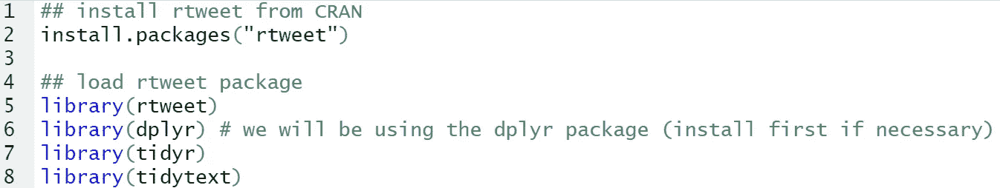

**步骤 2:** 通过创建一个访问令牌，使用您的凭证对 Twitter 的 API 进行认证。获取 Twitter 访问令牌的步骤:

[https://cran . r-project . org/web/packages/rtweet/vignettes/auth . html](https://cran.r-project.org/web/packages/rtweet/vignettes/auth.html)

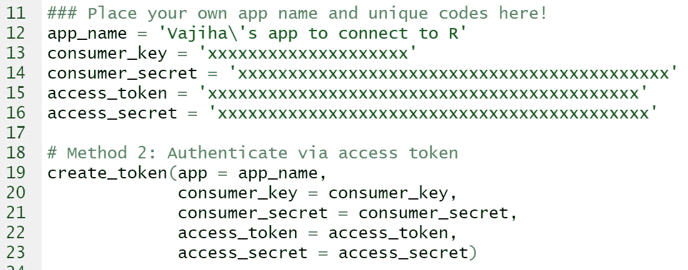

**第三步:**根据自己选择的话题搜索推文；减少你认为合适的推文数量，并决定是否包括转发。我决定包括加拿大和苏格兰各 100 条推文，并决定不包括转发，以避免重复推文影响评估。

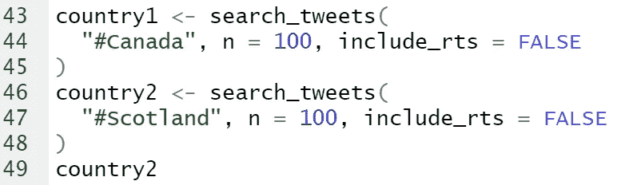

**第四步:**将每组推文处理成整齐的文本或语料库对象。

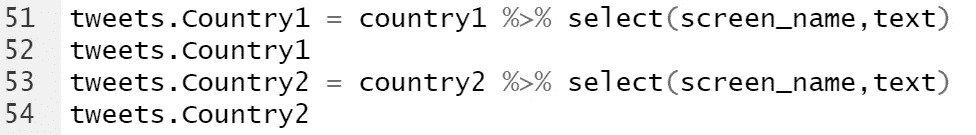

**第五步:**使用预处理文本转换清理推文；这包括[词干](https://cran.r-project.org/web/packages/corpus/vignettes/stemmer.html)词。词干提取的一个例子是将单词“计算机”、“计算的”和“计算”滚动到词根“comput”。

额外的预处理包括将所有单词转换为小写字母、删除网页链接(http 元素)以及删除标点符号和停用词。tidytext 包包含超过 1000 个英语停用词的列表，这些停用词对确定文本主体的整体情感没有帮助；这些是“我”、“我自己”、“他们自己”、“存在”和“拥有”等词。我们使用带有反连接的 tidytext 包从 tweets 中删除在步骤 3 中提取的停用词。

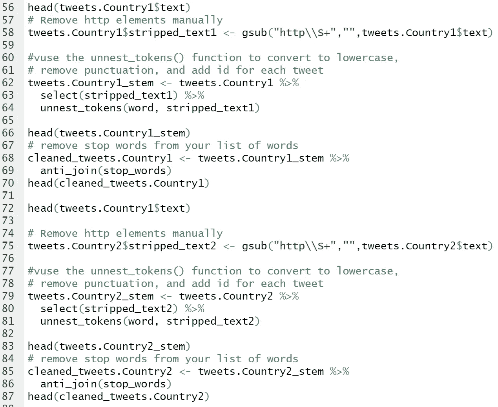

**第六步:**找出两国推特集合中最常用的 10 个词；这将使人们全面了解他们最关心的问题，以及他们参与这些问题的程度。

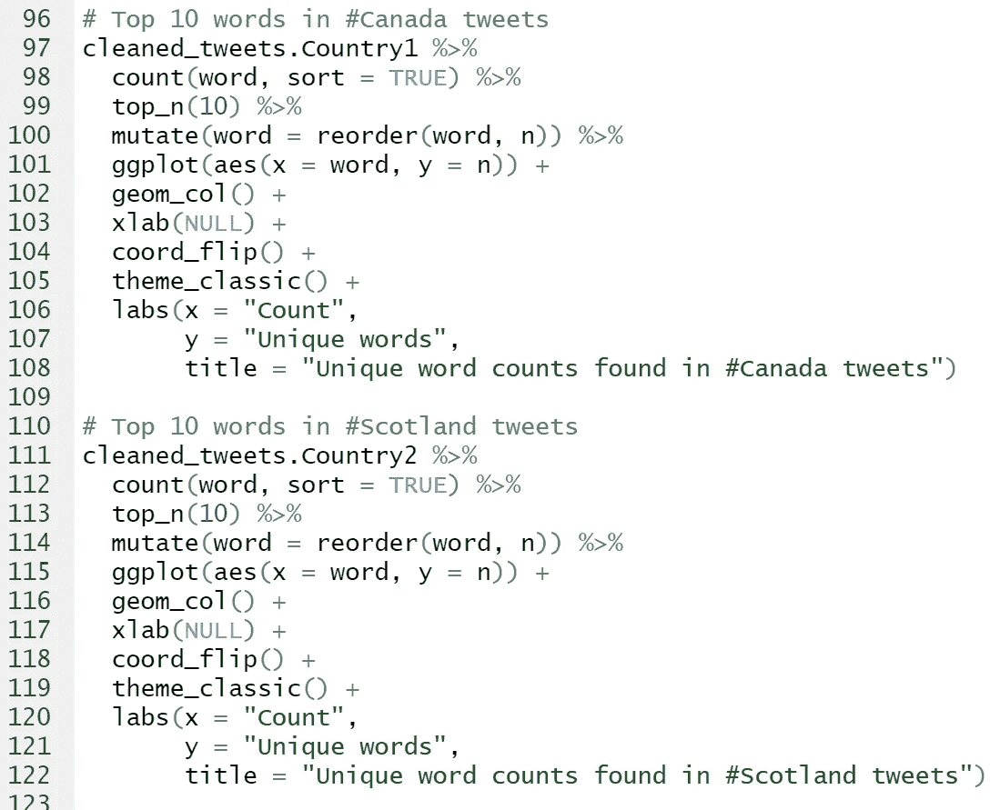

下面的输出显示了加拿大和苏格兰的前 10 个单词。

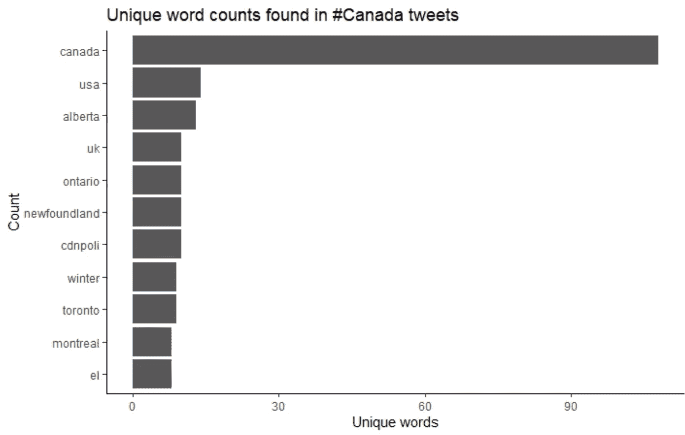

如您所见，Scotland 的输出返回的单词远不止 10 个，因为这些顶级单词中的许多都出现了相同的次数。

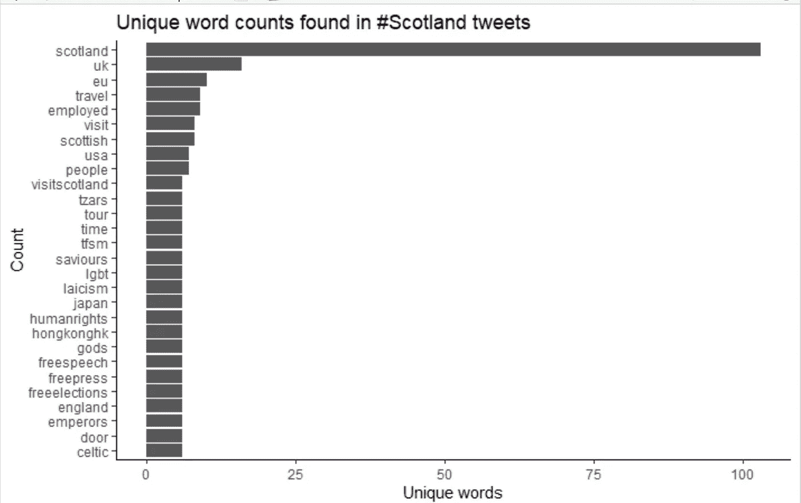

**步骤 7:** 使用 Bing lexicon 和 tidytext 包中的 get _ opinions 函数进行情感分析。R 中有许多库、字典和软件包可以用来评估文本中普遍存在的情感。tidytext 和 textdata 包就有这样的词到情感的评估库。三个通用词典是 Bing、AFINN 和 nrc(来自 textdata 包)。

要查看每个包包含的内容，您可以在 R 中运行以下命令:

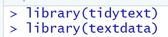

get _ opinions 函数返回一个 tibble，因此要查看哪些是“积极的”和“消极的”情绪，您需要进行相应的过滤。因为我想大致了解一下，所以我不需要提取整个数据集，但是根据您的需要，您可能需要这样做。

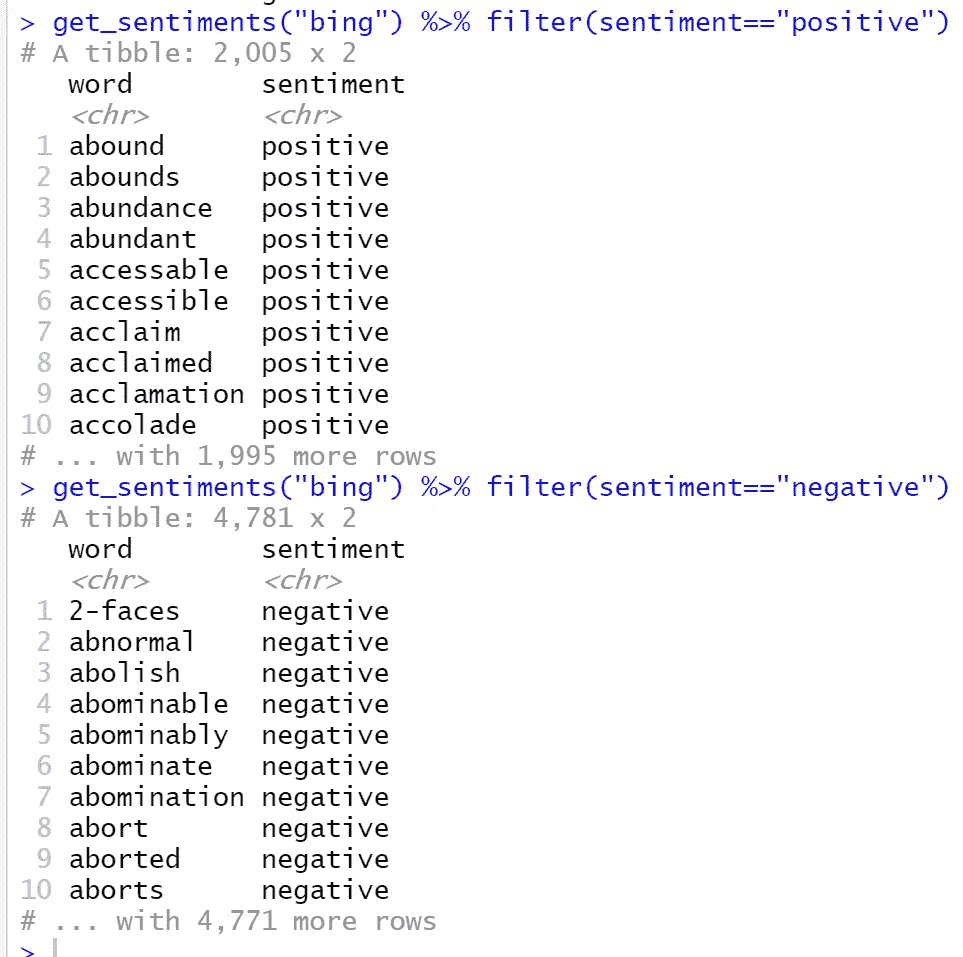

与 Bing 相反，AFINN 词典为其词典中的每个单词分配一个“肯定”或“否定”的分数；然后，进一步的情感分析将把情感分数加起来，以确定整体表达。大于零的分数表示积极的情绪，而小于零的分数意味着消极的整体情绪。计算得分为零表示中性情绪(既不积极也不消极)。

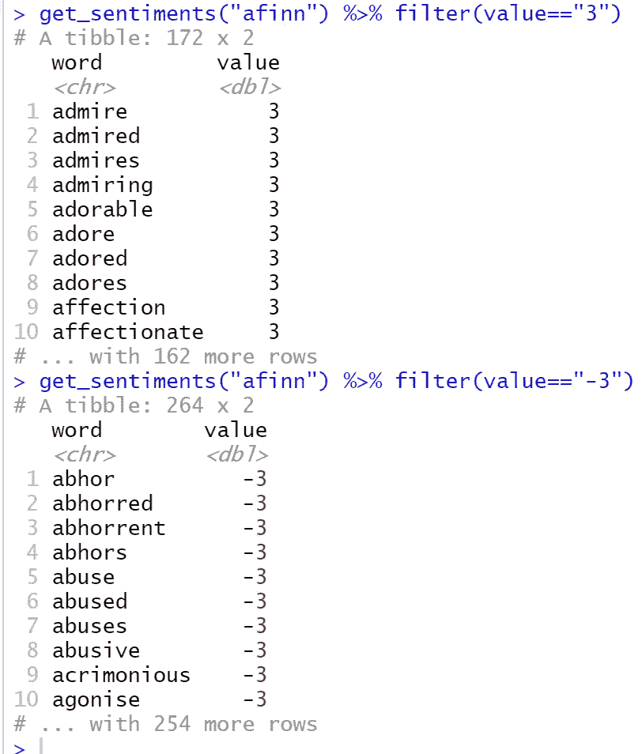

为了使用 Bing 对加拿大的 tweets 执行情感分析，我运行了以下命令，它返回一个 tibble。

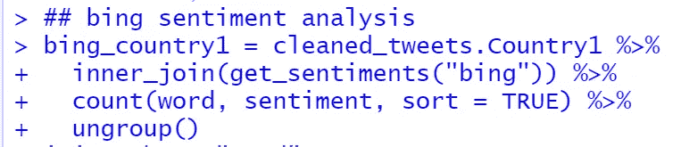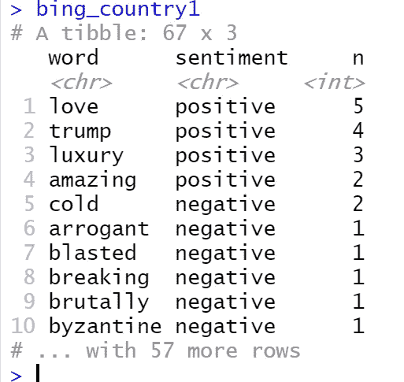

然后，为了直观地描述字数，您可以过滤并并排绘制单词，以比较积极情绪和消极情绪。

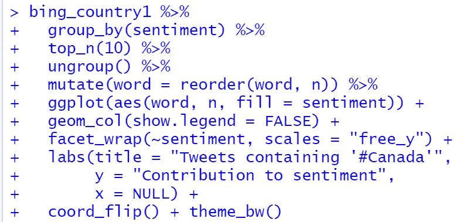

在下面的例子中，你会看到“trump”被标注为阳性。鉴于这些推文可能指的是现任美国总统，你可能希望仔细看看这个词在这些推文中实际上是如何使用的。

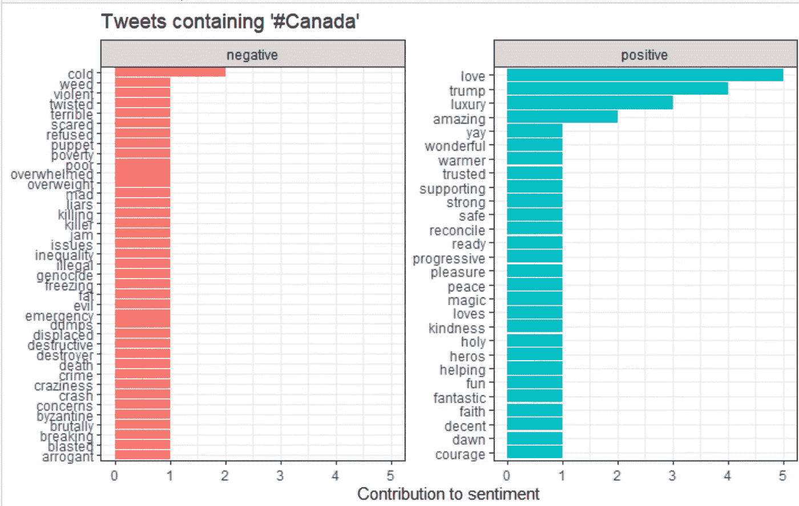

您可以对苏格兰的推文进行类似的分析；为了避免重复的 R 代码，我没有在这里包括这些。

**第 8 步:**获取每条推文的情感得分(您可以为此创建一个函数，如下所示)。

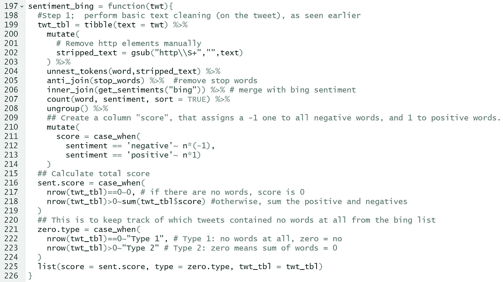

将该函数应用于两组推文:

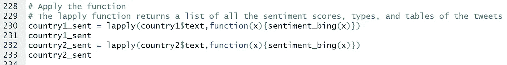

以下是我们收集的加拿大第 91 条推文的正面情感评分示例。单词“帮助”和“快乐”的得分为 2。

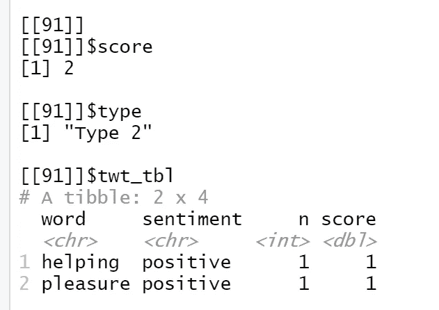

这里我们创建了一个 tibble，它指定了国家、分数和类型:

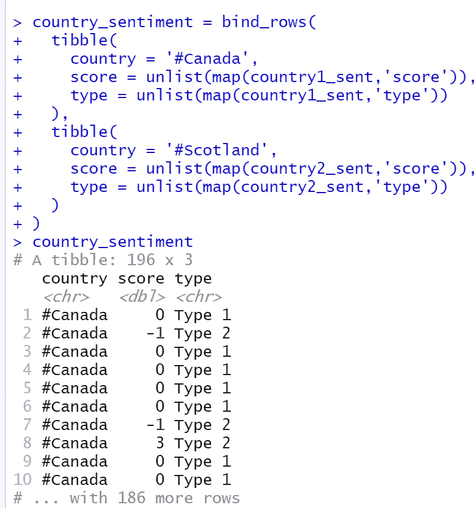

最后，我们可以看看每组情绪的一些特征。这是两组推文情绪的并列直方图，以及一些关键的汇总统计数据。

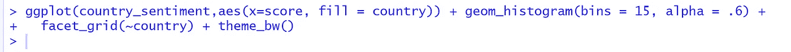

正如您在下面看到的，我们收集的推文中的观点总体上是中立的，最高观点得分为“0”。

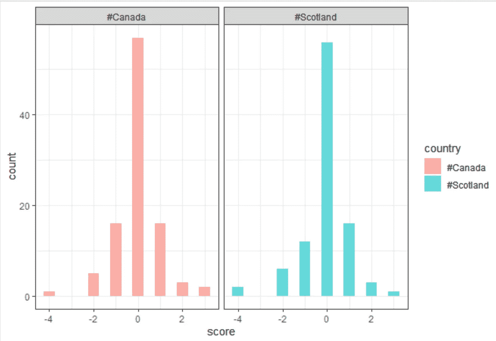

希望上面关于从 Twitter API 收集数据、使用 tidytext 进行情感分析以及使用 ggplot 可视化您的发现的步骤能够帮助您踏上数据科学之旅！