# 新冠肺炎期间基于新闻话题的推特情感分析

> 原文：<https://towardsdatascience.com/twitter-sentiment-analysis-based-on-news-topics-during-covid-19-c3d738005b55?source=collection_archive---------14----------------------->

## —网络公众如何回应疫情

*编剧* [薇拉·于](https://www.linkedin.com/in/willay/)、[娜拉·罗](https://www.linkedin.com/in/nluo/)、[张](https://www.linkedin.com/in/xingxuan-zhang/)、[李艾杰](https://www.linkedin.com/in/aijieli/)

距离美国首例新冠肺炎病例已经过去了 100 多天，距离加州最早的封锁令也已经过去了 45 天，在这段特殊的时间里，你感觉如何？你知道其他人对疫情的反应吗？

[engin akyurt](https://unsplash.com/@enginakyurt?utm_source=medium&utm_medium=referral) 在 [Unsplash](https://unsplash.com?utm_source=medium&utm_medium=referral) 上拍摄的照片

冠状病毒确实危及我们的身体健康，但同时，社交距离也对我们的情绪稳定性构成威胁。因此，理解新冠肺炎治下的公众情绪至关重要。

为了分析这些，我们组成了一个四人小组( [Willa Yu](https://www.linkedin.com/in/willay/) 、 [Nora Luo](https://www.linkedin.com/in/nluo/) 、[星璇张](https://www.linkedin.com/in/xingxuan-zhang/)、[李艾杰](https://www.linkedin.com/in/aijieli/))参加了加州大学戴维斯分校的新冠肺炎挑战赛。我们在推特上部署了情感分析，在新闻上部署了主题建模，以帮助理解情感趋势。基于这些，我们构建了仪表板作为日常情绪监控产品来展示结果。

# 目录

1.  分析处理
2.  数据源
3.  总体看:推特上发生了什么
4.  进一步分析:提取多维情感
5.  话题分析:当我们谈论新冠肺炎时，我们谈论什么
6.  进一步的步骤和结论

# 分析处理

为了研究公众情绪，我们选择 Twitter 作为我们的目标领域。作为世界上最大的社交网络平台之一，Twitter 拥有大量用户生成的帖子，这些帖子以低延迟的方式密切反映了公众对这一疫情的反应。通过在其上部署自然语言处理(NLP)方法，我们能够提取并量化一段时间内的公众情绪。我们使用的工具是 TextBlob、IBM Watson Tone Analyzer、BERT 和 Mallet。

起初，我们使用 TextBlob 来探索公众情绪，这显示了一种稳步变得更加积极的上升趋势。

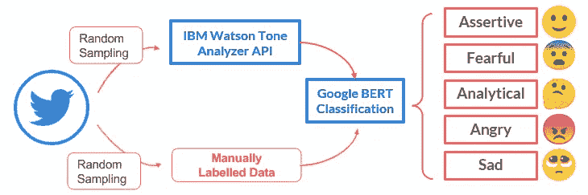

图一。产生 5 种情感的过程。

然后，我们以多维的方式在更详细的层次上分析情绪，以更全面地揭示趋势。我们使用 IBM Watson Tone analyzer 和手动标签来标记具有 5 种情绪的采样推文，然后使用 BERT 建立分类模型来分类具有 5 种情绪的所有推文。有了这个，我们能够:1)识别推文中更微妙的情绪；2)定义一个度量情感密度，它可以代表推文情感的复杂性。

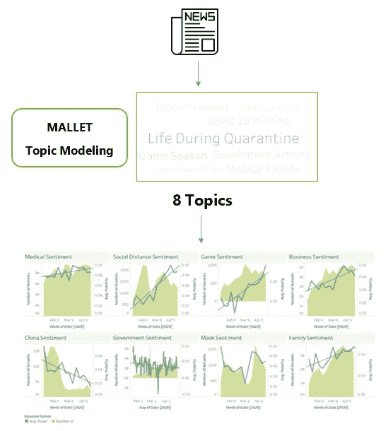

图二。产生新闻话题的过程。

为了进一步了解情感的趋势，我们决定引入使用 Mallet 的新闻主题建模，为情感添加一层上下文。通过构建一个仪表板来比较每个主题的情绪，我们可以更具体地了解趋势。

# 数据源

这项分析使用的两个主要数据源是从 1 月 20 日到 4 月 26 日每天的推文和新闻。我们还从约翰霍普金斯 CSSE 医院获得了确诊病例的统计数据，以补充情绪和主题的上下文。下面是我们所用数据的概览:

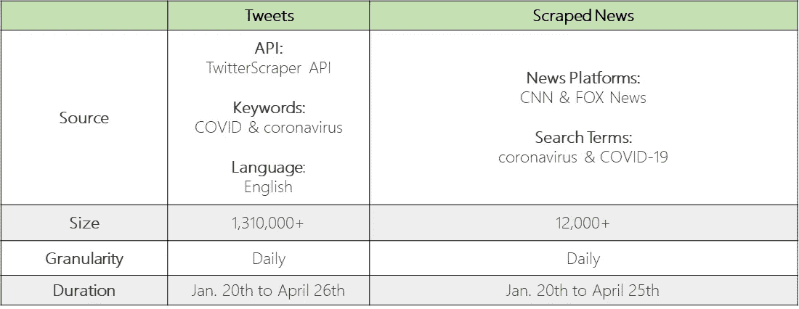

表 1。数据源

# 总体看:推特上发生了什么

自 2020 年 1 月报告首例确诊病例以来，#新冠肺炎和其他类似标签一直在推特上流行。收集了 130 多万条与新冠肺炎相关的推文(每天大约 1 万多条)，我们想知道人们在 Twitter 上对这些推文的反应。首先，我们探索了一些推文的参与度指标，如赞数。下图显示了每天每条推文的平均点赞/回复/转发次数:

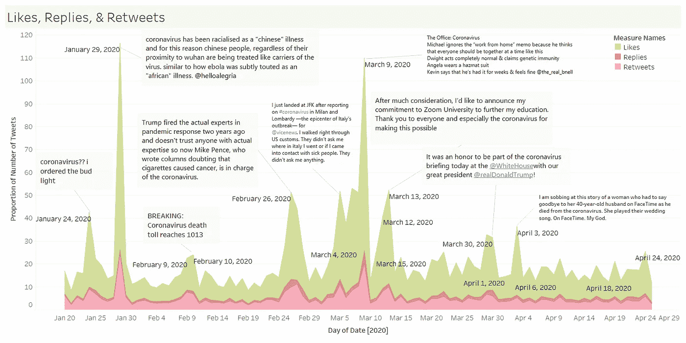

图 3。[一段时间内每条推文的平均赞数/回复数/转发数。](https://public.tableau.com/profile/jessica4482#!/vizhome/Book2_15884623747430/Dashboard6)对于一些数字异常高的日子，我们检索了收到最多赞/回复/转发的推文内容。

从图表中，我们可以看出，从 1 月到 3 月的几天里(例如 1 月 29 日、2 月 26 日和 3 月 9 日)，人们对一些#新冠肺炎推文的反应很激烈。获得最多赞/回复/转发的推文内容从中国的科罗纳啤酒和新冠肺炎变成了美国的新冠肺炎和政府的行动。在 3 月下旬和 4 月份，每条推文的平均赞数/回复数/转发数趋于持平，这表明 Twitter 上的人们对新冠肺炎推文的反应或参与比以前少了。

Twitter 不仅是一个让人们回复他人微博的地方，也是一个发布你的微博和分享你的感受的平台。因此，除了喜欢/回复/转发，我们还挖掘了新冠肺炎相关推文的内容，以了解人们的感受和表达如何随着时间的推移而变化。在 Python 中的情感分析库 [TextBlob](https://textblob.readthedocs.io/en/dev/) 的帮助下，我们提取了每条推文的[主观/客观(**主观** )](https://en.wikipedia.org/wiki/Sentiment_analysis) 内容是怎样的，内容是[正面还是负面(**极性** )](https://en.wikipedia.org/wiki/Sentiment_analysis) 。平均主观性和极性的数字如下所示:

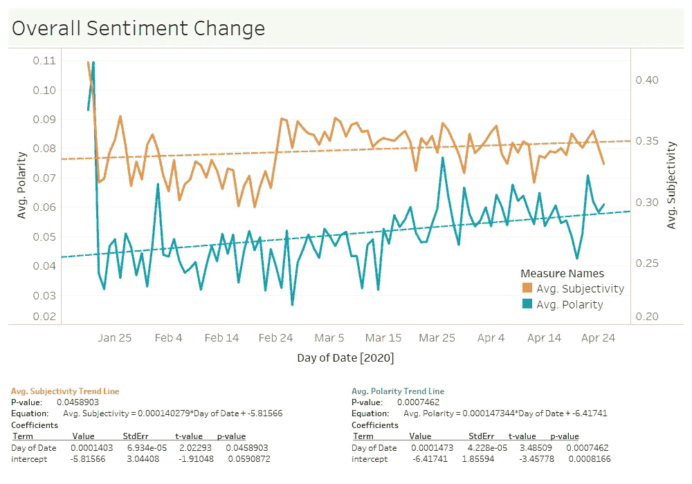

图 4。[新冠肺炎相关推文的主观性(客观[0–1]主观)和极性(消极[-1 — +1]积极)如何随时间变化。](https://public.tableau.com/profile/jessica4482#!/vizhome/Book2_15884623747430/Dashboard7)虚线代表平均主观性和平均极性的简单线性回归。

根据上面的图表，随着新冠肺炎的发展，相关推文的表达平均变得更加主观(从大约 0.33 到大约 0.35)，人们的感受平均变得更加积极(从大约 0.04 到大约 0.06)。为什么会这样？为什么随着越来越多的人感染冠状病毒，相关推文的情绪走向积极？带着这样的问题，我们深入研究了推文反映的实际情绪，以及人们在提到这种疾病时谈论的话题。

# 进一步分析:提取多维情感

我们利用伯特模型进行了进一步的分析。BERT 是谷歌预先训练的模型，可以针对广泛的 NLP 任务进行微调([了解更多](https://ai.googleblog.com/2018/11/open-sourcing-bert-state-of-art-pre.html))。在我们的例子中，它与 IBM 的 Watson Tone Analyzer ( [了解更多](https://www.ibm.com/watson/services/tone-analyzer/))结合使用，用 5 种情感类型来标记推文。下面是我们如何生成它们的:

***第一步*** :我们准备了一个训练数据集供模型学习，我们利用 Watson Tone Analyzer 为每条推文标注 5 种情绪。数据看起来像什么:

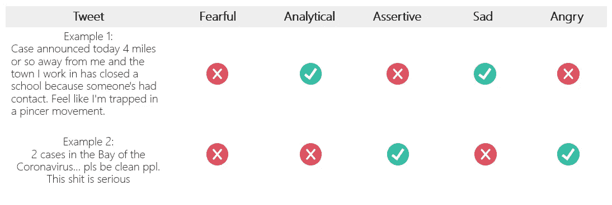

表二。推文如何被标记的例子。

***第二步*** :之后引入了 BERT Base 无壳模型，并进行了微调。我们的实现深受 Chris McCormick [1]的启发。在每个情感类型下建立了一个二元分类模型，然后用于为未标记的推文产生 1/0 标签。下面是我们提取的五个情感类别以及它们下面的典型推文。

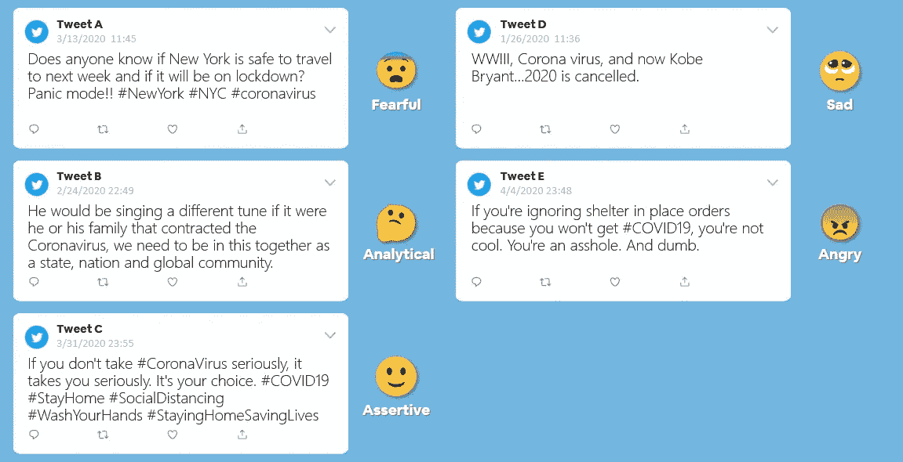

图 5。典型的推文及其观点。

***第三步*** :标签就位后，我们定义了一些指标来帮助进一步理解公众情绪的变化。我们首先提出了一个称为情绪水平的指标，使用具有特定情绪的推文占一天总推文的比例。由于一条推文可以拥有多种情绪，我们还计算了情绪密度，以显示一条推文在一天内平均有多少种不同的情绪。这个数字会给我们一个直观的印象，那就是一天中有多少推文“充满”了不同的情绪。然后，我们计算这些指标的每日变化，并形成增量指标。下表总结了我们的指标。

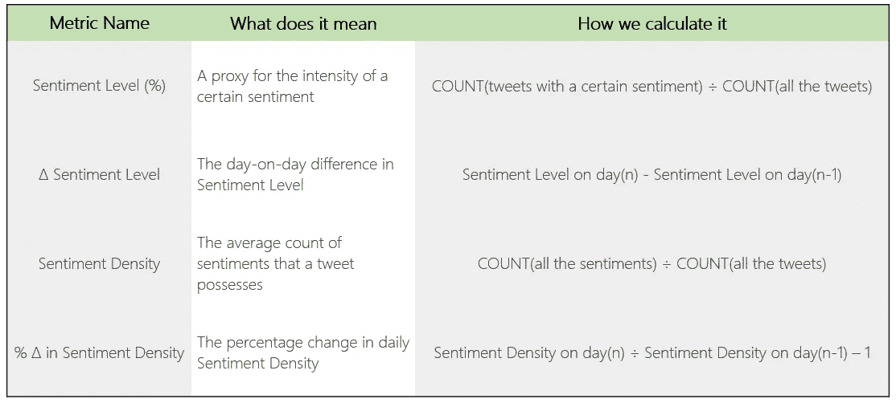

表 3。指标定义和公式。

## 调查的结果

在将我们的模型结果放回到疫情背景下的时间线(我们使用累计确诊病例数的增长率来反映疾病的传播)后，我们总结了一些有趣的发现。

***情绪等级:***

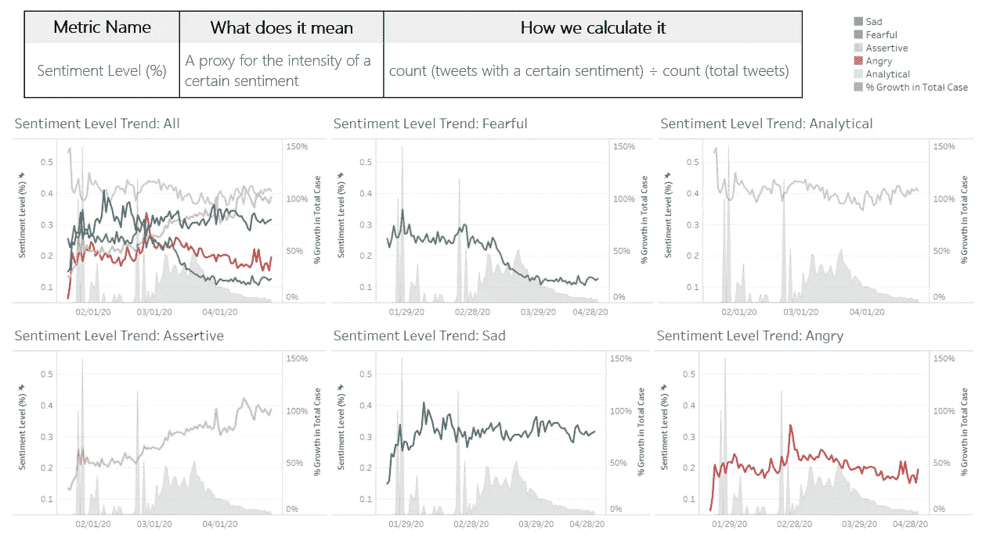

图 6。[情感等级的定义和 5 种情感的趋势](https://public.tableau.com/profile/nanluo#!/vizhome/Book2_v2_15887433980520/SentimentLevel)。

●在美国首例确诊病例被报道之前(1 月 21 日)，情绪“分析型”在推特中被发现最多，其他情绪水平仍然较低。

在报道第一个病例后，出现了复杂的情绪，这表明社会对疫情的认识不断提高。

●“Sad”波动较大，但在 1 月份上升后仍相对较高。

●2 月下旬，不同的情绪趋于分化，“自信”增加，“恐惧”下降。信息超载似乎让人们变得不那么敏感了。

***情绪密度:***

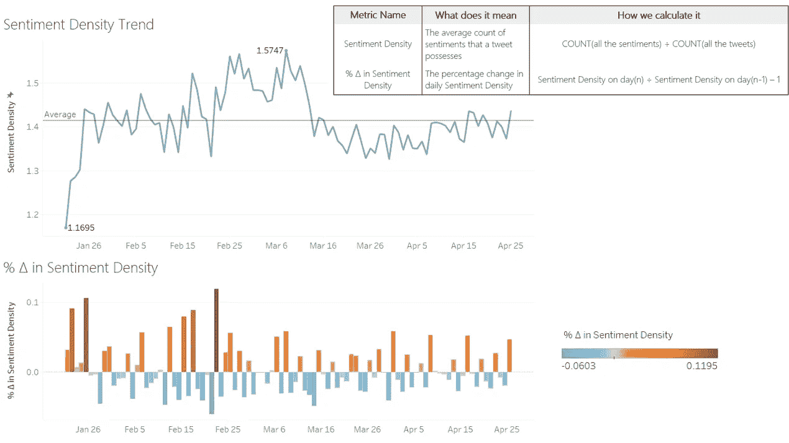

图 7。[按天定义情感密度和趋势](https://public.tableau.com/profile/nanluo#!/vizhome/Book2_v2_15887433980520/SentimentDensity)。

●通过上图中情绪密度的总体趋势，我们可以推断，从 2 月下旬到 3 月中旬，人们的情绪最密集，尤其是负面情绪，其次是 1 月下旬到 2 月中旬。

●4 月份情绪密度降低，停留在较低位置，但仍高于年初。

# 当我们谈论新冠肺炎时，我们谈论什么

在研究了调查期间情绪的总体趋势后，我们想添加另一层信息来剖析总体趋势。我们打算提取一些人们在谈论新冠肺炎时讨论的热门话题，以及每个话题下的极性(积极/消极)如何变化，所以我们首先从新冠肺炎相关新闻中提取几个话题，然后利用这些话题中的关键词对推文进行分类。

使用新闻文本而不是推文进行主题建模的优势在于，推文很短、不正式且高度感性，这对于主题模型来说很难处理，而新闻文本将以正式和中立的方式捕捉新冠肺炎统治下的重要事件。

## 提取新闻话题

我们利用自然语言处理工具包 [Mallet](http://mallet.cs.umass.edu/topics.php) 进行[潜在狄利克雷分配(LDA)主题建模](/light-on-math-machine-learning-intuitive-guide-to-latent-dirichlet-allocation-437c81220158)【2】，总结了 8 个主题。我们通过总结模型返回的主题关键词来命名这些主题，它们如下(按频率降序排列):新冠肺炎期间的生活，中国新冠肺炎，封锁令，医学测试&分析，政府行为，游戏季节，经济影响，医疗供应。配备了 TextBlob 的情感分析，这些主题随时间的趋势如下:

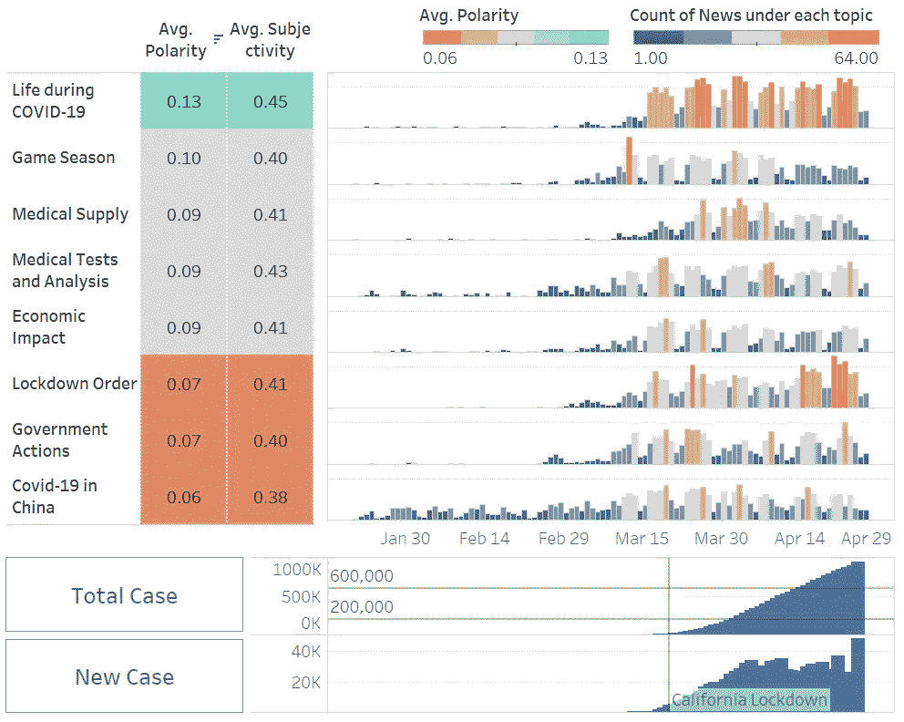

图 8。[新闻话题及其情绪，与确诊病例数的对比。](https://public.tableau.com/profile/willa.yu#!/vizhome/NewsSentimentsbyTopicsduringCOVID-19/Dashboard1?publish=yes)

不同的主题涵盖了不同的时期，而且大多数都与事实相符。例如，在 3 月份之前，只有少数像中国新冠肺炎这样的话题出现在冠状病毒相关新闻中。三月之后，由于新冠肺炎的广泛传播，相关新闻的数量开始激增，尤其是像医学测试这样的话题。一个有趣的发现是，随着自 3 月中旬以来封锁令的执行，关于新冠肺炎期间生活的新闻达到顶峰，成为大多数平均极性得分最高的新闻。

对于新闻中这些话题的情绪来说，在新冠肺炎期间的生活无疑是所有话题中最积极也是最客观的话题，其次是游戏赛季、医疗供应和医疗测试与分析。然而，另一方面，中国的新冠肺炎这个话题得到了最负面和主观的描述。

## 推文中的新闻话题

根据新闻话题建模总结出的话题，使用相应的关键词对推文进行分类。按关键词过滤推文(如图所示)后，由 8 个话题提示，话题趋势如下:

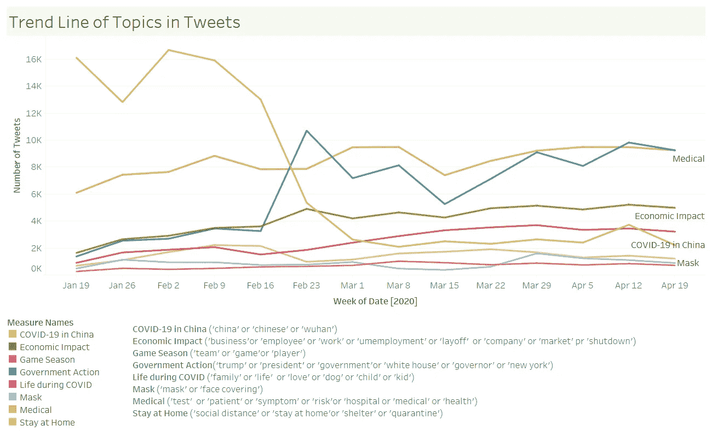

图 9。8 个主题下的推文数量如何随时间变化。用于主题分类的关键词显示在底部。

同样的新闻话题趋势也适用于此，因为在中国提到新冠肺炎的推文趋势在 3 月前达到顶峰，自美国出现首例病例后开始下降。如图所示，随着时间的推移，公众越来越关注政府的行为。医疗相关、经济影响和 COVID 期间的生活主题缓慢增加。至于游戏季、面具和呆在家里的话题并没有随着时间的推移呈现出明显的上升趋势。

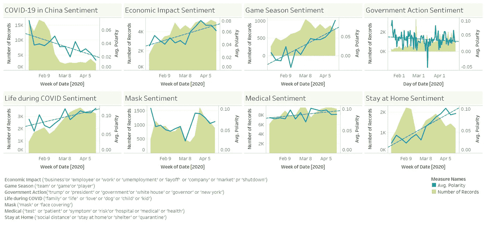

图 10。[每个话题的情绪如何随时间变化(蓝线)](https://public.tableau.com/profile/jessica4482#!/vizhome/Book2_15884623747430/Dashboard3)。绿色背景显示了每个主题下推文的放大趋势。

当分析情绪时，我们可以看到大多数话题的积极性都在增加。

●积极度最高的话题仍然是关于新冠肺炎时期的生活。乐观情绪增长最快的一个趋势是对呆在家里的看法，这与上面提到的人们在隔离期间变得不那么敏感的观点相呼应。

●对于关于口罩和呆在家里的辩论话题，我们可以看到，在新冠肺炎疫情爆发之初，极性首先下降，但在 3 月份晚些时候上升。

●谈论政府相关问题的推文倾向于具有非常波动的情绪趋势线，极性整体上下降。

●最近，越来越多的推文谈论经济影响，如裁员和失业，但整体情绪趋向积极。

●对于游戏赛季，由于冠状病毒，许多游戏被取消，所以那些推文的情绪不是很积极。

●最后，随着时间的推移，提到“中国”的推文变得更加负面。

# 进一步的步骤

我们的分析显示了确诊病例的增长与情绪趋势之间的一些关系。有了地理数据、人口统计信息等更细粒度的数据，就可以产生进一步的洞察，比如监测受灾最严重地区的公众情绪。有了更具体的目标，分析将对机构或政府采取行动更有价值。

# 结论

在这个项目中，我们用几种方法分析了新冠肺炎相关推文的情绪。总体趋势表明，随着时间的推移，公众变得更加乐观。深入多维度的情绪分析，我们发现随着时间的推移，情绪“自信”上升，“恐惧”下降。此外，情绪密度表明，公众原来是不那么情绪化的。最后，情绪背后的话题展现了更多的细节。

抗击冠状病毒不仅需要政府的指导，还需要公众的积极态度。我们的分析提供了一种潜在的方法来揭示公众的情绪状态，并帮助机构及时做出反应。

# 最后但并不是最不重要的

我们真诚地感谢加州大学戴维斯分校 MSBA 项目的教师和学生行政助理为推动新冠肺炎挑战赛所做的努力。此外，我们非常感谢 Ashwin Aravindakshan 教授和 rn Boehnke 教授提出的宝贵建议。

也请查看我们创建的 GitHub 页面和 Tableau 仪表盘，以获得更具交互性的视图和更多细节。

**参考文献:**

[1]麦考密克、克里斯和尼克·瑞安。2019.“伯特微调教程与 Pytorch 克里斯麦考密克”。【Mccormickml.Com】T4。[https://mccormickml.com/2019/07/22/BERT-fine-tuning/.](https://mccormickml.com/2019/07/22/BERT-fine-tuning/.)

[2]普拉巴卡兰，塞尔瓦。2018.“用 Gensim (Python)进行主题建模”。*机器学习加*。[https://www . machine learning plus . com/NLP/topic-modeling-gensim-python/。](https://www.machinelearningplus.com/nlp/topic-modeling-gensim-python/.)