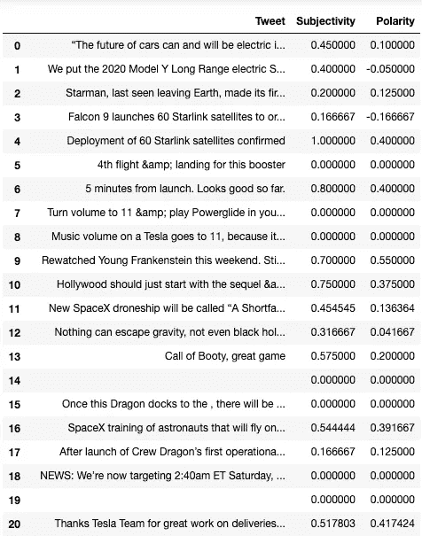

# Python 中的 Twitter 情感分析

> 原文：<https://towardsdatascience.com/twitter-sentiment-analysis-in-python-1bafebe0b566?source=collection_archive---------13----------------------->

## 计算 Twitter 账户的主观性和极性得分


卢克·切瑟在 [Unsplash](https://unsplash.com?utm_source=medium&utm_medium=referral) 上的照片

情感分析是数据科学和人工智能中最常见的任务之一。在本文中，我们将使用 Python、Tweepy 和 TextBlob，使用 Twitter API 和自然语言处理对选定的 Twitter 帐户进行情感分析。

# 介绍

我们将使用 Twitter 对书面文本进行情感分析。在这个例子中，我们将使用 Twitter，但这也可以用于商业环境中，以分析不同的社交媒体账户、对贵公司的评论、对贵公司产品和服务的评论，分析支持票、电子邮件或来自调查的自由文本，从而了解在线参与贵公司业务的人们的情绪。

# 你会学到什么？

您将学习如何使用 **TextBlob** 进行基本的情绪分析；用于 **Python** 的强大的**自然语言处理**库。我们还将使用 **WordCloud** 库来可视化我们的一些发现，我们还将使用 **Twitter API** 。熟悉 API 对于数据科学家来说是一项有用的技能。这是从互联网上获取数据的一种非常常见的方法。

# 问题定义

我们的任务是根据主观性**和极性**来分析个人推特账户的推文。我们会将每条推文区分为**正面、负面和中性**，并计算正面推文的百分比。我们将使用 **WordCloud** 库来展示来自推文中最积极的词汇。

# 逐步解决方案

**创建虚拟环境**

我们希望将特定于 Twitter 的 Python 库与我们计算机上的其他库分开。这就是为什么我们将为此项目创建一个虚拟环境。

您的计算机上应该有一个文件夹，用于存储所有虚拟环境。这个文件夹中应该没有其他东西，没有项目文件等。，只是虚拟环境不同。您可以将该文件夹称为“虚拟环境”。

有了该文件夹后，创建您的虚拟环境:

```
$ virtualenv twitter_venv
```

然后激活它:

```
$ source twitter_venv/bin/activate
```

然后安装 **Tweepy** 等库:

```
(twitter_venv) $ conda install tweepy(twitter_venv) $ conda install textblob(twitter_venv) $ conda install wordcloud
```

成功安装库后，您可以停用它:

```
(twitter_venv) $ deactivate
```

然后，您需要将这个虚拟环境添加到您的 jupyter 笔记本电脑配置中:

```
$ python -m ipykernel install — user — name=twitter_venv
```

一旦你完成了这一步，你就可以继续这个项目了。

**创建项目文件夹**

在你的电脑上为一个名为“推特-情绪-分析”的项目创建一个文件夹:

```
$ mkdir “Twitter-Sentiment-Analysis”
```

**创建 Twitter 应用密钥**

对于这个项目，我们将使用 **Twitter API** 从 Twitter 获取信息。为了做到这一点，我们需要一个 Twitter 开发者账户。

Twitter 为开发者引入了一些新的要求，完成这个过程需要几个步骤。

首先，你需要去 developer.twitter.com。如果您没有标准的 Twitter 帐户，您需要创建一个并登录。

标准 Twitter 账户将允许你登录，但不允许你做任何其他事情，你需要通过访问这个地址[developer.twitter.com/en/apply-for-access](http://developer.twitter.com/en/apply-for-access)并点击**申请开发者账户**来申请开发者访问。

你必须回答几个问题。出于使用 Twitter 开发者工具的原因，您可以选择**探索 API** 。

你还需要回答几个关于如何使用 Twitter API 的问题。您可以解释说，您将学习数据科学，不打算使用 API 构建任何产品(主题:您只是出于本练习的目的创建一个 Twitter 开发人员帐户，如果您打算将 Twitter 开发人员帐户用于任何其他用途，您需要提供更多详细信息)。

最后，你必须同意开发商协议和政策，你可以提交你的申请。

提交申请后，您需要点击 Twitter 发送给您的链接来确认您的电子邮件地址。确认您的电子邮件地址后，您的 Twitter 开发人员帐户的访问权限应该会立即被授予。如果你从 Twitter 上收到一封邮件，询问关于你的申请的更多信息或澄清，你需要提供所有必要的信息。

一旦你的访问权限被授予，进入这个网址[https://developer.twitter.com/en/apps](https://developer.twitter.com/en/apps)和**创建一个应用**。

你必须提供一个名称，描述，网址和你创建应用程序的原因。

一旦创建了您的应用程序，请转至**密钥和令牌**选项卡。这里已经创建了 **API 密钥**和 **API 秘密密钥**，您需要生成一个**访问令牌**和**访问令牌秘密**。点击**生成**按钮即可。你的 Twitter 情感分析项目需要这四个值。现在把它们都复制下来，放在文件中安全的地方。我们稍后会用到它们。

**开始新的笔记本**

通过在终端/命令提示符下键入命令，进入项目文件夹并启动 Jupyter Notebook:

```
$ cd “Twitter-Sentiment-Analysis”
```

然后

```
$ jupyter notebook
```

点击右上角的新建，选择 **twitter_venv** 虚拟环境。


作者图片

这将在您的浏览器中打开一个新的 jupyter 笔记本。将未命名的**项目名称重命名为您的项目名称，您就可以开始了。**


作者图片

如果你正在使用 [Google Colab](https://colab.research.google.com) ，打开一个新的笔记本。

**装载库**

正在导入 Tweepy、TextBlob、WordCloud、Pandas、Numpy 和 Matplotlib。

让我们加载配置文件(确保编辑配置文件并输入简介中描述的 **Twitter API 细节**)。

配置文件 **config.csv** 的格式如下:

```
twitterApiKey,twitterApiSecret,twitterApiAccessToken,twitterApiAccessTokenSecret
enter-your-value,enter-your-value,enter-your-value,enter-your-value
```

你可以在这里找到一个例子。

现在我们需要设置 Tweepy 认证所需的所有 Twitter API 配置值。这些值将从 **config.csv** 文件读取到 Python 变量中。

我们正在使用 **Tweepy** 进行身份验证调用，这样我们就可以调用一个函数来从指定的 Twitter 帐户中检索最新的 tweets。

我们使用 **elonmusk** Twitter 账户作为例子，但可以随意将 Tweeter 账户更改为不同的账户；甚至是你自己的推特账号。

现在我们将从指定的 Twitter 账户中检索最后的 **50 条推文&回复**。

我们将从它创建**熊猫数据帧**。

我们通过调用 *head()* 函数来看看数据帧里有什么。


作者图片

在我们开始情绪分析之前，最好先清理掉每条推文中不必要的数据。

我们将创建一个*clean up weet*函数，它将:

*   删除提及
*   移除标签
*   删除转发
*   删除 URL

现在，我们将把它应用到熊猫数据框中的所有推文中。

我们还将使用 TextBlob 构建几个函数来计算我们推文的主观性和极性。

现在，我们将这些函数应用到我们的数据框架中，并在数据框架中创建两个新特征**主观性**和**极性**。

现在，让我们看看我们的数据框现在是什么样子。



作者图片

我们这里有一些空行，所以在进一步处理之前，让我们删除它们。

下面的命令将删除 Tweet 列等于""的所有行。


作者图片

我们可以看到，我们已经为数据框架中的主观性和极性计算了分数。

现在让我们建立一个函数，将我们的推文分为**负面、中性和正面**。

应用这个函数，在我们的数据框中创建另一个名为 **Score** 的特征。

这是我们的数据框架，包含我们所有推文的主观性、极性和得分。


作者图片

现在让我们取所有正面推文，并计算我们的数据框架中所有推文中正面推文的百分比。

```
57.446808510638306 % of positive tweets
```

我们现在可以使用 **Matplotlib** 可视化正面、负面和中性的推文。


作者图片

我们可以看到负面、中立和正面的推文是如何在这个账号上传播的。

我们也可以通过在图表上显示主观性和极性的精确值来可视化相同的信息。

我们还可以计算客观推文的百分比。

```
27.659574468085108 % of objective tweets
```

最后，我们还可以生成一个词云来查看我们正在分析的推文中使用的主题和最常用的词。


作者图片

对推文进行情感分析使我们能够计算主观性和极性的数值。

这可以帮助我们更好地理解这个 Twitter 账户所使用的语言。

从营销的角度来看，将这一点与关于喜欢和评论的额外信息结合起来非常有用，可以让我们发现主观性、极性和特定 Twitter 账户用户参与度之间的一些相关性。

我们鼓励你对这个例子进行更多的实验，并想出更多关于如何在实践中使用它的想法。

如果你想了解更多并尝试 Python 和数据科学，你可以看看我的另一篇文章[用 Python 分析药品销售数据](/analysing-pharmaceutical-sales-data-in-python-6ce74da818ab)、[用 MNIST 介绍计算机视觉](https://medium.com/@pjarz/introduction-to-computer-vision-with-mnist-2d31c6f4d9a6)和[用 Python 进行图像人脸识别](https://medium.com/an-idea/image-face-recognition-in-python-30b6b815f105)。

为了巩固您的知识，请考虑从头开始再次完成任务，不要查看代码示例，看看您会得到什么结果。这是巩固你的知识的一件极好的事情。

Jupyter 笔记本的完整 Python 代码可在 GitHub 上获得:
[https://GitHub . com/pj online/Basic-Data-Science-Projects/tree/master/8-Twitter-情操分析](https://github.com/pjonline/Basic-Data-Science-Projects/tree/master/8-Twitter-Sentiment-Analysis)

编码快乐！

还没有订阅媒体？考虑[报名](https://pjwebdev.medium.com/membership)成为中等会员。每月只需 5 美元，你就可以无限制地阅读媒体上的所有报道。[订阅 Medium](https://pjwebdev.medium.com/membership) 支持我和其他作家在 Medium 上。