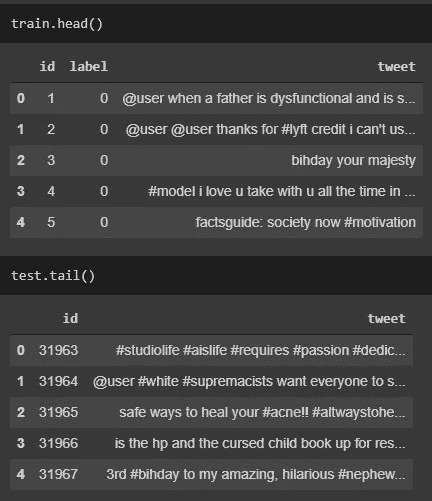
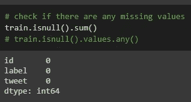
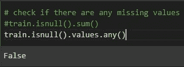
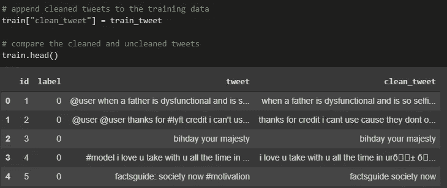
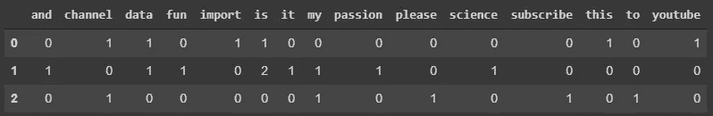
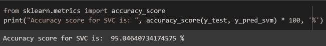

# Kaggle Twitter 情感分析:自然语言处理和文本分析

> 原文：<https://towardsdatascience.com/twitter-sentiment-analysis-nlp-text-analytics-b7b296d71fce?source=collection_archive---------36----------------------->

## 使用 Python 中的计数向量器和支持向量分类器对微博是否与仇恨相关进行分类

照片由[于切尔·莫兰](https://unsplash.com/@yucelmoran?utm_source=unsplash&utm_medium=referral&utm_content=creditCopyText)在 [Unsplash](https://unsplash.com/s/photos/twitter?utm_source=unsplash&utm_medium=referral&utm_content=creditCopyText) 上拍摄

你好 Medium 和 TDS 家族！

在这篇文章中，我将谈论如何使用 Python 中的 CountVectorizer 来分类推文是否是种族主义/性别歧视相关的推文。在本教程中，我将使用 Google Colab 进行编程。

查看**视频版**这里:[**https://youtu.be/DgTG2Qg-x0k**](https://youtu.be/DgTG2Qg-x0k)

你可以在这里找到我的**完整代码**:[**https://github.com/importdata/Twitter-Sentiment-Analysis**](https://github.com/importdata/Twitter-Sentiment-Analysis)

# 数据收集

我们将使用 Kaggle.com 来查找数据集。使用下面的链接访问 Kaggle 上的数据集。

 [## 推特情感分析

### 检测仇恨推文，由分析 Vidhya 提供

www.kaggle.com](https://www.kaggle.com/arkhoshghalb/twitter-sentiment-analysis-hatred-speech) 

## *1。了解数据集*

让我们阅读数据集的上下文来理解问题陈述。

在训练数据中，如果推文与种族主义或性别歧视情绪相关联，则推文被标记为“1”。否则，推文将被标记为“0”。

## 2.下载数据集

现在您已经了解了数据集，接下来下载两个 csv 文件——训练和测试数据。只需点击“下载(5MB)”

下载数据集后，确保解压文件。

现在让我们转到 Google Colab！

# 数据探索(探索性数据分析)

让我们看看训练和测试数据是什么样的。

检查训练和测试数据

注意这里有一些特殊的字符，比如@、#、！，等等。我们将在稍后的数据清理步骤中删除这些字符。

检查是否有任何缺失值。训练和测试数据都没有缺失值。

检查训练数据的缺失值

检查测试数据的缺失值

# 数据清理

我们将使用 tweet 预处理器库清理数据。下面是链接:[https://pypi.org/project/tweet-preprocessor/](https://pypi.org/project/tweet-preprocessor/)

这个库删除网址，标签，提及，保留字(RT，FAV)，表情符号和表情符号。

我们还将使用正则表达式库来删除 tweet-preprocessor 库没有的其他特殊情况。

数据清理功能

比较原始推文和清理过的推文

# 测试和训练分离

现在我们已经清理了数据，我们将使用 train_test_split 函数进行测试和训练分割。

我们将使用 70%的数据作为训练数据，剩余的 30%作为测试数据。

# 使用 CountVectorizer 对推文进行矢量化

现在，我们将把文本转换成数字形式，因为我们的模型不能理解人类语言。我们将使用 CountVectorizer 对推文进行矢量化。CountVectorizer 提供了一种简单的方法来标记一组文本文档并构建已知单词的词汇表。

例如，假设我们有一个如下所示的文本文档列表。

计数矢量器示例

CountVectorizer 组合所有文档并对它们进行标记。然后计算每个文档中出现的次数。结果如下所示。

计数矢量器示例结果

# 模型结构

现在我们已经对所有的推文进行了矢量化，我们将建立一个模型来对测试数据进行分类。

我们将使用监督学习算法，支持向量分类器(SVC)。它广泛用于二元分类和多类分类。

您可以在 scikit-learn 文档页面上找到更多解释:[https://sci kit-learn . org/stable/modules/generated/sk learn . SVM . SVC . html](https://scikit-learn.org/stable/modules/generated/sklearn.svm.SVC.html)

# 准确(性)

开始了。准确率竟然是 95%！

SVC 准确度分数