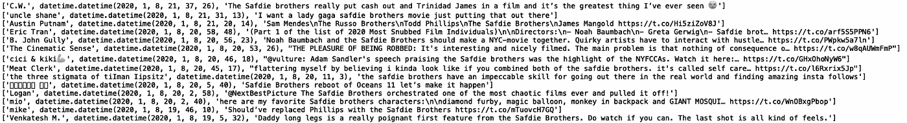
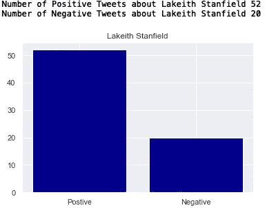

# 关于原钻的推文分析

> 原文：<https://towardsdatascience.com/twitter-sentiment-analysis-of-uncut-gems-92cc0e0ae628?source=collection_archive---------29----------------------->

## 原钻的推特情感分析:去除假阴性


照片由[乔尼·卢](https://www.pexels.com/@jonnylew)在[像素](https://www.pexels.com/photo/closeup-photo-of-purple-gemstones-1121123/)上拍摄

*《原钻》*是一部犯罪/惊悚片，由亚当·桑德勒、茱莉亚·福克斯、勒凯斯·斯坦菲尔德和前 NBA 球员凯文·加内特主演。由乔希和本尼·萨夫迪编剧和导演的《原钻》是一部历时十年制作的电影。故事情节讲述了一个纽约珠宝商和赌博成瘾的人，他必须找回一颗在埃塞俄比亚开采的黑欧泊未切割宝石，以便出售和偿还债务。这部电影是 A24 迄今为止票房最高的电影，在撰写本文时票房收入为 4000 万美元。

以我个人的经验来看，抛开专业影评人对这部电影的好评如潮不谈，我的同行对这部电影的评价褒贬不一。这启发了我对关于原钻的推文进行情感分析。在本文中，我们将使用 python Twitter API 包装器 Tweepy 来检索关于电影的推文，然后使用另一个名为 textblob 的 python 库对这些推文进行情感分析。

我们开始吧！

首先，你需要申请一个 Twitter 开发者账户:


[来源](https://projects.raspberrypi.org/en/projects/getting-started-with-the-twitter-api/3)

在您的开发人员帐户获得批准后，您需要创建一个 Twitter 应用程序:


[来源](https://projects.raspberrypi.org/en/projects/getting-started-with-the-twitter-api/4)

申请 Twitter 开发者账户和创建 Twitter 应用程序的步骤在这里[有所概述](https://projects.raspberrypi.org/en/projects/getting-started-with-the-twitter-api/4)。

为了访问 Twitter API，我们将使用免费的 python 库 tweepy。tweepy 的文档可以在这里找到[。](https://tweepy.readthedocs.io/en/latest/getting_started.html)

1.  **安装**

首先，确保您已经安装了 tweepy。打开命令行并键入:

```
pip install tweepy
```

2.**导入库**

接下来，打开您最喜欢的编辑器，导入 tweepy 和 pandas 库:

```
import tweepy
import pandas as pd
```

3.**认证**

接下来，我们需要我们的消费者密钥和访问令牌:


[来源](https://projects.raspberrypi.org/en/projects/getting-started-with-the-twitter-api/4)

请注意，该网站建议您保持您的密钥和令牌私有！这里我们定义了一个假的密钥和令牌，但是在创建 Twitter 应用程序时，您应该使用真正的密钥和令牌，如上所示:

```
consumer_key = '5GBi0dCerYpy2jJtkkU3UwqYtgJpRd' 
consumer_secret = 'Q88B4BDDAX0dCerYy2jJtkkU3UpwqY'
access_token = 'X0dCerYpwi0dCerYpwy2jJtkkU3U'
access_token_secret = 'kly2pwi0dCerYpjJtdCerYkkU3Um'
```

下一步是创建 OAuthHandler 实例。我们传递上面定义的消费者密钥和访问令牌:

```
auth = tweepy.OAuthHandler(consumer_key, consumer_secret)
auth.set_access_token(access_token, access_token_secret)
```

接下来，我们将 OAuthHandler 实例传递给 API 方法:

```
api = tweepy.API(auth)
```

4. **TWITTER API 请求**

接下来，我们为我们有兴趣分析的字段初始化列表。现在，我们可以查看推文字符串、用户和推文时间。接下来，我们在一个 tweepy“Cursor”对象上编写一个 for 循环。在“Cursor”对象中，我们传递“api.search”方法，为我们想要搜索的内容设置查询字符串，并设置“count”= 1000，这样我们就不会超过 Twitter 的速率限制。在这里，我们将搜索关于“星球大战”的推文。我们还使用“item()”方法将“Cursor”对象转换为 iterable。

为了简化查询，我们可以删除转发，只包含英文推文。为了了解该请求返回的内容，我们还可以打印附加到每个列表的值:

```
twitter_users = []
tweet_time = []
tweet_string = []
for tweet in tweepy.Cursor(api.search,q='Uncut Gems', count=1000).items(1000):
            if (not tweet.retweeted) and ('RT @' not in tweet.text):
                if tweet.lang == "en":
                    twitter_users.append(tweet.user.name)
                    tweet_time.append(tweet.created_at)
                    tweet_string.append(tweet.text)
                    print([tweet.user.name,tweet.created_at,tweet.text])
```


为了实现可重用性，我们可以将它封装在一个函数中，该函数将关键字作为输入。我们还可以将结果存储在数据帧中并返回值:

```
def get_related_tweets(key_word):twitter_users = []
    tweet_time = []
    tweet_string = [] 
    for tweet in tweepy.Cursor(api.search,q=key_word, count=1000).items(1000):
            if (not tweet.retweeted) and ('RT @' not in tweet.text):
                if tweet.lang == "en":
                    twitter_users.append(tweet.user.name)
                    tweet_time.append(tweet.created_at)
                    tweet_string.append(tweet.text)
                    print([tweet.user.name,tweet.created_at,tweet.text])
    df = pd.DataFrame({'name':twitter_users, 'time': tweet_time, 'tweet': tweet_string})

    return df
```

当我们可以用关键字“原钻”调用函数时:

```
get_related_tweets('Uncut Gems')
```


我们也可以传入关键字“亚当·桑德勒”:

```
get_related_tweets('Adam Sandler')
```


我们也可以传入关键字“Julia Fox”:

```
get_related_tweets('Julia Fox')
```


还有《萨夫迪兄弟》:

```
get_related_tweets('Safdie Brothers')
```



为了获得情感分数，我们需要导入一个名为 textblob 的 python 包。textblob 的文档可以在[这里](https://textblob.readthedocs.io/en/dev/)找到。要安装 textblob，请打开命令行并键入:

```
pip install textblob
```

下次导入 textblob:

```
from textblob import TextBlob
```

我们将使用极性得分作为积极或消极情绪的衡量标准。极性得分是一个从-1 到+1 的浮点数。

例如，如果我们定义一个 textblob 对象并传入句子“原钻是最好的！”：

```
sentiment_score = TextBlob("Uncut Gems is the best!").sentiment.polarity
print("Sentiment Polarity Score:", sentiment_score)
```


我们也可以试试“亚当·桑德勒太棒了！”：

```
sentiment_score = TextBlob("Adam Sandler is amazing!").sentiment.polarity
print("Sentiment Polarity Score:", sentiment_score)
```


我在使用 textblob 时注意到的一个缺陷是，尽管存在积极的形容词，但它对消极单词的存在给予了更大的权重，这可能会夸大错误的否定。电影标题中出现“未剪辑”一词会显著降低情感值。例如，考虑“这部电影太棒了”vs“原钻太棒了！”：

```
sentiment_score = TextBlob(“This movie is amazing”).sentiment.polarity
print("Sentiment Polarity Score:", sentiment_score)
```


```
sentiment_score = TextBlob(“Uncut Gems is amazing!”).sentiment.polarity
print("Sentiment Polarity Score:", sentiment_score)
```


我们可以看到，对于“原钻太棒了！”，在情绪依然积极的同时，明显低于前一句“这部电影太棒了”时两者应该价值接近或相等。我们解决这个问题的方法(作为一个快速解决方案)是，我们将从 tweet 中删除单词“Uncut ”,并从结果中生成情感评分。

让我们获得关于“原钻”的推文的情感极性分数，并将它们存储在一个数据框中(在删除单词“未切割”之前):

```
df = get_related_tweets("Tesla Cybertruck")
df['sentiment'] = df['tweet'].apply(lambda tweet: TextBlob(tweet).sentiment.polarity)
print(df.head())
```


我们也可以计算积极和消极情绪的数量:

```
df_pos = df[df['sentiment'] > 0.0]
df_neg = df[df['sentiment'] < 0.0]
print("Number of Positive Tweets", len(df_pos))
print("Number of Negative Tweets", len(df_neg))
```


正如我们所看到的，关于“原钻”的负面推文明显多于正面推文，但这可能是因为电影名称中出现了“未剪辑”这个词，这可能给了我们错误的否定。

让我们修改数据框架，从推文中删除“未剪切”一词:

```
df['tweet'] = df['tweet'].str.replace('Uncut', '')
df['tweet'] = df['tweet'].str.replace('uncut', '')
df['tweet'] = df['tweet'].str.replace('UNCUT', '')
df['sentiment'] = df['tweet'].apply(lambda tweet: TextBlob(tweet).sentiment.polarity)
print(df.head())
df_pos = df[df['sentiment'] > 0.0]
df_neg = df[df['sentiment'] < 0.0]
print("Number of Positive Tweets", len(df_pos))
print("Number of Negative Tweets", len(df_neg))
```


我们可以看到，当我们删除“未切割”这个词时，积极的推文明显更多。

对于代码重用，我们可以将其全部封装在一个函数中:

```
def get_sentiment(key_word):
    df = get_related_tweets(key_word)
    df['tweet'] = df['tweet'].str.replace('Uncut', '')
    df['tweet'] = df['tweet'].str.replace('uncut', '')
    df['tweet'] = df['tweet'].str.replace('UNCUT', '')
    df['sentiment'] = df['tweet'].apply(lambda tweet: TextBlob(tweet).sentiment.polarity)
    df_pos = df[df['sentiment'] > 0.0]
    df_neg = df[df['sentiment'] < 0.0]
    print("Number of Positive Tweets about {}".format(key_word), len(df_pos))
    print("Number of Negative Tweets about {}".format(key_word), len(df_neg))
```

如果我们用“原钻”调用这个函数，我们得到:

```
get_sentiment(“Uncut Gems”)
```


如果我们能以编程方式可视化这些结果，那将会很方便。让我们导入 seaborn 和 matplotlib 并修改我们的 get _ 情操函数:

```
import seaborn as sns
import matplotlib.pyplot as pltdef get_sentiment(key_word):
    df = get_related_tweets(key_word)
    df['tweet'] = df['tweet'].str.replace('Uncut', '')
    df['tweet'] = df['tweet'].str.replace('uncut', '')
    df['tweet'] = df['tweet'].str.replace('UNCUT', '')
    df['sentiment'] = df['tweet'].apply(lambda tweet: TextBlob(tweet).sentiment.polarity)
    df_pos = df[df['sentiment'] > 0.0]
    df_neg = df[df['sentiment'] < 0.0]
    print("Number of Positive Tweets about {}".format(key_word), len(df_pos))
    print("Number of Negative Tweets about {}".format(key_word), len(df_neg))
    sns.set()
    labels = ['Postive', 'Negative']
    heights = [len(df_pos), len(df_neg)]
    plt.bar(labels, heights, color = 'navy')
    plt.title(key_word)

get_sentiment("Uncut Gems")
```


我们也可以用“亚当·桑德勒”来调用函数:

```
get_sentiment( “Adam Sandler”)
```


和“朱莉娅·福克斯”:

```
get_sentiment(“Julia Fox”)
```


还有“凯文·加内特”:

```
get_sentiment(“Kevin Garnett”)
```


还有《勒凯斯·斯坦菲尔德》:

```
get_sentiment(“Lakeith Stanfield”)
```



正如你所见，关于《原钻》及其主演的推文正面情绪多于负面情绪。

概括地说，在这篇文章中，我们讨论了如何使用 python twitter API wrapper (Tweepy)从 Twitter 中提取推文。我们还回顾了 python 情感分析包 textblob，以及如何使用它从推文中生成情感得分。最后，我们展示了如何通过删除“未剪切”这个词来修改推文，这个词会人为地降低情感分数。收集几天的数据来观察情绪如何随时间变化会很有趣。也许我会把它留到以后的文章里。

感谢您的阅读。这篇文章的代码可以在 GitHub 上找到。

如果你喜欢这篇文章，你可以在我的 patreon 链接[这里](https://www.patreon.com/from_sklearn)做一点贡献。

祝好运，机器学习快乐！