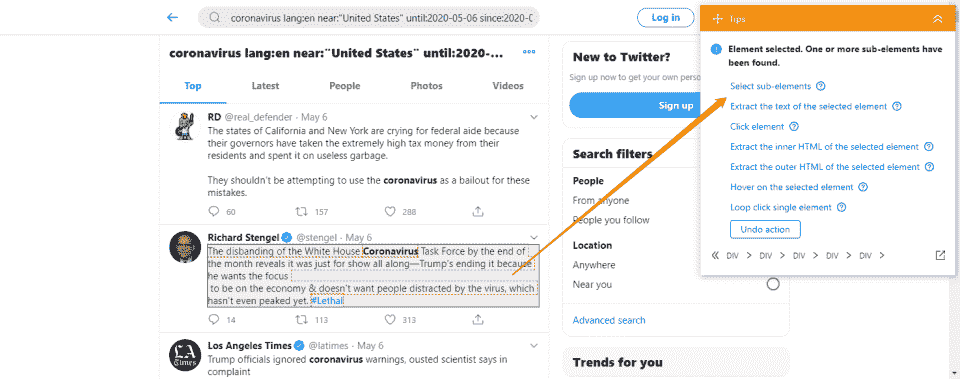
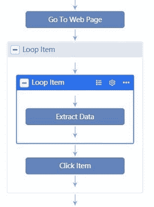
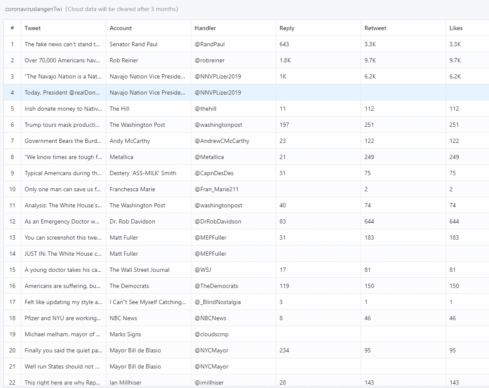
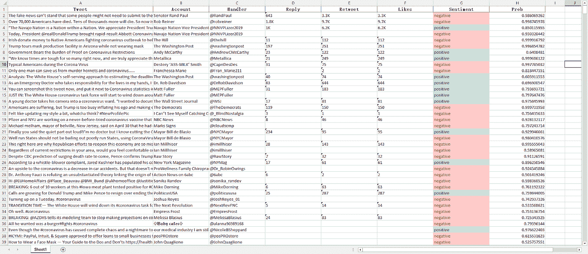
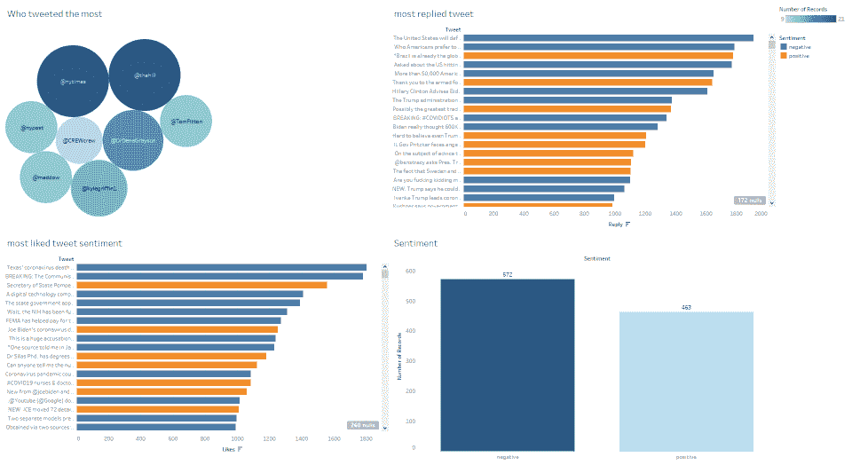

# 对新型冠状病毒(新冠肺炎)的推特情感分析

> 原文：<https://towardsdatascience.com/twitter-sentiment-analysis-on-novel-coronavirus-covid-19-5a9f950312d8?source=collection_archive---------49----------------------->

[腾雅特](https://unsplash.com/@tengyart?utm_source=medium&utm_medium=referral)在 [Unsplash](https://unsplash.com?utm_source=medium&utm_medium=referral) 上拍摄的照片

自从围绕冠状病毒的阴谋论爆发以来，脸书、推特和 Instagram 等社交媒体平台一直在积极进行审查和事实核查，以打击错误信息。随着更多可靠的消息来源被放大，Twitter 变得比疫情爆发初期更支持。我认为听到真正的公众声音和发现关于冠状病毒的真实情绪会更有趣。

不要被“刮擦”这个词吓倒。如果你能浏览网页，即使你是个新手，你也能像专业人士一样进行网页抓取。所以请容忍我。

了解态度的最简单方法是收集所有包含冠状病毒这个词的推文。我甚至通过将语言设置为英语和美国境内的地形来缩小研究范围。这将确保样本数据集与搜索主题保持一致，并提高预测的准确性。

研究范围定下来之后，现在就可以开始刮了。我更喜欢使用 [***八分解析***](https://www.octoparse.com/) 说到挑选最好的网页抓取工具，它有自动检测功能，这为我节省了很多手工挑选和选择数据的时间。

Twitter 更加动态，因为它有无限的滚动，这意味着一旦我们继续向下滚动页面，推文就会显示出来。为了获得尽可能多的 tweets，我构建了一个循环列表来维护获取信息时的滚动动作。这确保了刮擦工作流保持一致，不会中断。

接下来，我创建一个提取操作。Octoparse 在我们输入搜索 URL 时呈现网页。它会将网页结构分解成子组件，这样我就可以轻松地点击目标元素来设置命令，并告诉机器人——帮我获取信息。当我点击其中一条推文时，提示面板会弹出，建议选择子元素。

[使用 Octoparse 8 自动检测抓取 Twitter](https://helpcenter.octoparse.com/hc/en-us/articles/900000672806-Lesson-1-Extract-data-with-the-brand-new-Auto-detect-algorithm)

在那里！相应的事件会自动添加到工作流中。它还会找到其他推文。遵循提示指南，并单击“全选”命令。最终的工作流程应该是这样的:

八解析工作流

逻辑很简单:刮刀将首先访问页面。然后，它开始提取推文，直到完成循环中的所有推文。它将重复滚动动作来定位另一组推文，并再次继续提取，直到所有信息都被成功提取。

这是我得到的最终结果:

决赛成绩

# 用于情感分析的自然语言处理:

NLP 是自然语言处理的缩写。它被广泛用于分析文本的情感。这个想法是建立一个分类器模型来计算单词，并理解单词所代表的含义。例如，如果我输入一条推文，它应该会告诉我句子是肯定的还是否定的。显然，更细粒度的情感分类是一项更具挑战性的任务。

我已经有了一个训练有素的模型，所以我只是使用 FastText 来预测这种情况下的推文。我得到的结果是这样的，

情感分析

正如你所看到的，这些推文被分为两组——正面的和负面的。也有概率得分。得分越高，预测就越准确。至于 0.5 左右的分数，则表现出不积极也不消极的中性情绪。

我过滤掉得分低于 0.7 的推文，做个图:

使用 Tableau 可视化

如图所示，42.2%的推文对新型冠状病毒持肯定态度，而 57.8%的推文持否定态度。获得最多回复的推文往往更积极。然而，最受欢迎的推文似乎更加负面。这一结果显示了一种具有讽刺意味的情况，因为一般公众的态度显示出一种二分法而不是统一性。这解释了为什么有人一方面抗议经济重新开放，另一方面却担心医疗工作队的解散。我们正处于矛盾或不确定的境地。

新闻媒体总是用最响亮的声音告知公众。但我们知道，大多数主要参与者持有对我们的决策有深远影响的政治观点。尤其是当阴谋论搅进来，把一切都搅得水泄不通的时候——这是危机期间的典型现象。

除了战胜疾病，我们都应该尽自己的一份力量来遏制恐惧和厌恶的蔓延。如何保持头脑清醒？不要只看故事的一面，要多听一些声音。当我们阅读新闻时，我们应该采取批判性的做法和更负责任的态度，这样我们就永远不会在数百万人面前犯类似于"[围巾比口罩更好"](https://edition.cnn.com/2020/04/02/politics/fact-check-trump-coronavirus-briefing-april-2/index.html)的错误。最重要的是，我们不会指责而是团结起来共同治愈。

*原载于 2020 年 6 月 12 日*[*http://www . data extraction . io*](http://www.dataextraction.io/?p=631)*。*