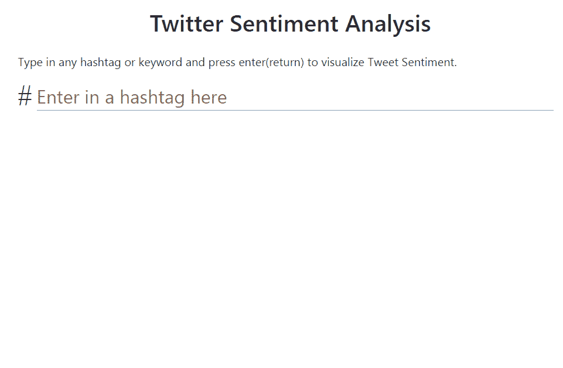
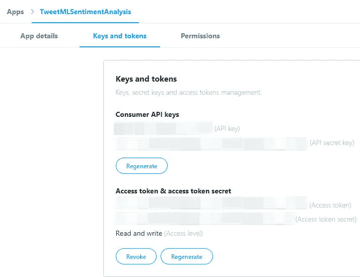

# 使用 Tensorflow.js 进行 Twitter 情感分析

> 原文：<https://towardsdatascience.com/twitter-sentiment-analysis-with-node-js-ae1ed8dd8fa7?source=collection_archive---------23----------------------->

## 使用 NLP 技术来了解人们是如何谈论你的品牌的


来源:bensonruan.com

情感分析是分析一篇在线文章(社交媒体帖子、评论)是正面、负面还是中性的过程。在过去的几年中，情感分析领域取得了重大进展，这种技术已经广泛应用于商业和政治领域。

在本文中，我们将连接到 Twitter API，通过 hashtag 收集推文，计算每条推文的情感，并构建一个实时仪表板来显示结果。下面是这个应用程序的最终结果，你可以键入你的品牌名称或你感兴趣的东西，看看人们在 Twitter 上是如何谈论它的。



点击下面的链接亲自尝试一下:

[](https://bensonruan.com/twitter-sentiment-analysis-with-tensorflowjs) [## 使用 Tensorflow.js - Benson 技术进行 Twitter 情感分析

### 情感分析是分析一篇在线文章(社交媒体帖子、评论)是否积极的过程…

bensonruan.com](https://bensonruan.com/twitter-sentiment-analysis-with-tensorflowjs) 

# 履行

这个工具对于企业监控和理解他们的品牌、产品或服务的社会情绪非常有用。我用 [Tensorflow.js 情感模型](https://github.com/tensorflow/tfjs-examples/tree/master/sentiment)制作了这个演示。如果你对它是如何建造的感到好奇，请跟随我，我会一步一步地告诉你。

## #第一步:创建一个 Twitter 应用

由于我们希望从 Twitter 中提取推文来分析情绪，因此，我们需要在 Twitter 的开发者平台中创建一个应用程序。

*   登录/注册一个 Twitter 账户
*   去 https://developer.twitter.com/en/apps
*   单击创建应用程序
*   填写应用信息表单并创建
*   创建应用程序后，导航到**密钥和令牌**选项卡
*   生成**消费者 API 密钥**和**访问令牌&访问令牌秘密**



Twitter API 密钥和令牌

## #第二步:从 Twitter 上获取推文

一旦您创建了 Twitter 应用程序并生成了 API 密钥和令牌，就该利用 [Twitter 的搜索 API](https://developer.twitter.com/en/docs/tweets/search/api-reference/get-search-tweets) 来下拉一些与您正在搜索的标签相匹配的推文了。

**PHP**

为了使事情更简单，这里我引用了 Twitter API v1.1 调用的 PHP 包装器 [twitter-api-php](https://github.com/J7mbo/twitter-api-php) 。从上面的库下载 TwitterAPIExchange.php，用下面的代码创建一个 queryTwitter.php，确保用步骤 1 中生成的代码替换 Twitter API 键和令牌。

**Javascript**

然后我们编写一个 javascript 函数向上面的 php 页面传递一个请求，并检索 tweets。

每条 tweet 都是一个对象，具有 id、created_at、user…等属性，我们感兴趣的是`"full_text"`属性

## #第三步:加载情感模型

只需在 html 文件的<头>部分包含`tfjs`和<的脚本。

```
<html>
  <head>
    <script src="[https://cdn.jsdelivr.net/npm/@tensorflow/tfjs](https://cdn.jsdelivr.net/npm/@tensorflow/tfjs)"></script>
  </head>
```

或者您可以通过 npm 安装它，以便在 TypeScript / ES6 项目中使用

```
npm install @tensorflow/tfjs
```

为了进行情感分析，我们首先需要通过调用`tf.loadLayersModel(url)`的 API 来加载预先训练好的情感模型和元数据。

该模型在 IMDB 的 25000 条电影评论上进行训练，这些评论被标记为积极或消极情绪。这个数据集是由 Python Keras 提供的[，模型也是基于](https://keras.io/datasets/#imdb-movie-reviews-sentiment-classification) [imdb_cnn](https://github.com/keras-team/keras/blob/master/examples/imdb_cnn.py) 示例在 Keras 中训练的。

## #第四步:情绪分析推文

对于每条推文，我们调用 Tensorflow.js 中的`model.predict(input)` API。这将对每条推文文本执行情感分析，返回 0 到 1 之间的存储，这表明它是中性的、积极的还是消极的。

## #步骤 5:在表格和图表中显示结果

现在我们有了推文的情感结果，为了让它看起来更好，更容易捕捉信息，我们把它放在一个表格和一个饼状图中。

现在我们有了推文的情感结果，为了让它看起来更好，更容易捕捉信息，我们把它放在一个表格和一个饼状图中。

对于饼图，我使用的是 jquery 图表库 [canvasjs](https://canvasjs.com/jquery-charts/)

当按下回车键或点击搜索按钮时，上述函数被调用

这就是代码，恭喜你，你已经建立了你的 Twitter 情绪分析应用。

# GitHub 知识库

您可以通过下面的链接下载上述演示的完整代码:

[](https://github.com/bensonruan/Sentiment-Analysis) [## 本森阮/情感分析

### 使用 npm 情绪模块的 Twitter 情绪分析连接到 Twitter API，通过标签收集推文，计算…

github.com](https://github.com/bensonruan/Sentiment-Analysis) 

在 [Unsplash](https://unsplash.com?utm_source=medium&utm_medium=referral) 上由 [Carlos Muza](https://unsplash.com/@kmuza?utm_source=medium&utm_medium=referral) 拍摄的照片

# 结论

仅使用 Tensorflow.js 情感 CNN 模型，这是一种简单的情感分析方法，但无法达到高准确率，约 70%。为了提高准确性，您可以研究更复杂的模型，如 LSTM。但是，我仍然认为这是一个很好的和方便的模型，并且在某种程度上表明了情绪是积极的还是消极的。

感谢您的阅读。如果你喜欢这篇文章，请在脸书或推特上分享。如果你有任何问题，请在评论中告诉我。在 [GitHub](https://github.com/bensonruan/) 和 [Linkedin](https://www.linkedin.com/in/benson-ruan/) 上关注我。