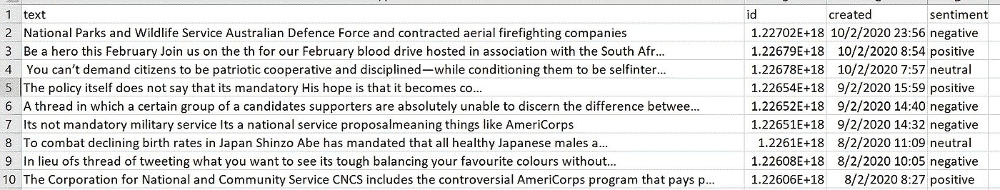
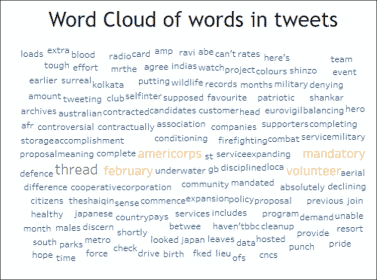

# R 中的 Twitter 文本分析

> 原文：<https://towardsdatascience.com/twitter-text-analysis-in-r-ed7b81ecdb9a?source=collection_archive---------28----------------------->

## [实践教程](https://towardsdatascience.com/tagged/hands-on-tutorials)

## 帮助通信从业者通过 Twitter 等开放数据源获得可操作的见解


由 [Unsplash](https://unsplash.com?utm_source=medium&utm_medium=referral) 上的[天线](https://unsplash.com/@antenna?utm_source=medium&utm_medium=referral)拍摄

开放数据源是数据科学家或分析师的最佳礼物之一，因为它们允许他们免费获得有价值的见解，而不必担心数据许可证。Twitter 是世界上最受欢迎的社交媒体应用之一，因为它是免费的，并且允许用户就他们想到的任何话题发表推文。本文将关注我们如何通过 R 编程使用 Twitter 来提取有价值的见解，并使用 Tableau 将这些发现传达给相关的利益相关者。

# 问题陈述

> “我们如何帮助传播从业者从 Twitter 获得可行的见解，以便他们能够创造更有效的沟通，满足公众的需求和关注”

本问题陈述选择的目标用户是**军事通信从业者**，他们渴望了解公众对新加坡军队(即国民兵役)的担忧。

# Twitter 数据源的特征

对于每个数据源，我们可以用大数据[的四个 V](https://www.ibmbigdatahub.com/infographic/four-vs-big-data)做一个简单的表示，主要是量、速度、多样性和准确性，以便对该数据源有一个总体的了解。

1.  **体积** —数据的规模
2.  **速度** —流数据分析
3.  **多样性** —不同形式的数据
4.  **准确性** —数据的不确定性


按作者分类的图片 Twitter 数据中的 4 个 V

# 连接到 Twitter API

我们可以在 R 编程中使用`twitteR`库包来访问 Twitter API。请注意，我们需要注册一个 [Twitter 开发者账户](https://developer.twitter.com/en/apply-for-access)来访问 API，因为每个用户都将获得一组唯一的消费者密钥、消费者密钥、访问令牌和访问密钥。一旦我们建立了与 Twitter API 的连接，我们将通过说明搜索词(即"*国服*")、最大推文数量(即 *n = 1000* )、搜索半径为英里的新加坡经纬度(即*地理编码= '1.3521，103.8198，279 米*')和语言(即【T11

```
# import necessary library for Twitter API, data manipulation and text cleaning
library("twitteR")
library("ROAuth")
library("dplyr")
library("tidytext")# Set up Twitter Connection
consumer_key <- '' # removed due to confidentiality
consumer_secret<- '' # removed due to confidentiality
access_token <- '' # removed due to confidentiality
access_secret <- '' # removed due to confidentiality
setup_twitter_oauth(consumer_key ,consumer_secret,access_token ,access_secret)# extract english tweets using 'National Service' tweeted in Singapore, with retweets removed
tweets <- strip_retweets(searchTwitter('National Service',n=1000, geocode='1.3521,103.8198,279mi',lang='en'))# print length of tweets
length(tweets)
```

请注意，对于 Twitter 公共 API 的免费版本，我们只能请求过去 7 天的推文。结果，我们的请求中只有 17 条推文。

# 数据清理

当我们通过 Twitter API 提取推文时，结果不会很清晰，因为推文可能使用多种语言，还包含像表情符号这样不可读的单词。看下面的截图，要采取的明显的数据清理步骤是删除 Twitter 用户名，删除表情符号(由表示)，并删除推文的 URL 链接(以蓝色突出显示)。


作者图片——通过 Twitter API 在 R

正如在上面的数据特征部分提到的，返回的 tweets 是 JSON 格式的，我们必须先将其转换成 R 格式的数据帧，然后才能使用像`dplyr`这样的通用数据处理库。在我们的分析中，我们不希望任何标点符号、数字或长度小于 2 的单词。因此，在我们的文本清理代码中，我们将删除它们。

```
# convert tweets to df
df <- twListToDF(tweets)# text cleaning
df$text <- as.character(df$text)
df$text <- gsub("\\$", "", df$text) 
df$text <- gsub("@\\w+", "", df$text)
df$text <- gsub("[[:punct:]]","", df$text)
df$text <- gsub("http\\w+", "", df$text)
df$text <- gsub("[ |\t]{2,}", "", df$text)
df$text <- gsub("^ ", "", df$text)
df$text <- gsub(" $", "", df$text)
df$text <- gsub("RT","",df$text)
df$text <- gsub("href", "", df$text)
df$text <- gsub("([0-9])","", df$text)
```

# 字频率

在每个文本分析问题中，将大块文本分解成单个单词(或标记)本质上是要采取的第一步，我们称之为标记化，可以使用`tidytext`库来完成。对于我们的分析，一旦我们将文本分解成单独的令牌，我们将合计每个唯一单词的计数，以便我们可以知道用户在推特上发布的一些常见单词。

```
# split the text into individual tokens, remove stopwords,'National Service', sort by descending count
tokens <- data_frame(text = df$text) %>%
    unnest_tokens(word, text) %>%
    anti_join(stop_words) %>%
    count(word, sort = TRUE)# output to csv for further usage
write.csv(tokens, './bukitmerah.csv',row.names = FALSE)
```


按作者分类的图像—标记及其频率的 csv 输出

如上所述，我们已经在一个 CSV 文件中输出了包含单个单词/单词及其频率的结果，稍后我们将把这些结果加载到 Tableau 中以实现可视化。

# 情感分析

我们可以对推文进行的另一种可能的分析是情绪分析，即对数据中的情绪进行解释和分类。这种情绪分析可以在 R 中使用`nrc`词典来容易地进行，该词典将每个单词/标记分类为 10 种情绪类别中的一种，主要是**愤怒、期待、厌恶、恐惧、快乐、消极、积极、悲伤、惊讶、信任**。然后会进行汇总，对积极情绪和所有消极情绪进行分类。每一个正面单词将被加上分数 **+1** ，每一个负面单词将被加上分数 **-1** 。一旦完成，每条推文的情感得分将被合并，如果得分高于 0 的**，该推文将被归类为**正面**。如果是低于 0** 的**，则为**负**。如果分数**正好为 0** ，则**中立**。**

```
# get sentiment score for each tweets by using the sentiment lexicon "nrc"
text_df <- data_frame(id=df$id, text = df$text) %>% 
    unnest_tokens(word, text) %>%
    anti_join(stop_words) %>%
    inner_join(get_sentiments("nrc")) %>%
    mutate(score = ifelse(sentiment=='positive',1,ifelse(sentiment=='joy',1,ifelse(sentiment=='anticipation',1,ifelse(sentiment=='trust',1,ifelse(sentiment=='surprise',1,-1)))))) %>%
    group_by(id) %>%
    summarise(total_score = sum(score)) %>%
    mutate(sentiment = ifelse(total_score>0,'positive',ifelse(total_score<0,'negative','neutral')))# get the dataframe which contains tweet message, id and it's sentiment
sentiments <- df %>% inner_join(text_df, by='id') %>% select('text','id','created','sentiment')
# output to csv for further usage
write.csv(sentiments, './sentiments.csv',row.names = FALSE)
```



按作者分类的图片—推文及其观点的 csv 输出

如上所述，我们已经在一个 CSV 文件中输出了包含整个 tweet 及其情感评分(即正面/负面/中性)的结果，我们稍后会将该结果加载到 Tableau 中以供可视化之用。

# 调查的结果

在前面的章节中，我们已经将两个文件输出为 CSV 格式，我们将把它们加载到 Tableau 中，通过数据可视化来发现可能的见解。

使用包含单个单词/令牌的第一个文件以及所有用户在其推文中的推文频率，我们可以在 Tableau 中绘制一个单词云，单词越大表示频率越高。



按作者分类的图片—词频的 Tableau 词云

从单词 cloud 中，我们可以识别出一些常用词，如*、【线程】、【强制】、【志愿者】、【二月】、*、【美国军团】、*，这些词在军事背景下没有太多含义。*

让我们看看是否可以通过包含推文及其情感评分的第二个 CSV 文件发现更多有用的见解。由于正在发推文的时间也被捕获，我们可以绘制一个随时间变化的条形图，以查看一周内人们对国家服务的情绪(请记住，Twitter 公共 API 只允许长达 7 天的数据请求)。


按作者分类的图片-情绪分析的 Tableau 条形图

在 17 条相关推文中，10 条是正面的，5 条是负面的，2 条是中性的。我们还观察到，情绪在一周内朝着消极的一面发展。

# 缺点和限制

在使用 Twitter 公共 API 从普通公众收集关于国家服务的见解的分析中，可以发现三个主要缺点。

1.  **Twitter API**

>免费帐户仅允许从 API 中提取过去 7 天的推文

超过 7 天的数据不能提供公众对国民兵役观点的全面分析

>无法提供对用户人口统计数据的深入分析

**2。情感分析的准确性**

>应该进行更深入的情感分析，因为当前的软件不考虑整个推文的情感，导致推文根据几个词被归类为错误的情感

>不恰当的词语或言论无法过滤

**3。无关的推文**

>在其他国家的“国家服务”上无关的推文可能会被捕获，因为 Twitter 对每个人开放，无论他们在哪里，都可以发布任何推文

# 摘要

在本文中，我们讨论了如何使用 Twitter 这样的开放数据源，从公众那里收集特定利益相关者感兴趣的任何问题的宝贵见解，在我们的案例中，这些利益相关者是军队/国家服务的通信从业者。我们还讨论了使用 R 中内置的情感分析包来解释文本中包含的情感。在数据科学领域的大部分时间里，数据科学家经常构建他们的情感分析模型，因为每个问题都需要不同的模型来获得更合适和准确的情感。希望你们现在有一个想法，我们可以考虑如何使用 Twitter API 和内置的情感分析库来启动你的文本挖掘问题！