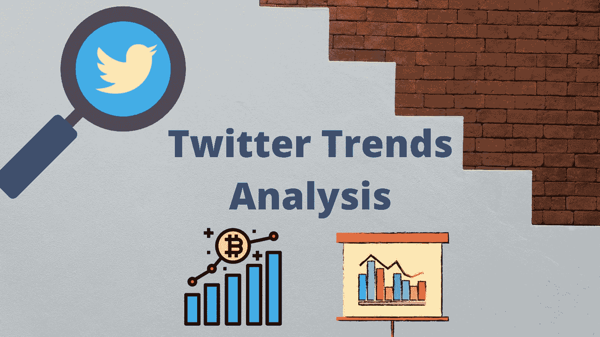
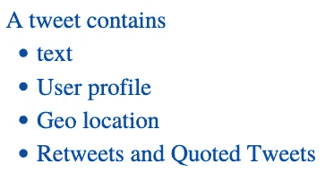
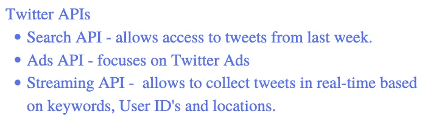
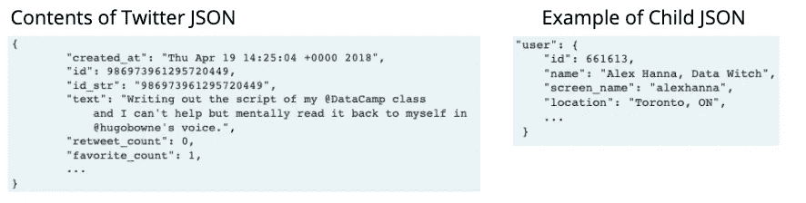
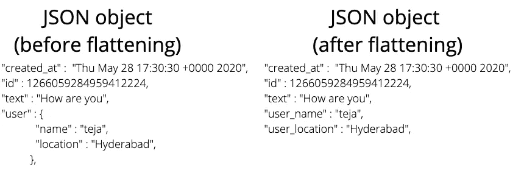
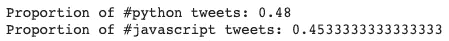
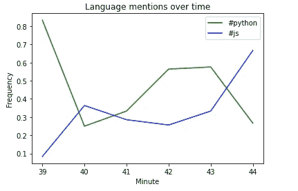
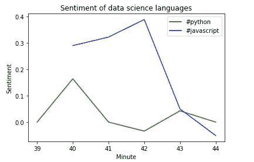

# 使用 Python 进行 Twitter 趋势分析

> 原文：<https://towardsdatascience.com/twitter-trends-analysis-using-python-fc78146f2f72?source=collection_archive---------11----------------------->

## 让我们尝试使用 Python 和 twitter API 来理解世界各地的 Twitter 趋势。



使用 Canva 设计

Twitter 于 2006 年推出，是当今最受欢迎的社交媒体平台之一。它有助于洞察流行趋势和重要的文化和政治时刻。在数据科学行业，twitter 分析可以用于市场营销或产品分析等任务。Twitter 数据已被用来分析政治极化和抗议运动的蔓延。在本文中，我们将了解收集 twitter 数据、处理 twitter 文本和绘制 twitter 数据地理地图的过程。我们将处理包含关键字 **#python** 和 **#javascript** 的数据子集。

# 收集数据

在收集数据时，我们受到两方面的限制。
1。无法收集过去(一年前等)的数据。)
2。Twitter 只免费提供其数据样本(比如其数据的 1%)。



然而，1%的数据样本相当于每天几百万条推文。许多社交媒体公司都有可供第三方开发者和研究人员使用的 API。Twitter 有许多可用的 API。



根据 tweepy docs，twitter 流 API 用于实时下载 Twitter 消息。这对于获取大量的 tweets，或者使用站点流或用户流创建实时提要非常有用。它有两个端点**过滤器**和**样本**。使用**过滤器**端点，用户可以使用几百个关键字、几千个用户名和 25 个位置范围请求数据。使用**样本**端点，twitter 将返回所有 twitter 数据的 1 %。为了从流式 API 收集数据，我们将使用一个名为`tweepy`的包，它抽象了建立稳定的流式 API 连接的工作。我们需要有自己的 twitter 账户和 API 密钥进行认证。

`tweepy`需要一个名为 SListener 的对象，告诉它如何处理传入的数据。这个 SListener 对象打开一个新的时间戳文件来存储 tweets，并带有一个可选的 API 参数。下面的代码将一直运行，直到显式停止(执行时间越长，文件中 Twitter JSON 对象的数量就越多)。本文中的数据集由 685 条 tweets(Twitter JSON 对象)组成，这些 tweet 是从 IST 时间晚上 7:39 到 IST 时间晚上 7:44 获取的。

现在一个名为`tweets.json`的文件将包含 JSON 对象。JSON 对象的数量取决于上述连接的打开和关闭。

## 了解 Twitter JSON

数据格式是一种特殊的数据格式，便于人们阅读，并且易于在机器之间传输。它是字典和列表的结合。每个 JSON 对象都有许多子对象。在我们的例子中，主 JSON 对象描述了主 tweet、favourites_count、retweet_count 等。并且具有描述用户、位置等的嵌套字典。



# 处理数据

为了大规模分析推文，最好将这些推文存储在熊猫数据帧中。这使我们能够跨行和列应用分析方法。然而，对于嵌套字典，JSON 对象是复杂的。为了克服这个问题，我们将把 JSON 对象扁平化(将所有属性保持在一个层次上，而不是嵌套)。



让我们将 tweets 列表加载到一个数据帧中。

```
df_tweet = pd.DataFrame(tweets)
```

现在让我们比较一下拥有#python 和#javascript 的推文数量。让我们编写一个函数，它将检查所有文本列中给定的 hashtag，并返回一系列布尔值，指示每一行是否有该关键字。



我们可以注意到， **#python** 略微领先于 **#javascript** 。现在，让我们试着了解一下上述两个关键词的提及率是如何随时间变化的。关于产品和公司的推文变化很大。让我们试着捕捉随时间的变化。当数据标有日期和时间时，它被称为时间序列数据。

首先让我们将`created_at` 列转换为 DateTime 类型。我们需要创建一个可以随时间变化的指标。让我们创建由布尔值组成的两列`python`和`js`。

现在让我们创建两个标签每分钟的平均提及次数，并绘制它们的时间图。我们将使用一系列方法`resample()`,这将允许我们在我们选择的时间窗口内进行汇总，并对其应用聚合函数。

`resample(“1 min”).mean()`将按分钟对数据进行分组，并对分组后的数据应用均值函数。



正如我已经提到的，我们从下午 7:39 到 7:44 获取数据，我们可以注意到分钟轴的值从 39 到 44，我们可以注意到频率如何随时间变化。

# 情感分析

情感分析是一种从文本中获取意义的方法。它是一种自然语言处理方法，用来判断一个单词、句子、段落、文档是肯定的还是否定的。基于正面和负面单词的数量，给每个文档一个正面或负面的分数。这可以用来分析对产品、公司等的反应。

我们将使用**自然语言工具包**或`nltk`中包含的**VADER**感知语义分析器。这对于分析短文档特别是推文很有用。也考虑表情符号和单词的大小写。

来自 VADER 分析器的每个情感分数提供 4 个值。阴性、阳性、中性和复合。前 3 个是不言自明的，范围在 0 到 1 之间，而复合值的范围在-1 到 1 之间。越接近 1 表示正，越接近-1 表示负。我们将再次对每分钟的数据进行重新采样，并找到每分钟的情感分数。



我们可以注意到，在我们拥有的一小部分数据中，没有负面的推文，而与 python 相比，javascript 有更多正面的推文。

> 根据我们收集的数据，我们可以按天、按月对数据进行采样，并执行类似的分析，以获得更多的见解。

完整的代码可以在[这里](https://github.com/kurasaiteja/Twitter-Trends-Analysis)找到。

# 结论

在本文中，我们学习了如何从 API 获取信息，还学习了如何处理 JSON 数据并对其进行时序分析。我没有把重点放在情感分析的内部解释上，这将在我以后的文章中讨论。作为即将到来的网络分析系列的一部分，我将使用图数据结构来说明 Twitter 数据的网络分析。

感谢阅读，并随时分享反馈！呆在家里，注意安全。