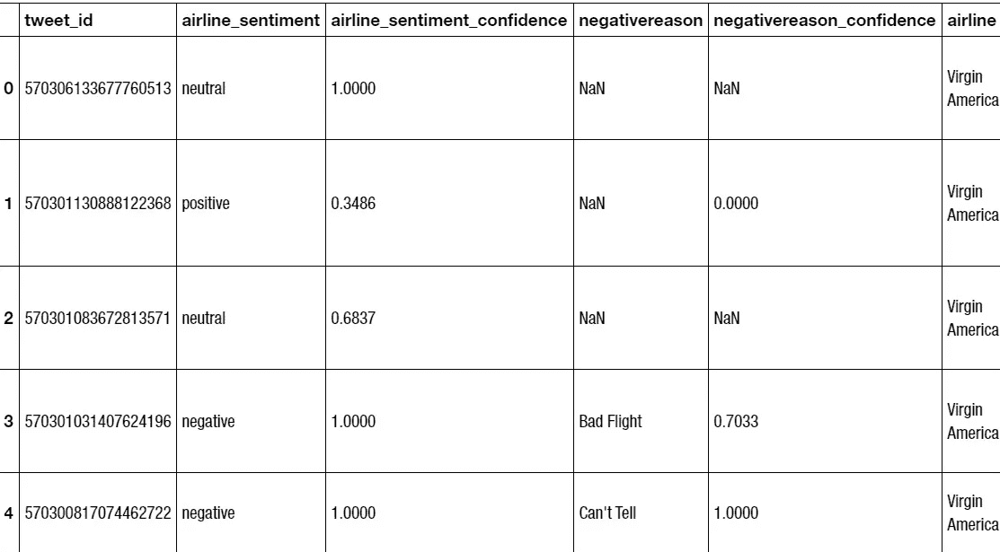
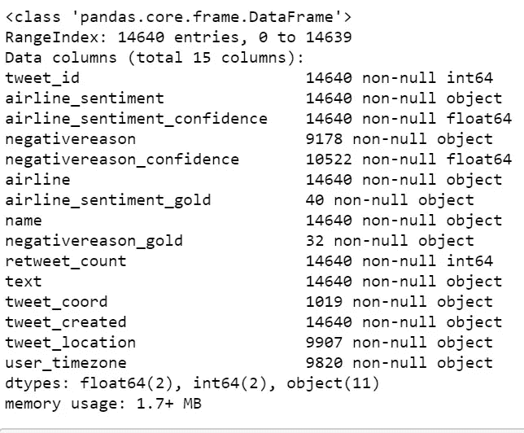
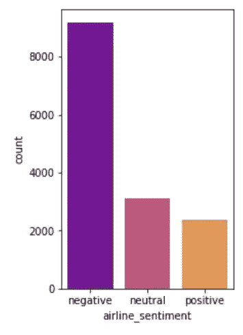
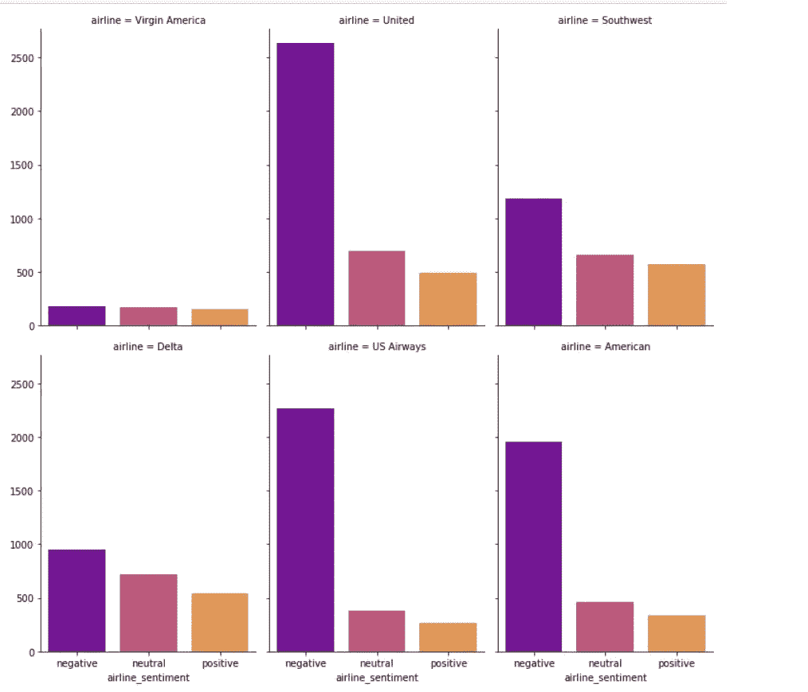
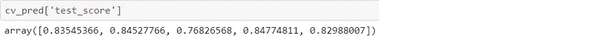

# Twitter 美国航空公司情绪分析

> 原文：<https://towardsdatascience.com/twitter-us-airline-sentiment-analysis-91caa7a22a93?source=collection_archive---------38----------------------->

## 用 Lightgbm 分类器进行反馈分析。


Szabo Viktor 在 Unsplash 上拍摄的照片

这里的目标是分析旅行者如何在 2015 年 2 月在 Twitter 上提及他们的感受。对于航空公司来说，利用这些免费数据为客户提供更好的服务将是非常有趣的。这个数据集可以从[这里](https://www.kaggle.com/crowdflower/twitter-airline-sentiment)下载。

怎么分析呢？

我已经用 Python 上传了保存在本地目录中的数据:

```
tweets = pd.read_csv('Tweets.csv')
```

让我们看看数据集中包含的要素:

```
tweets.head()
```



我们在这里寻找的是名为“航空公司情绪”的列，以及我们如何根据旅行者的推文预测它。这叫做情感分析。

为了更好地了解观察结果和特征，我们可以运行以下命令，它将为我们提供每个特征的特征。

```
tweets.info()
```



让我们把表达出来的感觉想象成消极的、中性的和积极的。

```
plt.figure(figsize=(3,5))
sns.countplot(tweets['airline_sentiment'], order =tweets.airline_sentiment.value_counts().index,palette= 'plasma')
plt.show()
```



大多数人持否定态度，如果航空公司能提供适当的回应，这将是一个很好的/免费的反馈。我们还可以展示对每家航空公司的看法。

```
g = sns.FacetGrid(tweets, col=”airline”, col_wrap=3, height=5, aspect =0.7) g = g.map(sns.countplot, “airline_sentiment”,order =tweets.airline_sentiment.value_counts().index, palette=’plasma’) plt.show()
```



为了进行情感分析，我们需要导入一些库。由于这是一个分类问题，所以我使用 LGBMClassifier。

```
**from** **lightgbm** **import** LGBMClassifier
```

我们需要将这些推文(文本)转换成令牌计数矩阵。

```
**from** **sklearn.feature_extraction.text** **import** CountVectorizer
```

下一步是使用 tf-idf 表示来规范化计数矩阵。

```
**from** **sklearn.feature_extraction.text** **import** TfidfTransformer
```

我使用管道功能来完成所有步骤。

```
twitter_sentiment = Pipeline([('CVec', CountVectorizer(CountVectorizer(stop_words='english'))),
                     ('Tfidf', TfidfTransformer()),
                      ('norm', Normalizer()),
                    ('tSVD', TruncatedSVD(n_components=100)),
                     ('lgb', LGBMClassifier(n_jobs=-1))])
```

最后，CROSS_VALIDATE 与 ROC_AUC 指标一起使用。

```
%%time 
cv_pred = cross_validate(twitter_sentiment, 
tweets[‘text’], 
tweets[‘airline_sentiment’], 
cv=5, 
scoring=(‘roc_auc_ovr’))
```

我们使用 ROC_AUS 测量的结果如下。



完整的代码可以通过这个[链接](https://github.com/shosseini811/Twitter-US-Airline-Sentiment-Analysis/blob/master/Twitter%20US%20Airline%20Sentiment.ipynb)访问。