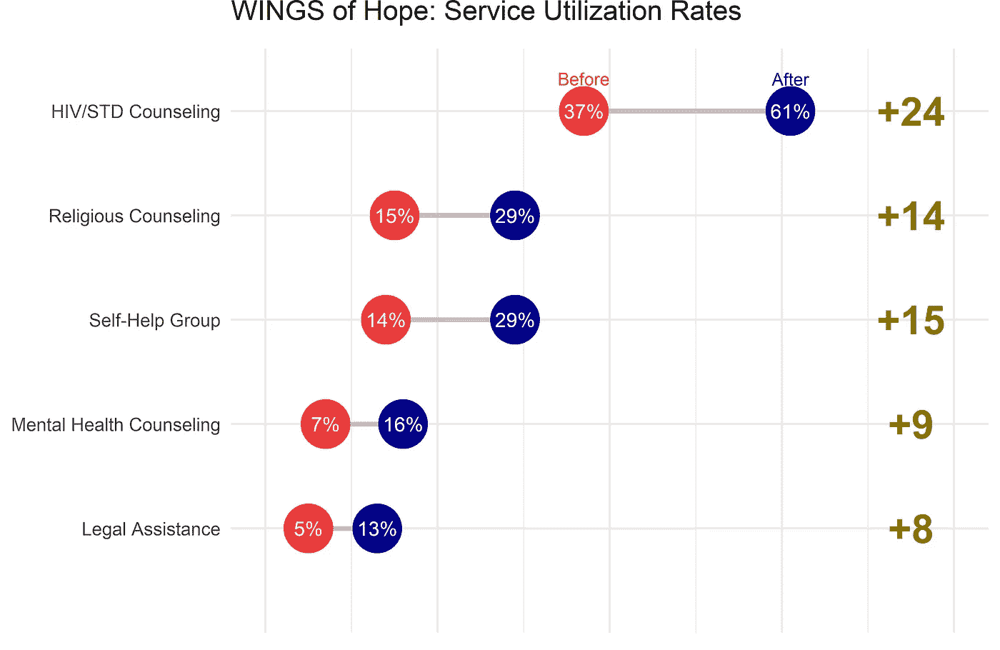
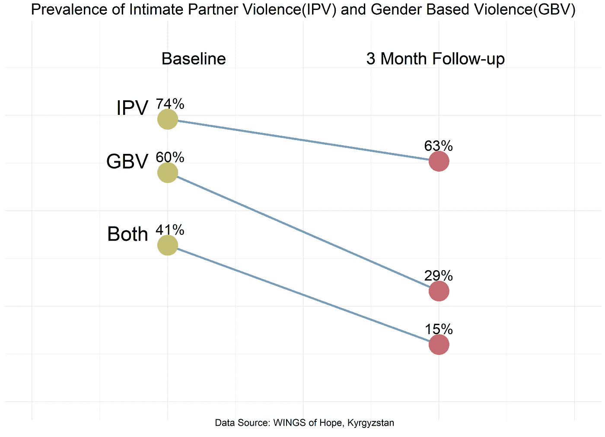

# 展示项目成果的两个令人惊叹的图表(静态与交互)

> 原文：<https://towardsdatascience.com/two-awesome-charts-to-present-project-results-static-vs-interactive-e7e36554b16?source=collection_archive---------80----------------------->

在 [Unsplash](https://unsplash.com/s/photos/data-analysis?utm_source=unsplash&utm_medium=referral&utm_content=creditCopyText) 上由 [Adeolu Eletu](https://unsplash.com/@adeolueletu?utm_source=unsplash&utm_medium=referral&utm_content=creditCopyText) 拍摄的照片

分享你的项目成果总是令人兴奋的，但更令人兴奋的是看到突出你成就的结果。选择正确的图表来展示您的项目结果可能会很棘手。可视化应该简单、全面、切中要点，当然，最好是用一种新的设计来替代条形图、饼图、折线图和散点图。

使用 [**Tableau**](https://www.tableau.com/) 或 [**Power BI**](https://powerbi.microsoft.com/en-us/) 软件，创建可视化的过程不需要编码来生成各种图形。但是，如果你没有这两个工具，你有什么选择？另一种选择是使用免费资源。

在非营利部门工作多年后，我发现 ggplot2 和 plotly 可以成为有用的工具。我经常要向捐赠者展示结果，我发现斜率和哑铃图非常有效。这些图表显示了两个时间段之间以及组内的比较。

这里有一个例子来说明它是如何工作的。我正在使用 [**希望之翼**](https://glori.kg/en/resource-center/) 项目的成果，该项目旨在消除处于危险中的妇女遭受的暴力。该项目为制定安全计划提供了干预措施，随后是前后测量。

我在用哑铃图可视化项目干预前后的数据。我的目的是展示服务价格在项目开始和结束时的不同。首先，我将创建一个数据集，然后使用 geom_dumbell 函数来绘制我的结果。在我的数据集中，我有以下服务名称(法律服务、HIV/STD 咨询、心理健康、自助团体和宗教咨询)、显示项目受益人使用这些类型服务频率的基线调查结果(14、5、15、7、37)，以及关于这些数字如何变化的 3 个月跟踪调查结果(29、13、29、16、31)。我还计划添加关于差异的列，因为我也想在图中使用它们。要理解 geom _ dumbling 函数的逻辑，我建议你查阅一下关于 [**ggalt 包**](https://cran.r-project.org/web/packages/ggalt/ggalt.pdf) **的文档。**

这是我得到的情节。它具有之前/之后的比较，并且在右侧，它以百分比的形式说明了变化。

用同样的数据，我正在用 plotly 制作交互式哑铃图。

单击下面的输出，在单独的窗口中打开它:

 [## 希望之翼:服务利用率|阿普加切夫制作的折线图| plotly

### 阿普加切夫的“希望之翼:服务利用率”的交互图和数据是一个折线图，显示了之前与…

chart-studio.plotly.com](https://chart-studio.plotly.com/~apugachev/7.embed) 

斜率表可以作为哑铃的替代品。显示两个时间点之间的变化方向令人印象深刻。我再次使用希望之翼项目的成果，但现在我的意图也是为了表明方向。我想展示我的项目指标是如何变化的。在我的例子中，我指的是暴力程度，暴力程度的降低证明了项目的有效性。首先，我将创建数据集并使用允许我用线连接两点的 [**geom_segment**](https://ggplot2.tidyverse.org/reference/geom_segment.html) 函数。在我的情况下，两点将代表基线和 3 个月的随访。

通过使用 ggplotly 函数，还有一种方法可以将 ggplot2 输出更改为 plotly 输出。请注意，这并不适用于所有图表。

单击下面的输出，在单独的窗口中打开它:

 [## 亲密伴侣暴力(IPV)和基于性别的暴力(GBV)的发生率|由…制作的折线图

### 阿普加切夫关于“亲密伴侣暴力(IPV)和基于性别的暴力(GBV)的流行程度”的互动图表和数据…

chart-studio.plotly.com](https://chart-studio.plotly.com/~apugachev/9.embed) 

总而言之，如果你的目标是展示项目的影响，考虑斜率或哑铃图是值得的。上面的例子展示了如何使用 ggplot2 和 plotly 从头开始创建静态和交互式可视化。这些图表可以为您关于项目影响的讨论增加价值。它们是不言自明的，并且准确地展示了观众需要了解的内容。

[1]希望之翼项目，吉尔吉斯斯坦，2014–2016 年

[2]鲍勃·鲁迪斯(2017 年 2 月 15 日)，*包“gg alt”*【https://cran.r-project.org/web/packages/ggalt/ggalt.pdf】T2

[3]Hadley Wickham，*线段与曲线*[https://gg plot 2 . tidy verse . org/reference/geom _ segment . html # details](https://ggplot2.tidyverse.org/reference/geom_segment.html#details)