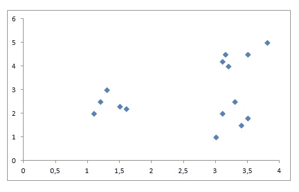
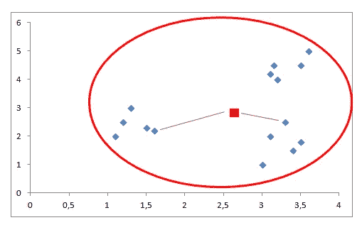
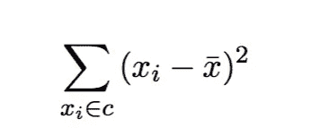
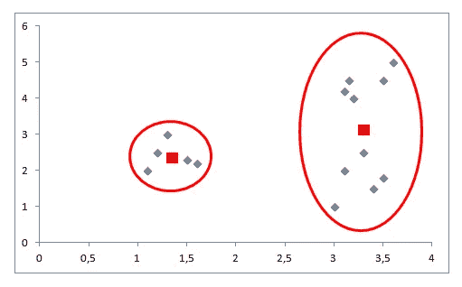
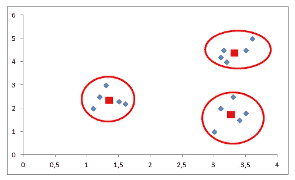
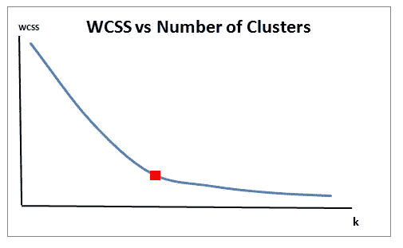

# K-均值聚类的两个挑战

> 原文：<https://towardsdatascience.com/two-challenges-of-k-means-clustering-72e90bdeb0da?source=collection_archive---------37----------------------->

## 如何“明智地”选择 k 和初始质心

照片由[岩田良治](https://unsplash.com/@ryoji__iwata?utm_source=unsplash&utm_medium=referral&utm_content=creditCopyText)在 [Unsplash](https://unsplash.com/s/photos/random?utm_source=unsplash&utm_medium=referral&utm_content=creditCopyText) 上拍摄

K-means 聚类算法旨在将数据划分为 k 个聚类，使得同一聚类中的数据点相似，而不同聚类中的数据点相距较远。两点的相似性是由它们之间的距离决定的。在这篇文章中，我将讨论在使用 k-means 聚类时需要记住的两个关键点。如果您不熟悉 k-means 聚类，您可能希望先阅读 k-means 算法的详细说明。

 [## k-均值聚类—已解释

### 详细的理论解释和 scikit-learn 实现

towardsdatascience.com](/k-means-clustering-explained-4528df86a120) 

为了充分利用 k-means 聚类算法，需要明智地应对两个挑战:

*   定义聚类的数量
*   确定初始质心

# **定义集群数量**

在运行 k-means 聚类算法之前，我们需要声明聚类的数量。它不能确定聚类的最佳数量。K-means 将数据集划分为我们预先确定的聚类数。对于我们来说，找到最佳的集群数量也是一项具有挑战性的任务。我们不能只看数据集就找出我们应该有多少分区。

> K-means 聚类试图最小化聚类内的距离。该距离被定义为聚类内距离和(WCSS)。

让我们看看 WCSS 随着不同的集群数量而变化。假设我们有以下非常简单的数据集:

让我们现实一点，有一个集群:

如果我们有一个集群，质心将是红色方块。WCSS 计算如下:

每个数据点和平均值之间的平方距离之和(红色方块)。随着聚类数量的增加，数据点和质心之间的平均距离减小，因此 WCSS 减小。

让我们看看两个集群的情况:

正如你所看到的，数据点和质心之间的平均距离减小了。请记住，距离的数量与集群的数量无关。无论存在多少个聚类，我们都将计算 n 个距离，其中 n 是数据点的数量。所以只能着眼于平均距离。

WCSS 在 3 个集群中进一步下降:

到目前为止，我们已经看到了 1、2 和 3 簇的 WCSS，其计算如下:

*   k=1 > WCSS = 35，16 单位
*   k=2 > WCSS = 20，91 单位
*   k=3 > WCSS = 2，95 单位

WCSS 还会下降多远？嗯，最终会是零。我们可以拥有的最大聚类数等于数据点的数量。虽然没有用，但是我们可以为每个数据点建立一个单独的集群。那么数据点和它的质心之间的距离变为零，因为数据点的质心就是它本身。

那么，为什么不对每个数据点进行聚类，并使 WCSS 为零呢？因为，在这种情况下，我们将有一个更大的问题，即过度拟合。过了一段时间后，我们将通过增加集群的数量来获得一点点 WCSS。下图显示了 WCSS 随着集群数量的增加而发生的变化。

正如你所看到的，在某一点之后，WCSS 并没有减少多少。我们应该寻找斜率急剧变化锐边。红色方块标记的边是我们的最佳聚类数。

如果我们选择大于该点的 k，WCSS 仍会降低，但不值得冒过度拟合的风险。

# **确定初始质心**

K-means 是一个迭代过程。它建立在[期望最大化](https://en.wikipedia.org/wiki/Expectation%E2%80%93maximization_algorithm)算法的基础上。确定集群数量后，它通过执行以下步骤来工作:

1.  **为每个簇随机选择质心(簇的中心)。**
2.  计算所有数据点到质心的距离。
3.  将数据点分配给最近的聚类。
4.  通过取聚类中所有数据点的平均值，找到每个聚类的新质心。
5.  重复步骤 2、3 和 4，直到所有点收敛并且聚类中心停止移动。

我们现在专注于第一步。根据数据集的底层结构，不同的初始质心可能最终形成不同的聚类。除此之外，完全随机选择质心可能会增加运行时间，因此算法需要更多的时间来收敛。

我们可能想寻找一种聪明的方法，而不是以完全随机的方式选择初始质心。那个聪明的办法就是 **k-means++** 。

K-means++确保了一种更智能的方式来初始化集群。如维基百科[所述，](https://en.wikipedia.org/wiki/K-means%2B%2B)

> ***k* -means++** 是一种为 *k* -means 聚类算法选择初始值(或“种子”)的算法。

k-means 和 k-means++的区别只是选择初始质心。剩下的步骤完全相同。K-means++从数据集中的数据点随机均匀地选择第一个质心。每个随后的质心从剩余的数据点中选择，其概率与其到该点最近的现有质心的距离的平方成比例。

幸运的是，在 scikit-learn 中实现了 k-means++。由 [sklearn.cluster.KMean](https://scikit-learn.org/stable/modules/generated/sklearn.cluster.KMeans.html) s 的“ **init** 参数指定，默认值为 k-means++。init 参数的另一个选项是“random ”,它随机初始化质心。

感谢您的阅读。如果您有任何反馈，请告诉我。

# **参考文献**

*   [https://en.wikipedia.org/wiki/K-means%2B%2B](https://en.wikipedia.org/wiki/K-means%2B%2B)