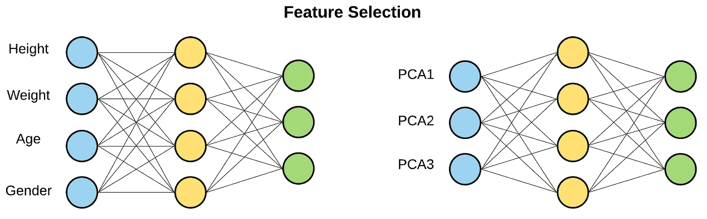

# 偏差和方差:改进每个模型的两个重要的机器学习概念

> 原文：<https://towardsdatascience.com/two-important-machine-learning-concepts-to-improve-every-model-62fd058916b?source=collection_archive---------19----------------------->

克里斯蒂娜·特里普科维奇在 [Unsplash](https://unsplash.com?utm_source=medium&utm_medium=referral) 上的照片

## 了解偏差和方差如何提高模型的准确性

如果你不明白自己做得对或错，那么训练任何新模型都是困难的。大多数时候，模型是黑匣子，它吸入数据，吐出精确的数字。理解**为什么**你的模型表现不佳是知道**你如何**改进它的关键。

1.  通过**识别偏差和方差，了解**为什么**你的模型表现不佳。**
2.  了解**如何通过**减少偏差和方差**来**改进您的模型。

# 识别偏差和差异

先说误差。误差是你的模型在测试数据上有多不准确。

如果你的模型在测试集上达到 86%的准确率，那么就有 14%的误差。这种误差一部分是偏差，一部分是方差。

上图两个要点:
1。**偏差**是训练集
2 的误差。**方差**是训练和测试准确度之间的差距

## 偏见

偏差描述了模型从训练数据中学习的能力。较大的偏差意味着模型很难从训练数据中学习。
如果模型对训练数据有 90%的准确度，那么模型有 10%的偏差。这种偏见有些是可以避免的，有些是不可避免的。

## [不可避免与可避免的偏差](https://d2wvfoqc9gyqzf.cloudfront.net/content/uploads/2018/09/Ng-MLY01-13.pdf#page=46)

**不可避免的偏差**被称为**最优误差率**。这是模型性能的上限。它认识到，一些任务，如字幕或股票预测，是不可能 100%准确预测的，即使对人类来说也是如此。因此，我们可以预期，即使在一个完美的世界中，我们的模型至少在某些时候是错误的。

如果你决定你的模型至少有 4%的时间是错误的，那么这个模型就有 4%不可避免的偏差。

**可避免偏差**是最优错误率与训练误差之差。这是我们可以尝试减少的误差，以实现最佳误差率。

## 差异

方差描述了您的模型对其尚未见过的数据的泛化能力。我们将方差定义为训练精度和测试精度之间的差异。

## [偏差与方差的权衡](https://d2wvfoqc9gyqzf.cloudfront.net/content/uploads/2018/09/Ng-MLY01-13.pdf#page=50)

大多数用来减少偏差或方差的方法都是以牺牲一个为代价来减少另一个。有一些例外，但是大多数时候构建最佳模型意味着最小化偏差和方差。

# 减少偏差和差异

## [减少可避免的偏差](https://d2wvfoqc9gyqzf.cloudfront.net/content/uploads/2018/09/Ng-MLY01-13.pdf#page=51)

*   **增加模型尺寸** 增加模型尺寸是减少可避免偏差的一种方法。
    模型越大，需要调整的参数越多。更多的参数允许模型学习更复杂的关系。您可以通过向模型添加更多的层或节点来增加模型的大小。模型从数据中学习得越好，就越接近最佳错误率。

*   **减少规则** 减少模型的规则允许模型更好地拟合训练数据。然而，较少的正则化意味着您的模型不会同样概化，从而增加了方差。这是偏倚与方差权衡的经典例子。

*   **更改模型架构** 更改模型架构可以帮助它更好地适应数据集。这类似于增加模型的大小，但是有更多的自由度。您可以更改以下任何内容，但要谨慎。
*   这些技术可以改变**偏差和**方差。
    1。层激活函数(tanh，relu，sigmoid，…)
    2。模型正在学习什么(安，CNN，RNN，KNN…)
    3。模型是如何学习的(Adam，SGD，RMSprop，…)
    4。更改其他超参数(学习率、图像大小等)

*   **添加新特征** 向训练数据添加新特征可以向模型提供更多信息，模型可以利用这些信息进行学习。这可以通过称为[特征工程](https://en.wikipedia.org/wiki/Feature_engineering)的过程来完成。在此过程中，您还可以将在开发早期剪切的功能添加回去。

## [减少差异](https://d2wvfoqc9gyqzf.cloudfront.net/content/uploads/2018/09/Ng-MLY01-13.pdf#page=53)

*   **添加更多的数据** 添加更多的数据是最简单的方法，*几乎*总是，增加你的模型的性能。添加更多数据的效果可以在 Andrej Karpathy 的文章[U*n reasonable Effectiveness of Data*](http://karpathy.github.io/2015/05/21/rnn-effectiveness/)中看到。此*通常*不会影响偏差，因此是减少方差的首选方法。

*   **增加正则化** 增加正则化可以防止模型在数据上过度拟合。虽然这减少了方差，但总会增加偏差。除了减少方差之外，加入正则化还可以产生显著的积极影响。我最喜欢的是使用 drop out 来实现[蒙特卡罗辍学](https://medium.com/@ahmdtaha/dropout-as-a-bayesian-approximation-representing-model-uncertainty-in-deep-learning-7a2e49e64a15)。

*   **减小模型尺寸** 减小模型尺寸有助于减少训练数据的过度拟合。尽管这种技术是最简单的，但它降低了模型学习数据集复杂模式的能力。通过添加正则化通常可以看到相同的结果，因此该方法是更优选的。

*   **特征选择** 通过删除不需要的特征来减少数据集的维数是减少模型方差的一个好方法。你可以用[主成分分析(PCA)](http://www.iro.umontreal.ca/~pift6080/H09/documents/papers/pca_tutorial.pdf) 过滤掉特征或者组合成几个主成分。

# 完整的画面

将所有这些放在一起，你应该能够识别偏差和方差，并知道如何减少它。

# 摘要备忘单

## 减少偏差

*   **增加模型尺寸**
*   **减少正规化**
*   **改变模型架构**
*   **添加功能**

## 减少方差

*   **添加更多数据**
*   **减小模型尺寸**
*   **添加正规化**
*   **功能选择**

# 资源

所有这些概念以及更多内容都包含在[吴恩达的《机器学习的渴望》一书中](https://d2wvfoqc9gyqzf.cloudfront.net/content/uploads/2018/09/Ng-MLY01-13.pdf)。它可以免费阅读、打印和分发。我强烈建议你去看看。

所有的图表都是作者创作的:

 [## 米基安·穆塞—中号

### 阅读米基安·穆瑟在媒体上的文章。数据科学家 https://mm909.github.io/Mikian/.·天天、米基安·穆塞尔和…

medium.com](https://medium.com/@mikianmusser)