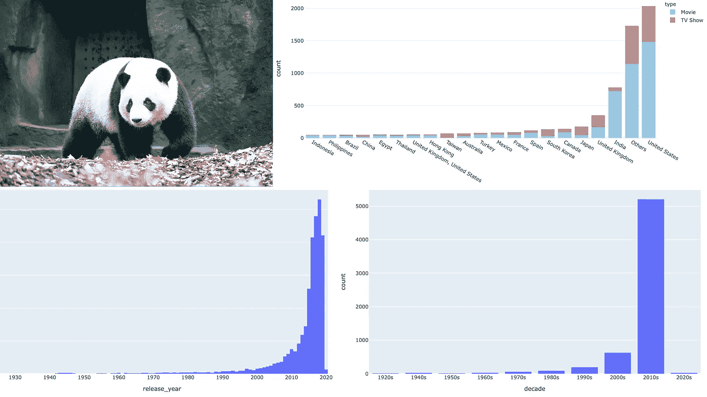

# 为了在 Python 中轻松操作数据，您必须知道两个熊猫函数

> 原文：<https://towardsdatascience.com/two-pandas-functions-you-must-know-for-easy-data-manipulation-in-python-2f6d0a2ef3e5?source=collection_archive---------11----------------------->

## 掌握这些 pandas 函数(和方法)可以缩短代码，提高性能，避免麻烦。



熊猫——其中一只与众不同(右上图由[斯坦·w .](https://unsplash.com/@stanyw?utm_source=unsplash&utm_medium=referral&utm_content=creditCopyText)在 [Unsplash](https://unsplash.com/s/photos/pandas?utm_source=unsplash&utm_medium=referral&utm_content=creditCopyText) 上拍摄)

我做大量的数据工作——一些 it 数据科学，一些 it 数据可视化，一些 it 数据邻近——比如摆弄体育分析。所有这些都是用 Python 完成的，而且几乎所有的数据操作都会用到 Pandas。

我喜欢认为在这段时间里，我学到了一两件关于使用熊猫的事情。我使用熊猫的方式与几年前我刚开始涉足熊猫时大不相同。我使用 Pandas 越多，我发现自己越少走出它进行数据操作。我的印象是，我的代码变得更加简洁，结果节省了大量时间。

所以在这篇文章中，我想和你们分享一些我现在离不开的功能——我相信你会发现它们和我一样有用。

是呆在室内的时候了，所以今天我使用来自 [Kaggle](https://www.kaggle.com) 的[网飞电影数据集](https://www.kaggle.com/shivamb/netflix-shows)。如果没有别的，你可能已经发现了一些值得看的东西:)。

# 在开始之前

## `Packages`

我假设您熟悉 python。即使你相对较新，这个教程也不应该太难。

你需要`pandas`和`plotly`。用一个简单的`pip install [PACKAGE_NAME]`安装每一个(在您的虚拟环境中)。

# 内容，内容无处不在

使用以下命令将网飞`csv`数据文件加载到熊猫数据帧中:

```
nf_df = pd.read_csv('srcdata/netflix_titles.csv')
```

让我们用`.head()`方法检查数据帧。

实际上，这引出了我的第一个建议。

## 在熊猫中设定显示选项

如果你像我一样，不使用 Jupyter notebook 或其变体，你可能会对 Python 外壳中熊猫有限的显示宽度感到沮丧。

这是运行`nf_df.head()`时输出的样子。

这并不能告诉你太多…

没那么有用。但是等等！Pandas 有一个`.set_option`功能，您可以使用它来调整要显示的列数，以及显示的总宽度。将您的参数设置为如下所示:

```
pd.set_option('display.max_columns', desired_cols)
pd.set_option('display.width', desired_width)
```

现在您的 shell 将输出更有用的东西。

更有用的输出

还有其他可以通过`.set_option`功能设置的选项——如果您有兴趣，可以在这里查看[文档。](https://pandas.pydata.org/pandas-docs/stable/reference/api/pandas.set_option.html)

## 。分配

你曾经看到过这条信息吗？

```
<input>:1: SettingWithCopyWarning: 
A value is trying to be set on a copy of a slice from a DataFrame.
Try using .loc[row_indexer,col_indexer] = value instead
```

如果这从未发生在你身上，你比我更好——你可能已经通过文件或一本书正确地了解了熊猫。

而熊猫官方的解释可以在这里[找到](https://pandas.pydata.org/pandas-docs/stable/user_guide/indexing.html#why-does-assignment-fail-when-using-chained-indexing)；但是 TL；dr 版本是，Pandas 警告您，无法确定您是否正在操作数据帧的*副本*(在这种情况下，您可能不会更改任何值)。

这也是使用`.assign`的原因之一。使用`.assign`，返回一个*新对象*，以避免由于`SettingWithCopyWarning`而导致的潜在混乱，不管实际问题是否存在，该问题经常被提出。

接下来，一个更明显的原因是创建一个新的*数据帧，现有的数据帧由于某种原因被保留。正如我提到的，`.assign`返回一个新的对象，所以我们可以避免类似这样的问题:*

第一个例子打印 13，因为我们不小心修改了原始数据帧(`nf_df`)，而在第二个例子中，原始数据帧保持不变，有 12 列。

现在，让我们继续讨论`.apply`——这可能是熊猫最被低估的功能之一:)。

## 。应用

如果你和我一样，你可能尝试过在一个循环中操作熊猫数据——可能会做类似这样的事情:

```
for i in range(len(nf_df)):
    nf_df.iloc[i, 1] = ...some function here
```

停下来。没必要这样。

这就是`.apply`方法的作用。它沿着数据帧的轴对每个元素应用一个函数。让我们来看一些例子。

**示例 1 —按发布年份统计的内容数量**

我们的数据框架包括一个发布年份的列(`release_year`)。分布可以绘制如下，如下所示:

```
fig = px.histogram(nf_df, x='release_year')
fig.show()
```


按年份划分的网飞图书发行数据直方图

如果我们想看十年的数据呢？简单—创建一个新列`‘decade’`,如下所示:

```
nf_df['decade'] = nf_df.release_year.apply(lambda x: str(x)[:3]+'0s')
```

这里，我们通过`nf_df.release_year`获取`release_year`列数据，并应用 lambda 函数`lambda x: str(x)[:3]+’0s’`。

Lambda 函数看起来令人困惑，但是一旦你习惯了，它就非常简单。在这里，它抓取每个元素(`x`)，首先应用转换`str(x)[:3]`获得年份字符串的前 3 个字母，并在末尾添加`’0s’`。

所以，看看我们新十年专栏的柱状图:

```
fig = px.histogram(nf_df, x='decade', category_orders={'decade': np.sort(nf_df.decade.unique())})
fig.show()
```


按十年划分的网飞图书发行数据直方图

看到这有多简单了吗？

另外，你可能已经注意到我使用了`.unique()`方法。这是一个非常有用的方法，它将返回该列中唯一实体的数组——不要错过它！

好吧。我们再来看一个使用`.apply`的例子。

**示例 2 —按来源国统计的内容数量**

DataFrame 还包括一个列(“`country`”)，该列(据我所知)包括内容的来源。

快速看了一下数据(`nf_df[‘country’].nunique()`)发现有 555 个(！)唯一实体在`country`列中。这是怎么回事？

事实证明，许多列表包含多个国家名称(例如'`United States, India, South Korea, China` ') —因此，让我们保留前 20 个名称，并将所有剩余的名称更改为“其他”。

用`.apply`很容易做到。为了清楚起见，我将使用两行代码，但也可能只用一行。准备好了吗？

```
top_countries = nf_df.groupby('country')['title'].count().sort_values().index
nf_df['country'] = nf_df.country.apply(lambda x: 'Others' if (x not in top_countries[-20:]) else x)
```

就是这样！再次运行`nf_df[‘country’].nunique()`，我们看到现在只有 21 个“国家”。

这里的 lambda 函数是一个简单的 if… else 语句，根据具有最高计数的列表检查'`country`'实体。

假设每个列还包括内容类型列，我们可以通过按内容类型给每个栏着色来可视化内容数据的细分。

```
fig = px.histogram(nf_df, x='country', color='type', category_orders={'country': top_countries},
color_discrete_sequence=px.colors.qualitative.Safe, template='plotly_white')
fig.show()
```


按来源国家和类型划分的网飞标题直方图

那不是很容易吗？想象一下用一些疯狂的循环函数来做这件事——通过`.loc`或`.iloc`索引器找到正确的索引器行/列号。不了，谢谢你。

整洁，对不对？

仅仅通过这两个简短的函数，您就可以完成以前可能需要一行又一行代码才能完成的事情。尝试一下——我敢打赌你会感到惊喜，并提高你的工作效率。

如果你喜欢这个，比如说👋/关注 [twitter](https://twitter.com/_jphwang) ，或点击此处获取更新。ICYMI:我还写了这篇关于用 Plotly Dash 构建 web 数据仪表板的文章。

[](/build-a-web-data-dashboard-in-just-minutes-with-python-d722076aee2b) [## 使用 Python 在几分钟内构建一个 web 数据仪表板

### 通过将您的数据可视化转换为基于 web 的仪表板，以指数方式提高功能和可访问性…

towardsdatascience.com](/build-a-web-data-dashboard-in-just-minutes-with-python-d722076aee2b) 

这篇文章也是关于将数据可视化来讲故事的:

[](/effectively-visualize-data-across-time-to-tell-better-stories-2a2c276e031e) [## 随着时间的推移有效地可视化数据，以讲述更好的故事

### 使用 Python 和 Plotly 构建清晰易读的时序数据可视化，以支持您的叙述。

towardsdatascience.com](/effectively-visualize-data-across-time-to-tell-better-stories-2a2c276e031e)