# 对 Python 字典进行排序的两种简单方法

> 原文：<https://towardsdatascience.com/two-simple-method-to-sort-a-python-dictionary-a7907c266dba?source=collection_archive---------10----------------------->

照片由[昂素敏](https://unsplash.com/@kaunglay1?utm_source=unsplash&utm_medium=referral&utm_content=creditCopyText)在 [Unsplash](https://unsplash.com/s/photos/book?utm_source=unsplash&utm_medium=referral&utm_content=creditCopyText) 上拍摄

## 以及 sort()和 sorted()的区别

字典是一种重要的数据结构，它通过将键与值进行映射来存储数据。Python 中默认的字典是无序的数据结构。像列表一样，我们可以使用 sorted()函数按键对字典进行排序。然而，它只会返回一个排序的键列表，这通常不是我们想要的。我们可能希望它按值而不是键排序，或者我们可能希望它返回一个排序的字典而不是一个列表。在本文中，我将讨论两种简单的方法，我们可以用它们来对 Python 字典进行排序并返回您想要的内容。

**排序列表**

既然我们在讨论排序，我想首先指出两个排序函数之间的一个非常重要的区别。让我们在列表中显示不同之处。假设我们有两个列表:

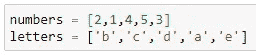

我们有两种对列表进行排序的方法，一种是使用 sort()进行就地排序，另一种方法是使用 sorted()，它不是就地排序。不同的是，当使用 sort()时，你会改变原来的列表，而 sorted()会返回一个新的列表而不改变原来的列表。如下所示:

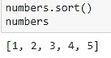

sort()改变了原始列表

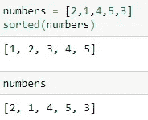

sorted()不改变原始列表

选择哪个用的高，要看实际情况。例如，如果你想保留原始记录，那么你应该使用 sorted()。如果你想节省空间和内存，那么你应该使用 sort()。

**整理字典**

让我们创建一个字典:

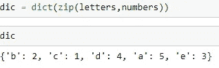

这里使用“zip”函数非常方便，我们将两个长度相同的列表中的元素映射在一起。

要对字典进行排序，我们必须使用 sorted()，因为字典没有嵌入 sort()函数:

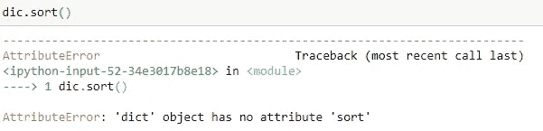

如果我们直接使用 sorted()，该函数将只从字典中返回一个键列表:

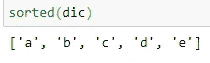

或者一个值列表:

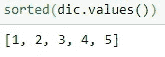

我们可以调用字典中的 items()函数，按键对其进行排序，并返回元组列表:

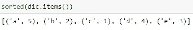

如果我们想对键进行逆序排序，我们可以在 sorted 函数中指定它:

如果我们想按值排序呢？有两种方法可以做到这一点。一种是使用 sorted()，但使用 lambda 函数指定排序的键；另一种方法是不使用默认的字典类型，而是使用不同的字典类型，直接按值对字典进行排序。

对于第一种方法，排序函数是一个*键*参数，用于指定在进行比较之前对每个元素调用的函数(或其他可调用函数)。我们可以在这里使用 lambda 函数来告诉 sorted()函数使用元素的哪一部分来进行比较。具体来说:

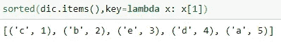

Python 是零索引的，所以 x[1]指定每个元素的第二部分是一个字典，也就是值。如果想要一个逆序，除了在 sorted()函数中添加一个逆序参数，我们还可以在 lambda 函数中使用一个负号:

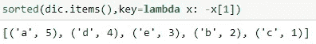

然而，这个技巧只在值是数字变量时有效。如果是字符串变量，就要用 reverse 参数。

如果您有一个值是数字的字典，您也可以在创建字典时使用不同的字典类型来直接对字典进行排序。字典类型可以是集合库中的计数器:

> 一个`[**Counter**](https://docs.python.org/2/library/collections.html#collections.Counter)`是一个`[**dict**](https://docs.python.org/2/library/stdtypes.html#dict)`子类，用于计数可散列对象。它是一个无序的集合，其中的元素存储为字典键，它们的计数存储为字典值。

创建计数器时，使用以下代码:

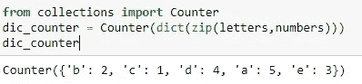

我们不是创建一个默认字典，而是创建一个计数器。它很有用，因为当我们想按值对字典排序时，我们可以只使用 most_common()函数:

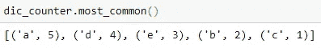

当您希望返回一个按值降序排列的元组列表时，这非常有用。

collections 库还有其他有趣的数据类型，比如 OrderedDict，它保留了插入的每个项目的顺序。更多信息，请点击查看网站[。](https://docs.python.org/2/library/collections.html#)

**返回排序后的字典**

通常，排序后，我们会得到一个元组的排序列表。如果你想以字典的形式拥有它，你可以使用字典理解，这很像列表理解，来完成这项工作:

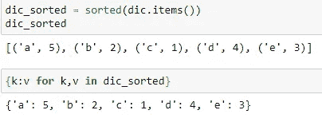

在本文中，我将介绍两种对 Python 字典进行排序的方法，以及 sorted()和 sort()函数之间的区别。救命这有帮助！感谢您的阅读！

这是我所有博客帖子的列表。如果你感兴趣的话，可以去看看！

 [## 我的博客文章库

### 我快乐的地方

zzhu17.medium.com](https://zzhu17.medium.com/my-blog-posts-gallery-ac6e01fe5cc3)  [## 阅读朱(以及媒体上成千上万的其他作家)的每一个故事

### 作为一个媒体会员，你的会员费的一部分会给你阅读的作家，你可以完全接触到每一个故事…

zzhu17.medium.com](https://zzhu17.medium.com/membership)