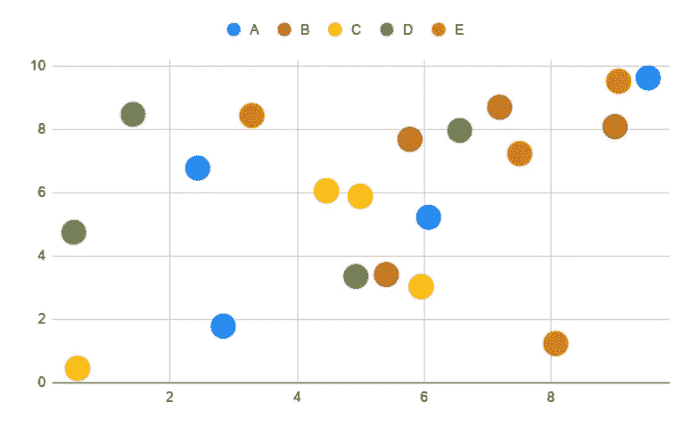
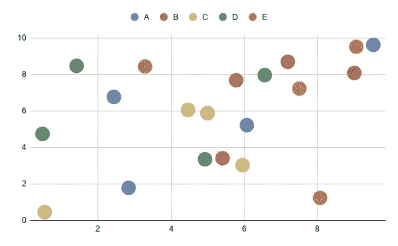
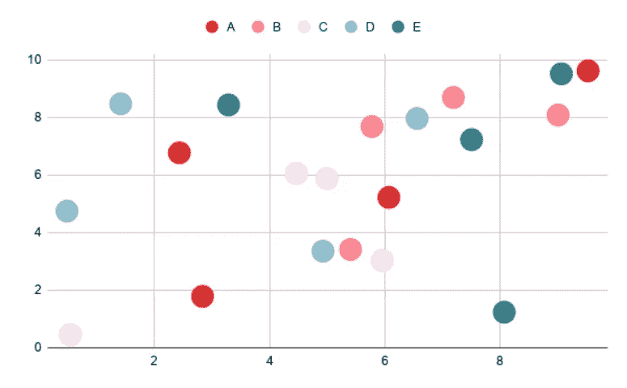
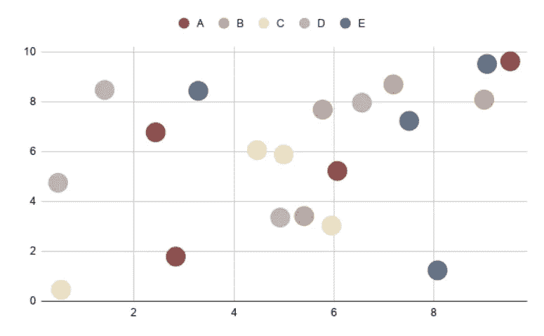
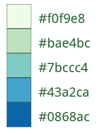
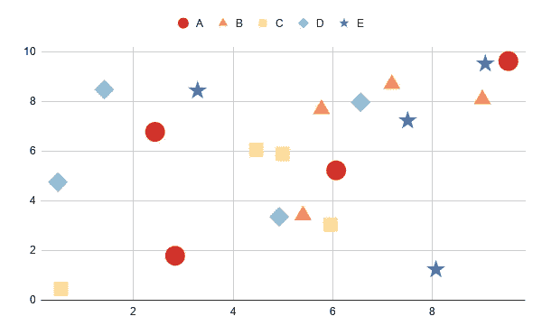
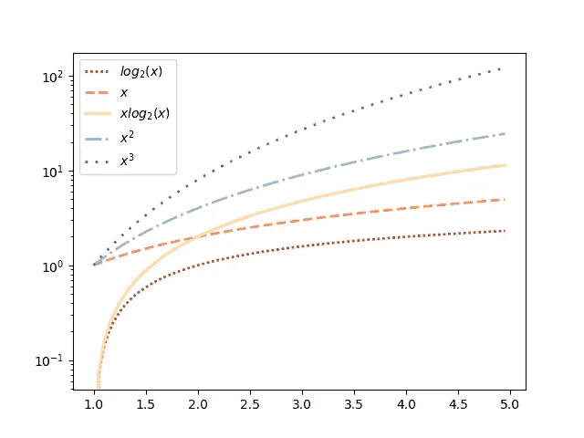

# 创建色盲友好数据可视化的两个简单步骤

> 原文：<https://towardsdatascience.com/two-simple-steps-to-create-colorblind-friendly-data-visualizations-2ed781a167ec?source=collection_archive---------9----------------------->

## 你的剧情可能很多人都无法理解。以下是解决这个问题的方法。

托马斯·伊万斯在 [Unsplash](https://unsplash.com/?utm_source=unsplash&utm_medium=referral&utm_content=creditCopyText) 上拍摄的照片。

根据[色盲意识网站](http://www.colourblindawareness.org/)，*色觉缺失*影响着世界上大约 8%的男性和 0.5%的女性，这意味着全球大约有 3 亿人患有某种程度的色盲。当谈到数据可视化时，颜色和图形元素的粗心选择会使图表模糊不清，甚至许多人无法理解。

事实上，不仅仅是色盲的人在解释用不小心选择的配色方案绘制的数据时会有问题。像黑白打印或阳光照射在设备屏幕上这样的常见事情也可能影响没有色盲的人的颜色感知。

虽然有各种类型的色盲，但创建每个人都可以轻松理解的数据可视化实际上非常简单——归根结底就是做出正确的选择。尽管如此，现在大量的内容并不是色盲友好的。表面上看，主要问题是大多数数据科学家在设计他们的数据可视化时仍然不习惯考虑这个因素。

在设计数据可视化时，您通常会考虑色盲吗？如果你没有，也许你应该开始做了。在这里，您将找到一些简单的提示，帮助您创建每个人都可以完全理解的数据可视化，而不管色盲状况或外部色觉改变。

# 动机:对于色盲的人来说，看似正常的图表可能无法理解

当我在攻读博士学位时，我经常使用 Google Sheets 快速生成临时图。但事实证明，Google Sheets plots 的默认配色方案并不是真正的色盲友好。它看起来是这样的:

用谷歌工作表创建的虚构图表。

如果您没有色盲，您大概可以区分图表中五个不同的数据系列。但是让我们来看看色盲的人是如何看到它的。我用[科布利斯——色盲模拟器](https://www.color-blindness.com/coblis-color-blindness-simulator/)来模拟患有八种不同色盲的人会如何感知这张图片。你可以查看下面的结果。(每个模拟条件的名称可以在图的标题中找到。)

第一:Protanomaly(红弱)。第二:Deuteranomaly(绿弱)。用谷歌工作表和科布利斯创建。

第一:Tritanomaly(蓝弱)。第二:红盲。用谷歌工作表和科布利斯创建。

第一:多盲症(绿盲)。第二:Tritanopia(蓝盲)。用谷歌工作表和科布利斯创建。

第一:色盲。第二:蓝锥单色。用谷歌工作表和科布利斯创建。

在其中一些模拟中，很难甚至不可能区分不同数据系列使用的不同颜色，这使得许多人完全无法理解该图表。实际上，任何在黑白打印件上看到它的人都不会理解。

# 第一步:选择正确的颜色

所以现在的问题是:有没有可能不考虑色盲，挑选出大家都能轻易分辨的颜色？鉴于有这么多不同的色盲状况，这可能不是一件容易的事情。一般建议是避免有问题的颜色组合，如红/绿、绿/棕、绿/蓝、蓝/灰等。

但幸运的是，其他人已经经历了这个过程，并找出了适合大多数色盲的颜色组合，所以你不必自己做这些。你可以在网上搜索这样的组合，使用你最喜欢的。甚至有一些在线工具可以根据你的要求帮助你选择一个色盲友好的配色方案，比如 [ColorBrewer](http://colorbrewer2.org/) 和 [Coolors](https://coolors.co/) 。

我已经使用 [ColorBrewer](http://colorbrewer2.org/) 为上面的示例图表选择了一个更好的配色方案。这是一个很棒的工具，可以根据用户选择的各种标准生成配色方案，包括色盲友好性。我让它用五种色盲安全、易于打印的颜色来创建配色方案。这是我选的一个:

使用 ColorBrewer 建议的颜色的新地块。使用的颜色:#d73027、#fc8d59、#fee090、#91bfdb、#4575b4。用谷歌工作表和科布利斯创建。

这是科布利斯的色盲模拟结果:

第一:Protanomaly(红弱)。第二:Deuteranomaly(绿弱)。用谷歌工作表和科布利斯创建。

第一:Tritanomaly(蓝弱)。第二:红盲。用谷歌工作表和科布利斯创建。

第一:多盲症(绿盲)。左:Tritanopia(蓝盲)。用谷歌工作表和科布利斯创建。

第一:色盲。第二:蓝锥单色。用谷歌工作表和科布利斯创建。

这样好多了吧？几乎在所有情况下都可以很容易地区分这五种颜色。唯一的例外是色盲的模拟，这是一种影响大约 30，000 人中有 1 人的情况。患有完全色盲的人不能感知任何颜色，并且会发现在这个图中几乎不可能区分 A 和 E 以及 B 和 D。同样，同样的事情也可以说发生在任何一个把这个情节印成黑白的人身上。

虽然上面使用的配色方案并不适用于所有的色盲情况，但仍然有可能找到合适的配色方案。你会发现大部分都是单色调色板，由单一颜色的不同强度组成。下面是这样一个调色板的例子，也是用 ColorBrewer 生成的:

用 ColorBrewer 生成的色盲友好调色板。来源:ColorBrewer。

然而，虽然这种方法可以安全地用于五种不同的颜色，如本例所示，但如果您需要使用更多的颜色变化，颜色强度可能会变得越来越相似。即使对于没有色盲的人来说，这也可能是一个问题。

这表明，虽然使用色盲友好的调色板可以让大多数人更容易理解您的数据可视化，但它可能仍然不是一个完美的解决方案。一般来说，不建议只使用颜色的变化来编码信息，即使它们是可访问的颜色。这就是为什么你也需要第二步。

# 第二步:使用不同的形状、图案、纹理或标签

确保人们能够完全理解您的绘图的最佳方法是，通过使用其他东西来区分其中的数据系列，从而完全消除对可区分颜色的需求。(这并不意味着你不应该关心在你的绘图中使用哪些颜色——除了使用色盲友好的调色板之外，你还应该这样做*,以防万一。)*

例如，我们可以通过对每个数据系列使用不同的形状来改进上面的图表，如下所示:

对不同的数据系列使用不同的形状。用谷歌工作表创建。

通过这种设计，我们可以确保色盲读者能够完全理解绘制的数据，不管他们的具体情况如何。即使出于某种原因，有人严格使用黑色和白色(没有灰色阴影)打印该图表，该图表仍然是明确的。

对于其他类型的情节，您可以使用其他策略。对于线图，除了不同的颜色之外，还可以使用不同的线型和/或不同的线宽。不幸的是，我无法找到如何在 Google Sheets 中使用虚线或点线模式，但我经常用 LaTeX/PGFPlots 和 Python/Matplotlib 这样做，所以我确信其他广泛使用的绘图软件也支持它们。下面是一个用 Matplotlib 创建的示例:

在线图中使用不同的线型。用 Matplotlib 创建。

对于条形图或饼图，我建议应用不同的填充纹理。同样，我在 Google Sheets 上找不到这个选项，但许多最流行的绘图软件可能都支持它。这里有一个我几年前创建的真实例子(使用 PGFPlots):

在条形图中使用不同的填充纹理。使用 PGFPlots 创建。

如果由于某种原因，您不能在绘图中使用不同的形状、图案或纹理，请考虑向数据系列添加标签(前提是您有足够的空间)。最重要的是确保每个人都能够理解你绘制的数据。

# 摘要

许多人仍然在创建色盲不友好的数据可视化的主要原因不是因为这很难避免，而是因为他们可能从一开始就没有想过这个问题。一旦我们意识到这一点，并有意创建可访问的图表，它实际上是非常简单的。基本上，这归结为两件事:

1.  **选择色盲友好的调色板:**像 [ColorBrewer](http://colorbrewer2.org/) 和 [Coolors](https://coolors.co/) 这样的在线工具使得现在很容易找到合适的配色方案。你也可以使用在线色盲模拟器，比如科布利斯[和](https://www.color-blindness.com/coblis-color-blindness-simulator/)来检查你的情节在其他人看来会是什么样子。
2.  **但不要只依赖颜色:**为你的地块添加不同的几何形状、线条图案、填充纹理甚至标签。这将提高每个人的可读性，包括没有色盲的人。

## **致谢**

*我感谢我用来创建本文所示示例的免费工具的创建者，即:* [*科布利斯*](https://www.color-blindness.com/coblis-color-blindness-simulator/) *，*[*color brewer*](http://colorbrewer2.org/)*，*[*Google Sheets*](http://sheets.google.com)*，*[*Matplotlib*](https://matplotlib.org/)*和*

# 推荐阅读

*   娜奥米·戴维斯的《色盲——不成文的准则:色盲父母指南》。
*   [关于色盲的一切:儿童(和成人)色觉缺失指南](https://www.amazon.com/gp/product/B006P92SRS?ie=UTF8&tag=chaulio0b-20&camp=1789&linkCode=xm2&creativeASIN=B006P92SRS)，作者凯伦·瑞·莱文。

# 出自同一作者

 [## 在你开始做任何项目之前都要这样做

### 这是一个简单的策略，可以让你在任何项目中更有效率。

medium.com](https://medium.com/swlh/do-this-before-you-start-working-on-any-project-14fd7bfa7327)  [## 要达到 1，000，000 美元，您需要投资多少以及投资多长时间

### 本文中的数学和交互式工具将为您提供这些问题的答案。你可能会感到惊讶。

themakingofamillionaire.com](https://themakingofamillionaire.com/how-much-and-for-how-long-you-need-to-invest-to-reach-1-000-000-19a0ce7d4c67)  [## 80/20 法则如何影响你的长期投资

### 你投资的一半资金将产生你投资组合的大部分结果。但是哪一半呢？

themakingofamillionaire.com](https://themakingofamillionaire.com/how-the-80-20-rule-affects-your-long-term-investments-96f6577b59bc) 

*披露:此帖子包含一个或多个亚马逊服务有限责任公司协会计划的链接。作为代销商，我从通过这些链接购买的商品中获得佣金，客户无需支付额外费用。*