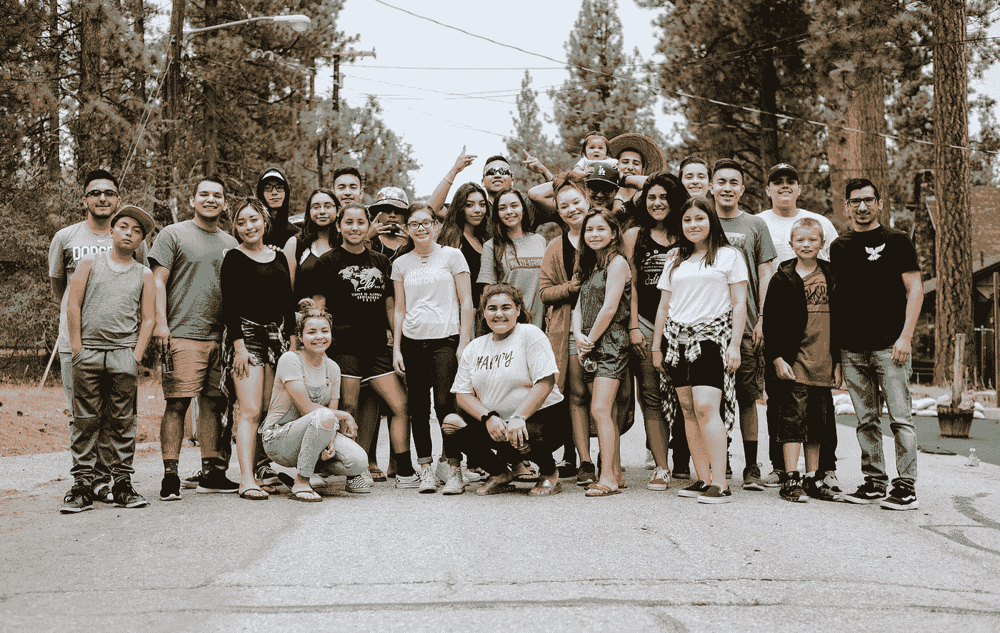
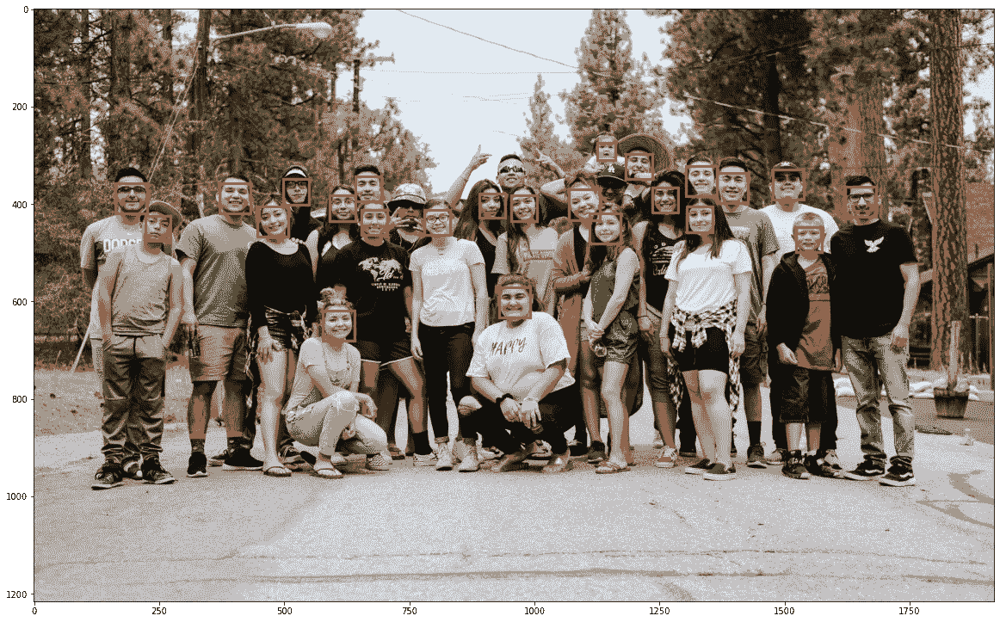
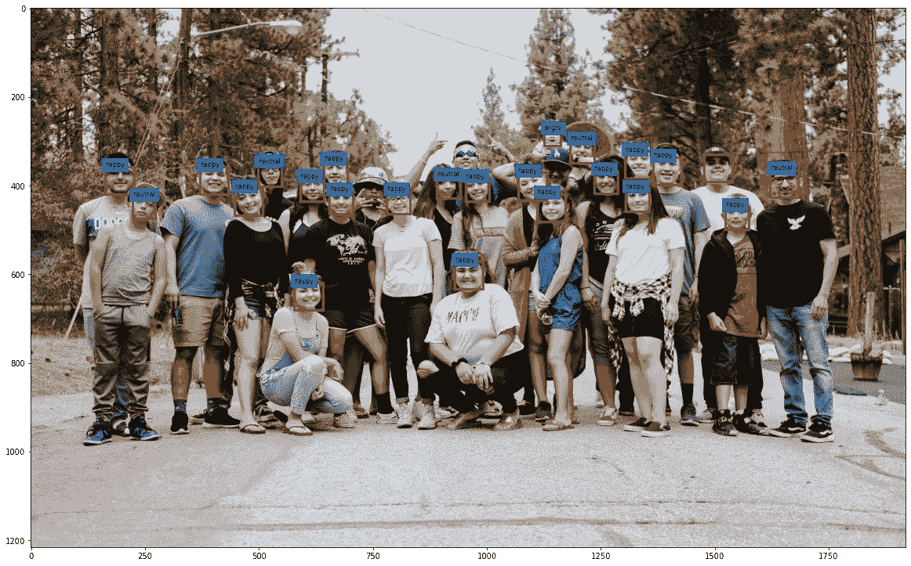
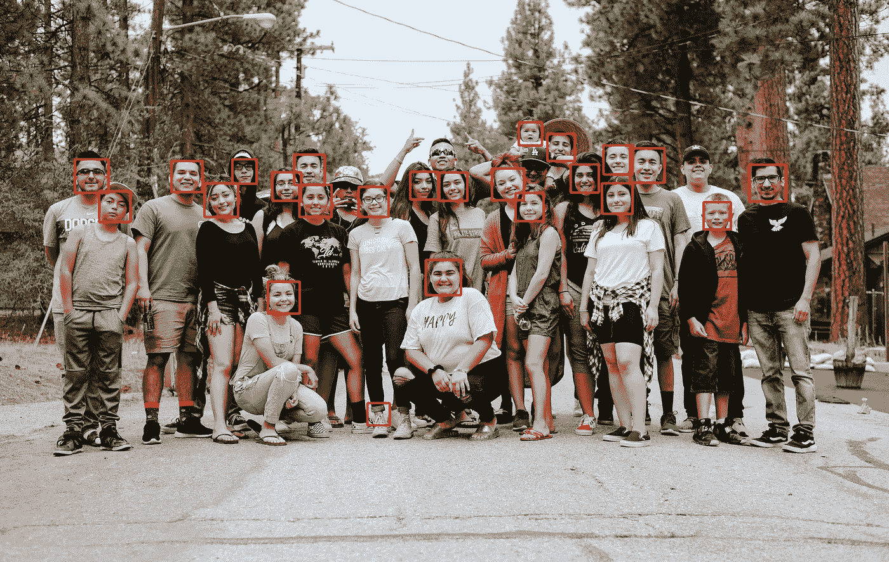

# 使用 Colab 的两步面部识别

> 原文：<https://towardsdatascience.com/two-step-facial-recognition-with-colab-883a54faafad?source=collection_archive---------28----------------------->

## 上传你的图片，并说服自己使用谷歌 Colab

这是周一的早晨，我正在引导我内心的杰瑞米·霍华德([又一次](https://en.wikipedia.org/wiki/Jeremy_Howard_(entrepreneur)))。在过去的几个月里，我看到了大量的面部识别指南，其中一些确实非常好。

问题是，每个深度学习或机器视觉的学生都通过不同的途径变得感兴趣。也许你是一个对声音感兴趣的音乐家，或者是一个对表格数据感兴趣的统计学学生。

我知道当我开始阅读 TensorFlow 和图像分类时，我个人变得很感兴趣——这种想法是，如果我有一个**精心策划的**数据集，我可能能够训练一个架构来以高精度对图像进行分类。

Google Colab 那时还不存在，我最近把类似的东西移植到了 Colab 上，我正在进行一次演练。点击此处查看第 1 部分:

[](/end-to-end-adaptation-of-resnet-in-google-colab-part-1-5e56fce934a6) [## Google Colab 中 ResNet 的端到端改编—第 1 部分

### 只需点击几下鼠标，就能训练出一个深度神经网络

towardsdatascience.com](/end-to-end-adaptation-of-resnet-in-google-colab-part-1-5e56fce934a6) 

我最初的尝试是在我的 iMac 上使用 Anaconda、Spyder 完成的，没有使用 GPU，只是让我的 Core i5 在数千张图像中跋涉，而我离开去做其他事情(阅读:为急救医学委员会学习)。当然，在我开始训练之前，我必须通读二十多篇使用不同风格编写代码的人的文章。结果是**，一个代码**的嵌合大杂烩，当我几周后看它的时候很难理解。

然后 Colab 进入了这个场景，虽然我仍然在我的机器上使用 Jupyter 和 Spyder，但我使用 Colab 与您交流并有效地共享我的代码。它并不完美，但他们在让大众获得高端计算方面做得很好，你所需要的只是一个谷歌账户。

闲话少说。让我们浏览一下笔记本:

## [**Colab 笔记本**](https://drive.google.com/file/d/10HRlLZR3q6ncEmYbEFmn2lEUQqaQXY5L/view?usp=sharing)

# 代表性图像



来源:[Unsplash.com](https://unsplash.com/photos/1qfy-jDc_jo)

# 两步面部识别

我在这里有点开玩笑——这两个步骤是“全部运行”和上传你的面部照片。

笔记本被设计成隐藏大部分代码，这样你就可以清楚地看到结果。首先看看输出，让自己相信我们不仅可以挑出(希望是大多数)照片中的人脸，然后使用情绪检测器功能分配一种情绪。

我还留了一些代码来尝试计算过程的时间。

## 面部识别库

这个使用了“人脸识别”库，在这里找到的。我们也会计算这需要多长时间。

这条生产线承担了所有繁重的工作:

```
face_locations = face_recognition.face_locations(image)
```

代码的其余部分使用 for 循环遍历面数，并使用以下两条线在面周围画一个框:

```
rect = patches.Rectangle((left,top), (right - left),
     (bottom-top),linewidth=3,edgecolor='r',facecolor='none')
ax.add_patch(rect)
```



作者图片

*注意:并不是所有的人脸都被检测到；帽子和太阳镜会干扰检测。*

**检测到的人脸数量:24**

**耗时:2.43 秒**

## 加入情感检测

除了一行(如果在第 11 行阻塞)之外，代码几乎与上面的相同:

正如我们将在下图中看到的那样，出现“if”语句是有原因的。“检测情绪”这条线并不适用于所有的脸。

结果如下:



作者图片

*注:情绪检测大多管用。并不是所有的脸都会表现出一种情绪，它认为婴儿生气了。我会让你仔细看看，看你是否觉得标签完全匹配——我不认为它们完全匹配。*

**检测到的人脸数量:24 个**

**耗时:2.83 秒**(稍长以添加情绪检测)

## 使用开放式 CV 的哈尔叶栅

基于 Haar 级联的识别是进行面部识别的另一种方式。关于这些工作的讨论超出了本文的范围。网上有很多讨论这种方法的技术资源。

结果如下:



作者图片

再次，使用哈尔级联是另一种方法，这里也有一些失误。特别是，它错过了一些脸，并认为裤腿，脚踝，鞋面的组合是一张脸。

然而，在我运行的每次迭代中，使用 Haar cascades 和 OpenCV 比使用 face_recognition 库要快得多——有时几乎快 20%—30%。这种速度优势非常显著，尤其是在浏览数百张图像(例如视频)时。它还涉及一种计算成本较低的过程，并且可能运行在需要较少功率的较便宜的硬件上。

当然，这不是仅有的两种面部检测方法，专有的方法可能更好。如果你必须在两者之间选择，我不认为有明确的答案——一个更擅长检测(人脸识别)，但另一个更快(哈尔瀑布)。

**检测到的人脸数量:24 个**

**耗时:1.95 秒**(更快)

# 参考

[1] [维基百科-杰瑞米·霍华德](https://en.wikipedia.org/wiki/Jeremy_Howard_(entrepreneur))，2020 年 10 月访问

[2] [面部识别库](https://pypi.org/project/face-recognition/)，PyPi，2020 年 10 月访问

[3] [打开 CV 哈尔叶栅](https://opencv-python-tutroals.readthedocs.io/en/latest/py_tutorials/py_objdetect/py_face_detection/py_face_detection.html)，2020 年 10 月进入